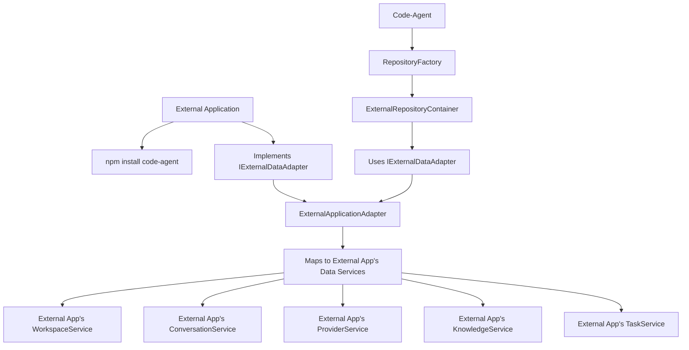

# NPM Package Integration Guide

**Date**: December 17, 2025  
**Status**: Implementation Guide

## Overview

This guide shows how to integrate code-agent as an NPM package dependency into external applications. The external application implements a data adapter interface to provide code-agent with access to their existing data layer.

## Integration Architecture



## Step-by-Step Integration

### 1. Install Code-Agent Package

```bash
npm install code-agent
```

### 2. Implement Data Adapter Interface

```typescript
// your-app/src/integrations/CodeAgentAdapter.ts
import { IExternalDataAdapter, ExternalApplicationAdapter } from "code-agent"

export class YourAppCodeAgentAdapter extends ExternalApplicationAdapter {
	constructor(
		private workspaceService: YourWorkspaceService,
		private conversationService: YourConversationService,
		private providerService: YourProviderService,
		private knowledgeService: YourKnowledgeService,
		private taskService: YourTaskService,
	) {
		super({
			workspaceService,
			conversationService,
			providerService,
			knowledgeService,
			taskService,
			isInitialized: () => true, // Your app's ready check
		})
	}

	// Override methods if you need custom mapping logic
	async read<T>(resource: string, id: string): Promise<T | null> {
		switch (resource) {
			case "workspaces":
				// Map your Workspace model to code-agent's Workspace interface
				const workspace = await this.workspaceService.getById(id)
				return workspace ? this.mapWorkspaceToCodeAgent(workspace) : null

			case "conversations":
				const conversation = await this.conversationService.getById(id)
				return conversation ? this.mapConversationToCodeAgent(conversation) : null

			// ... other resources
			default:
				return await super.read<T>(resource, id)
		}
	}

	private mapWorkspaceToCodeAgent(workspace: YourWorkspace): CodeAgentWorkspace {
		return {
			id: workspace.id,
			name: workspace.name,
			path: workspace.path,
			settings: {
				defaultProvider: workspace.settings?.currentApiConfigName,
				customInstructions: workspace.settings?.customInstructions,
				// Map other settings as needed
			},
			isActive: workspace.isActive,
			createdAt: workspace.createdAt,
			updatedAt: workspace.updatedAt,
		}
	}

	private mapConversationToCodeAgent(conversation: YourConversation): CodeAgentConversation {
		return {
			id: conversation.id,
			workspaceId: conversation.workspaceId,
			title: conversation.title,
			messages: conversation.messages.map(this.mapMessageToCodeAgent),
			provider: conversation.provider,
			model: conversation.model,
			tags: conversation.tags || [],
			isArchived: conversation.isArchived || false,
			metadata: {
				tokenUsage: conversation.metadata?.tokenUsage,
				lastMessageAt: conversation.metadata?.lastMessageAt,
				messageCount: conversation.messages?.length || 0,
			},
			createdAt: conversation.createdAt,
			updatedAt: conversation.updatedAt,
		}
	}

	// ... other mapping methods
}
```

### 3. Initialize Code-Agent in Your Application

```typescript
// your-app/src/services/CodeAgentService.ts
import { createExternalRepositoryContainer, type RepositoryContainer } from "code-agent"
import { YourAppCodeAgentAdapter } from "../integrations/CodeAgentAdapter"

export class CodeAgentService {
	private repositories: RepositoryContainer | null = null
	private adapter: YourAppCodeAgentAdapter

	constructor(
		workspaceService: YourWorkspaceService,
		conversationService: YourConversationService,
		providerService: YourProviderService,
		knowledgeService: YourKnowledgeService,
		taskService: YourTaskService,
	) {
		this.adapter = new YourAppCodeAgentAdapter(
			workspaceService,
			conversationService,
			providerService,
			knowledgeService,
			taskService,
		)
	}

	async initialize(workspaceRoot: string): Promise<void> {
		this.repositories = await createExternalRepositoryContainer(this.adapter, workspaceRoot)
	}

	getRepositories(): RepositoryContainer {
		if (!this.repositories) {
			throw new Error("CodeAgentService not initialized")
		}
		return this.repositories
	}

	// Convenience methods for common operations
	async createTask(workspaceId: string, taskData: any) {
		const repos = this.getRepositories()
		return await repos.task.create({
			workspaceId,
			type: taskData.type || "conversation",
			name: taskData.name,
			description: taskData.description,
			status: "pending",
			progress: { percentage: 0 },
			metadata: taskData.metadata || {},
		})
	}

	async getWorkspaceConversations(workspaceId: string) {
		const repos = this.getRepositories()
		return await repos.conversation.getConversationsByWorkspace(workspaceId)
	}

	async updateWorkspaceContext(workspaceId: string, contextData: any) {
		const repos = this.getRepositories()
		return await repos.context.updateEnvironmentContext(workspaceId, contextData)
	}
}
```

### 4. Use Code-Agent in Your Application Logic

```typescript
// your-app/src/controllers/AIController.ts
export class AIController {
	constructor(
		private codeAgentService: CodeAgentService,
		private yourExistingServices: YourServices,
	) {}

	async handleUserRequest(workspaceId: string, userMessage: string) {
		const repos = this.codeAgentService.getRepositories()

		// Create or get conversation
		let conversation = await repos.conversation.create({
			workspaceId,
			title: `Chat ${new Date().toISOString()}`,
			provider: "openai",
			model: "gpt-4",
			tags: [],
			isArchived: false,
			metadata: {},
			messages: [],
		})

		// Add user message
		await repos.conversation.addMessage(conversation.id, {
			role: "user",
			content: userMessage,
			metadata: {},
		})

		// Process with AI (your existing logic)
		const aiResponse = await this.yourExistingServices.processAIRequest(userMessage)

		// Add AI response
		await repos.conversation.addMessage(conversation.id, {
			role: "assistant",
			content: aiResponse.content,
			metadata: {
				model: aiResponse.model,
				tokens: aiResponse.tokenUsage,
				toolUsage: aiResponse.toolUsage,
			},
		})

		return aiResponse
	}
}
```

## Data Mapping Examples

### Workspace Mapping

```typescript
// Your app's Workspace -> Code-Agent's Workspace
{
  // Your app
  id: "ws-123",
  name: "My Project",
  createdAt: new Date(),
  updatedAt: new Date(),
  settings: {
    currentApiConfigName: "default",
    apiConfigs: { /* ... */ }
  }
}

// Maps to code-agent format
{
  id: "ws-123",
  name: "My Project",
  path: "/workspace/path", // You provide this
  settings: {
    defaultProvider: "default",
    customInstructions: "...",
    // Other mapped settings
  },
  isActive: true,
  createdAt: new Date(),
  updatedAt: new Date()
}
```

### Conversation Mapping

```typescript
// Your app's Conversation -> Code-Agent's Conversation
{
  // Your app
  id: "conv-456",
  title: "Chat about feature X",
  messages: [
    { id: "msg-1", role: "user", content: "Hello", timestamp: new Date() },
    { id: "msg-2", role: "assistant", content: "Hi!", timestamp: new Date() }
  ],
  provider: "openAI",
  model: "gpt-4"
}

// Maps to code-agent format
{
  id: "conv-456",
  workspaceId: "ws-123", // You provide workspace context
  title: "Chat about feature X",
  messages: [
    {
      id: "msg-1",
      conversationId: "conv-456",
      role: "user",
      content: "Hello",
      metadata: {},
      createdAt: new Date(),
      updatedAt: new Date()
    }
    // ... other messages
  ],
  provider: "openai", // Normalize to code-agent format
  model: "gpt-4",
  tags: [],
  isArchived: false,
  metadata: {},
  createdAt: new Date(),
  updatedAt: new Date()
}
```

## Benefits of NPM Package Integration

### 1. **Type Safety**

- Full TypeScript support
- Compile-time interface validation
- IntelliSense and autocomplete

### 2. **Performance**

- Direct method calls (no HTTP overhead)
- Efficient data transfer
- Optimal memory usage

### 3. **Simplicity**

- No network configuration
- No authentication complexity
- Direct dependency management

### 4. **Flexibility**

- Custom mapping logic
- Gradual adoption
- Easy testing and debugging

## Testing Your Integration

```typescript
// your-app/tests/CodeAgentIntegration.test.ts
import { YourAppCodeAgentAdapter } from "../src/integrations/CodeAgentAdapter"

describe("CodeAgent Integration", () => {
	let adapter: YourAppCodeAgentAdapter
	let mockServices: MockServices

	beforeEach(() => {
		mockServices = createMockServices()
		adapter = new YourAppCodeAgentAdapter(
			mockServices.workspace,
			mockServices.conversation,
			mockServices.provider,
			mockServices.knowledge,
			mockServices.task,
		)
	})

	it("should map workspace correctly", async () => {
		const workspace = await adapter.read("workspaces", "test-id")
		expect(workspace).toHaveProperty("id", "test-id")
		expect(workspace).toHaveProperty("name")
		expect(workspace).toHaveProperty("path")
		expect(workspace).toHaveProperty("settings")
	})

	it("should create conversation", async () => {
		const conversation = await adapter.create("conversations", {
			workspaceId: "ws-1",
			title: "Test Chat",
			provider: "openai",
			model: "gpt-4",
		})

		expect(conversation).toHaveProperty("id")
		expect(conversation.title).toBe("Test Chat")
	})
})
```

## Troubleshooting

### Common Issues

1. **Type Mismatches**: Ensure your data mapping correctly transforms between your app's types and code-agent's interfaces

2. **Missing Dependencies**: Make sure all required services are properly injected into the adapter

3. **Async/Await Issues**: Ensure all async operations are properly awaited

4. **Data Validation**: Code-agent expects specific data formats - validate your mapping logic

### Debug Tips

```typescript
// Add logging to your adapter for debugging
export class YourAppCodeAgentAdapter extends ExternalApplicationAdapter {
	async read<T>(resource: string, id: string): Promise<T | null> {
		console.log(`[CodeAgent] Reading ${resource}:${id}`)
		const result = await super.read<T>(resource, id)
		console.log(`[CodeAgent] Result:`, result)
		return result
	}
}
```

This NPM package integration approach provides a clean, type-safe way to integrate code-agent with your existing application while maintaining full control over your data layer.
