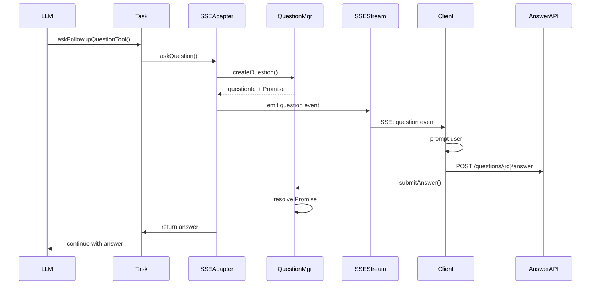

# PRD: API Ask Functionality

## Executive Summary

The API needs to support interactive questions from the LLM when running as an API server. This enables the agent to ask clarifying questions during task execution, just like it does in VSCode and CLI modes. The implementation must support asynchronous, multi-channel interaction patterns to eventually support SMS, email, IM, and other communication channels.

**Critical Design Principle**: This system is designed for long-lived workflow tasks where users operate on their own timeline. Users may go home, take vacations, or travel, and return days or weeks later to continue their tasks. Questions should persist indefinitely without timeout deletion, and the system should support task state persistence and resumption.

## Problem Statement

Currently, when tasks run via the API server with SSE streaming, the [`askFollowupQuestionTool`](src/core/tools/askFollowupQuestionTool.ts:6) cannot properly ask questions and wait for responses. The [`SSEOutputAdapter`](src/api/streaming/SSEOutputAdapter.ts:86) just returns default values, making the agent unable to gather additional information needed to complete tasks effectively.

## Goals

### Primary Goals

- **Enable Interactive Tasks**: Allow the LLM to ask questions and receive responses during API task execution
- **Maintain Async Architecture**: Keep ask/answer channels decoupled for future multi-channel support
- **Preserve User Experience**: Ensure the existing [`test-api.js`](test-api.js:1) client works seamlessly
- **Support Blocking Behavior**: Task execution should pause until response is received

### Secondary Goals

- **Prepare for Multi-Channel**: Design architecture to support future SMS, email, IM channels
- **Timeout Handling**: Questions should timeout gracefully if no response received
- **Question History**: Maintain audit trail of questions and responses
- **Transport Agnostic**: Support future WebSocket adapters alongside SSE

## User Stories

### Story 1: Basic Ask Question Flow

**As a** API client  
**I want** to receive questions from the LLM via SSE  
**So that** I can provide additional information to help complete tasks

**Acceptance Criteria:**

- Questions are sent via SSE with unique question ID
- Questions include the question text and suggested answers
- Question SSE events have all necessary metadata (timestamp, jobId, questionId)
- Client receives question immediately when LLM asks

### Story 2: Answer Submission

**As a** API client  
**I want** to submit answers to questions via HTTP POST  
**So that** the LLM can continue task execution with my input

**Acceptance Criteria:**

- New `/api/questions/{questionId}/answer` endpoint accepts POST requests
- Endpoint validates question ID exists and is pending
- Answer submission unblocks the waiting task immediately
- Invalid question IDs return appropriate error responses

### Story 3: Task Blocking and Resumption

**As a** task execution system  
**I want** to pause task execution when questions are asked  
**So that** the LLM waits for user input before continuing

**Acceptance Criteria:**

- Task execution blocks when `askFollowupQuestionTool` is invoked
- Task resumes immediately when answer is received
- Blocking mechanism supports concurrent questions across different jobs
- Task state is preserved during blocking period

### Story 4: Test Client Integration

**As a** developer using [`test-api.js`](test-api.js:1)  
**I want** to automatically handle questions during task execution  
**So that** I can interact with the agent seamlessly

**Acceptance Criteria:**

- Test client detects question SSE events
- Client prompts user for input via command line
- Client automatically submits answer via POST endpoint
- Question/answer flow integrates smoothly with existing streaming output

### Story 5: Long-lived Question Management

**As a** task execution system
**I want** to support long-lived questions without forced timeouts
**So that** users can work on their own timeline without losing progress

**Acceptance Criteria:**

- Questions persist indefinitely without automatic deletion
- Configurable timeout for optional automated responses (default: disabled)
- Task state can be preserved during long question periods
- Questions remain available even if SSE connection is lost
- System supports task resumption after extended periods

### Story 6: Persistent Question State Management

**As a** API server
**I want** to track question state and history with persistence
**So that** I can manage long-lived questions and support task resumption

**Acceptance Criteria:**

- Questions have states: pending, answered, expired (optional), cancelled
- Question store supports concurrent questions across multiple jobs
- Question history is persisted to disk for long-term retention
- Manual cleanup mechanisms for completed questions (no automatic deletion)
- Question state survives server restarts and connection losses
- Integration with existing task state persistence mechanisms

## Technical Architecture

### Core Components

#### 1. Question Manager (`ApiQuestionManager`)

- Manages question lifecycle and persistent state
- Generates unique question IDs with long-term stability
- Handles optional expiration (disabled by default)
- Supports concurrent questions across jobs
- Persists question state to disk for durability
- Integrates with task checkpoint/resumption system

#### 2. Enhanced SSE Output Adapter

- Extends current [`SSEOutputAdapter`](src/api/streaming/SSEOutputAdapter.ts:21) to support long-lived blocking questions
- Implements `IUserInterface.askQuestion()` with Promise-based blocking that can persist across sessions
- Emits question SSE events with unique IDs
- Integrates with Question Manager for persistent question state
- Supports task suspension and resumption when questions are pending

#### 3. Question API Endpoints

- `POST /api/questions/{questionId}/answer` - Submit answer
- `GET /api/questions/{questionId}` - Get question status (optional)
- `GET /api/questions` - List pending questions for job (optional)

#### 4. Enhanced Test Client

- Extend [`test-api.js`](test-api.js:289) to handle question SSE events
- Interactive command-line prompting for questions
- Automatic answer submission via HTTP POST
- Maintain existing streaming behavior

### Data Flow Diagram

### Integration Points

#### Current System Integration

- **Fastify Server**: Add new question endpoints to [`FastifyServer.ts`](src/api/server/FastifyServer.ts:18)
- **SSE Types**: Extend [`types.ts`](src/api/streaming/types.ts:8) with question event types
- **Task System**: Modify Task creation to use enhanced SSE adapter

#### Future Extension Points

- **Multi-Channel Support**: Question Manager can support multiple output adapters
- **WebSocket Support**: Alternative transport can use same Question Manager
- **External Integrations**: SMS/Email services can integrate via Question Manager API

## Implementation Stories

### Epic 1: Core Question Infrastructure

**Story 1.1**: Create `ApiQuestionManager` class with question lifecycle management  
**Story 1.2**: Extend SSE event types and [`SSEOutputAdapter`](src/api/streaming/SSEOutputAdapter.ts:21) for blocking questions  
**Story 1.3**: Add question-related API endpoints to [`FastifyServer`](src/api/server/FastifyServer.ts:18)

### Epic 2: Client Integration

**Story 2.1**: Enhance [`test-api.js`](test-api.js:1) to detect and handle question events  
**Story 2.2**: Implement interactive command-line question prompting  
**Story 2.3**: Add automatic answer submission functionality

### Epic 3: Persistence and Long-lived Task Support

**Story 3.1**: Implement persistent question storage with disk-based state
**Story 3.2**: Add comprehensive error handling for invalid questions/answers
**Story 3.3**: Create question state management with manual cleanup options
**Story 3.4**: Integrate with existing task checkpoint/resumption system

### Epic 4: Testing and Documentation

**Story 4.1**: Create comprehensive unit tests for question functionality  
**Story 4.2**: Add integration tests with actual LLM question scenarios  
**Story 4.3**: Update API documentation and examples

## Success Metrics

### Functional Metrics

- ✅ LLM can ask questions and receive answers during API task execution
- ✅ [`test-api.js`](test-api.js:1) client handles questions seamlessly
- ✅ Questions persist across server restarts and connection losses
- ✅ Multiple concurrent questions work across different jobs
- ✅ Tasks can be suspended and resumed with pending questions intact

### Performance Metrics

- ⏱️ Question-to-answer roundtrip time < 1 second (excluding user think time)
- 🔄 Support for 100+ concurrent long-lived questions across jobs
- 💾 Memory usage remains constant with persistent disk-based storage
- 🗃️ Question storage scales to thousands of persistent questions

### User Experience Metrics

- 🎯 Zero breaking changes to existing [`test-api.js`](test-api.js:1) usage
- 📱 Question/answer flow feels natural and responsive
- 🛠️ Clear error messages for debugging question issues

## Risk Mitigation

### Technical Risks

- **Resource Exhaustion**: Disk-based storage and manual cleanup prevent memory issues
- **State Corruption**: Transactional question state updates with rollback capability
- **Race Conditions**: Thread-safe question state management with file locking
- **Long-term Storage**: Monitoring and alerting for question storage growth

### Integration Risks

- **Breaking Changes**: Maintain backward compatibility with existing SSE streaming
- **Client Complexity**: Keep question handling optional and graceful degradation
- **Performance Impact**: Minimal overhead when questions are not used

## Future Considerations

### Multi-Channel Vision

The architecture is designed to support the eventual multi-channel vision:

- **Output Channels**: SMS, Email, Slack, Teams, etc. for sending questions
- **Input Channels**: Web forms, IM bots, voice interfaces for receiving answers
- **Channel Bridging**: Questions sent via one channel can be answered via another
- **Async by Design**: Long delays between questions and answers are supported

### Advanced Features

- **Question Threading**: Related questions grouped together
- **Rich Media**: Questions with images, files, complex UI elements
- **Collaborative Answers**: Multiple users contributing to complex questions
- **Question Analytics**: Insights into question patterns and user behavior

---

_This PRD serves as the foundation for implementing interactive API task execution while maintaining the flexibility needed for future multi-channel communication scenarios._
