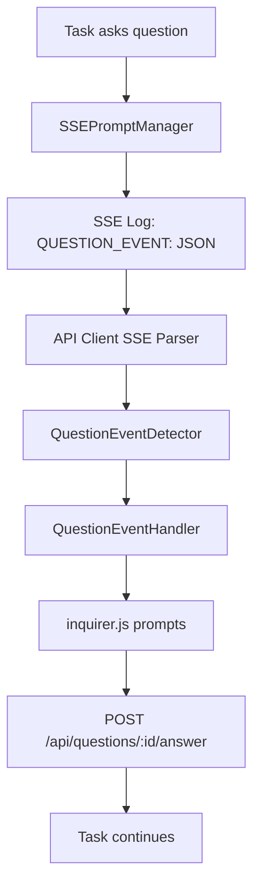

# API Client Question Blocking - Product Stories

## Overview

This epic implements client-side question handling for the API client to support interactive prompts during task execution. The server-side question infrastructure is already working perfectly, but the API client currently ignores question events and hangs.

## Current State

**✅ Server-Side (Working)**

- SSEPromptManager sends questions via log messages: `QUESTION_EVENT: {"type":"question","questionId":"...","questionType":"select",...}`
- ApiQuestionManager handles question lifecycle and answer collection
- POST `/api/questions/:questionId/answer` endpoint processes responses
- Task execution blocks until client responds

**❌ Client-Side (Missing)**

- SSE stream parser ignores "QUESTION_EVENT:" prefixed messages
- No interactive prompt presentation
- No answer submission to API
- Client hangs when questions are asked

## Architecture



## Product Stories

1. **[AC-001] SSE Question Event Detection**
2. **[AC-002] Question Event Handler Infrastructure**
3. **[AC-003] Interactive Select Questions**
4. **[AC-004] Interactive Input Questions**
5. **[AC-005] Interactive Confirmation Questions**
6. **[AC-006] Answer Submission System**
7. **[AC-007] Error Handling & Edge Cases**
8. **[AC-008] End-to-End Testing**

## Success Criteria

**When complete, this should work:**

```bash
# User runs: Use ask_followup_question to ask me what color I prefer

Server: I'll ask you about your color preference.
QUESTION_EVENT sent via SSE ✅

Client: ? What color do you prefer? (Use arrow keys)
❯ Blue
  Green
  Red
  Purple
  (Custom answer)

User selects: Blue

Client: POST /api/questions/q_job_md1s606p_543f603f_1752417562918_1/answer {"answer":"Blue"} ✅

Server: You selected Blue! ✅
Task execution continues...
```

## Dependencies

- inquirer.js (already available from CLI implementation)
- Existing API question endpoint infrastructure
- Current SSE stream processing in api-client.ts

## Implementation Order

Stories should be implemented in sequence as each builds on the previous ones.
