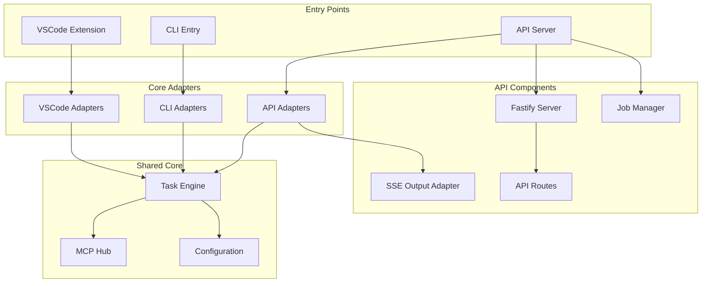
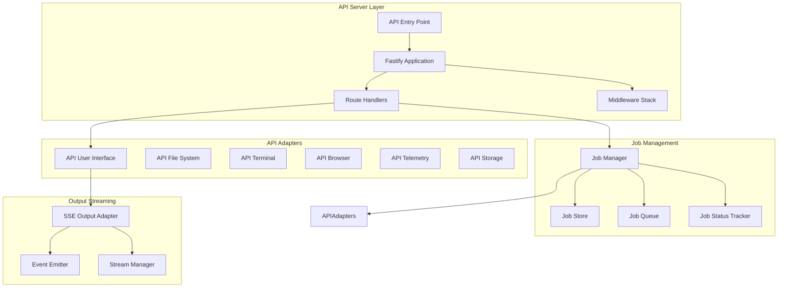

# API First Pass - Product Requirements Document

## Overview

This codebase is an agentic coding agent that initially ran as a VSCode extension and has been extended with CLI capability. Now we need to add the ability to run the agent as an API server.

## Requirements

### Core Functionality

- API server similar to the REPL experience
- One-time initialization including MCP (Model Context Protocol) setup
- Server-Sent Events (SSE) support for real-time streaming
- Synchronous and asynchronous execution modes
- Job management system for async operations

### Endpoints Required

- `/execute` - Execute agent tasks (sync/async)
- `/status` - Check status/result of async jobs
- `/control` - Control async jobs (pause, cancel, etc.)

### Technical Requirements

- Use Fastify for better performance and TypeScript-first design
- Leverage existing adapter pattern architecture
- Reuse Task execution engine and MCP initialization
- Create API-specific output adapter for SSE
- Maintain consistency with CLI patterns

## Architecture Overview



## Detailed Component Architecture



## Implementation Stories

### Story 1: API Infrastructure Setup

**As a developer, I want to set up the basic API server infrastructure so that I can serve HTTP requests.**

**Acceptance Criteria:**

- Create API entry point (`src/api/api-entry.ts`)
- Set up Fastify server with TypeScript
- Implement basic health check endpoint
- Add proper error handling and logging
- Configure CORS and security middleware

**Files to Create:**

- `src/api/api-entry.ts` - Main API entry point
- `src/api/server/FastifyServer.ts` - Fastify server setup
- `src/api/server/middleware/` - Middleware implementations
- `src/api/server/routes/` - Route definitions
- `src/api/config/ApiConfigManager.ts` - API-specific configuration

### Story 2: API Adapter Implementation

**As a developer, I want to create API-specific adapters so that the Task engine can work with HTTP requests and responses.**

**Acceptance Criteria:**

- Create API adapters following existing CLI adapter pattern
- Implement `ApiUserInterface` with SSE support
- Implement other required adapters (FileSystem, Terminal, etc.)
- Ensure adapters integrate with Fastify request/response cycle

**Files to Create:**

- `src/core/adapters/api/` - API adapter directory
- `src/core/adapters/api/index.ts` - Main exports
- `src/core/adapters/api/ApiUserInterface.ts` - HTTP/SSE user interface
- `src/core/adapters/api/ApiFileSystem.ts` - API file system adapter
- `src/core/adapters/api/ApiTerminal.ts` - API terminal adapter
- `src/core/adapters/api/ApiBrowser.ts` - API browser adapter
- `src/core/adapters/api/ApiTelemetry.ts` - API telemetry adapter
- `src/core/adapters/api/ApiStorage.ts` - API storage adapter

### Story 3: Server-Sent Events (SSE) Output Adapter

**As a developer, I want to implement real-time streaming so that clients can receive live updates during task execution.**

**Acceptance Criteria:**

- Create SSE output adapter for real-time streaming
- Implement event emission for task progress
- Handle client connection management
- Support multiple concurrent streams

**Files to Create:**

- `src/api/streaming/SSEOutputAdapter.ts` - SSE implementation
- `src/api/streaming/StreamManager.ts` - Connection management
- `src/api/streaming/EventEmitter.ts` - Event emission system
- `src/api/streaming/types.ts` - Type definitions

### Story 4: Job Management System

**As a developer, I want to implement async job management so that I can track and control long-running tasks.**

**Acceptance Criteria:**

- Create job management system for async operations
- Implement unique job ID generation
- Store job status and results
- Support job cancellation and control

**Files to Create:**

- `src/api/jobs/JobManager.ts` - Core job management
- `src/api/jobs/JobStore.ts` - Job persistence
- `src/api/jobs/JobQueue.ts` - Job queue management
- `src/api/jobs/types.ts` - Job-related types
- `src/api/jobs/JobStatus.ts` - Status tracking

### Story 5: Execute Endpoint Implementation

**As a user, I want to execute agent tasks via API so that I can integrate the agent into my applications.**

**Acceptance Criteria:**

- Implement `/execute` endpoint with sync/async modes
- Support task execution with proper input validation
- Return appropriate responses based on execution mode
- Integrate with job management for async operations

**Files to Create:**

- `src/api/routes/execute.ts` - Execute endpoint implementation
- `src/api/validation/` - Input validation schemas
- `src/api/types/requests.ts` - Request type definitions
- `src/api/types/responses.ts` - Response type definitions

### Story 6: Status and Control Endpoints

**As a user, I want to check job status and control async operations so that I can manage long-running tasks.**

**Acceptance Criteria:**

- Implement `/status/:jobId` endpoint for status checking
- Implement `/control/:jobId` endpoint for job control
- Support operations: cancel, pause, resume
- Return comprehensive job information

**Files to Create:**

- `src/api/routes/status.ts` - Status endpoint
- `src/api/routes/control.ts` - Control endpoint
- `src/api/controllers/` - Business logic controllers

### Story 7: API Integration and Testing

**As a developer, I want to integrate the API with existing initialization patterns so that MCP and configuration work seamlessly.**

**Acceptance Criteria:**

- Integrate with existing MCP initialization
- Reuse configuration management patterns
- Add comprehensive API testing
- Create API documentation

**Files to Create:**

- `src/api/__tests__/` - Test suite
- `src/api/docs/` - API documentation
- Integration with existing `GlobalCLIMcpService`
- Update package.json scripts for API mode

## Technical Specifications

### API Request/Response Format

```typescript
// Execute Request
interface ExecuteRequest {
	task: string
	mode?: string
	async?: boolean
	workspaceRoot?: string
	options?: {
		timeout?: number
		verbose?: boolean
		// ... other options
	}
}

// Sync Response
interface ExecuteResponse {
	success: boolean
	result?: string
	error?: string
	metadata?: {
		duration: number
		tokensUsed?: number
	}
}

// Async Response
interface AsyncExecuteResponse {
	jobId: string
	status: "queued" | "running" | "completed" | "failed" | "cancelled"
	message: string
}

// Status Response
interface StatusResponse {
	jobId: string
	status: JobStatus
	progress?: number
	result?: string
	error?: string
	logs?: string[]
	metadata?: JobMetadata
}
```

### SSE Event Format

```typescript
interface SSEEvent {
	type: "progress" | "log" | "error" | "complete"
	data: {
		jobId: string
		timestamp: string
		content: any
	}
}
```

### Job Management

```typescript
interface Job {
	id: string
	task: string
	status: JobStatus
	createdAt: Date
	startedAt?: Date
	completedAt?: Date
	result?: string
	error?: string
	logs: LogEntry[]
	metadata: JobMetadata
}

type JobStatus = "queued" | "running" | "completed" | "failed" | "cancelled"
```

## Implementation Priority

1. **API Infrastructure Setup** - Foundation
2. **API Adapter Implementation** - Core integration
3. **Execute Endpoint (Sync only)** - Basic functionality
4. **SSE Output Adapter** - Real-time capability
5. **Job Management System** - Async support
6. **Execute Endpoint (Async)** - Full async capability
7. **Status and Control Endpoints** - Job management
8. **Integration and Testing** - Quality assurance

## Success Criteria

- [ ] API server starts and accepts requests
- [ ] Sync task execution works via `/execute`
- [ ] Real-time streaming via SSE
- [ ] Async job management with unique tokens
- [ ] Status checking and job control
- [ ] MCP integration works seamlessly
- [ ] Configuration management integrated
- [ ] Comprehensive test coverage
- [ ] API documentation complete

## Future Considerations

- Authentication and authorization
- Rate limiting and quotas
- WebSocket support (alternative to SSE)
- Batch operation support
- API versioning strategy
- Monitoring and observability
- Horizontal scaling considerations
