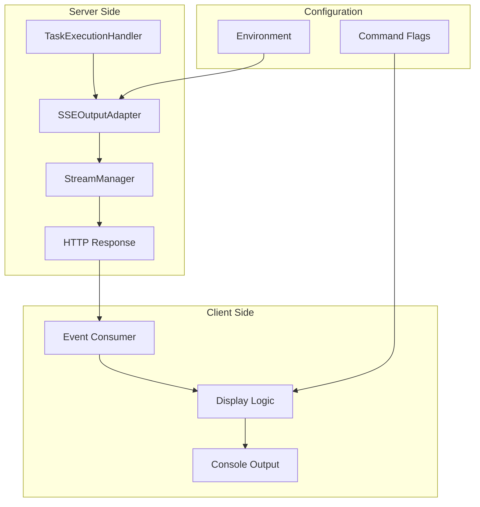

# API Token Usage Exposure

## Problem Statement

Token usage information is currently logged server-side in the API but not exposed to clients through the SSE stream. Users of the `api-client.js` cannot see important metrics like token consumption, costs, and cache performance, making it difficult to:

- Monitor API usage costs
- Optimize prompts for efficiency
- Debug performance issues
- Track resource consumption

## User Stories

### Primary User Story

**As a** developer using the API client  
**I want** to see token usage information after task completion  
**So that** I can monitor costs and optimize my API usage

### Secondary User Stories

**As a** cost-conscious user  
**I want** to see the cost of each API call  
**So that** I can budget my usage appropriately

**As a** performance optimizer  
**I want** to see cache hit/miss statistics  
**So that** I can understand system efficiency

**As a** privacy-focused user  
**I want** to hide token usage information  
**So that** I can keep my usage patterns private

## Current State

```bash
# Server logs show token usage but client doesn't see it
[ApiTaskExecutionHandler] Token usage: {
  totalTokensIn: 8,
  totalTokensOut: 300,
  totalCacheWrites: 22738,
  totalCacheReads: 22397,
  totalCost: 0.0965106,
  contextTokens: 22857
}

# Client only sees task completion
./api-client.js --stream "test task"
✅ [2025-01-07T18:31:33.000Z] Task completed successfully
```

## Desired State

```bash
# Default behavior - show token usage
./api-client.js --stream "test task"
✅ [2025-01-07T18:31:33.000Z] Task completed successfully
💰 Token Usage:
   Input: 8 tokens
   Output: 300 tokens
   Cost: $0.0965
   Context: 22,857 tokens
   Cache: 22,397 reads, 22,738 writes

# Hide token usage when desired
./api-client.js --stream --hide-token-usage "test task"
✅ [2025-01-07T18:31:33.000Z] Task completed successfully
```

## Success Criteria

- ✅ Token usage information is displayed by default after task completion
- ✅ Users can hide token usage with `--hide-token-usage` flag
- ✅ Token usage display is clear and informative
- ✅ Cost information is formatted appropriately (when available)
- ✅ Cache statistics are shown (when available)
- ✅ No breaking changes to existing API client usage
- ✅ Performance impact is negligible

## Stories

### Story 1: SSE Event Type Extension

**Epic**: Server-Side Infrastructure  
**Priority**: High  
**Effort**: 2 points

Add `token_usage` event type to SSE streaming system.

**Acceptance Criteria**:

- New `token_usage` event type added to `SSEEvent` interface
- `SSE_EVENTS.TOKEN_USAGE` constant defined
- Event includes structured token usage data
- Backward compatibility maintained

### Story 2: SSE Output Adapter Enhancement

**Epic**: Server-Side Infrastructure  
**Priority**: High  
**Effort**: 3 points

Add method to emit token usage events through SSE stream.

**Acceptance Criteria**:

- `emitTokenUsage()` method added to `SSEOutputAdapter`
- Method formats token usage data appropriately
- Event emission follows existing patterns
- Proper error handling for missing data

### Story 3: Task Execution Handler Integration

**Epic**: Server-Side Infrastructure  
**Priority**: High  
**Effort**: 2 points

Integrate token usage emission into task completion flow.

**Acceptance Criteria**:

- `ApiTaskExecutionHandler` emits token usage on completion
- Token usage emission happens after task completion
- Existing logging behavior preserved
- No impact on task execution performance

### Story 4: Client-Side Display Implementation

**Epic**: Client-Side Enhancement  
**Priority**: High  
**Effort**: 4 points

Add token usage display to API client with configuration options.

**Acceptance Criteria**:

- Token usage displayed by default after task completion
- `--hide-token-usage` flag hides token usage display
- `--show-token-usage` flag explicitly enables display
- Clear, formatted output with appropriate units
- Help text updated with new options

### Story 5: Testing and Validation

**Epic**: Quality Assurance  
**Priority**: Medium  
**Effort**: 3 points

Comprehensive testing of token usage exposure feature.

**Acceptance Criteria**:

- Unit tests for all new methods
- Integration tests for end-to-end flow
- Manual testing scenarios documented
- Performance impact validated
- Error handling tested

## Technical Implementation

### Architecture Overview



### Data Flow

1. **Token Collection**: LLM provider returns token usage with task completion
2. **Server Processing**: `ApiTaskExecutionHandler` receives token usage data
3. **Event Emission**: `SSEOutputAdapter.emitTokenUsage()` creates SSE event
4. **Stream Delivery**: `StreamManager` sends event to client
5. **Client Display**: `api-client.js` formats and displays token information

### Configuration Options

#### Server-Side

- **Environment Variable**: `EXPOSE_TOKEN_USAGE=true` (default: true)
- **Per-request Control**: Future enhancement for API parameters

#### Client-Side

- **Default**: Show token usage (`showTokenUsage = true`)
- **Hide Flag**: `--hide-token-usage` (sets `showTokenUsage = false`)
- **Show Flag**: `--show-token-usage` (explicit enable, overrides hide)

## Risk Assessment

### Technical Risks

- **Performance Impact**: Additional SSE event per task completion
    - _Mitigation_: Minimal data payload, existing event infrastructure
- **Data Sensitivity**: Cost information may be sensitive
    - _Mitigation_: Client-side control, server-side configuration option

### User Experience Risks

- **Information Overload**: Too much technical information
    - _Mitigation_: Clear formatting, hide option available
- **Breaking Changes**: Existing workflows disrupted
    - _Mitigation_: Additive changes only, backward compatibility

## Dependencies

### Internal Dependencies

- SSE streaming infrastructure (`src/api/streaming/`)
- Task execution system (`src/core/task/execution/`)
- API client script (`api-client.js`)

### External Dependencies

- No new external dependencies required
- Uses existing Node.js and HTTP infrastructure

## Rollout Plan

### Phase 1: Server-Side Implementation (Week 1)

- Implement SSE event type extension
- Add SSE output adapter method
- Integrate with task execution handler
- Server-side testing

### Phase 2: Client-Side Implementation (Week 1)

- Add command-line flags
- Implement event handling
- Add display formatting
- Update help documentation

### Phase 3: Testing and Refinement (Week 2)

- Comprehensive testing
- Performance validation
- User feedback integration
- Documentation updates

### Phase 4: Deployment and Monitoring (Week 2)

- Production deployment
- Usage monitoring
- Performance metrics
- User feedback collection

## Future Enhancements

### Advanced Display Options

- **Rich Formatting**: Tables, colors, progress bars
- **Historical Tracking**: Session-wide usage summaries
- **Cost Alerts**: Warnings for expensive operations

### Analytics Integration

- **Usage Patterns**: Track token consumption trends
- **Cost Optimization**: Identify expensive operations
- **Performance Monitoring**: Token efficiency metrics

### Configuration Enhancements

- **Per-mode Settings**: Different display options per agent mode
- **Output Formats**: JSON, CSV, or other structured formats
- **Threshold Alerts**: Notify when usage exceeds limits

## Metrics and Monitoring

### Success Metrics

- **Adoption Rate**: Percentage of users using default token display
- **Opt-out Rate**: Percentage using `--hide-token-usage`
- **Performance Impact**: Response time increase (target: <5ms)
- **Error Rate**: Token usage event delivery success rate

### Monitoring Points

- SSE event emission success rate
- Client-side event processing errors
- Token usage data availability
- Display formatting errors

## Documentation Updates

### User Documentation

- Update `api-client.js` help text
- Add usage examples to README
- Document new command-line flags

### Technical Documentation

- API event schema updates
- SSE streaming documentation
- Integration guide updates

## Conclusion

This feature addresses a significant gap in the API client experience by exposing important token usage information that was previously only available in server logs. The implementation follows existing patterns, maintains backward compatibility, and provides user control over information display.

The default behavior of showing token usage information helps users understand their API consumption and costs, while the hide option ensures privacy-conscious users can opt out. The technical implementation is straightforward and builds on existing SSE infrastructure.
