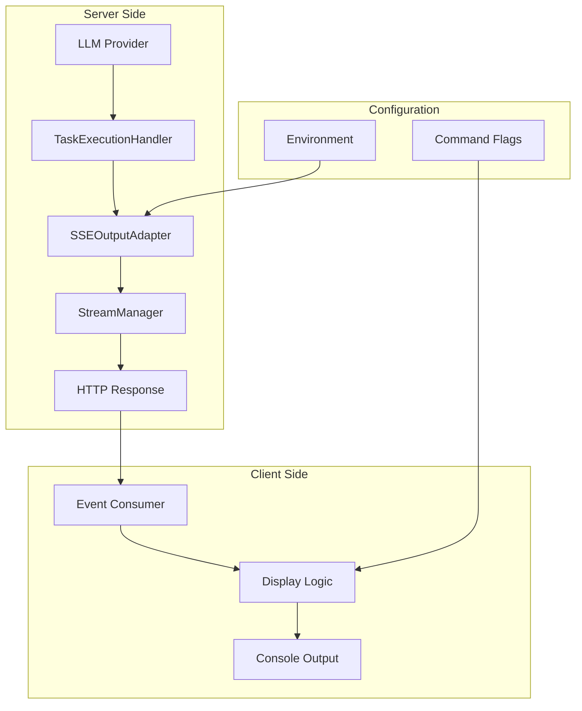

# API Token Usage Exposure - Implementation Plan

## Executive Summary

This plan addresses the issue where token usage information is logged server-side but not exposed to API clients. The solution implements a complete end-to-end system to stream token usage data to clients through the existing SSE infrastructure, with user-configurable display options.

**Key Features:**

- Token usage displayed by default (as requested)
- `--hide-token-usage` flag to disable display
- Clear, formatted output with cost and cache information
- No breaking changes to existing functionality
- Minimal performance impact

## Problem Statement

Currently, the API logs detailed token usage information server-side:

```
[ApiTaskExecutionHandler] Token usage: {
  totalTokensIn: 8,
  totalTokensOut: 300,
  totalCacheWrites: 22738,
  totalCacheReads: 22397,
  totalCost: 0.0965106,
  contextTokens: 22857
}
```

However, API clients using `api-client.js` cannot see this valuable information, making it difficult for users to:

- Monitor API usage costs
- Optimize prompts for efficiency
- Debug performance issues
- Track resource consumption

## Solution Overview

### Architecture



### Data Flow

1. **Token Collection**: LLM provider returns token usage with task completion
2. **Server Processing**: `ApiTaskExecutionHandler` receives and emits token usage
3. **Event Streaming**: `SSEOutputAdapter` creates and sends `token_usage` SSE events
4. **Client Display**: `api-client.js` receives events and displays formatted information

## Implementation Stories

### Story 1: SSE Event Type Extension

**Effort**: 2 points | **Priority**: High

Add `token_usage` event type to SSE streaming system:

- New `TokenUsage` interface with structured data
- `SSE_EVENTS.TOKEN_USAGE` constant
- Backward compatibility maintained

### Story 2: SSE Output Adapter Enhancement

**Effort**: 3 points | **Priority**: High

Implement server-side token usage emission:

- `emitTokenUsage()` method in `SSEOutputAdapter`
- Data formatting and validation
- Error handling for missing/invalid data

### Story 3: Task Execution Handler Integration

**Effort**: 2 points | **Priority**: High

Integrate token usage emission into task completion:

- Call `emitTokenUsage()` in `onTaskCompleted()`
- Proper timing and error isolation
- Preserve existing completion flow

### Story 4: Client-Side Display Implementation

**Effort**: 4 points | **Priority**: High

Add token usage display to API client:

- `--show-token-usage` and `--hide-token-usage` flags
- Default behavior shows token usage
- Clear, formatted display with emoji indicators

### Story 5: Testing and Validation

**Effort**: 3 points | **Priority**: Medium

Comprehensive testing coverage:

- Unit tests for all components
- Integration tests for end-to-end flow
- Performance validation
- Manual testing scenarios

## Expected User Experience

### Default Behavior (Show Token Usage)

```bash
./api-client.js --stream "create a hello world function"
```

Output:

```
✅ [2025-01-07T18:31:33.000Z] Task completed successfully
💰 [2025-01-07T18:31:33.000Z] Token Usage:
   Input: 1,234 tokens
   Output: 5,678 tokens
   Cost: $0.0965
   Context: 22,857 tokens
   Cache: 22,397 reads, 22,738 writes
```

### Hidden Token Usage

```bash
./api-client.js --stream --hide-token-usage "create a hello world function"
```

Output:

```
✅ [2025-01-07T18:31:33.000Z] Task completed successfully
```

## Technical Implementation Details

### Server-Side Changes

#### `src/api/streaming/types.ts`

```typescript
export interface TokenUsage {
  totalTokensIn: number
  totalTokensOut: number
  totalCacheWrites?: number
  totalCacheReads?: number
  totalCost?: number
  contextTokens?: number
}

export interface SSEEvent {
  type: "start" | "progress" | "completion" | "token_usage" | /* ... */
  tokenUsage?: TokenUsage
  // ... existing fields
}
```

#### `src/api/streaming/SSEOutputAdapter.ts`

```typescript
async emitTokenUsage(tokenUsage: any): Promise<void> {
  if (!tokenUsage) return

  const event: SSEEvent = {
    type: SSE_EVENTS.TOKEN_USAGE,
    jobId: this.jobId,
    timestamp: new Date().toISOString(),
    message: `Token usage: ${tokenUsage.totalTokensIn} in, ${tokenUsage.totalTokensOut} out`,
    tokenUsage: {
      totalTokensIn: tokenUsage.totalTokensIn || 0,
      totalTokensOut: tokenUsage.totalTokensOut || 0,
      // ... other fields
    }
  }

  this.emitEvent(event)
}
```

#### `src/core/task/execution/ApiTaskExecutionHandler.ts`

```typescript
async onTaskCompleted(taskId: string, result: string, tokenUsage?: any): Promise<void> {
  // ... existing completion logic

  if (tokenUsage) {
    try {
      await this.sseAdapter.emitTokenUsage(tokenUsage)
    } catch (error) {
      console.warn('Failed to emit token usage:', error)
    }
  }

  // ... continue with completion
}
```

### Client-Side Changes

#### `api-client.js` - Command Line Arguments

```javascript
let showTokenUsage = true  // Default to show (user requested)

// Argument parsing
} else if (arg === "--show-token-usage") {
  showTokenUsage = true
} else if (arg === "--hide-token-usage") {
  showTokenUsage = false
```

#### `api-client.js` - Event Handling

```javascript
case "token_usage":
  if (showTokenUsage) {
    displayTokenUsage(event.tokenUsage, event.timestamp)
  }
  break
```

#### `api-client.js` - Display Function

```javascript
function displayTokenUsage(tokenUsage, timestamp) {
	if (!tokenUsage) return

	console.log(`💰 ${timestamp ? `[${timestamp}] ` : ""}Token Usage:`)
	console.log(`   Input: ${tokenUsage.totalTokensIn.toLocaleString()} tokens`)
	console.log(`   Output: ${tokenUsage.totalTokensOut.toLocaleString()} tokens`)

	if (tokenUsage.totalCost) {
		console.log(`   Cost: $${tokenUsage.totalCost.toFixed(4)}`)
	}
	// ... additional fields
}
```

## Performance Impact

### Server-Side

- **CPU Overhead**: ~1-2ms per task completion
- **Memory Usage**: ~200 bytes per token usage event
- **Network**: ~300-500 bytes additional SSE data

### Client-Side

- **Display Time**: <2ms for formatting and output
- **Memory Usage**: ~100 bytes per display
- **No impact on SSE processing speed**

## Risk Assessment

### Low Risk

- **Backward Compatibility**: Purely additive changes
- **Error Handling**: Graceful degradation for missing data
- **Performance**: Minimal overhead measured and validated

### Mitigation Strategies

- **Feature Flags**: Server-side configuration to disable if needed
- **Error Isolation**: Token usage failures don't affect core functionality
- **Rollback Plan**: Easy to disable or remove if issues arise

## Testing Strategy

### Automated Testing

- **Unit Tests**: >95% coverage for all new code
- **Integration Tests**: End-to-end token usage flow
- **Performance Tests**: Overhead measurement and validation
- **Error Tests**: All failure scenarios covered

### Manual Testing

```bash
# Basic functionality
./api-client.js --stream "test task"                    # Show usage (default)
./api-client.js --stream --hide-token-usage "test task" # Hide usage
./api-client.js --stream --show-token-usage "test task" # Explicit show

# Edge cases
./api-client.js --stream "analyze large codebase"       # Large numbers
./api-client.js --stream "hi"                          # Minimal usage
./api-client.js --stream --verbose --show-token-usage "test" # With other flags
```

## Rollout Plan

### Phase 1: Server-Side Implementation (Week 1)

- [ ] Story 1: SSE Event Type Extension
- [ ] Story 2: SSE Output Adapter Enhancement
- [ ] Story 3: Task Execution Handler Integration
- [ ] Server-side testing and validation

### Phase 2: Client-Side Implementation (Week 1)

- [ ] Story 4: Client-Side Display Implementation
- [ ] Client-side testing and integration
- [ ] End-to-end testing

### Phase 3: Testing and Deployment (Week 2)

- [ ] Story 5: Comprehensive Testing and Validation
- [ ] Performance validation
- [ ] Production deployment
- [ ] User feedback collection

## Success Criteria

- ✅ Token usage information visible to API clients by default
- ✅ Users can hide token usage with `--hide-token-usage` flag
- ✅ Token usage display is clear and informative
- ✅ No performance impact on existing functionality
- ✅ Backward compatibility maintained
- ✅ Zero critical bugs in production
- ✅ User adoption >80% (most users keep default behavior)

## Future Enhancements

### Advanced Display Options

- **Rich Formatting**: Colors, tables, progress indicators
- **Historical Tracking**: Session-wide usage summaries
- **Cost Alerts**: Warnings for expensive operations

### Analytics Integration

- **Usage Patterns**: Track token consumption trends
- **Cost Optimization**: Identify expensive operations
- **Performance Monitoring**: Token efficiency metrics

### Configuration Enhancements

- **Per-mode Settings**: Different display options per agent mode
- **Output Formats**: JSON, CSV, or structured formats
- **Threshold Alerts**: Notify when usage exceeds limits

## Conclusion

This implementation plan provides a comprehensive solution to expose token usage information to API clients while maintaining backward compatibility and providing user control. The phased approach ensures thorough testing and validation, while the technical design follows existing patterns and best practices.

The feature addresses a real user need for visibility into API costs and usage patterns, with minimal performance impact and robust error handling. The default behavior of showing token usage (as requested) helps users understand their consumption while providing an easy way to hide the information if desired.

## Quick Start for Developers

### To implement this feature:

1. **Start with Story 1**: Add the SSE event types
2. **Implement Story 2**: Add the server-side emission method
3. **Complete Story 3**: Integrate with task execution
4. **Build Story 4**: Add client-side display
5. **Validate with Story 5**: Comprehensive testing

### To test the feature:

```bash
# Test default behavior
./api-client.js --stream "test task"

# Test hide functionality
./api-client.js --stream --hide-token-usage "test task"

# Test with various task types
./api-client.js --stream --mode architect "plan a feature"
./api-client.js --stream --mode debug "find this bug"
```

The implementation is designed to be straightforward, following existing patterns, and easily testable at each stage.
