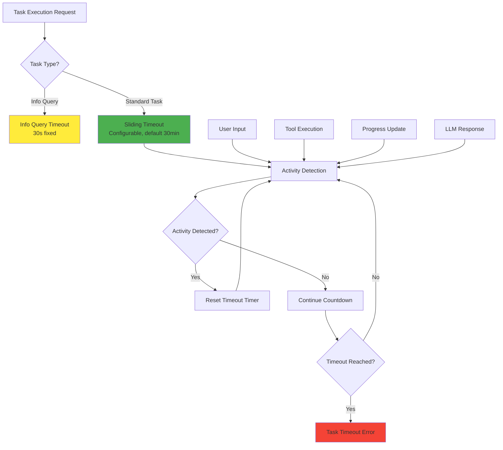

# API Timeout System Enhancement

## Problem Statement

The current API timeout system has two mechanisms:

1. **Emergency Timeout**: Hard 60-second limit that never resets (causing premature task termination)
2. **Sliding Timeout**: 10-minute timeout that resets on activity (works correctly)

The emergency timeout is counterproductive for long-running tasks and conflicts with the planned features for:

- Tasks that run hours or days
- Task state persistence and restoration
- Complex workflows requiring extended execution time

## Solution Overview

Remove the emergency timeout mechanism and enhance the sliding timeout system to support long-running tasks with proper activity detection and future state persistence.

## Architecture Diagram



## Stories

### Story 1: Remove Emergency Timeout from Standard Tasks

**Goal**: Remove the hard 60-second emergency timeout for standard tasks

**Acceptance Criteria**:

- [ ] Remove `emergencyTimeoutMs` from `TaskExecutionOptions` interface
- [ ] Remove emergency timeout logic from `executeStandardTask()` method
- [ ] Update API server configuration to not pass `emergencyTimeoutMs`
- [ ] Keep info query timeout separate (serves different purpose)
- [ ] Update all related tests
- [ ] Verify no emergency timeout errors occur in API logs

**Files to Modify**:

- `src/core/task/execution/types.ts`
- `src/core/task/execution/TaskExecutionOrchestrator.ts`
- `src/api/server/FastifyServer.ts`
- Related test files

### Story 2: Enhance Sliding Timeout Configuration

**Goal**: Make sliding timeout more configurable and appropriate for long-running tasks

**Acceptance Criteria**:

- [ ] Add environment variable `TASK_DEFAULT_SLIDING_TIMEOUT_MS` (default: 30 minutes)
- [ ] Add environment variable `TASK_MAX_SLIDING_TIMEOUT_MS` (default: 24 hours)
- [ ] Add API parameter to override sliding timeout per request
- [ ] Add configuration validation and bounds checking
- [ ] Update default from 10 minutes to 30 minutes
- [ ] Document new configuration options

**Configuration Changes**:

```typescript
// Environment Variables
TASK_DEFAULT_SLIDING_TIMEOUT_MS=1800000  // 30 minutes
TASK_MAX_SLIDING_TIMEOUT_MS=86400000     // 24 hours max

// API Request Override
POST /api/tasks
{
  "message": "...",
  "slidingTimeoutMs": 3600000  // 1 hour for this specific task
}
```

### Story 3: Improve Activity Detection

**Goal**: Ensure all task activities properly reset the sliding timeout

**Acceptance Criteria**:

- [ ] Audit all activity types that should reset timeout
- [ ] Ensure tool executions reset timeout
- [ ] Ensure user interactions reset timeout
- [ ] Ensure progress updates reset timeout
- [ ] Ensure LLM responses reset timeout
- [ ] Add more granular activity logging for debugging
- [ ] Verify timeout resets work across CLI, API, and Extension contexts
- [ ] Add activity type documentation

**Activity Types to Monitor**:

- Tool executions (file operations, commands, etc.)
- User input/responses
- LLM streaming responses
- Progress updates
- Mode switches
- Task spawning

### Story 4: Prepare for State Persistence

**Goal**: Design timeout system to work with future task state persistence

**Acceptance Criteria**:

- [ ] Add task state serialization hooks for timeout information
- [ ] Design timeout restoration logic for resumed tasks
- [ ] Add metadata tracking for task pause/resume scenarios
- [ ] Document timeout behavior for persistent tasks
- [ ] Create interfaces for future state persistence integration

**Design Considerations**:

- How to handle timeout when task is paused/resumed
- Whether to reset timeout on task restoration
- How to track cumulative execution time vs. activity time
- Integration with future task state storage

### Story 5: Update Tests and Documentation

**Goal**: Update all tests and documentation to reflect new timeout behavior

**Acceptance Criteria**:

- [ ] Remove emergency timeout tests
- [ ] Update sliding timeout tests with new defaults
- [ ] Add tests for configurable timeout scenarios
- [ ] Add tests for activity detection
- [ ] Update API documentation
- [ ] Update configuration documentation
- [ ] Update troubleshooting guides
- [ ] Create migration guide for users

## Benefits

1. **Eliminates 60-second timeout errors** - No more premature task termination
2. **Supports long-running tasks** - Hours or days of execution time
3. **Activity-based timeout** - Only times out on actual inactivity
4. **Configurable per request** - Different tasks can have different timeout needs
5. **Future-ready** - Designed for task state persistence and resumption
6. **Cleaner architecture** - Removes redundant timeout mechanism

## Implementation Priority

1. **High Priority**: Story 1 (Remove Emergency Timeout) - Fixes immediate issue
2. **High Priority**: Story 2 (Enhanced Configuration) - Provides flexibility
3. **Medium Priority**: Story 3 (Activity Detection) - Improves reliability
4. **Low Priority**: Story 4 (State Persistence Prep) - Future-proofing
5. **Medium Priority**: Story 5 (Tests/Docs) - Ensures quality

## Testing Strategy

1. **Unit Tests**: Test timeout logic in isolation
2. **Integration Tests**: Test timeout behavior across CLI/API/Extension
3. **Long-running Tests**: Verify tasks can run for extended periods
4. **Activity Tests**: Verify all activity types reset timeout properly
5. **Configuration Tests**: Test various timeout configurations
6. **Regression Tests**: Ensure info query timeouts still work correctly

## Rollout Plan

1. **Phase 1**: Remove emergency timeout (immediate fix)
2. **Phase 2**: Add configuration options
3. **Phase 3**: Enhance activity detection
4. **Phase 4**: Prepare for state persistence
5. **Phase 5**: Complete documentation and testing
