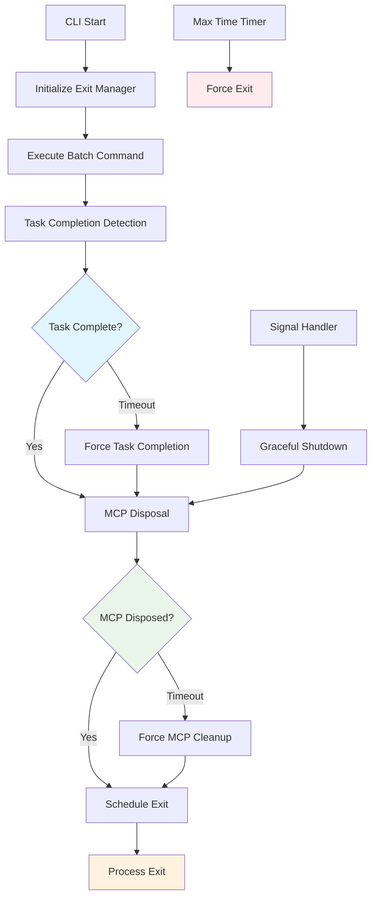

# CLI Hanging Fix - Phase 4: Integration and Testing

## Overview

Integrate all three phases of the CLI hanging fix and provide comprehensive testing to ensure reliable CLI exit behavior in all scenarios.

## Problem Statement

While each phase addresses specific aspects of the hanging issue, they must work together cohesively to provide a robust solution. Integration testing and validation are critical to ensure the fix works in real-world scenarios.

## Integration Architecture



## Integration Points

### 1. Exit Manager Coordination

The exit manager coordinates all phases and provides fallback mechanisms:

```typescript
// src/cli/index.ts - Integration coordination

class IntegratedCLIExitManager extends CLIExitManager {
	private taskCompletionDetector?: TaskCompletionDetector
	private mcpDisposalManager?: MCPDisposalManager

	async executeWithIntegratedCleanup(
		operation: () => Promise<void>,
		operationType: "batch" | "interactive",
	): Promise<void> {
		// Phase 1: Setup completion detection
		if (operationType === "batch") {
			this.taskCompletionDetector = new TaskCompletionDetector()
		}

		// Phase 2: Setup MCP disposal
		this.mcpDisposalManager = new MCPDisposalManager()

		try {
			// Execute the main operation
			await Promise.race([operation(), this.createOperationTimeout(operationType)])

			// Success path
			await this.performIntegratedCleanup()
			this.scheduleExit(0, `${operationType} operation completed successfully`)
		} catch (error) {
			this.logger.error(`${operationType} operation failed:`, error)

			// Error path - still perform cleanup
			await this.performIntegratedCleanup()
			this.scheduleExit(1, `${operationType} operation failed`)
		}
	}

	private async performIntegratedCleanup(): Promise<void> {
		const cleanupTimeout = 10000 // 10 seconds total cleanup time

		try {
			await Promise.race([
				this.executeCleanupPhases(),
				new Promise((_, reject) =>
					setTimeout(() => reject(new Error("Integrated cleanup timeout")), cleanupTimeout),
				),
			])
		} catch (error) {
			this.logger.warn("Integrated cleanup timeout, forcing exit preparation")
		}
	}

	private async executeCleanupPhases(): Promise<void> {
		const phases = [
			() => this.taskCompletionDetector?.cleanup(),
			() => this.mcpDisposalManager?.dispose(),
			() => this.disposeMcpServices(),
			() => this.clearGlobalTimers(),
			() => this.removeEventListeners(),
		]

		for (const phase of phases) {
			try {
				await Promise.race([
					phase(),
					new Promise((_, reject) => setTimeout(() => reject(new Error("Phase timeout")), 2000)),
				])
			} catch (error) {
				this.logger.debug("Cleanup phase timeout or error:", error)
				// Continue with next phase
			}
		}
	}
}
```

### 2. Enhanced Batch Processor Integration

Update BatchProcessor to work with all phases:

```typescript
// src/cli/commands/batch.ts - Full integration

export class IntegratedBatchProcessor extends BatchProcessor {
	private exitManager: IntegratedCLIExitManager
	private completionDetector: ResponseCompletionDetector

	constructor(options: BatchOptions, configManager?: CliConfigManager, exitManager?: IntegratedCLIExitManager) {
		super(options, configManager)
		this.exitManager = exitManager || new IntegratedCLIExitManager(getCLILogger())
		this.completionDetector = new ResponseCompletionDetector()
	}

	async run(taskDescription: string): Promise<void> {
		return this.exitManager.executeWithIntegratedCleanup(() => this.executeTask(taskDescription), "batch")
	}

	private async executeTask(taskDescription: string): Promise<void> {
		this.logDebug("[IntegratedBatchProcessor] Starting integrated batch execution...")

		// Detect task type for completion strategy
		const isInfoQuery = this.completionDetector.isInformationalQuery(taskDescription)

		// Create CLI adapters and configuration
		const adapters = createCliAdapters({
			workspaceRoot: this.options.cwd,
			isInteractive: false,
			verbose: this.options.verbose,
		})

		const { apiConfiguration } = await this.loadConfiguration()
		const cliUIService = new CLIUIService(this.options.color)

		// Create task with integrated lifecycle management
		const [task, taskPromise] = Task.create({
			apiConfiguration,
			task: taskDescription,
			fileSystem: adapters.fileSystem,
			terminal: adapters.terminal,
			browser: adapters.browser,
			telemetry: adapters.telemetry,
			workspacePath: this.options.cwd,
			globalStoragePath: process.env.HOME ? `${process.env.HOME}/.agentz` : "/tmp/.agentz",
			startTask: true,
			verbose: this.options.verbose,
			cliUIService: cliUIService,
			mcpConfigPath: this.options.mcpConfig,
			mcpAutoConnect: this.options.mcpAutoConnect !== false && !this.options.noMcpAutoConnect,
			mcpTimeout: this.options.mcpTimeout,
			mcpRetries: this.options.mcpRetries,
		})

		// Setup integrated completion detection
		const completionPromise = this.completionDetector.setupCompletionDetection(task, taskDescription, isInfoQuery)

		// Execute with comprehensive monitoring
		await Promise.race([completionPromise, taskPromise, this.createTaskTimeout(isInfoQuery)])

		this.logDebug("[IntegratedBatchProcessor] Task execution completed")
	}

	private createTaskTimeout(isInfoQuery: boolean): Promise<never> {
		const timeout = isInfoQuery ? 30000 : 60000 // 30s for info, 60s for others

		return new Promise((_, reject) => {
			setTimeout(() => {
				reject(new Error(`Task timeout after ${timeout}ms`))
			}, timeout)
		})
	}
}
```

### 3. Response Completion Detector

Extract completion detection logic into a dedicated class:

```typescript
// src/cli/services/ResponseCompletionDetector.ts

export class ResponseCompletionDetector {
	private responseBuffer = ""
	private lastResponseTime = 0
	private completionTimer?: NodeJS.Timeout
	private logger = getCLILogger()

	isInformationalQuery(taskDescription: string): boolean {
		const infoPatterns = [
			/what.*(mcp|servers?).*(available|do you have)/i,
			/list.*(mcp|servers?)/i,
			/which.*(mcp|servers?)/i,
			/show.*(mcp|servers?)/i,
			/tell me about.*(mcp|servers?)/i,
		]

		return infoPatterns.some((pattern) => pattern.test(taskDescription))
	}

	detectResponseCompletion(response: string): boolean {
		const informationIndicators = [
			"available mcp servers",
			"connected mcp servers",
			"no mcp servers",
			"i have access to",
			"mcp servers:",
			"the following mcp servers",
			"these servers provide",
		]

		const lowerResponse = response.toLowerCase()
		return informationIndicators.some((indicator) => lowerResponse.includes(indicator))
	}

	async setupCompletionDetection(task: Task, taskDescription: string, isInfoQuery: boolean): Promise<void> {
		return new Promise((resolve, reject) => {
			let completed = false

			const complete = (reason: string) => {
				if (completed) return
				completed = true

				this.logger.debug(`[CompletionDetector] Task completed: ${reason}`)

				if (this.completionTimer) {
					clearTimeout(this.completionTimer)
				}

				resolve()
			}

			// Setup response monitoring for info queries
			if (isInfoQuery) {
				this.setupResponseMonitoring(task, complete)
			}

			// Setup standard event handlers
			this.setupEventHandlers(task, complete, reject)
		})
	}

	private setupResponseMonitoring(task: Task, complete: (reason: string) => void): void {
		task.on("message", (event: any) => {
			if (event.action === "response" || event.action === "say") {
				const content = event.message?.text || event.content || ""
				this.responseBuffer += content
				this.lastResponseTime = Date.now()

				// Clear existing timer
				if (this.completionTimer) {
					clearTimeout(this.completionTimer)
				}

				// Check for immediate completion
				if (this.detectResponseCompletion(this.responseBuffer)) {
					this.completionTimer = setTimeout(() => {
						complete("Response completion detected")
					}, 1000)
				} else {
					// Set timer for response completion by timeout
					this.completionTimer = setTimeout(() => {
						const timeSinceLastResponse = Date.now() - this.lastResponseTime
						if (timeSinceLastResponse >= 2000 && this.responseBuffer.length > 50) {
							complete("Response timeout completion")
						}
					}, 3000)
				}
			}
		})
	}

	private setupEventHandlers(task: Task, complete: (reason: string) => void, reject: (error: Error) => void): void {
		task.on("taskCompleted", (taskId: string) => {
			complete(`Standard task completion: ${taskId}`)
		})

		task.on("taskAborted", () => {
			reject(new Error("Task was aborted"))
		})

		task.on("taskToolFailed", (taskId: string, tool: string, error: string) => {
			reject(new Error(`Tool ${tool} failed: ${error}`))
		})
	}

	cleanup(): void {
		if (this.completionTimer) {
			clearTimeout(this.completionTimer)
			this.completionTimer = undefined
		}
		this.responseBuffer = ""
	}
}
```

## Comprehensive Testing Strategy

### 1. Test Suite Structure

```
tests/
├── unit/
│   ├── task-completion-detection.test.ts
│   ├── mcp-disposal.test.ts
│   ├── process-exit-enforcement.test.ts
│   └── integration-coordination.test.ts
├── integration/
│   ├── cli-hanging-scenarios.test.ts
│   ├── mcp-server-lifecycle.test.ts
│   ├── signal-handling.test.ts
│   └── resource-cleanup.test.ts
└── e2e/
    ├── real-mcp-servers.test.ts
    ├── timeout-scenarios.test.ts
    └── stress-testing.test.ts
```

### 2. Critical Test Scenarios

```typescript
// tests/integration/cli-hanging-scenarios.test.ts

describe("CLI Hanging Fix Integration", () => {
	test("original hanging scenario - MCP server query", async () => {
		const result = await runCLICommand(["--batch", "what mcp servers do you have available?", "--verbose"], {
			timeout: 10000,
		})

		expect(result.exitCode).toBe(0)
		expect(result.stdout).toContain("MCP servers")
		expect(result.duration).toBeLessThan(8000) // 8 seconds max
	})

	test("hanging MCP disposal scenario", async () => {
		// Test with deliberately slow MCP server
		const result = await runCLICommand(
			[
				"--batch",
				"list available tools",
				"--mcp-timeout",
				"1000", // Short timeout to trigger disposal
			],
			{ timeout: 15000 },
		)

		expect(result.exitCode).toBe(0)
		expect(result.duration).toBeLessThan(12000)
	})

	test("maximum execution time enforcement", async () => {
		const result = await runCLICommand(["--batch", "perform an extremely long operation that should timeout"], {
			timeout: 130000,
		}) // Just over 2 minutes

		expect(result.exitCode).toBe(1)
		expect(result.stderr).toContain("Maximum execution time exceeded")
	})

	test("signal handling - SIGTERM", async () => {
		const child = spawnCLICommand(["--batch", "long running operation"])

		setTimeout(() => {
			child.kill("SIGTERM")
		}, 2000)

		const result = await waitForExit(child)
		expect(result.exitCode).toBe(143) // SIGTERM exit code
		expect(result.duration).toBeLessThan(20000) // Should exit within 20s
	})
})
```

### 3. Performance Benchmarks

```typescript
// tests/performance/exit-timing.test.ts

describe("Exit Performance", () => {
	test("information query completion time", async () => {
		const times = []

		for (let i = 0; i < 10; i++) {
			const start = Date.now()
			await runCLICommand(["--batch", "what mcp servers are available?"])
			times.push(Date.now() - start)
		}

		const avgTime = times.reduce((a, b) => a + b) / times.length
		expect(avgTime).toBeLessThan(5000) // Average under 5 seconds

		const maxTime = Math.max(...times)
		expect(maxTime).toBeLessThan(8000) // Max under 8 seconds
	})

	test("MCP disposal performance", async () => {
		// Test with multiple MCP servers
		const result = await runCLICommand(["--batch", "list all available tools and resources"])

		expect(result.exitCode).toBe(0)
		expect(result.duration).toBeLessThan(10000)
	})
})
```

## Implementation Roadmap

### Sprint 1: Core Integration (Week 1)

- [ ] Implement `IntegratedCLIExitManager`
- [ ] Create `ResponseCompletionDetector`
- [ ] Update `BatchProcessor` with integration
- [ ] Basic integration testing

### Sprint 2: MCP Enhancement (Week 1)

- [ ] Implement enhanced MCP disposal
- [ ] Add process force termination
- [ ] Update connection classes
- [ ] MCP disposal testing

### Sprint 3: Process Exit (Week 1)

- [ ] Add exit enforcement mechanisms
- [ ] Implement signal handlers
- [ ] Add timeout management
- [ ] Process exit testing

### Sprint 4: Testing & Validation (Week 1)

- [ ] Comprehensive test suite
- [ ] Performance benchmarks
- [ ] Edge case testing
- [ ] Documentation and examples

## Acceptance Criteria

### Functional Requirements

- [ ] CLI exits cleanly for all batch commands within 10 seconds
- [ ] Information queries complete within 5 seconds typically
- [ ] Signal handling works correctly (SIGINT/SIGTERM)
- [ ] No hanging processes or resource leaks
- [ ] Proper exit codes for success/failure scenarios

### Performance Requirements

- [ ] 95% of operations complete within expected timeframes
- [ ] Maximum execution time never exceeds 2 minutes
- [ ] Cleanup operations complete within 10 seconds
- [ ] Memory usage remains stable

### Reliability Requirements

- [ ] 100% exit success rate across all test scenarios
- [ ] Zero hanging CLI instances in production
- [ ] Graceful degradation when cleanup fails
- [ ] Comprehensive error logging and debugging info

## Success Metrics

### Primary KPIs

- **Hanging Incidents**: 0% (down from current 100% for affected scenarios)
- **Exit Success Rate**: 100% (up from current ~0% for hanging scenarios)
- **User Satisfaction**: Measured via feedback on CLI reliability

### Secondary Metrics

- **Average Exit Time**: < 3 seconds for typical operations
- **99th Percentile Exit Time**: < 8 seconds
- **Resource Cleanup Success**: 100%
- **Error Resolution Time**: < 1 minute for any remaining issues

## Rollback Plan

If issues arise during deployment:

1. **Phase Rollback**: Can disable individual phases via feature flags
2. **Timeout Adjustment**: Can increase timeouts via configuration
3. **Full Rollback**: Revert to previous CLI implementation
4. **Hotfix Deployment**: Critical fixes can be deployed independently

## Documentation Updates

- [ ] Update CLI documentation with new timeout behaviors
- [ ] Add troubleshooting guide for exit issues
- [ ] Document configuration options for timeouts
- [ ] Create debugging guide for hanging scenarios

This integration phase ensures all components work together seamlessly to provide a reliable, fast-exiting CLI experience.
