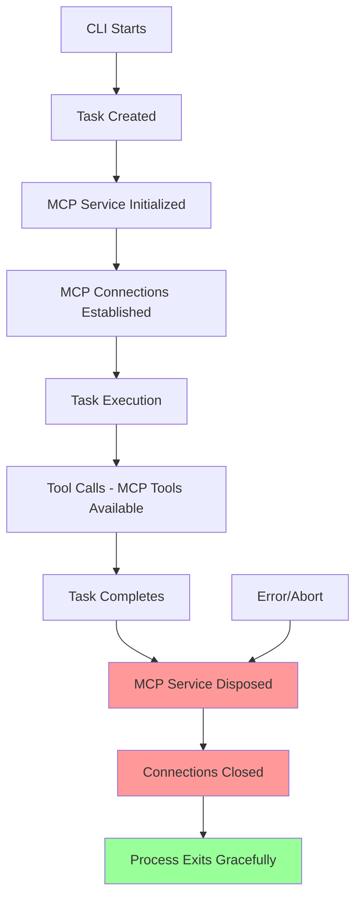

# CLI MCP Hanging Issue Fix

## Problem Statement

The CLI hangs after task completion when MCP servers are connected, requiring manual termination (Ctrl+C). This occurs because MCP connections are established but never properly cleaned up, keeping the Node.js event loop alive.

## Root Cause Analysis

### Current Issues

1. **Resource Leak**: `CLIMcpService` instance is created as local variable and never disposed
2. **Missing Tool Implementations**: `use_mcp_tool` and `access_mcp_resource` return "not implemented for CLI mode"
3. **Event Loop Persistence**: Active MCP connections (TCP sockets, timers, health checkers) prevent process termination
4. **No Cleanup Chain**: Missing lifecycle management from task completion to process exit

### Evidence

- Console output shows task completion but process hangs
- Memory pressure detected: 117% of limit used
- Tool execution failures for MCP operations
- Manual Ctrl+C required to terminate CLI

## Solution Architecture



## Implementation Stories

### Story 1: Task MCP Service Lifecycle Management

**Priority**: HIGH  
**File**: `src/core/task/Task.ts`

**Description**: Implement proper lifecycle management for MCP service in Task class

**Acceptance Criteria**:

- [ ] Add `cliMcpService` as instance property to Task class
- [ ] Store MCP service reference during initialization instead of local variable
- [ ] Add `dispose()` method to Task class that calls `cliMcpService.dispose()`
- [ ] Call cleanup on `taskCompleted` event
- [ ] Call cleanup on `taskAborted` event
- [ ] Ensure no memory leaks from unreferenced MCP connections

**Technical Implementation**:

```typescript
class Task extends EventEmitter {
  private cliMcpService?: CLIMcpService

  // In initialization code (around line 1171)
  this.cliMcpService = new CLIMcpService(this.mcpConfigPath)

  async dispose() {
    if (this.cliMcpService) {
      await this.cliMcpService.dispose()
      this.cliMcpService = undefined
    }
  }

  // Add event handlers for cleanup
  this.on('taskCompleted', () => this.dispose())
  this.on('taskAborted', () => this.dispose())
}
```

### Story 2: Implement CLI MCP Tools

**Priority**: HIGH  
**Files**:

- `src/core/task/Task.ts` (executeCliTool method)
- `src/cli/services/CLIMcpService.ts` (tool delegation methods)

**Description**: Implement missing MCP tools for CLI mode to enable resource listing and tool execution

**Acceptance Criteria**:

- [ ] Implement `use_mcp_tool` in `executeCliTool` method
- [ ] Implement `access_mcp_resource` in `executeCliTool` method
- [ ] Add `executeTool(serverName, toolName, arguments)` method to CLIMcpService
- [ ] Add `accessResource(serverName, uri)` method to CLIMcpService
- [ ] Handle tool errors gracefully with proper error messages
- [ ] Return properly formatted responses for CLI context

**Technical Implementation**:

```typescript
// In Task.ts executeCliTool method
case 'use_mcp_tool':
  if (!this.cliMcpService) {
    throw new Error('MCP service not available in CLI mode')
  }
  return await this.cliMcpService.executeTool(
    params.server_name,
    params.tool_name,
    JSON.parse(params.arguments)
  )

case 'access_mcp_resource':
  if (!this.cliMcpService) {
    throw new Error('MCP service not available in CLI mode')
  }
  return await this.cliMcpService.accessResource(
    params.server_name,
    params.uri
  )
```

### Story 3: BatchProcessor Cleanup Integration

**Priority**: MEDIUM  
**File**: `src/cli/commands/batch.ts`

**Description**: Ensure BatchProcessor properly handles cleanup and doesn't hang after task completion

**Acceptance Criteria**:

- [ ] Add cleanup handling in BatchProcessor event listeners
- [ ] Ensure MCP disposal on task completion events
- [ ] Implement timeout-based cleanup for hung processes
- [ ] Handle cleanup on process termination signals (SIGINT, SIGTERM)
- [ ] Remove or increase timeout to prevent premature termination

**Technical Implementation**:

```typescript
// In BatchProcessor.executeTask method
task.on("taskCompleted", async (taskId: string, tokenUsage: any, toolUsage: any) => {
	this.logDebug(`[BatchProcessor] Task completed: ${taskId}`)
	this.logDebug(`[BatchProcessor] Token usage:`, tokenUsage)
	this.logDebug(`[BatchProcessor] Tool usage:`, toolUsage)

	// Ensure cleanup before resolving
	try {
		await task.dispose()
	} catch (error) {
		this.logDebug("Cleanup error:", error)
	}

	resolve()
})

task.on("taskAborted", async () => {
	this.logDebug("[BatchProcessor] Task was aborted")
	try {
		await task.dispose()
	} catch (error) {
		this.logDebug("Cleanup error:", error)
	}
	reject(new Error("Task was aborted"))
})
```

### Story 4: CLI Main Process Exit Handling

**Priority**: MEDIUM  
**File**: `src/cli/index.ts`

**Description**: Implement graceful shutdown sequence and ensure CLI exits automatically

**Acceptance Criteria**:

- [ ] Add process exit handlers for cleanup operations
- [ ] Implement graceful shutdown sequence with timeout
- [ ] Add timeout for forced exit if cleanup hangs (10 seconds)
- [ ] Ensure proper exit codes reflect task success/failure status
- [ ] Handle SIGINT and SIGTERM signals gracefully

**Technical Implementation**:

```typescript
// In main CLI action handler
process.on("SIGINT", async () => {
	console.log("\nReceived SIGINT, cleaning up...")
	// Trigger cleanup and exit
	setTimeout(() => process.exit(130), 10000) // Force exit after 10s
})

process.on("SIGTERM", async () => {
	console.log("\nReceived SIGTERM, cleaning up...")
	setTimeout(() => process.exit(143), 10000) // Force exit after 10s
})

// After task execution
try {
	if (options.batch || options.stdin || !options.interactive) {
		// ... existing code ...
	} else {
		// ... existing code ...
	}

	// Ensure process exits
	setTimeout(() => {
		if (options.verbose) {
			logger.debug("Forcing process exit after timeout")
		}
		process.exit(0)
	}, 5000)
} catch (error) {
	// ... existing error handling ...
	process.exit(1)
}
```

### Story 5: Connection Health and Cleanup Enhancement

**Priority**: LOW  
**File**: `src/cli/services/CLIMcpService.ts`

**Description**: Enhance disposal method with robust cleanup and timeout handling

**Acceptance Criteria**:

- [ ] Add timeout handling to dispose method (default 5 seconds)
- [ ] Implement connection state tracking for cleanup verification
- [ ] Add forced cleanup for unresponsive connections
- [ ] Enhance logging for cleanup operations in verbose mode
- [ ] Ensure dispose is idempotent (safe to call multiple times)

**Technical Implementation**:

```typescript
async dispose(): Promise<void> {
  if (this.isDisposed) {
    return // Already disposed
  }

  const logger = getCLILogger()
  logger.debug('CLIMcpService: Starting disposal...')

  // Stop all health checkers
  for (const [serverId, interval] of this.healthCheckIntervals) {
    clearInterval(interval)
    this.healthCheckIntervals.delete(serverId)
  }

  // Disconnect all servers with timeout
  const disconnectPromises = Array.from(this.connections.keys()).map(async (serverId) => {
    try {
      const timeoutPromise = new Promise((_, reject) =>
        setTimeout(() => reject(new Error('Disconnect timeout')), 3000)
      )

      await Promise.race([
        this.disconnectFromServer(serverId),
        timeoutPromise
      ])

      logger.debug(`CLIMcpService: Disconnected from ${serverId}`)
    } catch (error) {
      logger.debug(`CLIMcpService: Force disconnect ${serverId}:`, error)
      // Force remove connection
      this.connections.delete(serverId)
    }
  })

  await Promise.allSettled(disconnectPromises)

  this.isDisposed = true
  logger.debug('CLIMcpService: Disposal complete')
}
```

## Implementation Priority

1. **Story 1 (HIGH)**: Task Lifecycle - Fixes immediate hanging issue
2. **Story 2 (HIGH)**: CLI Tools - Fixes "not implemented" errors that trigger the hanging
3. **Story 3 (MEDIUM)**: BatchProcessor - Improves reliability and proper cleanup
4. **Story 4 (MEDIUM)**: Main Process - Ensures graceful exit as fallback
5. **Story 5 (LOW)**: Enhancement - Improves robustness for edge cases

## Risk Mitigation

1. **Timeout Handling**: All cleanup operations have timeouts to prevent infinite hanging
2. **Error Recovery**: Cleanup continues even if individual connections fail
3. **Forced Exit**: Process will exit after cleanup timeout expires
4. **Backward Compatibility**: Changes don't affect existing VSCode extension functionality
5. **Idempotent Operations**: Cleanup methods can be called multiple times safely

## Testing Strategy

### Unit Tests

- [ ] Test Task.dispose() method
- [ ] Test CLIMcpService tool implementations
- [ ] Test CLIMcpService.dispose() with timeout scenarios
- [ ] Test error handling in cleanup operations

### Integration Tests

- [ ] Test full CLI execution with MCP servers connected
- [ ] Test CLI exits cleanly after task completion
- [ ] Test CLI handles SIGINT/SIGTERM during execution
- [ ] Test tool execution with connected MCP servers

### Process Tests

- [ ] Verify CLI process terminates automatically
- [ ] Test memory cleanup after task completion
- [ ] Verify no orphaned processes or connections
- [ ] Test timeout-based forced exit scenarios

## Success Criteria

1. **Primary**: CLI exits automatically after task completion without manual intervention
2. **Secondary**: MCP tools (`use_mcp_tool`, `access_mcp_resource`) work in CLI mode
3. **Tertiary**: No memory leaks or resource accumulation during CLI execution
4. **Quality**: Robust error handling and graceful degradation when MCP operations fail

## Dependencies

- No breaking changes to existing MCP interfaces
- Maintains compatibility with VSCode extension MCP functionality
- Requires proper testing with both MCP server types (stdio and SSE)
