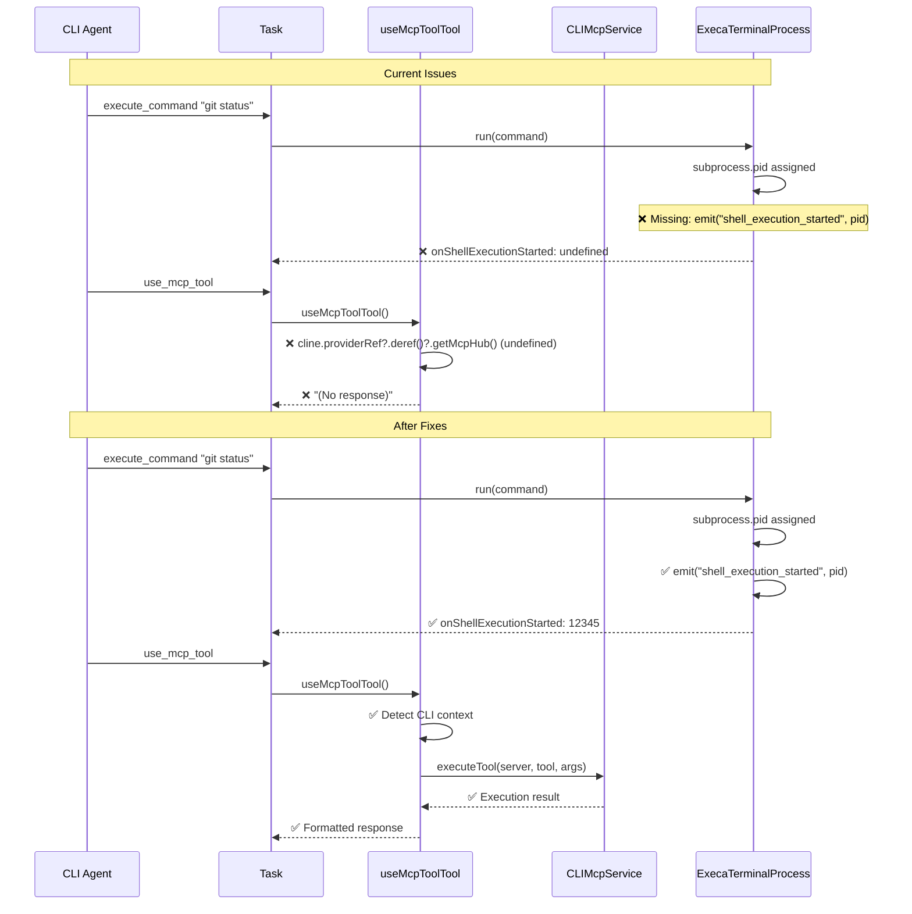

# CLI MCP & Logging Fixes

## Problem Statement

The CLI agent has two critical issues affecting core functionality:

1. **Execute Command Failing**: `execute_command` shows `onShellExecutionStarted: undefined` due to missing event emission in ExecaTerminalProcess
2. **MCP Tools Producing No Output**: `use_mcp_tool` calls return "(No response)" because the tool uses VS Code extension MCP hub instead of CLI MCP service

## Root Cause Analysis

### Issue 1: ExecaTerminalProcess Missing Event Emission

**Location**: [`src/integrations/terminal/ExecaTerminalProcess.ts:51`](src/integrations/terminal/ExecaTerminalProcess.ts:51)

**Problem**:

- Process correctly assigns `this.pid = subprocess.pid`
- **Never emits** `"shell_execution_started"` event
- Other terminal components expect this event: [`Terminal.ts:58`](src/integrations/terminal/Terminal.ts:58), [`ExecaTerminal.ts:27`](src/integrations/terminal/ExecaTerminal.ts:27)
- Results in `onShellExecutionStarted: undefined` log

### Issue 2: MCP Tool Context Detection

**Location**: [`src/core/tools/useMcpToolTool.ts:79-82`](src/core/tools/useMcpToolTool.ts:79-82)

**Problem**:

- Uses VS Code extension MCP hub: `cline.providerRef?.deref()?.getMcpHub()?.callTool()`
- In CLI mode, `providerRef` is undefined → `toolResult` is undefined
- Should use `cline.cliMcpService.executeTool()` (as seen in [`Task.ts:824-828`](src/core/task/Task.ts:824-828))
- Results in "(No response)" output

## Architecture Overview



## Implementation Stories

### Story 1: Fix ExecaTerminalProcess Shell Execution Started Event

**Priority**: P0 (Critical)
**Effort**: 1-2 hours
**Dependencies**: None

**Objective**: Ensure `execute_command` properly reports process start with correct PID

**Acceptance Criteria**:

- [ ] `onShellExecutionStarted` receives correct PID in CLI mode
- [ ] No regression in VS Code extension terminal functionality
- [ ] Process tracking works for both successful and failed commands
- [ ] Proper error handling when PID is undefined

**Implementation Tasks**:

1. **Add missing event emission** in [`ExecaTerminalProcess.ts`](src/integrations/terminal/ExecaTerminalProcess.ts:51-54)

    ```typescript
    this.pid = subprocess.pid

    // Emit shell execution started event for callbacks
    if (this.pid !== undefined) {
    	this.emit("shell_execution_started", this.pid)
    } else {
    	console.warn("[ExecaTerminalProcess] subprocess.pid is undefined")
    	this.emit("shell_execution_started", undefined)
    }
    ```

2. **Add debug logging** for process lifecycle

    ```typescript
    console.log(`[ExecaTerminalProcess] Starting command: ${command}`)
    console.log(`[ExecaTerminalProcess] Process started with PID: ${this.pid}`)
    ```

3. **Update tests** to verify event emission
    - Test `"shell_execution_started"` event is emitted with correct PID
    - Test undefined PID handling
    - Verify integration with terminal callbacks

**Files to Modify**:

- [`src/integrations/terminal/ExecaTerminalProcess.ts`](src/integrations/terminal/ExecaTerminalProcess.ts)
- [`src/integrations/terminal/__tests__/ExecaTerminalProcess.spec.ts`](src/integrations/terminal/__tests__/ExecaTerminalProcess.spec.ts)

### Story 2: Fix MCP Tool Execution Context Detection

**Priority**: P0 (Critical)
**Effort**: 2-3 hours
**Dependencies**: None

**Objective**: Make `useMcpToolTool` work correctly in both VS Code extension and CLI contexts

**Acceptance Criteria**:

- [ ] MCP tools execute successfully in CLI mode
- [ ] No regression in VS Code extension MCP functionality
- [ ] Consistent response format between CLI and extension modes
- [ ] Proper error handling for unavailable MCP services
- [ ] Tool execution results are properly logged and displayed

**Implementation Tasks**:

1. **Add execution context detection** in [`useMcpToolTool.ts`](src/core/tools/useMcpToolTool.ts:76-82)

    ```typescript
    // Now execute the tool
    await cline.say("mcp_server_request_started")

    let toolResult
    if (cline.cliMcpService) {
    	// CLI mode - use CLI MCP service
    	console.log(`[CLI MCP] Executing tool ${tool_name} on server ${server_name}`)
    	const result = await cline.cliMcpService.executeTool(server_name, tool_name, parsedArguments)

    	// Convert CLI result to consistent format
    	toolResult = {
    		isError: !result.success,
    		content: [
    			{
    				type: "text",
    				text: result.success
    					? JSON.stringify(result.result, null, 2)
    					: result.error || "Tool execution failed",
    			},
    		],
    	}
    } else {
    	// VS Code extension mode - use MCP hub
    	toolResult = await cline.providerRef?.deref()?.getMcpHub()?.callTool(server_name, tool_name, parsedArguments)
    }

    if (!toolResult) {
    	throw new Error("MCP service not available in current context")
    }
    ```

2. **Enhance error handling and logging**

    ```typescript
    // Add comprehensive error checking
    if (cline.cliMcpService && !cline.cliMcpService.getConnectedServers().find((s) => s.id === server_name)) {
    	throw new Error(`MCP server '${server_name}' is not connected`)
    }

    // Log tool execution for debugging
    console.log(`[MCP] Tool execution completed: ${tool_name} -> ${toolResult.isError ? "ERROR" : "SUCCESS"}`)
    ```

3. **Update tests** for dual context support
    - Test CLI mode execution path
    - Test VS Code extension mode execution path
    - Test error handling for missing MCP services
    - Verify response format consistency

**Files to Modify**:

- [`src/core/tools/useMcpToolTool.ts`](src/core/tools/useMcpToolTool.ts)
- [`src/core/tools/__tests__/useMcpToolTool.test.ts`](src/core/tools/__tests__/useMcpToolTool.test.ts) (create if missing)

### Story 3: Enhance MCP CLI Logging and Observability

**Priority**: P1 (High)
**Effort**: 1-2 hours  
**Dependencies**: Story 2

**Objective**: Provide better visibility into MCP operations for debugging

**Acceptance Criteria**:

- [ ] Structured logging for all MCP tool executions
- [ ] Clear error messages for common MCP issues
- [ ] Debug information available for troubleshooting
- [ ] Performance metrics for tool execution times

**Implementation Tasks**:

1. **Add structured logging** to [`CLIMcpService.ts`](src/cli/services/CLIMcpService.ts:224-254)

    ```typescript
    async executeTool(serverId: string, toolName: string, args: any): Promise<McpExecutionResult> {
        const startTime = Date.now()
        console.log(`[CLIMcpService] Executing tool: ${toolName} on server: ${serverId}`)
        console.log(`[CLIMcpService] Arguments:`, JSON.stringify(args, null, 2))

        try {
            const result = await connection.client.callTool({
                name: toolName,
                arguments: args,
            })

            const duration = Date.now() - startTime
            console.log(`[CLIMcpService] Tool execution completed in ${duration}ms`)
            console.log(`[CLIMcpService] Result:`, result.isError ? 'ERROR' : 'SUCCESS')

            return {
                success: !result.isError,
                result: result.content,
                metadata: { ...result._meta, duration }
            }
        } catch (error) {
            const duration = Date.now() - startTime
            console.error(`[CLIMcpService] Tool execution failed after ${duration}ms:`, error)
            throw error
        }
    }
    ```

2. **Improve error categorization**
    ```typescript
    // Add specific error types for better debugging
    if (error.code === -32601) {
    	throw new McpToolExecutionError(
    		`Tool '${toolName}' not found on server ${serverId}. Available tools: ${availableTools.join(", ")}`,
    		toolName,
    		serverId,
    	)
    }
    ```

**Files to Modify**:

- [`src/cli/services/CLIMcpService.ts`](src/cli/services/CLIMcpService.ts)
- [`src/cli/types/mcp-types.ts`](src/cli/types/mcp-types.ts)

### Story 4: Strengthen CLI/Extension Abstraction Layer

**Priority**: P2 (Medium)
**Effort**: 3-4 hours
**Dependencies**: Stories 1-3

**Objective**: Ensure robust support for dual execution contexts (CLI + VS Code extension)

**Acceptance Criteria**:

- [ ] Consistent MCP interface across CLI and extension modes
- [ ] Clear separation of concerns between execution contexts
- [ ] Comprehensive test coverage for both modes
- [ ] Documentation for MCP service usage patterns

**Implementation Tasks**:

1. **Create MCP service interface**

    ```typescript
    // src/shared/mcp-service-interface.ts
    interface McpServiceProvider {
    	executeTool(serverId: string, toolName: string, args: any): Promise<McpExecutionResult>
    	accessResource(serverId: string, uri: string): Promise<any>
    	listTools(): Promise<McpToolInfo[]>
    	listServers(): Promise<McpServerInfo[]>
    	isAvailable(): boolean
    	getExecutionContext(): "cli" | "extension"
    }
    ```

2. **Implement adapter pattern** for existing services

    - CLI adapter wrapping [`CLIMcpService`](src/cli/services/CLIMcpService.ts)
    - Extension adapter wrapping [`McpHub`](src/services/mcp/McpHub.ts)
    - Factory method to create appropriate adapter

3. **Update Task class** to use abstracted interface

    ```typescript
    // In Task constructor, inject appropriate MCP service
    private mcpService?: McpServiceProvider

    // Use consistent interface in tool implementations
    const result = await this.mcpService?.executeTool(serverId, toolName, args)
    ```

**Files to Modify**:

- [`src/shared/mcp-service-interface.ts`](src/shared/mcp-service-interface.ts) (new)
- [`src/core/task/Task.ts`](src/core/task/Task.ts)
- [`src/core/adapters/cli/CLIMcpAdapter.ts`](src/core/adapters/cli/CLIMcpAdapter.ts) (new)
- [`src/core/adapters/vscode/ExtensionMcpAdapter.ts`](src/core/adapters/vscode/ExtensionMcpAdapter.ts) (new)

## Testing Strategy

### Unit Tests

- [ ] [`ExecaTerminalProcess`](src/integrations/terminal/ExecaTerminalProcess.ts) event emission
- [ ] [`useMcpToolTool`](src/core/tools/useMcpToolTool.ts) context detection logic
- [ ] MCP service interface implementations
- [ ] Error handling for edge cases

### Integration Tests

- [ ] End-to-end CLI command execution with proper PID tracking
- [ ] MCP tool calls in both CLI and VS Code extension contexts
- [ ] Error scenarios and fallback behavior
- [ ] Performance under load

### Regression Tests

- [ ] Existing VS Code extension functionality unchanged
- [ ] CLI batch mode operations work correctly
- [ ] MCP server connection and discovery
- [ ] Backward compatibility with existing configurations

## Success Metrics

- [ ] CLI `execute_command` shows proper PID instead of "undefined"
- [ ] CLI `use_mcp_tool` returns actual tool results instead of "(No response)"
- [ ] No regressions in VS Code extension terminal or MCP functionality
- [ ] Improved debugging capability with structured logging
- [ ] Clear error messages for common configuration issues

## Risk Assessment

**Low Risk**:

- Story 1 (terminal event emission) - isolated change with clear rollback
- Story 3 (logging improvements) - additive changes only

**Medium Risk**:

- Story 2 (MCP context detection) - affects core tool functionality but well-tested pattern
- Story 4 (abstraction layer) - larger refactoring but backward compatible

**Mitigation Strategies**:

- Comprehensive testing before deployment
- Feature flags for new MCP abstraction layer
- Staged rollout starting with CLI mode only
- Clear rollback procedures for each story
