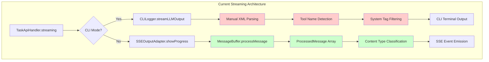
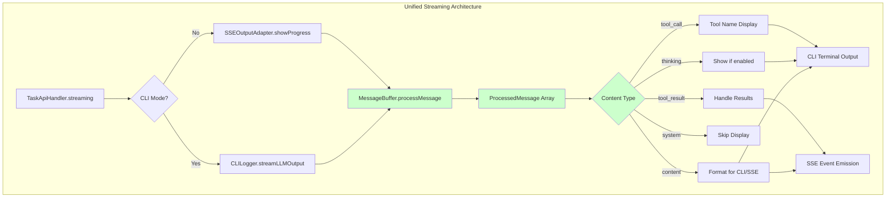
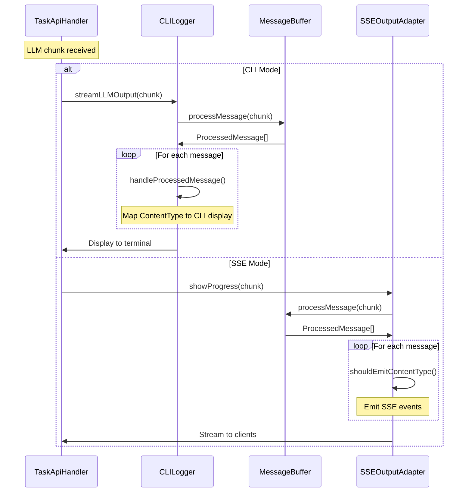
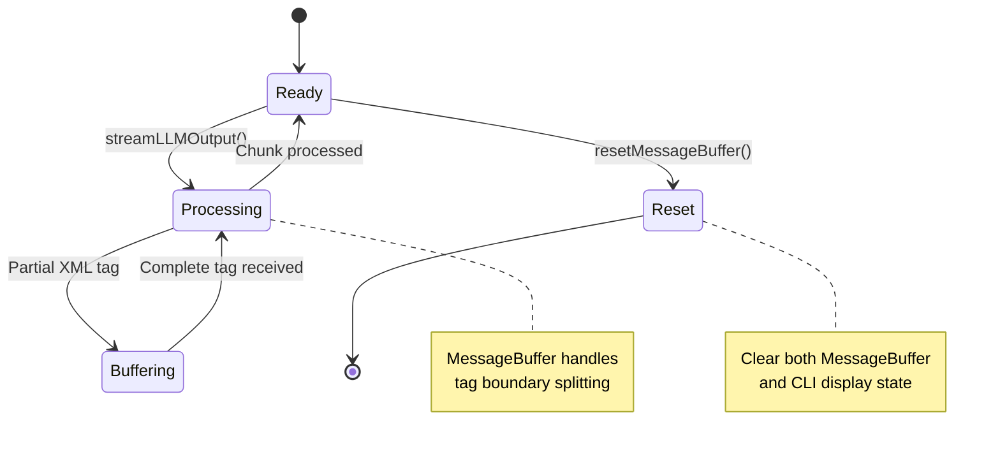

# CLI MessageBuffer Integration Architecture

## Current Architecture Issues

### Problems with Current Architecture

- **Red boxes**: Duplicate parsing logic in CLILogger
- **Green boxes**: Sophisticated parsing logic in MessageBuffer
- **Tool name sets are different** between CLILogger and MessageBuffer
- **System tag handling differs** between implementations
- **Content classification** only available in SSE path

## Proposed Unified Architecture

### Benefits of Unified Architecture

- **Single parsing engine** handles all XML content
- **Consistent content classification** across CLI and SSE
- **Shared tool definitions** prevent drift
- **Extensible content types** automatically available to both paths
- **Reduced maintenance burden** - one place to update parsing logic

## Implementation Flow

## Content Type Mapping

| ContentType   | CLI Behavior                           | SSE Behavior                 |
| ------------- | -------------------------------------- | ---------------------------- |
| `content`     | Display with markdown formatting       | Emit as progress event       |
| `thinking`    | Display only if `showThinking` enabled | Emit if verbose mode         |
| `tool_call`   | Show tool name indicator (yellow)      | Emit with tool metadata      |
| `system`      | Skip (internal XML tags)               | Skip or emit as system event |
| `tool_result` | Skip or show results                   | Emit as result event         |

## State Management

## Migration Strategy

### Phase 1: Foundation

- Ensure MessageBuffer has complete tool/system tag coverage
- Create CLI content type mapping functions
- Add MessageBuffer instance to CLILogger

### Phase 2: Integration

- Replace manual XML parsing with MessageBuffer calls
- Implement content type to CLI display mapping
- Preserve existing display formatting and timing

### Phase 3: Cleanup

- Remove duplicate parsing code from CLILogger
- Remove hardcoded tool/system tag sets
- Update tests to use shared parsing logic

### Phase 4: Validation

- Comprehensive testing of CLI output behavior
- Performance benchmarking
- Integration testing with various LLM providers

## Risk Mitigation

### Backward Compatibility

- Feature flag for old vs new implementation during development
- Extensive output comparison testing
- Gradual rollout with fallback capability

### Performance Considerations

- MessageBuffer designed for streaming efficiency
- Object pooling if ProcessedMessage creation becomes bottleneck
- Benchmark against current manual parsing performance

### Testing Strategy

- Unit tests for CLILogger with MessageBuffer integration
- Integration tests comparing CLI and SSE output for identical input
- Edge case testing for XML tag boundary conditions
- Performance regression testing
