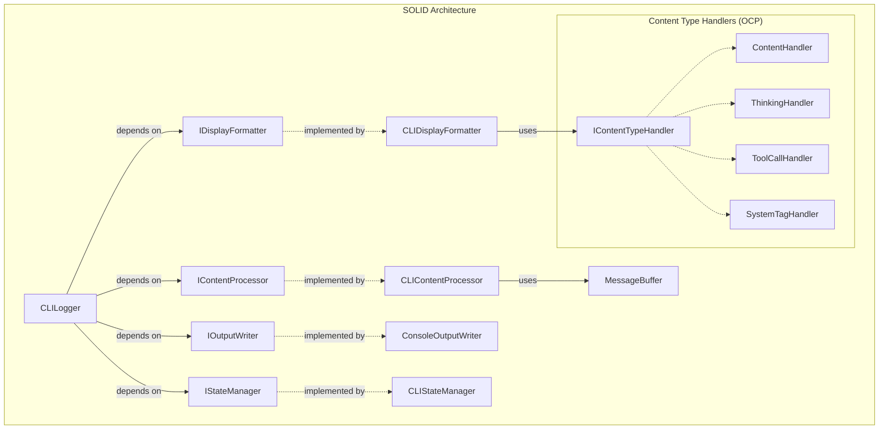

# CLI MessageBuffer Integration - Updated Implementation with SOLID Principles

## Overview

This document updates the original implementation plan to incorporate SOLID design principles and comprehensive unit testing requirements.

## SOLID Principles Integration

### Updated Architecture with SOLID



## Updated Implementation Stories

### Story 1: SOLID Foundation with Interfaces (NEW)

**As a** developer  
**I want** well-defined interfaces following SOLID principles  
**So that** the code is maintainable, testable, and extensible

**Acceptance Criteria:**

- [ ] Define `IContentProcessor` interface with single responsibility
- [ ] Define `IDisplayFormatter` interface for display formatting only
- [ ] Define `IOutputWriter` interface for output operations only
- [ ] Define `IStateManager` interface for state management only
- [ ] Define `IContentTypeHandler` interface for extensible content handling
- [ ] All interfaces follow Interface Segregation Principle
- [ ] Dependencies are injected (Dependency Inversion Principle)

**Technical Implementation:**

```typescript
interface IContentProcessor {
	processContent(content: string): ProcessedMessage[]
	reset(): void
}

interface IDisplayFormatter {
	formatContent(message: ProcessedMessage): string | null
	formatToolIndicator(toolName: string): string
}

interface IOutputWriter {
	write(content: string): void
	writeToolIndicator(toolName: string): void
	clearLine(): void
}

interface IStateManager {
	reset(): void
	shouldShowThinking(): boolean
	hasDisplayedTool(toolName: string): boolean
	markToolDisplayed(toolName: string): void
}

interface IContentTypeHandler {
	canHandle(contentType: ContentType): boolean
	handle(message: ProcessedMessage, context: DisplayContext): DisplayResult | null
}
```

### Story 2: CLIContentProcessor Implementation (UPDATED)

**As a** developer  
**I want** a focused content processor that only handles content processing  
**So that** I follow Single Responsibility Principle

**Acceptance Criteria:**

- [ ] Implements `IContentProcessor` interface
- [ ] Single responsibility: delegates to MessageBuffer for processing
- [ ] Proper error handling for malformed content
- [ ] 100% unit test coverage
- [ ] Performance tests for large content processing

**Technical Implementation:**

```typescript
class CLIContentProcessor implements IContentProcessor {
	constructor(private messageBuffer: MessageBuffer) {}

	processContent(content: string): ProcessedMessage[] {
		try {
			return this.messageBuffer.processMessage(content)
		} catch (error) {
			// Graceful error handling
			return [
				{
					content: content,
					contentType: "content",
					isComplete: true,
				},
			]
		}
	}

	reset(): void {
		this.messageBuffer.reset()
	}
}
```

**Unit Tests:**

- [ ] Test successful content processing
- [ ] Test error handling for invalid XML
- [ ] Test reset functionality
- [ ] Test with various content types
- [ ] Performance test with large content

### Story 3: CLIDisplayFormatter Implementation (UPDATED)

**As a** developer  
**I want** a display formatter that only handles formatting concerns  
**So that** formatting logic is separate from processing logic

**Acceptance Criteria:**

- [ ] Implements `IDisplayFormatter` interface
- [ ] Uses Strategy pattern for different content types
- [ ] Supports extensible content type handlers (Open/Closed Principle)
- [ ] 100% unit test coverage including all content type branches
- [ ] Property-based tests for edge cases

**Technical Implementation:**

```typescript
class CLIDisplayFormatter implements IDisplayFormatter {
	private contentHandlers: Map<ContentType, IContentTypeHandler>

	constructor(
		private useColor: boolean,
		private showThinking: boolean,
		handlers: IContentTypeHandler[] = [],
	) {
		this.contentHandlers = new Map()
		this.registerDefaultHandlers()
		handlers.forEach((handler) => this.registerHandler(handler))
	}

	formatContent(message: ProcessedMessage): string | null {
		const handler = this.contentHandlers.get(message.contentType)
		if (!handler) {
			return this.formatDefault(message)
		}

		const context = { useColor: this.useColor, showThinking: this.showThinking }
		const result = handler.handle(message, context)
		return result?.displayText || null
	}

	private registerHandler(handler: IContentTypeHandler): void {
		// Open/Closed: can add new handlers without modifying existing code
	}
}
```

**Unit Tests:**

- [ ] Test all content type formatting
- [ ] Test color vs no-color output
- [ ] Test thinking show/hide logic
- [ ] Test handler registration and selection
- [ ] Test null return for filtered content
- [ ] Property-based test with random content

### Story 4: Content Type Handlers Implementation (NEW)

**As a** developer  
**I want** extensible content type handlers  
**So that** new content types can be added without modifying existing code (Open/Closed Principle)

**Acceptance Criteria:**

- [ ] Base `ContentHandler` abstract class
- [ ] Specific handlers for each content type
- [ ] Template method pattern for common behavior
- [ ] Easy to add new content types
- [ ] 95% unit test coverage for all handlers

**Technical Implementation:**

```typescript
abstract class ContentHandler implements IContentTypeHandler {
	abstract canHandle(contentType: ContentType): boolean

	handle(message: ProcessedMessage, context: DisplayContext): DisplayResult | null {
		if (!this.canHandle(message.contentType)) {
			return null
		}

		return this.handleSpecific(message, context)
	}

	protected abstract handleSpecific(message: ProcessedMessage, context: DisplayContext): DisplayResult | null
}

class ThinkingContentHandler extends ContentHandler {
	canHandle(contentType: ContentType): boolean {
		return contentType === "thinking"
	}

	protected handleSpecific(message: ProcessedMessage, context: DisplayContext): DisplayResult | null {
		if (!context.showThinking) {
			return null // Filter out thinking content
		}

		return {
			displayText: context.useColor
				? chalk.gray(`[THINKING] ${message.content}`)
				: `[THINKING] ${message.content}`,
		}
	}
}

class ToolCallContentHandler extends ContentHandler {
	canHandle(contentType: ContentType): boolean {
		return contentType === "tool_call"
	}

	protected handleSpecific(message: ProcessedMessage, context: DisplayContext): DisplayResult | null {
		if (message.toolName && !context.hasDisplayedTool?.(message.toolName)) {
			const toolDisplay = context.useColor ? chalk.yellow(`${message.toolName}...`) : `${message.toolName}...`

			context.markToolDisplayed?.(message.toolName)
			return { displayText: `\n${toolDisplay}\n` }
		}

		return null // Skip tool content itself
	}
}
```

**Unit Tests:**

- [ ] Test each handler's canHandle method
- [ ] Test specific handling logic
- [ ] Test context parameter usage
- [ ] Test filtering behavior
- [ ] Test tool name display tracking

### Story 5: CLILogger Refactoring with Dependency Injection (UPDATED)

**As a** developer  
**I want** CLILogger to use dependency injection  
**So that** it's easily testable and follows SOLID principles

**Acceptance Criteria:**

- [ ] Constructor accepts all dependencies as interfaces
- [ ] Single responsibility: orchestrates content streaming
- [ ] Liskov Substitution: can be subclassed safely
- [ ] 100% unit test coverage with mocked dependencies
- [ ] Integration tests with real implementations

**Technical Implementation:**

```typescript
class CLILogger implements IStreamingLogger, IStateManager {
	private displayedToolNames = new Set<string>()

	constructor(
		private contentProcessor: IContentProcessor,
		private displayFormatter: IDisplayFormatter,
		private outputWriter: IOutputWriter,
		private useColor: boolean = true,
		private showThinking: boolean = false,
	) {}

	streamContent(content: string): void {
		const messages = this.contentProcessor.processContent(content)

		for (const message of messages) {
			const formatted = this.displayFormatter.formatContent(message)
			if (formatted) {
				this.outputWriter.write(formatted)
			}
		}
	}

	reset(): void {
		this.contentProcessor.reset()
		this.displayedToolNames.clear()
	}

	// IStateManager implementation
	shouldShowThinking(): boolean {
		return this.showThinking
	}

	hasDisplayedTool(toolName: string): boolean {
		return this.displayedToolNames.has(toolName)
	}

	markToolDisplayed(toolName: string): void {
		this.displayedToolNames.add(toolName)
	}
}
```

**Unit Tests:**

- [ ] Test with mocked dependencies
- [ ] Test streamContent orchestration
- [ ] Test reset behavior
- [ ] Test state management methods
- [ ] Test error handling propagation
- [ ] Integration test with real dependencies

### Story 6: Comprehensive Unit Test Suite (UPDATED)

**As a** developer  
**I want** comprehensive unit tests covering all SOLID components  
**So that** the refactoring is reliable and maintainable

**Acceptance Criteria:**

- [ ] 95% line coverage, 100% function coverage
- [ ] Unit tests for all interfaces and implementations
- [ ] Integration tests for component interactions
- [ ] Contract tests for interface compliance
- [ ] Performance tests for streaming scenarios
- [ ] Property-based tests for edge cases
- [ ] Mock-based testing for dependency injection

**Test Structure:**

```
src/cli/services/__tests__/
├── unit/
│   ├── CLIContentProcessor.test.ts
│   ├── CLIDisplayFormatter.test.ts
│   ├── ContentHandlers.test.ts
│   ├── CLILogger.test.ts
│   └── ConsoleOutputWriter.test.ts
├── integration/
│   ├── CLIStreamingIntegration.test.ts
│   ├── MessageBufferIntegration.test.ts
│   └── EndToEndStreaming.test.ts
├── contract/
│   ├── IContentProcessor.contract.test.ts
│   ├── IDisplayFormatter.contract.test.ts
│   └── IContentTypeHandler.contract.test.ts
├── performance/
│   ├── StreamingPerformance.test.ts
│   └── MemoryUsage.test.ts
└── fixtures/
    ├── streaming-scenarios.ts
    ├── test-data-generators.ts
    └── mock-factories.ts
```

### Story 7: Tool Execution Verification with SOLID Architecture (UPDATED)

**As a** developer  
**I want** to verify tool execution still works with the new SOLID architecture  
**So that** the refactoring doesn't break existing functionality

**Acceptance Criteria:**

- [ ] All existing tool execution tests pass
- [ ] New architecture doesn't interfere with tool parsing
- [ ] MCP functionality remains intact
- [ ] Performance is maintained or improved
- [ ] Dependency injection doesn't affect tool execution path

**Integration Tests:**

- [ ] Test all tool types with new streaming architecture
- [ ] Test MCP tool execution with new display formatting
- [ ] Test error scenarios don't affect tool execution
- [ ] Test tool execution with various display settings
- [ ] Benchmark performance vs old implementation

## Testing Requirements Summary

### Coverage Targets:

- **Lines**: 95%
- **Functions**: 100%
- **Branches**: 90%
- **Statements**: 95%

### Test Types Required:

1. **Unit Tests**: Test each class/interface in isolation
2. **Integration Tests**: Test component interactions
3. **Contract Tests**: Verify interface implementations
4. **Performance Tests**: Ensure no regression
5. **Property-Based Tests**: Generate edge cases
6. **End-to-End Tests**: Full streaming scenarios

### Quality Gates:

- [ ] All tests pass before merge
- [ ] Coverage targets met
- [ ] No performance regression > 5%
- [ ] All SOLID principles verified in code review
- [ ] Tool execution functionality preserved

## Benefits of SOLID Implementation

1. **Single Responsibility**: Each class has one reason to change
2. **Open/Closed**: Can add new content types without modifying existing code
3. **Liskov Substitution**: All implementations are substitutable
4. **Interface Segregation**: No forced dependencies on unused interfaces
5. **Dependency Inversion**: Depend on abstractions, not concretions

## Implementation Order

1. **Story 1**: Define interfaces (Foundation)
2. **Story 2**: Implement CLIContentProcessor
3. **Story 4**: Implement content type handlers
4. **Story 3**: Implement CLIDisplayFormatter
5. **Story 5**: Refactor CLILogger with DI
6. **Story 6**: Complete unit test suite
7. **Story 7**: Verify tool execution integration

This approach ensures a solid, testable, and maintainable implementation that follows SOLID principles throughout.
