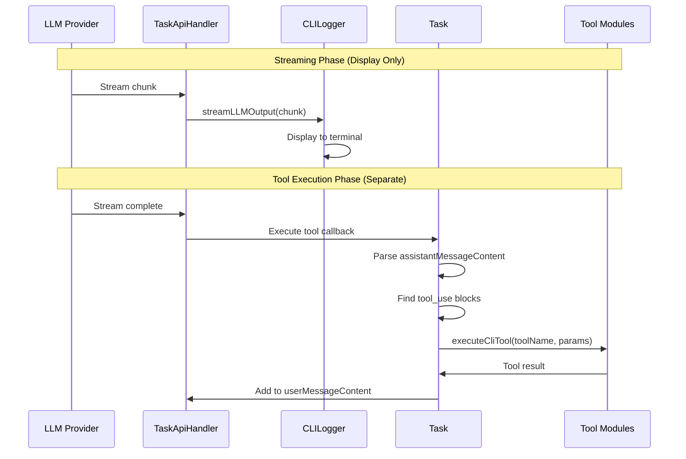
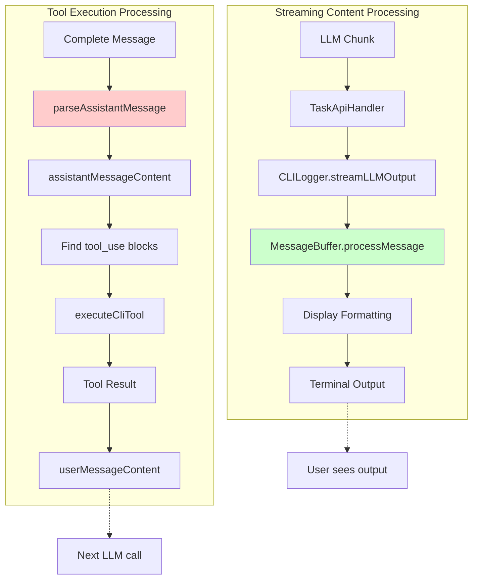

# CLI MessageBuffer Integration - Tool Execution Preservation

## Critical Constraint: Preserve Tool Execution

The MessageBuffer integration **MUST NOT** interfere with tool execution and MCP calls. This document clarifies the separation of concerns and safeguards.

## Current Tool Execution Flow

### Key Insight: Two Separate Pipelines

1. **Streaming Display Pipeline**: `TaskApiHandler` → `CLILogger.streamLLMOutput()` → Terminal display
2. **Tool Execution Pipeline**: `Task.executeCliTool()` → Parse final message → Execute tools → Return results

**MessageBuffer only affects Pipeline #1 (display), not Pipeline #2 (execution).**

## Tool Execution Independence

### What MessageBuffer DOES affect:

- Real-time display of streaming content in terminal
- Filtering of `<thinking>` sections
- Display of tool name indicators ("write_to_file...")
- Classification of content types for display purposes

### What MessageBuffer DOES NOT affect:

- Parsing of final `assistantMessageContent` for tool execution
- Tool parameter extraction and validation
- Actual tool execution (`executeCliTool` calls)
- MCP server communication
- Tool result processing and formatting

## Verification Strategy

### Pre-Integration Testing

1. **Tool Execution Baseline**: Test all tools work correctly with current implementation
2. **MCP Baseline**: Test MCP calls work correctly with current implementation
3. **Message Parsing Baseline**: Verify `parseAssistantMessage()` works correctly

### Post-Integration Testing

1. **Tool Execution Preservation**: All baseline tool tests must pass
2. **MCP Preservation**: All baseline MCP tests must pass
3. **Message Parsing Preservation**: `parseAssistantMessage()` output unchanged
4. **Display vs Execution Separation**: Same tools execute even with different display filtering

## Implementation Safeguards

### Story 1 Update: MessageBuffer Integration with Tool Execution Verification

**Additional Acceptance Criteria:**

- [ ] All existing tool execution tests pass unchanged
- [ ] `parseAssistantMessage()` function behavior is unaffected
- [ ] Tool parameter extraction works identically
- [ ] MCP tool execution continues to work
- [ ] Tool result formatting in `userMessageContent` is preserved

### Story 2 Update: Content Type Handling with Tool Execution Context

**Additional Technical Details:**

- MessageBuffer content classification is for display only
- Tool execution still uses original message parsing logic
- `tool_call` content type affects display, not execution
- Tool name extraction for execution vs display are separate concerns

### Story 7: Tool Execution Integration Testing

**As a** developer  
**I want** comprehensive testing of tool execution with MessageBuffer integration  
**So that** CLI tool functionality is preserved during the refactoring

**Acceptance Criteria:**

- [ ] All core tools execute correctly (read_file, write_to_file, execute_command, etc.)
- [ ] MCP tools execute correctly (use_mcp_tool, access_mcp_resource)
- [ ] Tool parameter validation works identically
- [ ] Tool error handling is preserved
- [ ] Tool results are formatted correctly in user messages
- [ ] Multiple tool execution scenarios work correctly
- [ ] Edge cases (malformed XML, partial messages) don't break tool execution

**Technical Details:**

- Create comprehensive integration tests covering all tool types
- Test tool execution with various MessageBuffer states
- Verify tool execution works with partial/incomplete streaming content
- Test error scenarios don't interfere with subsequent tool execution

## Architecture Clarification

**Green box**: MessageBuffer integration point (display only)  
**Red box**: Tool execution parsing (unchanged)

## Risk Mitigation

### Risk: MessageBuffer changes affect tool execution

**Mitigation**:

- Tool execution uses separate parsing logic (`parseAssistantMessage`)
- Comprehensive integration testing
- Feature flag for rollback capability

### Risk: Content filtering breaks tool parameter extraction

**Mitigation**:

- MessageBuffer only affects display, not message content storage
- Tool execution reads from `assistantMessageContent`, not display output
- Separate test suite for tool parameter extraction

### Risk: XML parsing differences cause tool recognition failures

**Mitigation**:

- Tool recognition happens in `parseAssistantMessage`, not MessageBuffer
- MessageBuffer is purely for display classification
- Cross-reference tool definitions but keep execution logic separate

## Success Criteria with Tool Execution

1. **All existing CLI streaming tests pass**
2. **All existing tool execution tests pass**
3. **All existing MCP integration tests pass**
4. **New MessageBuffer integration tests pass**
5. **No performance regression in tool execution**
6. **Tool error handling remains identical**
7. **MCP server communication is unaffected**

## Implementation Order Update

1. **Story 4** (Consolidation) - Prepare shared definitions
2. **Story 7** (Tool Execution Testing) - Establish comprehensive baseline
3. **Story 1** (Core Integration) - Implement MessageBuffer usage
4. **Story 2** (Content Type Handling) - Map content types to CLI behavior
5. **Story 3** (State Management) - Ensure proper state synchronization
6. **Story 5** (Testing) - Validate implementation thoroughly
7. **Story 6** (Migration) - Ensure backward compatibility
8. **Story 7** (Final Verification) - Confirm all tool execution still works
