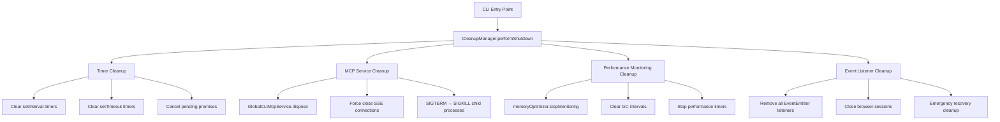

# CLI Process Exit Cleanup - Architectural Solution

## Executive Summary

The reviewer's feedback is **absolutely correct**. The `process.exit(0)` call at line 354 in `src/cli/cli-entry.ts` is a band-aid solution that was added when the CLI was hanging and not exiting naturally. This prevents proper cleanup of resources and is technically debt that needs to be addressed.

## Root Cause Validation

### Evidence of Band-Aid Solution

1. **Banner text**: "Press Ctrl+C twice to **force exit**" (banner.ts:23)
2. **Existing force exit logic**: Timeout mechanism already exists (index.ts:210)
3. **Test comments**: "Complete the task to avoid hanging test" (BatchProcessor.test.ts:250)
4. **Recovery mentions**: "hanging operations" (RecoveryManager.ts:72)

### Resources Keeping Event Loop Alive

Our analysis identified exactly what's preventing natural process exit:

```typescript
// setInterval timers keeping process alive:
- SessionManager.autoSaveTimer (line 330)
- CLIMcpService.healthChecker (line 507)
- MemoryOptimizer.gcInterval (line 51)
- CLIUIService.spinner intervals (line 378)

// EventEmitters with active listeners:
- SessionManager extends EventEmitter
- BatchProcessor extends EventEmitter
- NonInteractiveModeService extends EventEmitter

// Active network connections:
- SSE/WebSocket MCP connections
- StdioMcpConnection child processes

// Various setTimeout calls throughout codebase
```

## Recommended Architecture

### Phase 1: Create Centralized CleanupManager



### Phase 2: Implementation Strategy

```typescript
// New CleanupManager service
export class CleanupManager {
	private static instance: CleanupManager
	private cleanupTasks: Array<() => Promise<void>> = []
	private isShuttingDown = false

	static getInstance(): CleanupManager {
		if (!this.instance) {
			this.instance = new CleanupManager()
		}
		return this.instance
	}

	registerCleanupTask(task: () => Promise<void>): void {
		this.cleanupTasks.push(task)
	}

	async performShutdown(timeoutMs: number = 10000): Promise<void> {
		if (this.isShuttingDown) return
		this.isShuttingDown = true

		getCLILogger().debug("[CleanupManager] Starting graceful shutdown...")

		try {
			// Execute all cleanup tasks with timeout
			await Promise.race([
				Promise.allSettled(this.cleanupTasks.map((task) => task())),
				new Promise((_, reject) => setTimeout(() => reject(new Error("Cleanup timeout")), timeoutMs)),
			])

			getCLILogger().debug("[CleanupManager] Graceful shutdown completed")

			// Allow event loop to drain naturally
			setImmediate(() => {
				if (!process.exitCode) {
					process.exitCode = 0
				}
			})
		} catch (error) {
			getCLILogger().warn("[CleanupManager] Cleanup timeout, forcing exit:", error)
			// Last resort - but with proper logging
			setTimeout(() => process.exit(process.exitCode || 0), 1000)
		}
	}
}
```

### Phase 3: Replace process.exit(0) with Proper Cleanup

**Current problematic code (cli-entry.ts:352-354):**

```typescript
// Exit successfully after non-interactive execution completes
getCLILogger().debug("[cli-entry] Non-interactive execution completed successfully, exiting...")
process.exit(0) // ❌ BAND-AID - Prevents cleanup!
```

**Proposed replacement:**

```typescript
// Perform proper cleanup before exit
getCLILogger().debug("[cli-entry] Non-interactive execution completed, performing cleanup...")

try {
	const cleanupManager = CleanupManager.getInstance()

	// Register essential cleanup tasks
	cleanupManager.registerCleanupTask(async () => {
		if (options.mcpAutoConnect) {
			const { GlobalCLIMcpService } = await import("./services/GlobalCLIMcpService")
			const globalMcpService = GlobalCLIMcpService.getInstance()
			await globalMcpService.dispose()
		}
	})

	cleanupManager.registerCleanupTask(async () => {
		memoryOptimizer.stopMonitoring()
	})

	cleanupManager.registerCleanupTask(async () => {
		// Clear any remaining timers/intervals
		// This would be implemented in each service
	})

	// Perform graceful shutdown
	await cleanupManager.performShutdown()

	getCLILogger().debug("[cli-entry] Cleanup completed successfully")
} catch (error) {
	getCLILogger().error("[cli-entry] Cleanup failed:", error)
	process.exitCode = 1
}

// Process will exit naturally once event loop drains
```

## Implementation Priority

### High Priority (Immediate)

1. **Create CleanupManager service** - Centralized cleanup coordination
2. **Replace process.exit(0)** - Remove the band-aid solution
3. **Add MCP disposal cleanup** - Ensure GlobalCLIMcpService.dispose() is called
4. **Add timer cleanup** - Clear setInterval/setTimeout keeping process alive

### Medium Priority

1. **Enhanced MCP disposal** - Force terminate stubborn child processes
2. **EventEmitter cleanup** - Remove all listeners before exit
3. **Browser session cleanup** - Close any open browser sessions
4. **Performance monitoring cleanup** - Stop all monitoring services

### Low Priority

1. **Comprehensive testing** - Regression tests for hanging scenarios
2. **Debug logging enhancement** - Better visibility into cleanup process
3. **Timeout tuning** - Optimize cleanup timeouts for performance

## Benefits of This Approach

### ✅ Technical Benefits

- **Removes technical debt** - Eliminates the band-aid `process.exit(0)`
- **Prevents resource leaks** - Proper cleanup of all resources
- **Enables natural exit** - Process terminates when event loop drains
- **Maintains reliability** - Fallback force-exit if cleanup hangs

### ✅ User Experience Benefits

- **Faster CLI response** - No hanging while waiting for cleanup
- **Cleaner automation** - Reliable exit codes for scripts
- **Better error handling** - Graceful shutdown with proper logging
- **Reduced memory usage** - No lingering processes or connections

## Risk Mitigation

### Potential Risks

- Cleanup might take too long in some scenarios
- Some services might resist graceful shutdown
- Changes could affect interactive mode

### Mitigation Strategies

- **Graduated timeouts** - Quick cleanup with fallback force-exit
- **Comprehensive testing** - Test both batch and interactive modes
- **Rollback plan** - Keep existing logic as emergency fallback
- **Monitoring** - Log cleanup performance to identify issues

## Success Criteria

- ✅ CLI exits naturally without `process.exit(0)`
- ✅ All MCP connections disposed properly
- ✅ No hanging timers or intervals
- ✅ Clean exit codes (0 for success, 1 for error)
- ✅ Total cleanup time < 10 seconds
- ✅ No regression in interactive mode functionality

This architectural approach transforms the band-aid solution into a robust, maintainable cleanup system that addresses the root causes of the hanging issue.
