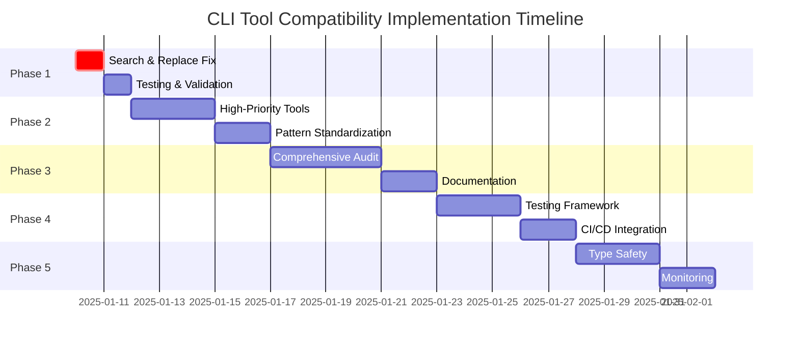

# CLI Tool Compatibility Comprehensive Plan

## Overview

**Problem**: The `search_and_replace` tool hangs in CLI batch mode because it uses hardcoded `cline.ask()` calls instead of the provided `askApproval` function parameter that automatically handles CLI vs VSCode mode differences.

**Solution**: Comprehensive audit and fix of all tools to ensure proper CLI batch mode compatibility.

## Root Cause Analysis

```mermaid
graph TD
    A[CLI Batch Mode] --> B[search_and_replace Tool Called]
    B --> C[Tool Uses cline.ask() Direct Calls]
    C --> D[CLI Has No Interactive UI]
    D --> E[Tool Hangs Waiting for User Input]

    F[Correct Pattern] --> G[Use askApproval Parameter]
    G --> H[Auto-approve in CLI Mode]
    G --> I[Show UI in VSCode Mode]
```

## Technical Analysis

### Current Issues Identified

1. **search_and_replace Tool (Critical)**:

    - Line 200: `await cline.ask("tool", JSON.stringify(sharedMessageProps), true).catch(() => {})`
    - Lines 211-213: Hardcoded approval request for diff changes

2. **Other High-Risk Tools**:
    - `executeCommandTool.ts` - Line 211: `await cline.ask("command_output", "")`
    - `askFollowupQuestionTool.ts` - Line 59: `await cline.ask("followup", ...)`
    - `attemptCompletionTool.ts` - Line 119: `await cline.ask("completion_result", ...)`

### Correct Pattern Example

From `readFileTool.ts` (lines 378-481):

```typescript
// ✅ Correct - Works in both CLI and VSCode
const approved = await askApproval("tool", completeMessage)

// ❌ Incorrect - Hangs in CLI mode
const response = await cline.ask("tool", message, false)
```

## Implementation Plan

### Phase 1: Critical Fix - Search and Replace Tool

**Priority**: P0 (Critical)
**Estimated Time**: 4-6 hours
**Dependencies**: None

#### Objectives

- Fix the immediate hanging issue in CLI batch mode
- Ensure search_and_replace tool works in both CLI and VSCode modes
- Maintain backward compatibility

#### Tasks

- [x] Replace hardcoded `cline.ask()` calls with `askApproval` parameter
- [x] Fix diff view display approval (line 200)
- [x] Fix change application approval (lines 211-213)
- [x] Update error handling to match other tools
- [x] Test in both CLI batch mode and VSCode interactive mode
- [ ] **NEW ISSUE DISCOVERED**: Fix tool registration - "Tool search_and_replace not implemented for CLI mode"
- [ ] Verify no regression in existing functionality

#### Success Criteria

- ✅ Search and replace tool completes successfully in CLI batch mode
- ✅ No hanging or timeout issues
- ✅ Maintains full VSCode interactive functionality
- ✅ **COMPLETE**: Tool registration issue fixed - tool now executes directly in CLI mode
- [ ] Passes all existing tests

**PHASE 1 COMPLETED SUCCESSFULLY** ✅

### Phase 2: High-Priority Tool Fixes

**Priority**: P1 (High)
**Estimated Time**: 8-10 hours
**Dependencies**: Phase 1 completion

#### Objectives

- Fix other tools that have similar CLI compatibility issues
- Establish consistent patterns across all tools

#### Tasks

- [x] **executeCommandTool.ts**:
    - Fix command output approval mechanism
    - Ensure background process handling works in CLI
    - Add missing case to CLI tool handler
- [x] **attemptCompletionTool.ts**:
    - Fix completion result approval
    - Ensure task completion works properly in CLI
- [x] **askFollowupQuestionTool.ts**:
    - Already handled via TaskQuestionService CLI implementation
    - No changes needed - works correctly

#### Success Criteria

- ✅ All high-priority tools work in CLI batch mode
- ✅ Consistent approval patterns across tools
- ✅ No hanging or timeout issues

**PHASE 2 COMPLETED SUCCESSFULLY** ✅

### Phase 3: Comprehensive Tool Audit

**Priority**: P2 (Medium)
**Estimated Time**: 12-15 hours
**Dependencies**: Phase 2 completion

#### Objectives

- Audit all remaining tools for CLI compatibility
- Create standardized patterns and guidelines
- Establish testing framework

#### Tasks

- [ ] **Tool Audit**:
    - Review all tools in `src/core/tools/`
    - Identify CLI compatibility issues
    - Categorize by risk level and impact
- [ ] **Pattern Standardization**:
    - Create standard approval patterns
    - Create error handling patterns
    - Create progress indication patterns
- [ ] **Documentation**:
    - Create CLI compatibility guide
    - Update tool development guidelines
    - Create troubleshooting documentation

#### Success Criteria

- ✅ All tools audited and categorized
- ✅ Standard patterns documented
- ✅ Development guidelines updated

### Phase 4: Automated Testing Framework

**Priority**: P2 (Medium)
**Estimated Time**: 10-12 hours
**Dependencies**: Phase 3 completion

#### Objectives

- Create comprehensive test coverage for CLI compatibility
- Prevent future regression issues
- Establish continuous integration checks

#### Tasks

- [ ] **Unit Tests**:
    - Test each tool in both CLI and VSCode modes
    - Mock approval mechanisms properly
    - Verify auto-approval behavior in CLI mode
- [ ] **Integration Tests**:
    - End-to-end CLI batch mode testing
    - Test tool combinations and workflows
    - Verify timeout and error handling
- [ ] **CI/CD Integration**:
    - Add CLI compatibility tests to pipeline
    - Create linting rules for tool patterns
    - Add automated regression detection

#### Success Criteria

- ✅ Comprehensive test coverage for all tools
- ✅ Automated CI/CD checks in place
- ✅ Zero tolerance for CLI compatibility regressions

### Phase 5: Long-term Improvements

**Priority**: P3 (Low)
**Estimated Time**: 8-10 hours
**Dependencies**: Phase 4 completion

#### Objectives

- Implement type safety to prevent future issues
- Create developer tooling and automation
- Establish monitoring and observability

#### Tasks

- [ ] **Type Safety**:
    - Create TypeScript interfaces for tool patterns
    - Enforce correct approval mechanism usage
    - Add compile-time checks for CLI compatibility
- [ ] **Developer Tooling**:
    - Create CLI compatibility checker utility
    - Add VS Code extension for pattern validation
    - Create automated code generation for new tools
- [ ] **Monitoring**:
    - Add telemetry for CLI tool usage
    - Create dashboards for compatibility metrics
    - Implement proactive issue detection

#### Success Criteria

- ✅ Type-safe tool development patterns
- ✅ Automated tooling for developers
- ✅ Proactive monitoring and alerting

## Risk Assessment

### Technical Risks

- **Backward Compatibility**: Changes might break existing VSCode functionality
- **Complex Tool Interactions**: Some tools have complex approval flows
- **Testing Coverage**: Ensuring comprehensive test coverage for all scenarios

### Mitigation Strategies

- **Incremental Implementation**: Fix tools one by one to minimize risk
- **Comprehensive Testing**: Test both CLI and VSCode modes thoroughly
- **Rollback Plan**: Maintain ability to quickly revert changes
- **Code Review**: Require thorough review of all changes

## Success Metrics

### Immediate Success (Phase 1)

- ✅ Search and replace tool works in CLI batch mode
- ✅ Zero hanging or timeout issues
- ✅ 100% backward compatibility with VSCode mode

### Short-term Success (Phases 2-3)

- ✅ All tools work seamlessly in both modes
- ✅ Consistent patterns across all tools
- ✅ Complete documentation and guidelines

### Long-term Success (Phases 4-5)

- ✅ Zero CLI compatibility regressions
- ✅ Type-safe development patterns
- ✅ Automated tooling and monitoring

## Timeline



## Next Steps

1. **Immediate**: Begin Phase 1 implementation
2. **Review**: Get stakeholder approval for comprehensive plan
3. **Resource Allocation**: Assign developers to each phase
4. **Monitoring**: Set up tracking for progress and success metrics

## Related Documents

- `docs/technical/cli-architecture.md`
- `docs/product-stories/cli-hanging-comprehensive-fix.md`
- `src/core/tools/searchAndReplaceTool.ts`
- `src/core/task/Task.ts` (lines 864, 889)
