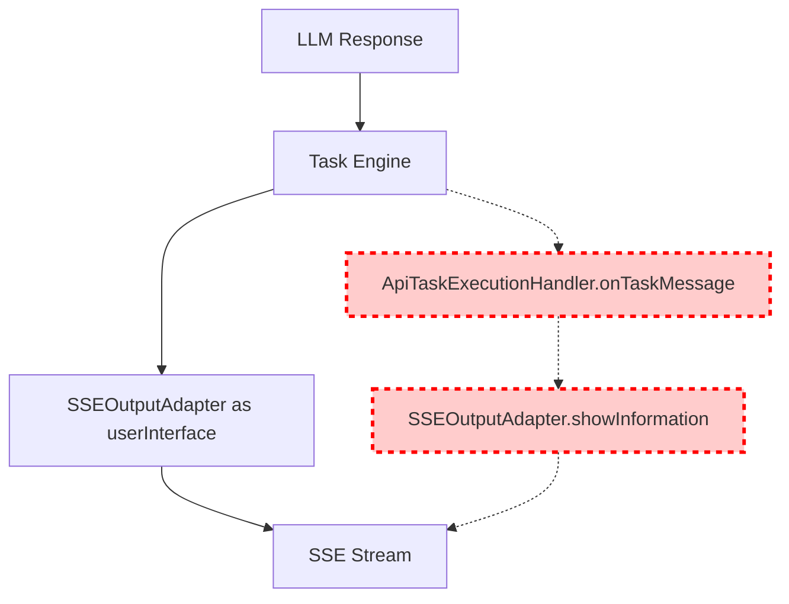

# SSE Streaming Duplication Fix

## Problem Statement

The API streaming endpoint (`/execute/stream`) is experiencing content duplication where each piece of LLM-generated content appears twice in the SSE stream. This creates poor user experience with garbled, repeated text output.

## Root Cause Analysis

The issue is caused by **double event emission** happening in two places simultaneously:

1. **Direct SSE Integration**: The Task uses `SSEOutputAdapter` as its `userInterface`, so LLM streaming content flows directly through `showInformation()`, `showProgress()`, etc.

2. **Message Forwarding**: The `ApiTaskExecutionHandler.onTaskMessage()` method is **ALSO** forwarding the same messages to the SSE adapter again.

This creates a duplicate emission pipeline:

- ✅ **First time**: Task → SSEOutputAdapter.showInformation() → SSE stream
- ❌ **Second time**: Task → ApiTaskExecutionHandler.onTaskMessage() → SSEOutputAdapter.showInformation() → SSE stream

## Architecture Diagram



## Stories

### Story 1: Remove Duplicate Message Forwarding (HIGH PRIORITY)

**Goal**: Eliminate the duplicate event emission by removing redundant message forwarding

**Acceptance Criteria**:

- [ ] LLM streaming content appears only once in SSE output
- [ ] All essential task messages are still forwarded appropriately
- [ ] No functionality regression in task execution
- [ ] Logging shows single emission per content chunk

**Tasks**:

1. **Analyze current event flow** to confirm which path is the primary one
2. **Modify ApiTaskExecutionHandler.onTaskMessage()** to remove duplicate forwarding:
    - Remove forwarding for `say` actions that are already handled by direct SSE integration
    - Keep forwarding only for events that aren't automatically handled by userInterface
3. **Add source identification** in logs to track event origins
4. **Test with various query types** to ensure no regression

**Files to modify**:

- `src/core/task/execution/ApiTaskExecutionHandler.ts` (lines 45-61)

**Implementation Details**:

```typescript
async onTaskMessage(taskId: string, event: any): Promise<void> {
    if (this.verbose) {
        console.log(`[ApiTaskExecutionHandler] Task ${taskId} message:`, event.action)
    }

    // Remove duplicate forwarding - the Task already uses SSEOutputAdapter as userInterface
    // Only forward events that require special handling beyond the standard userInterface methods

    // Keep specialized forwarding for events that need custom handling
    if (event.action === "ask" && event.message?.text) {
        // Questions might need special SSE handling beyond standard askQuestion
        await this.sseAdapter.showInformation(`Question: ${event.message.text}`)
    }

    // Remove the duplicate "say" forwarding - this is handled by userInterface directly
    // if (event.action === "say" && event.message?.text) {
    //     await this.sseAdapter.showInformation(event.message.text)  // ← REMOVED
    // }
}
```

### Story 2: Add SSE Event Deduplication Safety Net (MEDIUM PRIORITY)

**Goal**: Add deduplication logic as a safety measure to prevent future duplicate issues

**Acceptance Criteria**:

- [ ] SSEOutputAdapter can detect and prevent duplicate events
- [ ] Deduplication window is configurable (default: 100ms)
- [ ] Metrics track deduplication hits for monitoring
- [ ] Performance impact is minimal (< 1ms overhead per event)

**Tasks**:

1. **Add event deduplication** in SSEOutputAdapter
2. **Implement content hashing** for text-based events using fast hash
3. **Add configurable deduplication window** with environment variable override
4. **Add metrics collection** for duplicate detection rates
5. **Add logging** for debugging duplicate detection

**Files to modify**:

- `src/api/streaming/SSEOutputAdapter.ts`

**Implementation Details**:

```typescript
export class SSEOutputAdapter implements IUserInterface {
	private recentEvents = new Map<string, number>() // hash -> timestamp
	private deduplicationWindowMs = 100

	private isDuplicateEvent(content: string): boolean {
		const hash = this.simpleHash(content)
		const now = Date.now()
		const lastEmitted = this.recentEvents.get(hash)

		if (lastEmitted && now - lastEmitted < this.deduplicationWindowMs) {
			return true
		}

		this.recentEvents.set(hash, now)
		// Cleanup old entries periodically
		if (this.recentEvents.size > 100) {
			this.cleanupOldEvents(now)
		}

		return false
	}
}
```

### Story 3: Improve Logging and Debugging (LOW PRIORITY)

**Goal**: Add better observability to prevent and debug similar issues

**Acceptance Criteria**:

- [ ] Detailed SSE event logging with source identification
- [ ] Flow tracing capability for debugging event paths
- [ ] API debugging endpoints for SSE stream inspection
- [ ] Integration tests verify single emission behavior

**Tasks**:

1. **Add detailed SSE event logging** with source metadata
2. **Add flow tracing** to track event paths through the system
3. **Create debugging endpoints** for SSE stream inspection (`/debug/streams`)
4. **Add integration tests** to verify single emission per content chunk
5. **Add performance monitoring** for SSE throughput

**Files to modify**:

- `src/api/streaming/SSEOutputAdapter.ts`
- `src/api/streaming/__tests__/SSEOutputAdapter.test.ts`
- `src/api/server/FastifyServer.ts` (for debug endpoints)

## Testing Strategy

### Unit Tests

- [ ] Test ApiTaskExecutionHandler without duplicate forwarding
- [ ] Test SSEOutputAdapter deduplication logic
- [ ] Test event source identification

### Integration Tests

- [ ] Test `/execute/stream` endpoint with various query types
- [ ] Verify single emission per LLM content chunk
- [ ] Test error handling doesn't cause duplication

### Manual Testing

- [ ] Test with short queries (like "list MCP servers")
- [ ] Test with long reasoning queries
- [ ] Test with coding tasks that involve multiple tool uses

## Implementation Priority

**Phase 1 (Immediate Fix - 15 minutes)**:

- Story 1: Remove duplicate message forwarding

**Phase 2 (Safety & Monitoring - 75 minutes)**:

- Story 2: Add deduplication safety net
- Story 3: Improve logging and add tests

## Success Metrics

- [ ] Zero duplicate content in SSE streams
- [ ] No regression in task execution functionality
- [ ] Improved user experience with clean, single-emission content
- [ ] Debugging capabilities for future SSE issues
