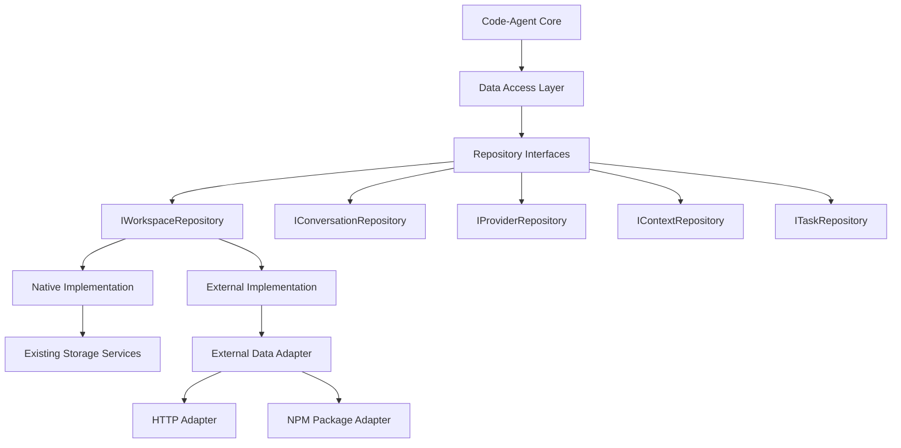

# Data Layer Abstraction for External Application Integration

**Status**: Planning  
**Priority**: High  
**Epic**: External Integration  
**Created**: December 16, 2025

## Overview

This epic enables code-agent to integrate with external applications while maintaining full backwards compatibility. The solution creates a **Data Access Layer (DAL)** that abstracts all data operations, enabling code-agent to work with both its native data layer and external application data layers via minimal read/write adapters.

## Business Context

Code-agent needs to be integrated as a dependency into another application that has its own data layer for system prompts, providers, context, history, etc. The integration must:

1. **Maintain Backwards Compatibility**: Existing VSCode extension, CLI, and API functionality must continue working unchanged
2. **Support Dual Deployment**: Work as both NPM package and separate executable process
3. **Enable Clean Integration**: Provide minimal interface for external applications to integrate
4. **Ensure Security**: Restrict access to workspace root path only when running as separate process

## Architecture Overview

## Data Mapping

| Code-Agent Entity    | External App Entity      | Notes                               |
| -------------------- | ------------------------ | ----------------------------------- |
| Provider Settings    | Providers                | API keys, model configurations      |
| Conversation History | Conversations + Messages | Chat interactions, threading        |
| System Prompts       | Prompts/Agents           | Template-based AI interactions      |
| Context/Knowledge    | Knowledge Items          | File references, snippets           |
| Workspace Config     | Workspaces               | Top-level organizational containers |
| Task State           | Tasks                    | Background processing operations    |

## User Stories

### Epic 1: Core Data Abstractions

#### Story 1.1: Repository Interface Design

**As a** developer  
**I want** well-defined repository interfaces for all data operations  
**So that** the core application logic is decoupled from data storage implementation

**Acceptance Criteria:**

- [ ] Create `IWorkspaceRepository` interface with CRUD operations
- [ ] Create `IConversationRepository` interface with message management
- [ ] Create `IProviderRepository` interface with provider configuration
- [ ] Create `IContextRepository` interface for workspace context
- [ ] Create `ITaskRepository` interface for task state management
- [ ] All interfaces include proper TypeScript types and JSDoc
- [ ] Interfaces support both synchronous and asynchronous operations where appropriate

**Technical Notes:**

- Use generic repository pattern with common base interface
- Include query capabilities for complex data retrieval
- Support batch operations for performance optimization

#### Story 1.2: Data Transfer Objects

**As a** developer  
**I want** common data structures that work across both native and external systems  
**So that** data can be seamlessly transferred between different implementations

**Acceptance Criteria:**

- [ ] Define `Workspace` DTO with id, name, path, settings
- [ ] Define `Conversation` DTO with messages, metadata, provider info
- [ ] Define `Message` DTO with role, content, timestamp, metadata
- [ ] Define `Provider` DTO with type, credentials, configuration
- [ ] Define `Context` DTO with workspace state and file references
- [ ] All DTOs include validation schemas using zod
- [ ] DTOs support serialization/deserialization

**Technical Notes:**

- Use branded types for IDs to prevent mixing different entity IDs
- Include migration helpers for schema evolution
- Support optional fields for backwards compatibility

### Epic 2: Native Implementation (Backwards Compatibility)

#### Story 2.1: Native Repository Implementation

**As a** existing code-agent user  
**I want** all current functionality to continue working without changes  
**So that** I can upgrade safely without losing data or features

**Acceptance Criteria:**

- [ ] Create `NativeWorkspaceRepository` wrapping existing storage services
- [ ] Create `NativeConversationRepository` wrapping session management
- [ ] Create `NativeProviderRepository` wrapping `ProviderSettingsManager`
- [ ] Create `NativeContextRepository` wrapping `FileContextTracker`
- [ ] Create `NativeTaskRepository` wrapping task persistence
- [ ] All existing tests pass without modification
- [ ] Performance matches or exceeds current implementation

**Technical Notes:**

- Use adapter pattern to wrap existing services
- Maintain exact same data formats for compatibility
- Include comprehensive integration tests

#### Story 2.2: Repository Factory

**As a** developer  
**I want** a factory to create appropriate repository implementations  
**So that** the application can switch between native and external data layers

**Acceptance Criteria:**

- [ ] Create `RepositoryFactory` with `create()` method
- [ ] Support `DataLayerConfig` with mode selection
- [ ] Return `RepositoryContainer` with all repository instances
- [ ] Support configuration via environment variables
- [ ] Include validation of configuration parameters
- [ ] Support async initialization of repositories

**Technical Notes:**

- Use factory pattern with dependency injection
- Support lazy loading of repositories
- Include proper error handling for invalid configurations

### Epic 3: External Integration

#### Story 3.1: External Data Adapter Interface

**As an** external application developer  
**I want** a minimal, well-defined interface to integrate with code-agent  
**So that** I can provide data layer implementation without complex integration

**Acceptance Criteria:**

- [ ] Define `IExternalDataAdapter` interface with CRUD operations
- [ ] Support workspace-scoped data operations
- [ ] Include query interface for complex data retrieval
- [ ] Support batch operations for performance
- [ ] Include error handling and validation
- [ ] Provide TypeScript definitions for all interfaces

**Technical Notes:**

- Keep interface minimal to reduce integration complexity
- Use JSON for all data exchange
- Include versioning for future compatibility

#### Story 3.2: HTTP Adapter Implementation

**As a** user  
**I want** to run code-agent as a separate process  
**So that** I have clean separation and security isolation

**Acceptance Criteria:**

- [ ] Create `HttpExternalDataAdapter` for REST API communication
- [ ] Support authentication via JWT tokens or API keys
- [ ] Include retry logic and error handling
- [ ] Support TLS encryption for secure communication
- [ ] Include rate limiting and request batching
- [ ] Provide comprehensive logging and monitoring

**Technical Notes:**

- Use fetch API for HTTP requests
- Implement exponential backoff for retries
- Include request/response validation

#### Story 3.3: NPM Package Adapter

**As an** external application developer  
**I want** to integrate code-agent as an NPM package  
**So that** I can embed it directly in my application

**Acceptance Criteria:**

- [ ] Create `PackageExternalDataAdapter` for direct API calls
- [ ] Support dependency injection of external API instance
- [ ] Include proper error boundary handling
- [ ] Support graceful degradation when external services unavailable
- [ ] Include TypeScript definitions for integration
- [ ] Provide example implementation

**Technical Notes:**

- Use inversion of control pattern
- Include comprehensive error handling
- Support both promise and callback patterns

### Epic 4: Core Application Updates

#### Story 4.1: Task Class Refactoring

**As a** developer  
**I want** the core Task class to use the repository pattern  
**So that** it can work with different data layer implementations

**Acceptance Criteria:**

- [ ] Update `Task.ts` constructor to accept `RepositoryContainer`
- [ ] Replace direct storage service calls with repository calls
- [ ] Update conversation persistence to use conversation repository
- [ ] Update provider management to use provider repository
- [ ] Update context tracking to use context repository
- [ ] All existing functionality preserved
- [ ] All tests updated and passing

**Technical Notes:**

- Use dependency injection pattern
- Maintain backwards compatibility for existing constructors
- Include proper error handling for repository failures

#### Story 4.2: CLI Integration

**As a** CLI user  
**I want** to specify external data layer configuration  
**So that** I can use code-agent with external applications

**Acceptance Criteria:**

- [ ] Add `--external-data-layer` CLI option
- [ ] Add `--external-endpoint` CLI option for HTTP mode
- [ ] Add `--workspace-root` CLI option for path restriction
- [ ] Update batch processor to use repository factory
- [ ] Include validation of external data layer options
- [ ] Provide helpful error messages for configuration issues

**Technical Notes:**

- Use commander.js for CLI argument parsing
- Include configuration file support
- Add comprehensive help documentation

#### Story 4.3: API Integration

**As an** API user  
**I want** to configure external data layer via API endpoints  
**So that** I can use code-agent API with external applications

**Acceptance Criteria:**

- [ ] Add data layer configuration to API server startup
- [ ] Support external data layer configuration via environment variables
- [ ] Update `FastifyServer` to use repository factory
- [ ] Include health check endpoints for external data layer
- [ ] Provide API documentation for external integration
- [ ] Include monitoring and metrics for external data layer calls

**Technical Notes:**

- Use environment variable configuration
- Include proper error handling for external service failures
- Add comprehensive logging

### Epic 5: Security and Validation

#### Story 5.1: Security Framework

**As a** security-conscious user  
**I want** proper security controls when using external data layers  
**So that** my data and system are protected from unauthorized access

**Acceptance Criteria:**

- [ ] Implement authentication for HTTP adapter (JWT/API keys)
- [ ] Add authorization checks for data operations
- [ ] Restrict file system access to workspace root path only
- [ ] Include input validation for all external data
- [ ] Add rate limiting for external API calls
- [ ] Include audit logging for security events

**Technical Notes:**

- Use established security patterns and libraries
- Include comprehensive security testing
- Follow OWASP security guidelines

#### Story 5.2: Data Validation

**As a** developer  
**I want** comprehensive validation of external data  
**So that** invalid data doesn't corrupt the application state

**Acceptance Criteria:**

- [ ] Validate all incoming data using zod schemas
- [ ] Include sanitization of user input
- [ ] Add schema version compatibility checks
- [ ] Include graceful error handling for validation failures
- [ ] Provide detailed error messages for debugging
- [ ] Add logging for validation failures

**Technical Notes:**

- Use zod for schema validation
- Include custom validation rules where needed
- Add comprehensive test coverage for validation

### Epic 6: Testing and Quality Assurance

#### Story 6.1: Repository Testing

**As a** developer  
**I want** comprehensive tests for all repository implementations  
**So that** data operations are reliable and consistent

**Acceptance Criteria:**

- [ ] Unit tests for all repository interfaces
- [ ] Integration tests for native repositories
- [ ] Mock implementations for external repository testing
- [ ] Performance tests for data operations
- [ ] Error handling tests for failure scenarios
- [ ] Migration tests for schema changes

**Technical Notes:**

- Use Jest for testing framework
- Include test data fixtures
- Add performance benchmarks

#### Story 6.2: End-to-End Integration Testing

**As a** developer  
**I want** end-to-end tests with mock external applications  
**So that** external integration works correctly in production

**Acceptance Criteria:**

- [ ] Create mock external application for testing
- [ ] Test all data operations through external adapter
- [ ] Test error scenarios and recovery
- [ ] Test performance with large datasets
- [ ] Test concurrent access scenarios
- [ ] Include compatibility tests across versions

**Technical Notes:**

- Use Docker for isolated test environments
- Include automated CI/CD pipeline testing
- Add load testing for performance validation

## Migration Plan

### Phase A: Foundation (Week 1-2)

- Repository interface design and DTOs
- Native repository implementation as wrappers
- Repository factory with native mode only
- Update unit tests to use repository pattern

### Phase B: Core Integration (Week 3-4)

- Update Task class to use repositories
- Update CLI and API entry points
- Add configuration management
- Ensure all existing functionality works

### Phase C: External Integration (Week 5-6)

- Implement external adapter interfaces
- Create HTTP and NPM package adapters
- Add external mode to repository factory
- Integration testing with mock external app

### Phase D: Security and Validation (Week 7)

- Implement security framework
- Add comprehensive data validation
- Security testing and audit
- Performance optimization

### Phase E: Documentation and Release (Week 8)

- Create integration guides
- Example implementations
- API documentation
- Release preparation

## Success Criteria

### Functional Requirements

- [ ] All existing code-agent functionality preserved
- [ ] External application integration working via both HTTP and NPM package
- [ ] Data operations perform within 10% of current performance
- [ ] Comprehensive test coverage (>90%)
- [ ] Security audit passed
- [ ] Documentation complete

### Non-Functional Requirements

- [ ] Zero breaking changes for existing users
- [ ] Clean, maintainable code architecture
- [ ] Proper error handling and logging
- [ ] Scalable design for future enhancements
- [ ] Security best practices implemented
- [ ] Performance monitoring and metrics

## Risks and Mitigation

### Risk: Performance Impact

**Mitigation**: Comprehensive performance testing, optimization, caching strategies

### Risk: Security Vulnerabilities

**Mitigation**: Security audit, input validation, principle of least privilege

### Risk: Breaking Changes

**Mitigation**: Extensive backwards compatibility testing, gradual rollout

### Risk: External Integration Complexity

**Mitigation**: Simple adapter interfaces, comprehensive documentation, examples

## Dependencies

- Existing code-agent codebase stability
- External application API specifications
- Security framework selection
- Testing infrastructure setup

## Deliverables

1. **Repository Interface Library** - Core abstractions and DTOs
2. **Native Repository Implementation** - Backwards compatibility layer
3. **External Adapter Framework** - HTTP and NPM package adapters
4. **Updated Core Application** - Task, CLI, API integration
5. **Security Framework** - Authentication, authorization, validation
6. **Test Suite** - Unit, integration, and end-to-end tests
7. **Documentation Package** - Integration guides, API docs, examples
8. **Migration Tools** - Configuration helpers, validation tools
