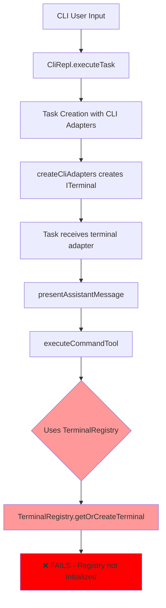
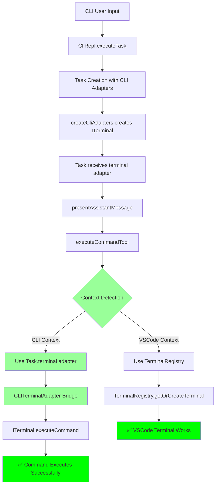
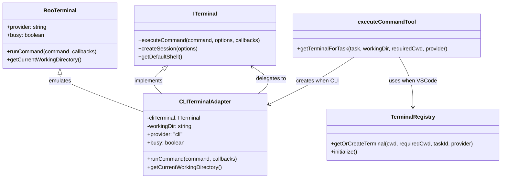
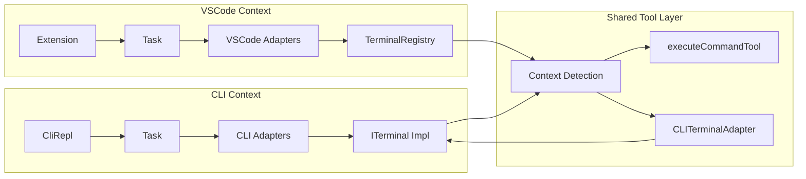

# Execute Command CLI Architecture

## Current Flow (Broken)

## Proposed Solution Flow

## Interface Bridge Architecture

## Component Integration Points

## Implementation Strategy

### Phase 1: Core Implementation

1. **Create CLITerminalAdapter class**

    - Bridge ITerminal interface to RooTerminal interface
    - Handle command execution delegation
    - Manage working directory state

2. **Modify executeCommandTool**

    - Add context detection logic
    - Route to appropriate terminal system
    - Maintain backward compatibility

3. **Add proper error handling**
    - Graceful fallbacks between systems
    - Clear error messages for debugging

### Phase 2: Testing & Validation

1. **Unit tests for CLITerminalAdapter**
2. **Integration tests for executeCommandTool in both contexts**
3. **Manual testing of CLI command execution**

### Phase 3: Documentation & Cleanup

1. **Update tool documentation**
2. **Add CLI-specific usage examples**
3. **Performance optimization if needed**

## Success Metrics

- ✅ `execute_command` tool works in CLI context
- ✅ No regression in VSCode functionality
- ✅ All existing tests continue to pass
- ✅ New CLI tests added and passing
- ✅ Error handling provides clear feedback
- ✅ Performance within acceptable bounds

## Risk Mitigation

| Risk                          | Impact | Mitigation                                         |
| ----------------------------- | ------ | -------------------------------------------------- |
| Breaking VSCode functionality | High   | Maintain existing TerminalRegistry path as default |
| Interface incompatibility     | Medium | Create comprehensive adapter layer                 |
| Performance overhead          | Low    | Minimize adapter with direct delegation            |
| Complex debugging             | Medium | Add comprehensive logging and error messages       |
