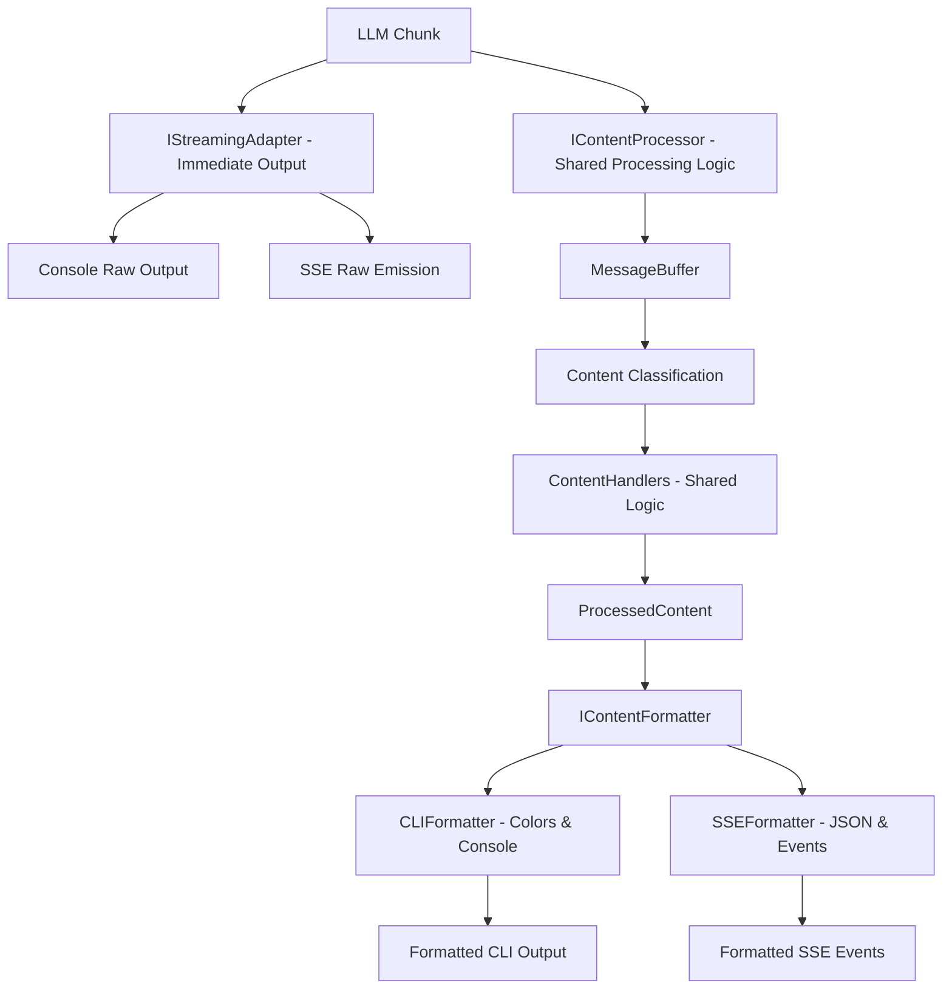

# Fix SSE Streaming Buffering Issue

## Problem Statement

The API mode is accumulating/buffering LLM response content and emitting it all at once via SSE instead of streaming it immediately as chunks become available. Additionally, the CLI and API have divergent content processing logic, violating DRY principles.

## Root Cause Analysis

### Current Divergent Processing

```
CLI Path:
LLM Chunk → CLIContentProcessor → MessageBuffer → ContentHandlers → Tool Indicators + Formatted Output

API Path:
LLM Chunk → SSEOutputAdapter → MessageBuffer → Direct SSE Emission (NO ContentHandlers, NO Tool Indicators)
```

### Key Issues

1. **Buffering**: API content goes through complex TaskMessaging before SSE emission
2. **Divergent Logic**: CLIContentProcessor does work that API also needs but doesn't share
3. **Missing Features**: API lacks tool indicators and proper content formatting that CLI has

## Shared Logic Analysis

### What CLIContentProcessor Does That API Should Also Do:

1. **Content Classification**: Uses MessageBuffer to identify `content`, `thinking`, `tool_call`, etc. (API also does this)
2. **Tool Indicators**: Generates `execute_command...`, `use_mcp_tool...` indicators (API should have this too)
3. **Content State Management**: Tracks what tools have been displayed (API needs this)
4. **Structured Processing**: Handles complex content parsing (API needs this)

### What Should Be Output-Specific:

1. **Immediate Streaming**: Raw chunks for user responsiveness
2. **Output Formatting**: Colors for CLI, JSON for API
3. **Display Medium**: Console vs SSE events

## Revised Solution Architecture

### Shared Content Processing with Output Adapters



## Implementation Stories

### Story 1: Create Shared Content Processing Interface

**File**: `src/core/interfaces/IContentProcessor.ts`

```typescript
/**
 * Shared interface for content processing logic
 * Used by both CLI and API to ensure consistent content handling
 */
export interface IContentProcessor {
	/**
	 * Process content chunk and return structured results
	 */
	processContent(chunk: string): Promise<ProcessedContent[]>

	/**
	 * Reset processing state for new task
	 */
	reset(): void
}

export interface ProcessedContent {
	content: string
	contentType: ContentType
	toolName?: string
	isToolIndicator?: boolean
	shouldDisplay?: boolean
}
```

### Story 2: Create Shared Content Processor Implementation

**File**: `src/core/content/SharedContentProcessor.ts`

```typescript
import { MessageBuffer } from "../../api/streaming/MessageBuffer"
import { CLIDisplayFormatter } from "../../cli/services/streaming/CLIDisplayFormatter"
import { IContentProcessor, ProcessedContent } from "../interfaces/IContentProcessor"

/**
 * Shared content processor that both CLI and API use
 * Contains all the logic currently in CLIContentProcessor
 */
export class SharedContentProcessor implements IContentProcessor {
	private messageBuffer = new MessageBuffer()
	private displayFormatter = new CLIDisplayFormatter()
	private displayedTools = new Set<string>()

	async processContent(chunk: string): Promise<ProcessedContent[]> {
		// Use the existing MessageBuffer logic
		const processedMessages = this.messageBuffer.processMessage(chunk)
		const results: ProcessedContent[] = []

		for (const message of processedMessages) {
			// Use existing ContentHandlers logic for tool indicators
			const formatted = this.displayFormatter.formatContent([message], {
				useColor: false, // Output adapters handle coloring
				hasDisplayedTool: (tool) => this.displayedTools.has(tool),
				markToolDisplayed: (tool) => this.displayedTools.add(tool),
				quiet: false,
			})

			// Convert to shared format
			results.push({
				content: formatted.displayText || message.content,
				contentType: message.contentType,
				toolName: message.toolName,
				isToolIndicator: formatted.isToolIndicator,
				shouldDisplay: this.shouldDisplayContent(message.contentType),
			})
		}

		return results
	}

	reset(): void {
		this.messageBuffer.reset()
		this.displayedTools.clear()
	}

	private shouldDisplayContent(contentType: ContentType): boolean {
		// Shared logic for what content types should be displayed
		return contentType === "content" || contentType === "tool_call"
	}
}
```

### Story 3: Create Output Adapter Interfaces

**File**: `src/core/interfaces/IOutputAdapter.ts`

```typescript
/**
 * Interface for immediate raw streaming
 */
export interface IStreamingAdapter {
	streamRawChunk(chunk: string): Promise<void>
	reset(): void
}

/**
 * Interface for formatted content output
 */
export interface IContentOutputAdapter {
	outputProcessedContent(content: ProcessedContent[]): Promise<void>
	reset(): void
}
```

### Story 4: Implement CLI Adapters

**File**: `src/core/adapters/cli/CLIOutputAdapters.ts`

```typescript
export class CLIStreamingAdapter implements IStreamingAdapter {
	async streamRawChunk(chunk: string): Promise<void> {
		process.stdout.write(chunk)
	}
	reset(): void {}
}

export class CLIContentOutputAdapter implements IContentOutputAdapter {
	async outputProcessedContent(content: ProcessedContent[]): Promise<void> {
		for (const item of content) {
			if (item.shouldDisplay) {
				// Apply CLI-specific formatting (colors, etc.)
				const formatted = this.applyCLIFormatting(item)
				console.log(formatted)
			}
		}
	}

	private applyCLIFormatting(content: ProcessedContent): string {
		// Apply colors, CLI-specific formatting
		// Reuse existing CLI formatting logic
		return content.content
	}

	reset(): void {}
}
```

### Story 5: Implement SSE Adapters

**File**: `src/core/adapters/api/SSEOutputAdapters.ts`

```typescript
export class SSEStreamingAdapter implements IStreamingAdapter {
	constructor(private sseAdapter: SSEOutputAdapter) {}

	async streamRawChunk(chunk: string): Promise<void> {
		await this.sseAdapter.emitRawChunk(chunk)
	}

	reset(): void {}
}

export class SSEContentOutputAdapter implements IContentOutputAdapter {
	constructor(private sseAdapter: SSEOutputAdapter) {}

	async outputProcessedContent(content: ProcessedContent[]): Promise<void> {
		for (const item of content) {
			if (item.shouldDisplay) {
				// Convert to SSE event format
				const event: SSEEvent = {
					type: item.isToolIndicator ? SSE_EVENTS.TOOL_USE : SSE_EVENTS.PROGRESS,
					jobId: this.sseAdapter.jobId,
					message: item.content,
					toolName: item.toolName,
					contentType: item.contentType,
					timestamp: Date.now(),
				}

				await this.sseAdapter.emitEvent(event)
			}
		}
	}

	reset(): void {}
}
```

### Story 6: Modify TaskApiHandler to Use Shared Processing

**File**: `src/core/task/TaskApiHandler.ts`

```typescript
// In constructor, inject both adapters
constructor(
    // ... existing parameters
    private streamingAdapter?: IStreamingAdapter,
    private contentProcessor?: IContentProcessor,
    private contentOutputAdapter?: IContentOutputAdapter
) {}

// In createApiReq(), use shared processing
if (chunk.text) {
    assistantMessage += chunk.text
    const prevLength = this.assistantMessageContent.length
    this.assistantMessageContent = parseAssistantMessage(assistantMessage)

    // IMMEDIATE STREAMING - raw chunks
    if (this.streamingAdapter) {
        await this.streamingAdapter.streamRawChunk(chunk.text)
    }

    // SHARED CONTENT PROCESSING - same logic for CLI and API
    if (this.contentProcessor && this.contentOutputAdapter) {
        const processedContent = await this.contentProcessor.processContent(chunk.text)
        await this.contentOutputAdapter.outputProcessedContent(processedContent)
    }

    // Remove the divergent CLI/API paths entirely
    // All modes now use the same shared processing logic

    if (this.assistantMessageContent.length > prevLength) {
        this.userMessageContentReady = false
    }
}
```

### Story 7: Update CLIContentProcessor to Use Shared Logic

**File**: `src/cli/services/streaming/CLIContentProcessor.ts`

```typescript
// CLIContentProcessor becomes a thin wrapper around SharedContentProcessor
import { SharedContentProcessor } from "../../../core/content/SharedContentProcessor"

export class CLIContentProcessor implements IContentProcessor {
	private sharedProcessor = new SharedContentProcessor()

	async processContent(chunk: string): Promise<ProcessedContent[]> {
		// Delegate to shared implementation
		return this.sharedProcessor.processContent(chunk)
	}

	reset(): void {
		this.sharedProcessor.reset()
	}
}
```

### Story 8: Integration Points

#### FastifyServer Integration

```typescript
const sharedProcessor = new SharedContentProcessor()
const sseStreamingAdapter = new SSEStreamingAdapter(sseAdapter)
const sseContentAdapter = new SSEContentOutputAdapter(sseAdapter)

const taskAdapters = {
	streamingAdapter: sseStreamingAdapter,
	contentProcessor: sharedProcessor,
	contentOutputAdapter: sseContentAdapter,
}
```

#### BatchProcessor Integration

```typescript
const sharedProcessor = new SharedContentProcessor()
const cliStreamingAdapter = new CLIStreamingAdapter()
const cliContentAdapter = new CLIContentOutputAdapter()

const taskAdapters = {
	streamingAdapter: cliStreamingAdapter,
	contentProcessor: sharedProcessor,
	contentOutputAdapter: cliContentAdapter,
}
```

## Technical Benefits

1. **Shared Logic**: CLI and API use identical content processing (MessageBuffer, ContentHandlers, tool indicators)
2. **DRY Principle**: No duplication of content processing logic
3. **Immediate Streaming**: Raw chunks stream immediately in both modes
4. **Consistent Features**: API gets tool indicators and proper content classification like CLI
5. **Clean Separation**: Streaming vs processing vs output formatting are separate concerns

## Success Criteria

- [ ] Both CLI and API use SharedContentProcessor (same logic)
- [ ] API mode gets tool indicators like CLI mode
- [ ] Immediate streaming works in both modes (test with test-api.js)
- [ ] No duplicated content processing logic
- [ ] All existing CLI functionality preserved
- [ ] Both modes share MessageBuffer and ContentHandlers logic

## Architecture Summary

The solution creates **shared content processing** with **mode-specific output adapters**:

1. **SharedContentProcessor**: Contains all content logic (MessageBuffer, ContentHandlers, tool indicators)
2. **IStreamingAdapter**: Handles immediate raw streaming per mode
3. **IContentOutputAdapter**: Handles formatted output per mode (colors for CLI, events for SSE)

This eliminates code duplication while ensuring both modes get the same features and immediate streaming.
