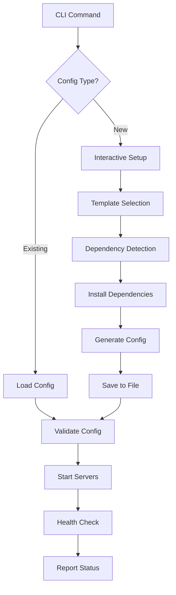

# MCP Server Enhancement Product Stories

## Overview

This document outlines the product stories for enhancing MCP (Model Context Protocol) server functionality, focusing on adding sample servers to configuration files and improving dependency management.

## Current State Analysis

### Existing MCP Infrastructure

The codebase currently has two MCP configuration systems:

#### 1. VS Code Extension MCP Format

**Location**: `src/services/mcp/McpHub.ts`
**Config Structure**:

```json
{
  "mcpServers": {
    "server-name": {
      "command": "node",
      "args": ["path/to/server.js"],
      "env": { "API_KEY": "value" },
      "type": "stdio" | "sse",
      "disabled": false,
      "timeout": 60,
      "alwaysAllow": []
    }
  }
}
```

#### 2. CLI MCP Format

**Location**: `src/cli/types/mcp-config-types.ts`
**Config Structure**:

```json
{
  "version": "1.0.0",
  "defaults": { "timeout": 30000, "retryAttempts": 3, ... },
  "servers": [
    {
      "id": "server-id",
      "name": "Display Name",
      "description": "Server description",
      "type": "stdio" | "sse",
      "enabled": true,
      "command": "npx",
      "args": ["-y", "@modelcontextprotocol/server-github"],
      "env": { "GITHUB_TOKEN": "${GITHUB_TOKEN}" },
      "timeout": 30000
    }
  ]
}
```

### Key Components

- **McpHub** - Central management for VS Code extension
- **CLIMcpService** - MCP service for CLI operations
- **CLIMcpCommands** - CLI command interface
- **Example Servers** - Predefined configurations in `EXAMPLE_SERVERS`

## Product Stories

### Epic 1: MCP Configuration Enhancement

#### Story 1.1: Add Sample Servers to CLI Config

**As a** developer using the CLI version  
**I want** to have sample MCP servers pre-configured  
**So that** I can quickly test MCP functionality without manual setup

**Acceptance Criteria:**

- [ ] Add sample servers from `EXAMPLE_SERVERS` to `/Users/eo/.agentz/mcp-config.json`
- [ ] Include GitHub, Filesystem, and Custom API server examples
- [ ] Servers should be disabled by default to avoid connection errors
- [ ] Include clear descriptions and environment variable placeholders

**Implementation Notes:**

- Use existing `EXAMPLE_SERVERS` from `mcp-config-types.ts`
- Ensure environment variable placeholders (e.g., `${GITHUB_TOKEN}`) are properly documented
- Add installation instructions for required dependencies

#### Story 1.2: Unified Configuration Format

**As a** developer working with both CLI and VS Code extension  
**I want** a unified MCP configuration format  
**So that** I can use the same configuration across both environments

**Acceptance Criteria:**

- [ ] Create a configuration adapter that converts between formats
- [ ] Support importing VS Code extension configs into CLI
- [ ] Support exporting CLI configs to VS Code extension format
- [ ] Maintain backward compatibility with existing configs

### Epic 2: Dependency Management

#### Story 2.1: Automatic Dependency Detection

**As a** developer adding MCP servers  
**I want** automatic dependency detection and installation  
**So that** I don't have to manually manage npm packages

**Acceptance Criteria:**

- [ ] Scan MCP server configurations for npm dependencies
- [ ] Detect missing packages (e.g., `@modelcontextprotocol/server-github`)
- [ ] Provide installation commands for missing dependencies
- [ ] Cache dependency status to avoid repeated checks

**Technical Implementation:**

```typescript
interface DependencyManager {
	detectDependencies(config: McpServerConfig): string[]
	checkInstalled(packages: string[]): Promise<DependencyStatus[]>
	installMissing(packages: string[]): Promise<InstallationResult>
}
```

#### Story 2.2: MCP Server Bootstrapping

**As a** developer creating custom MCP servers  
**I want** an automated bootstrapping process  
**So that** I can quickly create new servers with proper dependencies

**Acceptance Criteria:**

- [ ] CLI command: `roo mcp create <server-name> --template <template-type>`
- [ ] Support templates: basic, github-api, filesystem, custom
- [ ] Automatically install required dependencies
- [ ] Generate TypeScript boilerplate code
- [ ] Add server to configuration file

**Templates:**

- **basic**: Minimal MCP server with tool and resource examples
- **github-api**: GitHub integration with authentication
- **filesystem**: File system operations with security constraints
- **custom**: Blank template for custom implementations

#### Story 2.3: Environment Variable Management

**As a** developer configuring MCP servers  
**I want** guided environment variable setup  
**So that** I can easily configure authentication and API keys

**Acceptance Criteria:**

- [ ] Detect required environment variables from config
- [ ] Interactive prompts for missing variables
- [ ] Secure storage options for sensitive data
- [ ] Validation of API keys and tokens
- [ ] Integration with system environment and `.env` files

### Epic 3: Configuration Management Interface

#### Story 3.1: Enhanced Config Commands

**As a** developer managing MCP configurations  
**I want** comprehensive config management commands  
**So that** I can easily add, modify, and remove servers

**Acceptance Criteria:**

- [ ] `roo mcp config add` - Add new server interactively
- [ ] `roo mcp config edit <server-id>` - Edit existing server
- [ ] `roo mcp config remove <server-id>` - Remove server
- [ ] `roo mcp config enable/disable <server-id>` - Toggle server state
- [ ] `roo mcp config import <file>` - Import from VS Code format

#### Story 3.2: Configuration Validation and Testing

**As a** developer with MCP server configurations  
**I want** validation and testing capabilities  
**So that** I can ensure my configurations work correctly

**Acceptance Criteria:**

- [ ] Validate configuration syntax and schema
- [ ] Test server connectivity before saving
- [ ] Health checks for configured servers
- [ ] Configuration diff and merge capabilities
- [ ] Backup and restore functionality

## Implementation Architecture

### Mermaid Diagram: MCP Configuration Flow



### Key Interfaces

```typescript
interface McpConfigManager {
	loadConfig(path?: string): Promise<McpConfigFile>
	saveConfig(config: McpConfigFile, path?: string): Promise<void>
	addServer(server: McpServerConfig): Promise<void>
	removeServer(serverId: string): Promise<void>
	validateConfig(config: McpConfigFile): ValidationResult
}

interface McpServerBootstrapper {
	createServer(name: string, template: string): Promise<string>
	installDependencies(serverPath: string): Promise<void>
	generateBoilerplate(template: string, serverPath: string): Promise<void>
}

interface DependencyManager {
	detectDependencies(config: McpServerConfig): string[]
	checkInstalled(packages: string[]): Promise<DependencyStatus[]>
	installMissing(packages: string[]): Promise<InstallationResult>
}
```

## Sample Configuration Output

The enhanced `/Users/eo/.agentz/mcp-config.json` should include:

```json
{
	"version": "1.0.0",
	"defaults": {
		"timeout": 30000,
		"retryAttempts": 3,
		"retryDelay": 1000,
		"healthCheckInterval": 60000,
		"autoConnect": true,
		"enableLogging": true
	},
	"servers": [
		{
			"id": "github-server",
			"name": "GitHub MCP Server",
			"description": "Access GitHub repositories and operations",
			"type": "stdio",
			"enabled": false,
			"command": "npx",
			"args": ["-y", "@modelcontextprotocol/server-github"],
			"env": {
				"GITHUB_PERSONAL_ACCESS_TOKEN": "${GITHUB_TOKEN}"
			},
			"timeout": 30000,
			"retryAttempts": 3,
			"retryDelay": 1000,
			"healthCheckInterval": 60000,
			"installationNotes": "Set GITHUB_TOKEN environment variable with your GitHub Personal Access Token"
		},
		{
			"id": "filesystem-server",
			"name": "Filesystem MCP Server",
			"description": "Access local filesystem operations",
			"type": "stdio",
			"enabled": false,
			"command": "npx",
			"args": ["-y", "@modelcontextprotocol/server-filesystem", "/path/to/allowed/directory"],
			"timeout": 15000,
			"retryAttempts": 2,
			"retryDelay": 500,
			"healthCheckInterval": 30000,
			"installationNotes": "Update the allowed directory path in args before enabling"
		}
	]
}
```

## Dependencies to Install

For MCP server functionality, the following dependencies are commonly needed:

### Core MCP Dependencies

```bash
npm install -g @modelcontextprotocol/server-github
npm install -g @modelcontextprotocol/server-filesystem
npm install -g @modelcontextprotocol/create-server
```

### Development Dependencies

```bash
npm install @modelcontextprotocol/sdk
npm install axios zod
```

## Next Steps

1. **Immediate**: Add sample servers to `/Users/eo/.agentz/mcp-config.json`
2. **Short-term**: Implement dependency detection and installation
3. **Medium-term**: Create server bootstrapping functionality
4. **Long-term**: Unified configuration management across CLI and extension
