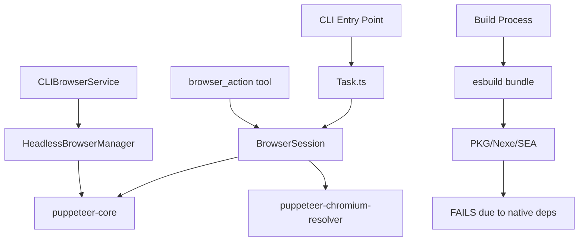
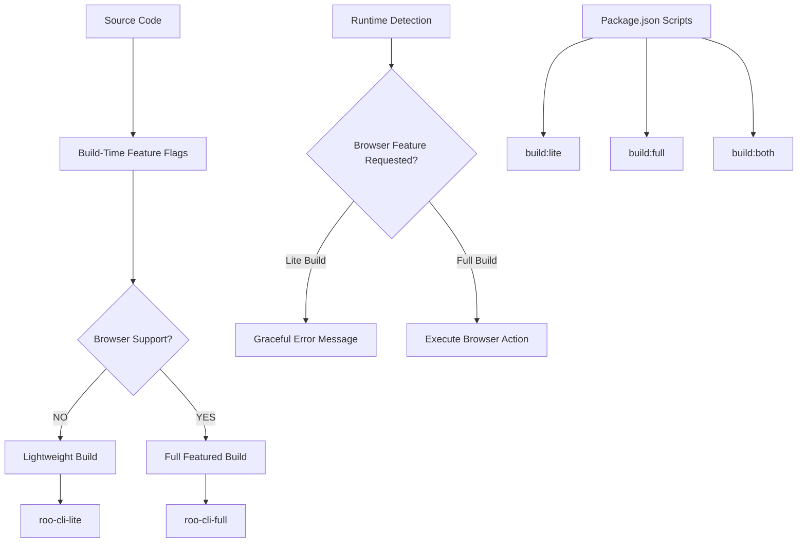

# Optional Browser Functionality for CLI Standalone Executable

## Technical Specification

### Overview

Create a conditional compilation system that allows building CLI standalone executables with or without browser functionality, eliminating hard dependencies on `puppeteer-core` and `puppeteer-chromium-resolver` while maintaining full functionality for users who need browser features.

## Current State Analysis

### Browser Dependencies

- **Hard Dependencies**: `puppeteer-core`, `puppeteer-chromium-resolver`
- **Impact**: Prevents successful compilation with pkg, nexe, and Node.js SEA bundlers
- **Usage Pattern**: Browser functionality is rarely used but causes universal build failures

### Current Browser Integration Points



## Target Architecture

### Conditional Compilation Strategy



### Feature Flag Architecture

```typescript
// src/core/config/features.ts
export interface FeatureFlags {
	browserSupport: boolean
	mcpSupport: boolean
	// Future expandable features
}

export const FEATURES: FeatureFlags = {
	browserSupport: process.env.BROWSER_SUPPORT === "true",
	mcpSupport: true, // Always enabled for now
}
```

## Implementation Strategy

### 1. Build System Modifications

#### Enhanced esbuild Configuration

```typescript
// src/esbuild.mjs - Enhanced for conditional compilation
const buildVariants = {
	lite: {
		define: {
			"process.env.BROWSER_SUPPORT": "false",
			"process.env.BUILD_VARIANT": '"lite"',
		},
		external: ["puppeteer-core", "puppeteer-chromium-resolver"],
		outfile: "dist/cli/index-lite.js",
	},
	full: {
		define: {
			"process.env.BROWSER_SUPPORT": "true",
			"process.env.BUILD_VARIANT": '"full"',
		},
		outfile: "dist/cli/index-full.js",
	},
}
```

#### Package.json Build Scripts

```json
{
	"scripts": {
		"build:cli:lite": "node esbuild.mjs --variant=lite",
		"build:cli:full": "node esbuild.mjs --variant=full",
		"build:cli:both": "npm run build:cli:lite && npm run build:cli:full",
		"build:standalone:lite": "npm run build:cli:lite && pkg dist/cli/index-lite.js --out-path=dist/executables",
		"build:standalone:full": "npm run build:cli:full && pkg dist/cli/index-full.js --out-path=dist/executables"
	}
}
```

### 2. Browser Service Abstraction

#### Browser Service Interface

```typescript
// src/core/interfaces/IBrowserService.ts
export interface IBrowserService {
	isAvailable(): boolean
	launch(url: string): Promise<IBrowserSession | null>
	createHeadlessSession(): Promise<IBrowserSession | null>
	getErrorMessage(): string
}

export interface IBrowserSession {
	navigate(url: string): Promise<void>
	click(coordinate: string): Promise<BrowserActionResult>
	type(text: string): Promise<BrowserActionResult>
	close(): Promise<void>
}
```

#### Conditional Browser Service Implementation

```typescript
// src/core/services/BrowserServiceFactory.ts
import { FEATURES } from "../config/features"

export class BrowserServiceFactory {
	static create(): IBrowserService {
		if (FEATURES.browserSupport) {
			return new FullBrowserService()
		} else {
			return new NoBrowserService()
		}
	}
}

class NoBrowserService implements IBrowserService {
	isAvailable(): boolean {
		return false
	}

	async launch(): Promise<null> {
		return null
	}

	async createHeadlessSession(): Promise<null> {
		return null
	}

	getErrorMessage(): string {
		return `Browser functionality is not available in this build variant.
    
To use browser features:
1. Download the full CLI version: roo-cli-full
2. Or install browser dependencies: npm install -g roo-cli-browser-addon
3. Or run from source: npm start

This lightweight version excludes browser dependencies for faster installation and smaller executable size.`
	}
}
```

### 3. Dynamic Import Strategy for Browser Dependencies

```typescript
// src/core/services/BrowserLoader.ts
export class BrowserLoader {
	private static browserModule: any = null

	static async loadBrowserDependencies(): Promise<boolean> {
		if (!FEATURES.browserSupport) {
			return false
		}

		try {
			// Dynamic import only when feature is enabled
			const [puppeteer, PCR] = await Promise.all([
				import("puppeteer-core"),
				import("puppeteer-chromium-resolver"),
			])

			this.browserModule = { puppeteer, PCR }
			return true
		} catch (error) {
			console.error("Failed to load browser dependencies:", error)
			return false
		}
	}

	static getBrowserModule() {
		return this.browserModule
	}
}
```

### 4. Modified Browser Action Tool

```typescript
// src/core/tools/browserActionTool.ts - Enhanced with conditional support
export async function browserActionTool(
	cline: Cline,
	block: BrowserActionToolUse,
	askApproval: (msg: string, value?: string) => Promise<boolean>,
	handleError: (error: Error) => void,
	pushToolResult: (result: ToolResult) => void,
	removeClosingTag: (tag: string, content: string) => string,
) {
	// Check if browser functionality is available
	const browserService = BrowserServiceFactory.create()

	if (!browserService.isAvailable()) {
		const errorMessage = browserService.getErrorMessage()
		pushToolResult({
			result: `Error: ${errorMessage}`,
			error: true,
		})
		return
	}

	// Existing browser action implementation...
}
```

## Build Configuration

### PKG Configuration for Lite Build

```json
// pkg.config.lite.json
{
	"name": "roo-cli-lite",
	"version": "3.19.1",
	"main": "dist/cli/index-lite.js",
	"bin": "roo-cli-lite",
	"targets": [
		"node18-macos-x64",
		"node18-macos-arm64",
		"node18-windows-x64",
		"node18-linux-x64",
		"node18-linux-arm64"
	],
	"assets": ["src/i18n/**/*", "assets/**/*"],
	"outputPath": "dist/executables"
}
```

### PKG Configuration for Full Build

```json
// pkg.config.full.json
{
	"name": "roo-cli-full",
	"version": "3.19.1",
	"main": "dist/cli/index-full.js",
	"bin": "roo-cli-full",
	"targets": [
		"node18-macos-x64",
		"node18-macos-arm64",
		"node18-windows-x64",
		"node18-linux-x64",
		"node18-linux-arm64"
	],
	"assets": ["src/i18n/**/*", "assets/**/*", "node_modules/puppeteer-core/**/*"],
	"outputPath": "dist/executables"
}
```

## Runtime Behavior

### Feature Detection and Error Handling

```typescript
// src/core/runtime/FeatureDetection.ts
export class FeatureDetection {
	static checkBrowserSupport(): {
		available: boolean
		reason?: string
		suggestion?: string
	} {
		if (!FEATURES.browserSupport) {
			return {
				available: false,
				reason: "Browser support disabled in this build",
				suggestion: "Use roo-cli-full or install browser addon",
			}
		}

		// Additional runtime checks...
		return { available: true }
	}

	static generateFeatureReport(): FeatureReport {
		return {
			buildVariant: process.env.BUILD_VARIANT || "unknown",
			browserSupport: FEATURES.browserSupport,
			mcpSupport: FEATURES.mcpSupport,
			executableSize: this.getExecutableSize(),
			capabilities: this.getAvailableCapabilities(),
		}
	}
}
```

### Graceful Error Messages

```typescript
// src/core/errors/BrowserUnavailableError.ts
export class BrowserUnavailableError extends Error {
	constructor(action: string) {
		const message = `Browser action "${action}" is not available in this CLI build.

This is the lightweight version without browser dependencies.

Available options:
1. Download full version:
   • macOS: curl -L https://releases.example.com/roo-cli-full-macos -o roo-cli
   • Windows: wget https://releases.example.com/roo-cli-full-windows.exe
   • Linux: curl -L https://releases.example.com/roo-cli-full-linux -o roo-cli

2. Install browser addon:
   npm install -g @roo/cli-browser-addon

3. Run from source:
   git clone https://github.com/RooCodeInc/Roo-Code
   cd Roo-Code/src && npm install && npm start

For this task, consider alternatives:
• Use curl or wget for simple HTTP requests
• Use MCP tools for structured data access
• Run the task in VSCode extension instead`

		super(message)
		this.name = "BrowserUnavailableError"
	}
}
```

## CI/CD Pipeline Integration

### GitHub Actions Workflow

```yaml
# .github/workflows/build-conditional-standalone.yml
name: Build Conditional Standalone Executables

on:
    push:
        branches: [main]
    pull_request:
        branches: [main]

jobs:
    build-matrix:
        strategy:
            matrix:
                os: [ubuntu-latest, windows-latest, macos-latest]
                variant: [lite, full]
                include:
                    - os: ubuntu-latest
                      platform: linux
                    - os: windows-latest
                      platform: windows
                    - os: macos-latest
                      platform: macos

        runs-on: ${{ matrix.os }}

        steps:
            - uses: actions/checkout@v3

            - name: Setup Node.js
              uses: actions/setup-node@v3
              with:
                  node-version: "20"

            - name: Install dependencies
              run: npm ci
              working-directory: src

            - name: Build CLI variant
              run: npm run build:cli:${{ matrix.variant }}
              working-directory: src

            - name: Build standalone executable
              run: npm run build:standalone:${{ matrix.variant }}
              working-directory: src

            - name: Test executable
              run: |
                  chmod +x dist/executables/roo-cli-${{ matrix.variant }}-${{ matrix.platform }}*
                  ./dist/executables/roo-cli-${{ matrix.variant }}-${{ matrix.platform }}* --version
                  ./dist/executables/roo-cli-${{ matrix.variant }}-${{ matrix.platform }}* --features
              working-directory: src

            - name: Upload artifacts
              uses: actions/upload-artifact@v3
              with:
                  name: roo-cli-${{ matrix.variant }}-${{ matrix.platform }}
                  path: src/dist/executables/roo-cli-${{ matrix.variant }}-${{ matrix.platform }}*
```

## User Experience Design

### CLI Feature Detection Command

```bash
# New --features flag to show build capabilities
$ roo-cli --features
Roo CLI v3.19.1 (lite)

Features:
✓ Core AI chat functionality
✓ File operations
✓ Command execution
✓ MCP server support
✗ Browser automation (use roo-cli-full)

Build Info:
• Variant: lite
• Size: 45MB
• Browser Support: disabled
• Platform: linux-x64

To enable browser features:
1. Download full version: curl -L https://releases.roo.dev/roo-cli-full-linux
2. Install addon: npm install -g @roo/cli-browser-addon
```

### Version Comparison

| Feature            | roo-cli-lite | roo-cli-full |
| ------------------ | ------------ | ------------ |
| File Operations    | ✓            | ✓            |
| Command Execution  | ✓            | ✓            |
| MCP Support        | ✓            | ✓            |
| Browser Automation | ✗            | ✓            |
| Executable Size    | ~45MB        | ~120MB       |
| Install Time       | Fast         | Slower       |
| Dependencies       | Minimal      | Full         |

## Migration and Compatibility

### Backward Compatibility Strategy

```typescript
// src/core/migration/CompatibilityLayer.ts
export class CompatibilityLayer {
	static async handleLegacyBrowserAction(action: string): Promise<void> {
		const detection = FeatureDetection.checkBrowserSupport()

		if (!detection.available) {
			console.warn(`Browser action "${action}" not available in this build.`)
			console.log(detection.suggestion)

			// Offer alternative approaches
			this.suggestAlternatives(action)
			return
		}

		// Execute if available
		// ... existing implementation
	}

	private static suggestAlternatives(action: string): void {
		const alternatives = {
			launch: "Use curl for HTTP requests or file:// URLs for local files",
			click: "Consider using MCP tools for structured interactions",
			type: "Use command line tools for automation",
			screenshot: "Not available in lite build - use full version",
		}

		const suggestion = alternatives[action as keyof typeof alternatives]
		if (suggestion) {
			console.log(`Alternative: ${suggestion}`)
		}
	}
}
```

## Testing Strategy

### Build Variant Testing

```typescript
// src/__tests__/conditional-build.test.ts
describe("Conditional Build Tests", () => {
	describe("Lite Build", () => {
		beforeAll(() => {
			process.env.BROWSER_SUPPORT = "false"
			process.env.BUILD_VARIANT = "lite"
		})

		it("should not include browser dependencies", () => {
			expect(() => require("puppeteer-core")).toThrow()
		})

		it("should show browser unavailable error", async () => {
			const browserService = BrowserServiceFactory.create()
			expect(browserService.isAvailable()).toBe(false)
			expect(browserService.getErrorMessage()).toContain("not available")
		})

		it("should handle browser_action gracefully", async () => {
			const result = await simulateBrowserAction("launch", "https://example.com")
			expect(result.error).toBe(true)
			expect(result.result).toContain("Browser functionality is not available")
		})
	})

	describe("Full Build", () => {
		beforeAll(() => {
			process.env.BROWSER_SUPPORT = "true"
			process.env.BUILD_VARIANT = "full"
		})

		it("should include browser dependencies", () => {
			expect(() => require("puppeteer-core")).not.toThrow()
		})

		it("should support browser actions", async () => {
			const browserService = BrowserServiceFactory.create()
			expect(browserService.isAvailable()).toBe(true)
		})
	})
})
```

### Executable Integration Tests

```bash
#!/bin/bash
# scripts/test-executables.sh

echo "Testing lite executable..."
./dist/executables/roo-cli-lite-linux --version
./dist/executables/roo-cli-lite-linux --features | grep "Browser Support: disabled" || exit 1

echo "Testing full executable..."
./dist/executables/roo-cli-full-linux --version
./dist/executables/roo-cli-full-linux --features | grep "Browser Support: enabled" || exit 1

echo "Testing browser functionality..."
echo "browser_action launch https://example.com" | ./dist/executables/roo-cli-lite-linux 2>&1 | grep "not available" || exit 1

echo "All tests passed!"
```

## Implementation Phases

### Phase 1: Foundation (Week 1)

- [ ] Implement feature flag system
- [ ] Create conditional compilation in esbuild
- [ ] Add browser service abstraction layer
- [ ] Create lite and full build scripts

### Phase 2: Error Handling (Week 1)

- [ ] Implement graceful error messages
- [ ] Add feature detection utilities
- [ ] Create compatibility layer for legacy code
- [ ] Add CLI --features command

### Phase 3: Build System (Week 2)

- [ ] Configure PKG for both variants
- [ ] Set up CI/CD pipeline for dual builds
- [ ] Add automated testing for both variants
- [ ] Create distribution packages

### Phase 4: Documentation & Polish (Week 1)

- [ ] Update documentation for both variants
- [ ] Create migration guides
- [ ] Add user-facing error messages
- [ ] Performance optimization

## Success Metrics

- **Lite Build Success**: PKG compilation succeeds without browser dependencies
- **Size Reduction**: Lite executable <50MB (vs >100MB with browser deps)
- **Feature Parity**: 100% non-browser functionality preserved
- **Error Quality**: Clear, actionable error messages for unavailable features
- **CI Success**: Both variants build successfully across all platforms

## Risk Mitigation

| Risk                   | Impact | Mitigation                             |
| ---------------------- | ------ | -------------------------------------- |
| Build complexity       | Medium | Automated testing, clear scripts       |
| User confusion         | High   | Clear documentation, feature detection |
| Maintenance overhead   | Medium | Shared codebase, automated builds      |
| Performance regression | Low    | Benchmarking, optimization             |

## Next Steps

1. **Approval**: Confirm architectural approach and implementation plan
2. **Prototype**: Create minimal working example with conditional compilation
3. **Implementation**: Execute phases 1-4 with iterative testing
4. **Release**: Gradual rollout with both variants available

This specification provides a comprehensive approach to eliminating browser dependencies while maintaining optional browser functionality through conditional compilation.
