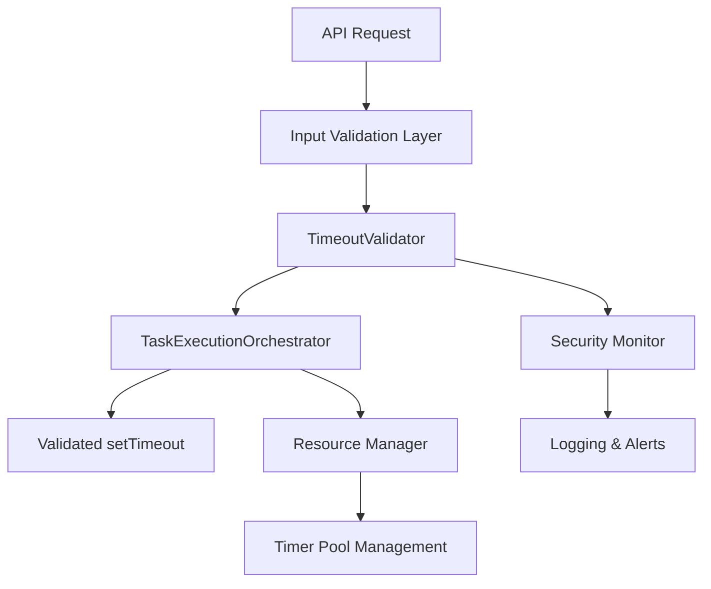

# Security: Timeout Validation & Resource Exhaustion Prevention

## Overview

This PRD addresses CodeQL security findings related to resource exhaustion vulnerabilities in the TaskExecutionOrchestrator. The issues stem from user-controlled timeout values being passed directly to setTimeout() without proper validation, potentially allowing malicious users to cause resource exhaustion attacks.

## Problem Statement

### Security Issues Identified

- **Line 209**: `setTimeout(callback, timeoutMs)` where `timeoutMs` comes from user-controlled `options.slidingTimeoutMs`
- **Line 233**: `setTimeout(callback, timeoutMs)` in the `resumeTimeout()` function using the same user-controlled value

### Business Context

- Tasks are designed to run for hours (up to 24 hours based on `TASK_MAX_SLIDING_TIMEOUT_MS`)
- The API allows clients to specify `slidingTimeoutMs` in request bodies
- Current defaults: 30 minutes default, 24 hours maximum
- Environment variables provide some bounds but user input can still bypass validation

### Security Risks

1. **Resource Exhaustion**: Malicious users could set extremely large timeout values (e.g., `Number.MAX_SAFE_INTEGER`)
2. **Memory Leaks**: Long-running timers consume memory and can accumulate
3. **DoS Attacks**: Multiple requests with large timeouts could exhaust server resources

## Solution Architecture

## User Stories

### Epic 1: Input Validation & Sanitization

#### Story 1.1: Implement Timeout Validation Layer

**As a** system administrator  
**I want** timeout values to be validated and sanitized  
**So that** malicious users cannot cause resource exhaustion attacks

**Acceptance Criteria:**

- Create `TimeoutValidator` class with strict bounds checking
- Enforce absolute maximum limits (24 hours for sliding, 5 minutes for info queries)
- Validate minimum limits (1 second minimum)
- Sanitize input types (handle strings, nulls, undefined)
- Provide clear error messages for invalid values
- Log security violations for monitoring

**Technical Requirements:**

- File: `src/core/task/execution/TimeoutValidator.ts`
- Validation rules:
    - `slidingTimeoutMs`: 1,000ms - 86,400,000ms (1s - 24h)
    - `infoQueryTimeoutMs`: 1,000ms - 300,000ms (1s - 5m)
- Return sanitized values or throw validation errors
- Support for environment variable overrides with validation

#### Story 1.2: Update TaskExecutionOrchestrator with Validation

**As a** developer  
**I want** the TaskExecutionOrchestrator to use validated timeout values  
**So that** all setTimeout calls are protected from malicious input

**Acceptance Criteria:**

- Replace direct timeout usage with `TimeoutValidator.validateSlidingTimeout()`
- Replace info query timeout with `TimeoutValidator.validateInfoQueryTimeout()`
- Add validation at entry points (lines 141, 168)
- Fail fast with clear error messages
- Maintain backward compatibility for valid values
- Log when values are clamped to safe ranges

**Technical Requirements:**

- File: `src/core/task/execution/TaskExecutionOrchestrator.ts`
- Update lines 141 and 168 with validation calls
- Add error handling for validation failures
- Preserve existing functionality for valid inputs

### Epic 2: API Layer Protection

#### Story 2.1: API Request Validation

**As a** API consumer  
**I want** clear feedback when I provide invalid timeout values  
**So that** I can correct my requests and understand the limits

**Acceptance Criteria:**

- Add schema validation for timeout parameters in request bodies
- Return HTTP 400 with clear error messages for invalid timeouts
- Document timeout limits in API documentation
- Implement rate limiting for requests with large timeouts
- Add request logging for security monitoring

**Technical Requirements:**

- File: `src/api/server/FastifyServer.ts`
- Add Joi/Zod schema validation for timeout fields
- Update request handling to validate before execution
- Add security headers and rate limiting

#### Story 2.2: Configuration Hardening

**As a** system administrator  
**I want** environment variable configuration to be validated  
**So that** misconfiguration cannot create security vulnerabilities

**Acceptance Criteria:**

- Validate `TASK_DEFAULT_SLIDING_TIMEOUT_MS` and `TASK_MAX_SLIDING_TIMEOUT_MS`
- Ensure configuration values respect security bounds
- Add configuration validation on startup
- Fail startup with clear errors for invalid configuration
- Log configuration values (sanitized) on startup

**Technical Requirements:**

- File: `src/api/config/ApiConfigManager.ts`
- Add validation schema for timeout environment variables
- Integrate with `TimeoutValidator` for consistent bounds
- Add startup validation checks

### Epic 3: Enhanced Security Measures

#### Story 3.1: Resource Management

**As a** system administrator  
**I want** the system to manage timer resources efficiently  
**So that** resource exhaustion is prevented even with valid long timeouts

**Acceptance Criteria:**

- Implement timeout pooling to limit concurrent long-running timers
- Add memory usage monitoring for timer management
- Implement graceful degradation when resource limits are approached
- Provide metrics on active timer count and memory usage
- Add configurable limits for concurrent long-running tasks

**Technical Requirements:**

- File: `src/core/task/execution/ResourceManager.ts`
- Track active timers and their durations
- Implement timer pooling with configurable limits
- Add memory monitoring and cleanup
- Integrate with existing task execution flow

#### Story 3.2: Security Monitoring

**As a** security team member  
**I want** to monitor and alert on suspicious timeout usage patterns  
**So that** potential attacks can be detected and mitigated

**Acceptance Criteria:**

- Log suspicious timeout requests (values near limits, repeated large values)
- Implement alerting for potential abuse patterns
- Add metrics for timeout usage patterns
- Track timeout validation failures and their sources
- Provide dashboard for timeout security metrics

**Technical Requirements:**

- File: `src/core/security/SecurityMonitor.ts`
- Integrate with existing logging infrastructure
- Add structured logging for security events
- Implement configurable alerting thresholds
- Export metrics for monitoring systems

### Epic 4: Testing & Documentation

#### Story 4.1: Security Test Suite

**As a** developer  
**I want** comprehensive tests for timeout security  
**So that** regressions and new vulnerabilities are caught early

**Acceptance Criteria:**

- Test boundary conditions (min/max values, edge cases)
- Test malicious input scenarios (negative values, extremely large values)
- Test resource exhaustion scenarios
- Performance tests with various timeout values
- Integration tests with API layer validation
- Test environment variable validation

**Technical Requirements:**

- File: `src/core/task/execution/__tests__/TimeoutSecurity.test.ts`
- Use Jest for unit and integration tests
- Include performance benchmarks
- Test all validation paths and error conditions
- Mock timer functions for controlled testing

#### Story 4.2: Documentation Updates

**As a** developer and API consumer  
**I want** clear documentation on timeout limits and security measures  
**So that** I can use the system safely and understand the constraints

**Acceptance Criteria:**

- Document timeout validation rules and limits
- Provide API documentation with timeout parameter details
- Create security guidelines for timeout usage
- Document configuration options and their security implications
- Provide troubleshooting guide for timeout-related issues

**Technical Requirements:**

- Files:
    - `docs/technical/security-timeout-validation.md`
    - `docs/api/timeout-limits.md`
    - `docs/configuration/timeout-security.md`
- Include code examples and configuration samples
- Document migration path for existing users
- Provide security best practices

## Validation Rules

| Parameter            | Min Value    | Max Value          | Default           | Context            |
| -------------------- | ------------ | ------------------ | ----------------- | ------------------ |
| `slidingTimeoutMs`   | 1,000ms (1s) | 86,400,000ms (24h) | 1,800,000ms (30m) | Long-running tasks |
| `infoQueryTimeoutMs` | 1,000ms (1s) | 300,000ms (5m)     | 30,000ms (30s)    | Quick info queries |

## Implementation Priority

1. **Phase 1**: Input Validation & Sanitization (Stories 1.1, 1.2)
2. **Phase 2**: API Layer Protection (Stories 2.1, 2.2)
3. **Phase 3**: Enhanced Security Measures (Stories 3.1, 3.2)
4. **Phase 4**: Testing & Documentation (Stories 4.1, 4.2)

## Backward Compatibility

- Existing valid timeout values will continue to work unchanged
- Invalid values will be clamped to safe ranges with warnings logged
- Environment variable overrides will be validated but existing valid configs preserved
- API clients will receive clear error messages for invalid inputs with migration guidance

## Success Metrics

- **Security**: Zero CodeQL security findings related to timeout resource exhaustion
- **Performance**: No degradation in task execution performance for valid timeouts
- **Reliability**: Reduced memory usage and timer-related resource leaks
- **Usability**: Clear error messages and documentation reduce support requests
- **Monitoring**: Security dashboard provides visibility into timeout usage patterns

## Risk Mitigation

- **Breaking Changes**: Comprehensive testing and gradual rollout with feature flags
- **Performance Impact**: Validation overhead minimized through efficient implementation
- **User Experience**: Clear error messages and migration documentation
- **Security**: Defense in depth with multiple validation layers
