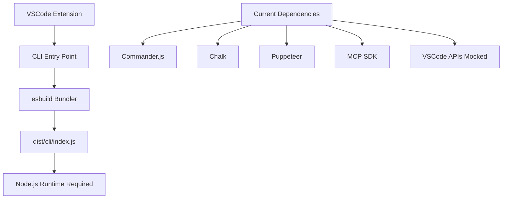
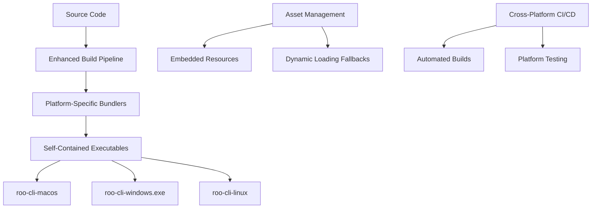
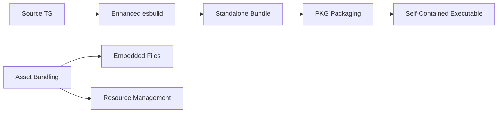

# Standalone Cross-Platform CLI Executable Architecture Plan

## Overview

Transform the existing Node.js-based CLI into self-contained executables for macOS, Windows, and Linux that don't require Node.js installation on target machines.

## Current Architecture Analysis

## Target Architecture

## Technical Implementation Strategy

### 1. Build Tool Selection: PKG

**Rationale**: PKG is mature, well-maintained, and handles complex Node.js applications effectively.

**Benefits**:

- Embeds Node.js runtime
- Handles dynamic requires with snapshots
- Good asset bundling support
- Established ecosystem

### 2. Enhanced esbuild Configuration

### 3. Cross-Platform Build Matrix

| Platform | Target             | Architecture | Executable Name     | Output Path |
| -------- | ------------------ | ------------ | ------------------- | ----------- |
| macOS    | node18-macos-x64   | x86_64       | roo-cli-macos       | apps/       |
| macOS    | node18-macos-arm64 | ARM64        | roo-cli-macos-arm64 | apps/       |
| Windows  | node18-win-x64     | x86_64       | roo-cli-windows.exe | apps/       |
| Linux    | node18-linux-x64   | x86_64       | roo-cli-linux       | apps/       |
| Linux    | node18-linux-arm64 | ARM64        | roo-cli-linux-arm64 | apps/       |

## Product Stories

### Story 1: Enhanced Build System Foundation

**Epic**: Standalone Executable Infrastructure
**Priority**: High
**Effort**: 8 points

**Acceptance Criteria**:

- [ ] Install and configure PKG as build dependency
- [ ] Create enhanced esbuild configuration for standalone builds
- [ ] Implement asset bundling for CLI-required resources
- [ ] Enhance VSCode dependency mocking for standalone context
- [ ] Create build scripts for local development

**Technical Details**:

- Add PKG configuration to [`package.json`](src/package.json:53)
- Modify [`esbuild.mjs`](src/esbuild.mjs:116) to create standalone-optimized bundles
- Handle puppeteer binary embedding
- Mock additional VSCode APIs that may be missing in [`cli/__mocks__/vscode.js`](src/cli/__mocks__/vscode.js:1)

**Implementation Tasks**:

1. Add PKG as dev dependency: `"pkg": "^5.8.1"`
2. Create `pkg.config.json` with asset specifications
3. Modify [`cliConfig`](src/esbuild.mjs:116) in esbuild to optimize for PKG
4. Add puppeteer-chromium-resolver configuration for embedded binaries
5. Enhance VSCode mocks for CLI-only functionality

---

### Story 2: Cross-Platform Build Automation

**Epic**: Standalone Executable Infrastructure  
**Priority**: High
**Effort**: 5 points

**Acceptance Criteria**:

- [ ] Create GitHub Actions workflow for cross-platform builds
- [ ] Implement build matrix for all target platforms
- [ ] Set up artifact collection and release automation
- [ ] Add build verification and smoke tests
- [ ] Create local build scripts matching CI/CD

**Technical Details**:

- GitHub Actions with matrix strategy for each platform
- Automated testing on each platform using virtual environments
- Release artifact management with proper naming conventions
- Version consistency across platforms using [`package.json`](src/package.json:6) version

**Implementation Tasks**:

1. Create `.github/workflows/build-executables.yml`
2. Add matrix jobs for macOS, Windows, Linux (x64 and ARM64)
3. Implement artifact upload with proper naming
4. Add smoke tests for each executable
5. Create `scripts/build-standalone.sh` for local builds

---

### Story 3: Asset and Dependency Management

**Epic**: Standalone Executable Infrastructure
**Priority**: Medium
**Effort**: 5 points

**Acceptance Criteria**:

- [ ] Implement dynamic asset loading for embedded resources
- [ ] Handle puppeteer browser binary management
- [ ] Create fallback mechanisms for missing assets
- [ ] Optimize executable size through selective bundling
- [ ] Implement runtime dependency detection

**Technical Details**:

- Use PKG's snapshot feature for dynamic requires
- Embed critical assets, download others on-demand
- Implement browser binary discovery and fallback using [`puppeteer-chromium-resolver`](src/package.json:422)
- Optimize bundle size through tree-shaking and selective imports

**Implementation Tasks**:

1. Create asset manifest for embedded vs downloaded resources
2. Implement dynamic browser binary resolution for standalone context
3. Add fallback asset downloading mechanism
4. Optimize [`esbuild.mjs`](src/esbuild.mjs:1) for minimal bundle size
5. Add runtime environment detection for asset paths

---

### Story 4: Platform-Specific Optimizations

**Epic**: Cross-Platform Compatibility
**Priority**: Medium
**Effort**: 3 points

**Acceptance Criteria**:

- [ ] Optimize executable size per platform
- [ ] Handle platform-specific path and file operations
- [ ] Implement platform-specific error handling
- [ ] Add platform detection and feature flags
- [ ] Optimize startup time for each platform

**Technical Details**:

- Platform-specific build configurations in PKG
- Conditional compilation for platform features
- Platform-optimized asset handling
- Native module compatibility for MCP and other features

**Implementation Tasks**:

1. Create platform-specific PKG configurations
2. Implement OS detection utility for CLI context
3. Add platform-specific optimizations for [`PerformanceMonitoringService`](src/cli/optimization/PerformanceMonitoringService.ts:1)
4. Optimize [`StartupOptimizer`](src/cli/optimization/StartupOptimizer.ts:1) for standalone context
5. Add platform-specific [`MemoryOptimizer`](src/cli/optimization/MemoryOptimizer.ts:1) configurations

---

### Story 5: Testing and Quality Assurance

**Epic**: Quality Assurance
**Priority**: High
**Effort**: 5 points

**Acceptance Criteria**:

- [ ] Create automated tests for each platform executable
- [ ] Implement end-to-end testing without Node.js
- [ ] Add performance benchmarking for executables
- [ ] Create manual testing guidelines
- [ ] Implement regression testing for core features

**Technical Details**:

- Platform-specific test runners using clean environments
- Docker containers for isolated testing
- Performance monitoring and benchmarking against current [`CLI`](src/cli/index.ts:1) implementation
- Feature compatibility validation across all [`modes`](src/cli/index.ts:69) and [`commands`](src/cli/commands/batch.ts:1)

**Implementation Tasks**:

1. Extend [`jest.config.mjs`](src/cli/jest.config.mjs:1) for executable testing
2. Create Docker containers for clean environment testing
3. Add performance benchmarks comparing Node.js vs standalone
4. Create E2E test suite for [`BatchProcessor`](src/cli/commands/batch.ts:1) and [`CliRepl`](src/cli/repl.ts:1)
5. Implement regression tests for [`MCP integration`](src/cli/commands/mcp-commands.ts:1)

---

### Story 6: Distribution and Installation

**Epic**: User Experience
**Priority**: Medium
**Effort**: 3 points

**Acceptance Criteria**:

- [ ] Create installation scripts for each platform
- [ ] Implement automatic update mechanism
- [ ] Add executable signing for macOS and Windows
- [ ] Create distribution packages (homebrew, chocolatey, etc.)
- [ ] Document installation and usage procedures

**Technical Details**:

- Code signing certificates for macOS and Windows executables
- Package manager integrations (Homebrew, Chocolatey, APT)
- Auto-update infrastructure with version checking
- Platform-specific installers and documentation

**Implementation Tasks**:

1. Set up code signing for macOS and Windows builds
2. Create Homebrew formula for macOS distribution
3. Create Chocolatey package for Windows distribution
4. Implement auto-update mechanism in [`CLI`](src/cli/index.ts:1)
5. Create installation documentation and scripts

---

### Story 7: Backward Compatibility and Migration

**Epic**: User Experience
**Priority**: Low
**Effort**: 2 points

**Acceptance Criteria**:

- [ ] Maintain Node.js-based CLI option
- [ ] Create migration guide for existing users
- [ ] Implement feature parity validation
- [ ] Add compatibility testing between versions
- [ ] Document breaking changes and workarounds

**Technical Details**:

- Dual build outputs (Node.js + standalone) in [`package.json`](src/package.json:54)
- Configuration migration utilities for [`CliConfigManager`](src/cli/config/CliConfigManager.ts:1)
- Feature comparison matrix between versions
- Version compatibility testing

**Implementation Tasks**:

1. Maintain existing [`bin`](src/package.json:53) configuration alongside standalone builds
2. Create migration utility for existing CLI configurations
3. Add feature parity validation tests
4. Create compatibility documentation
5. Implement version detection and migration warnings

## Implementation Phases

### Phase 1: Foundation (Stories 1-2)

**Duration**: 2-3 weeks

- Set up PKG build system
- Create cross-platform CI/CD pipeline
- Establish basic executable generation

### Phase 2: Optimization (Stories 3-4)

**Duration**: 2 weeks

- Implement asset management
- Add platform-specific optimizations
- Optimize performance and size

### Phase 3: Quality & Distribution (Stories 5-7)

**Duration**: 2-3 weeks

- Comprehensive testing
- Distribution mechanisms
- User migration support

## Risk Assessment

| Risk                          | Impact | Probability | Mitigation                           |
| ----------------------------- | ------ | ----------- | ------------------------------------ |
| Large executable size         | Medium | High        | Asset optimization, lazy loading     |
| Platform compatibility issues | High   | Medium      | Extensive testing, gradual rollout   |
| Performance degradation       | Medium | Low         | Benchmarking, optimization           |
| Missing native dependencies   | High   | Medium      | Dependency auditing, fallbacks       |
| Puppeteer binary issues       | High   | Medium      | Custom browser management, fallbacks |
| MCP compatibility             | Medium | Medium      | Enhanced mocking, testing            |

## Success Metrics

- **Functionality**: 100% feature parity with Node.js CLI
- **Performance**: <20% startup time increase vs Node.js version
- **Size**: <100MB per executable
- **Compatibility**: Works on 95% of target systems without Node.js
- **Adoption**: 50% of users migrate to standalone version within 6 months

## Dependencies and Technical Considerations

### Critical File Modifications

- [`src/esbuild.mjs`](src/esbuild.mjs:116): Enhanced for standalone bundling
- [`src/package.json`](src/package.json:53): PKG configuration and scripts
- [`src/cli/index.ts`](src/cli/index.ts:1): Runtime environment detection
- [`src/cli/__mocks__/vscode.js`](src/cli/__mocks__/vscode.js:1): Enhanced mocking

### New Infrastructure

- `pkg.config.json`: PKG configuration
- `.github/workflows/build-executables.yml`: CI/CD pipeline
- `scripts/build-standalone.sh`: Local build scripts
- `docs/installation/`: Platform-specific installation guides

### Asset Management Strategy

- Embed critical CLI assets in executable
- Download browser binaries on first run
- Cache downloaded assets in user directory
- Implement fallback mechanisms for network issues

## Next Steps

1. **User Approval**: Confirm architectural approach and story prioritization
2. **Technical Spike**: Validate PKG compatibility with current codebase
3. **Implementation**: Begin with Story 1 (Enhanced Build System Foundation)
4. **Iteration**: Regular testing and feedback collection during development
