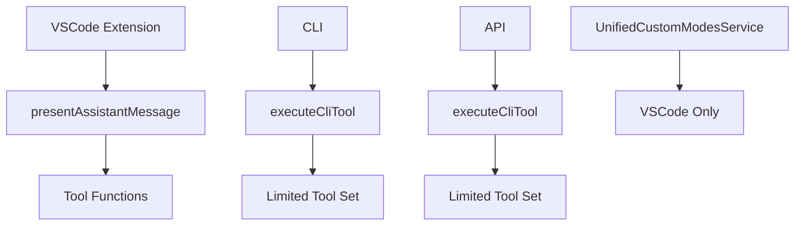
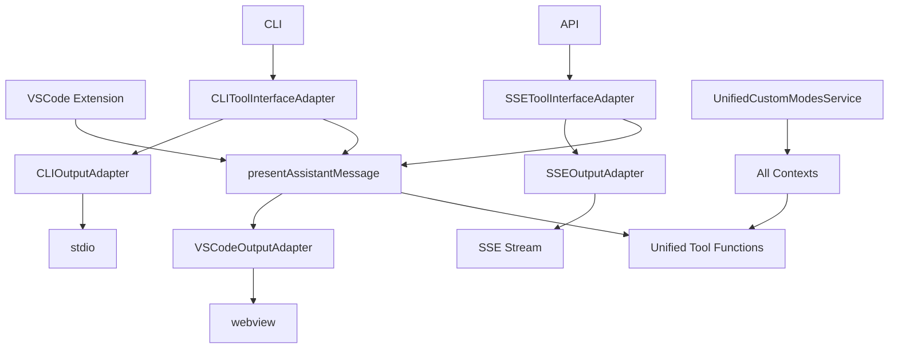

# PRD: Unified Tool Execution Architecture

## Executive Summary

This PRD outlines the implementation of a unified tool execution system that consolidates tool handling across all execution contexts (VSCode Extension, CLI, API) while preserving existing output mechanisms (webview, stdio, SSE). The primary goal is to eliminate architectural inconsistencies that cause tools like `list_modes` to fail in CLI/API contexts while ensuring feature parity across all platforms.

## Problem Statement

### Current Issues

1. **Tool Execution Inconsistency**: VSCode Extension uses `presentAssistantMessage` pattern while CLI/API use `executeCliTool` with incomplete tool coverage
2. **Missing Tools**: `list_modes`, `switch_mode`, `new_task` are missing from CLI/API execution paths
3. **Service Integration Gaps**: `UnifiedCustomModesService` is not properly integrated across all contexts
4. **Maintenance Burden**: Duplicate tool implementations require maintaining two separate systems
5. **Feature Lag**: New tools added to VSCode don't automatically work in CLI/API

### Impact

- **User Experience**: CLI/API users cannot access all available tools
- **Development Velocity**: Developers must implement tools twice (VSCode + CLI/API)
- **Quality**: Inconsistent behavior across execution contexts
- **Support**: Different tool behaviors create confusion and support issues

## Solution Overview

### Unified Tool Execution Architecture

Implement a unified tool execution system that:

1. **Consolidates Tool Logic**: All contexts use the same tool implementations from `presentAssistantMessage`
2. **Preserves Output Systems**: Maintains existing stdio (CLI), SSE (API), and webview (VSCode) output mechanisms
3. **Context-Aware Adapters**: Creates interface adapters that bridge tool execution to context-specific output systems
4. **Service Integration**: Properly integrates `UnifiedCustomModesService` across all contexts

### Architecture Principles

- **Single Source of Truth**: One tool implementation per tool across all contexts
- **Separation of Concerns**: Tool logic separate from output/interaction mechanisms
- **Backward Compatibility**: No breaking changes to existing CLI/API interfaces
- **Extensibility**: Easy to add new tools that automatically work everywhere

## Technical Architecture

### Current State

### Target State

## User Stories

### Epic 1: Context-Aware Tool Interface Adapters

- **US-001**: As a CLI user, I want all tools to work via stdio output
- **US-002**: As an API user, I want all tools to work via SSE streaming
- **US-003**: As a VSCode user, I want existing functionality preserved

### Epic 2: Unified Service Integration

- **US-004**: As a user in any context, I want custom modes to work consistently
- **US-005**: As a developer, I want to add tools once and have them work everywhere

### Epic 3: Tool Execution Unification

- **US-006**: As a CLI user, I want access to `list_modes`, `switch_mode`, and `new_task` tools
- **US-007**: As an API user, I want access to all tools available in VSCode
- **US-008**: As a developer, I want consistent tool behavior across all contexts

## Success Criteria

### Functional Requirements

1. **Tool Parity**: All tools available in VSCode work in CLI and API
2. **Output Preservation**: CLI maintains stdio, API maintains SSE, VSCode maintains webview
3. **Service Integration**: `UnifiedCustomModesService` works across all contexts
4. **Backward Compatibility**: Existing CLI/API interfaces continue to work

### Non-Functional Requirements

1. **Performance**: No significant performance degradation in any context
2. **Maintainability**: Single tool implementation reduces maintenance burden
3. **Extensibility**: New tools automatically work in all contexts
4. **Reliability**: Consistent error handling and user feedback

### Acceptance Criteria

- [ ] `list_modes` tool works in CLI mode with stdio output
- [ ] `list_modes` tool works in API mode with SSE streaming
- [ ] All existing VSCode tools work in CLI/API contexts
- [ ] Custom modes display consistently across all contexts
- [ ] No breaking changes to existing CLI/API interfaces
- [ ] Performance benchmarks show <5% overhead
- [ ] Integration tests pass for all contexts

## Implementation Phases

### Phase 1: Foundation (Week 1)

- Create context-aware tool interface adapters
- Enhance output adapters with tool support methods
- Create unified service integration pattern

### Phase 2: CLI Integration (Week 2)

- Replace CLI `executeCliTool` with unified system
- Implement CLI tool interface adapter
- Test all tools in CLI context

### Phase 3: API Integration (Week 3)

- Replace API tool execution with unified system
- Implement SSE tool interface adapter
- Test all tools in API context

### Phase 4: Service Integration (Week 4)

- Integrate `UnifiedCustomModesService` across all contexts
- Update `listModesTool` to use service
- Test custom modes in all contexts

### Phase 5: Validation & Documentation (Week 5)

- Comprehensive testing across all contexts
- Performance validation
- Documentation updates
- Migration guide for developers

## Risk Assessment

### High Risk

- **Breaking CLI/API Functionality**: Mitigation through comprehensive testing and gradual rollout
- **Performance Impact**: Mitigation through profiling and optimization

### Medium Risk

- **Complex Interface Mapping**: Mitigation through clear adapter patterns and documentation
- **Service Integration Issues**: Mitigation through incremental integration and testing

### Low Risk

- **VSCode Regression**: Minimal changes to VSCode path reduce risk
- **Tool Behavior Differences**: Unified implementation ensures consistency

## Dependencies

### Internal

- `UnifiedCustomModesService` (existing)
- `CLIOutputAdapter` (existing)
- `SSEOutputAdapter` (existing)
- `presentAssistantMessage` (existing)

### External

- No external dependencies required

## Metrics & Monitoring

### Development Metrics

- Tool coverage parity across contexts
- Code duplication reduction
- Test coverage improvement

### User Metrics

- CLI tool usage increase
- API tool usage increase
- Support ticket reduction for tool inconsistencies

### Performance Metrics

- Tool execution latency
- Memory usage
- Output streaming performance

## Future Considerations

### Extensibility

- Plugin system for custom tools
- Dynamic tool registration
- Context-specific tool filtering

### Enhancements

- Interactive tool approval in CLI
- Tool execution analytics
- Advanced error recovery

## Conclusion

This unified tool execution architecture addresses critical inconsistencies in the current system while preserving the strengths of each execution context. By implementing context-aware adapters and proper service integration, we achieve tool parity across all platforms without sacrificing the specialized output mechanisms that make each context effective.

The phased implementation approach minimizes risk while delivering immediate value through the resolution of the `list_modes` issue and establishing a foundation for long-term architectural consistency.
