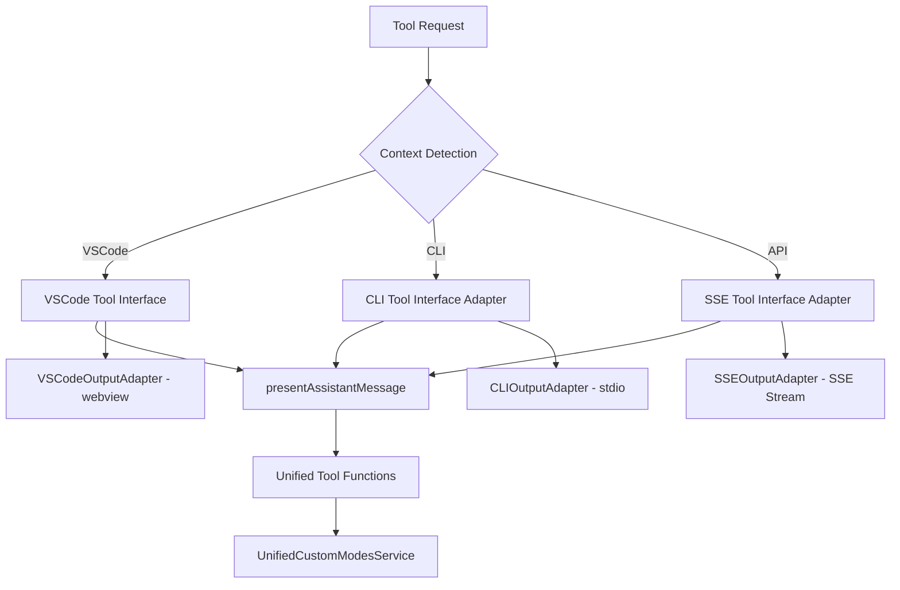

# Unified Tool Execution Architecture

## Overview

This directory contains the Product Requirements Document (PRD) and implementation stories for unifying tool execution across all execution contexts (VSCode Extension, CLI, API) while preserving existing output mechanisms (webview, stdio, SSE).

## Problem Statement

The current system has architectural inconsistencies where:

- **VSCode Extension** uses `presentAssistantMessage` pattern with complete tool coverage
- **CLI/API** use `executeCliTool` with incomplete tool coverage (missing `list_modes`, `switch_mode`, `new_task`)
- **Service Integration** is inconsistent across contexts
- **Maintenance** requires implementing tools twice

This causes the immediate issue where `list_modes` fails in API mode with "Tool not implemented for CLI mode" error.

## Solution Architecture

### Unified Tool Execution Flow

### Key Components

1. **Context-Aware Interface Adapters**: Bridge tool execution to output systems
2. **Unified Service Integration**: `UnifiedCustomModesService` across all contexts
3. **Preserved Output Systems**: Maintain stdio, SSE, and webview mechanisms
4. **Single Tool Implementation**: One codebase for all tools

## Implementation Stories

### Story 001: Context-Aware Tool Interface Adapters

**Epic**: Context-Aware Tool Interface Adapters  
**Effort**: 3 story points (1-2 days)  
**Priority**: High - Foundation for entire system

Create adapters that bridge `presentAssistantMessage` tool interface to CLI and API output systems:

- `CLIToolInterfaceAdapter` for stdio output
- `SSEToolInterfaceAdapter` for SSE streaming
- Output adapter enhancements for tool support

### Story 002: CLI Tool Execution Integration

**Epic**: Tool Execution Unification  
**Effort**: 5 story points (3-4 days)  
**Priority**: High - Core CLI functionality

Replace CLI `executeCliTool` with unified `presentAssistantMessage` pattern:

- Remove `executeCliTool` method
- Integrate CLI adapter into execution flow
- Ensure all tools work in CLI context
- Maintain stdio output behavior

### Story 003: API Tool Execution Integration

**Epic**: Tool Execution Unification  
**Effort**: 5 story points (3-4 days)  
**Priority**: High - Core API functionality

Replace API tool execution with unified pattern:

- Integrate SSE adapter into API execution flow
- Enhance SSE events for tool execution
- Ensure all tools work in API context
- Maintain SSE streaming behavior

### Story 004: UnifiedCustomModesService Integration

**Epic**: Unified Service Integration  
**Effort**: 3 story points (2-3 days)  
**Priority**: High - Resolves immediate `list_modes` issue

Integrate service across all contexts and update tools:

- Inject service into Task constructor for all contexts
- Update `listModesTool` to use service
- Configure service appropriately per context
- Ensure custom modes work consistently

### Story 005: Validation and Testing

**Epic**: Tool Execution Unification  
**Effort**: 8 story points (5-6 days)  
**Priority**: High - Critical for reliability

Comprehensive testing and validation:

- Functional validation across all contexts
- Performance benchmarking and regression testing
- Integration and end-to-end testing
- Manual validation and user acceptance testing

## Implementation Timeline

### Phase 1: Foundation (Week 1)

- **Story 001**: Context-Aware Tool Interface Adapters
- **Story 004**: Service Integration (parallel development)

### Phase 2: CLI Integration (Week 2)

- **Story 002**: CLI Tool Execution Integration
- Begin validation testing

### Phase 3: API Integration (Week 3)

- **Story 003**: API Tool Execution Integration
- Continue validation testing

### Phase 4: Validation (Week 4-5)

- **Story 005**: Comprehensive Validation and Testing
- Performance optimization
- Documentation and deployment preparation

## Success Criteria

### Immediate Goals

- ✅ `list_modes` tool works in CLI mode with stdio output
- ✅ `list_modes` tool works in API mode with SSE streaming
- ✅ All VSCode tools work in CLI/API contexts

### Long-term Goals

- ✅ Single tool implementation across all contexts
- ✅ Consistent behavior and feature parity
- ✅ Reduced maintenance burden
- ✅ Preserved output mechanisms (stdio, SSE, webview)

### Performance Targets

- <5% performance overhead in any context
- Maintained output streaming characteristics
- No regression in existing functionality

## Risk Mitigation

### High Risk: Breaking Existing Functionality

- **Mitigation**: Comprehensive testing and gradual rollout
- **Mitigation**: Feature flags for controlled deployment
- **Mitigation**: Backward compatibility validation

### Medium Risk: Performance Impact

- **Mitigation**: Performance benchmarking and optimization
- **Mitigation**: Load testing for API SSE streaming
- **Mitigation**: Memory usage monitoring

### Low Risk: Integration Complexity

- **Mitigation**: Clear adapter patterns and interfaces
- **Mitigation**: Incremental integration and testing
- **Mitigation**: Comprehensive documentation

## Benefits

### For Users

- **Feature Parity**: All tools available in all contexts
- **Consistent Experience**: Same behavior across CLI, API, VSCode
- **Reliable Functionality**: Unified implementation reduces bugs

### For Developers

- **Single Implementation**: Add tools once, work everywhere
- **Reduced Maintenance**: One codebase to maintain
- **Clear Architecture**: Well-defined separation of concerns

### For System

- **Architectural Consistency**: Unified patterns across contexts
- **Extensibility**: Easy to add new tools and contexts
- **Maintainability**: Clear interfaces and responsibilities

## Files in This Directory

- **`PRD-unified-tool-execution.md`**: Complete Product Requirements Document
- **`story-001-context-aware-adapters.md`**: Foundation adapter implementation
- **`story-002-cli-integration.md`**: CLI tool execution unification
- **`story-003-api-integration.md`**: API tool execution unification
- **`story-004-service-integration.md`**: Service integration across contexts
- **`story-005-validation-testing.md`**: Comprehensive validation and testing

## Next Steps

1. **Review and Approve**: Stakeholder review of PRD and stories
2. **Switch to Code Mode**: Begin implementation with Story 001
3. **Iterative Development**: Implement stories in sequence with testing
4. **Validation**: Comprehensive testing before production deployment

This unified architecture will resolve the immediate `list_modes` issue while establishing a robust foundation for consistent tool execution across all contexts.
