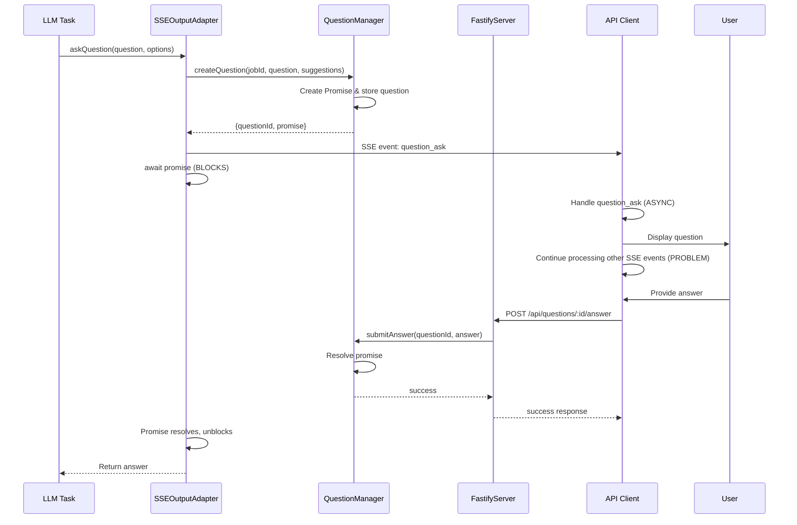
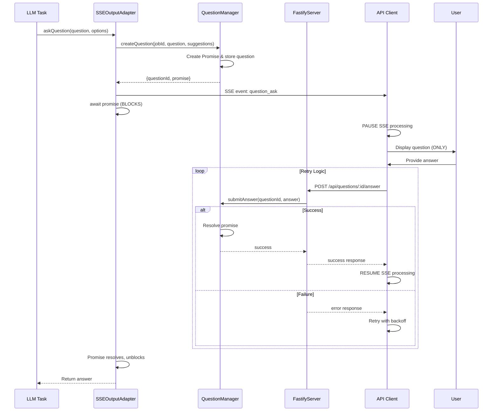

# API Client Question Blocking - Technical Architecture

## System Overview

This document outlines the technical architecture for fixing the API client question blocking issue, where questions appear but the LLM seems to continue without waiting for user responses.

## Current Architecture Analysis

### Question Flow Diagram



### Problem Areas

1. **Client Async Handling**: Client processes question asynchronously while continuing SSE stream
2. **Silent Fallbacks**: Server falls back to defaults when questions fail
3. **No Error Visibility**: Failed questions aren't clearly reported
4. **No Stream Pausing**: Client doesn't pause to wait for user input

## Proposed Architecture

### Enhanced Question Flow



## Component Changes

### 1. API Client Stream Manager

**New Class: `StreamProcessor`**

```typescript
class StreamProcessor {
	private isPaused: boolean = false
	private eventQueue: SSEEvent[] = []
	private currentQuestion: QuestionState | null = null

	async processEvent(event: SSEEvent): Promise<void> {
		if (this.isPaused && event.type !== "question_ask") {
			this.eventQueue.push(event)
			return
		}

		switch (event.type) {
			case "question_ask":
				await this.handleQuestion(event)
				break
			default:
				await this.handleRegularEvent(event)
		}
	}

	private async handleQuestion(event: SSEEvent): Promise<void> {
		this.pauseProcessing()
		try {
			const answer = await this.promptUserWithRetry(event)
			await this.submitAnswerWithRetry(event.questionId, answer)
		} finally {
			this.resumeProcessing()
		}
	}

	private pauseProcessing(): void {
		this.isPaused = true
	}

	private resumeProcessing(): void {
		this.isPaused = false
		// Process queued events
		const queuedEvents = [...this.eventQueue]
		this.eventQueue = []
		queuedEvents.forEach((event) => this.processEvent(event))
	}
}
```

### 2. Enhanced Question Manager

**Configuration Interface**

```typescript
interface QuestionManagerConfig {
	storageDir?: string
	defaultTimeout?: number
	enableTimeout?: boolean
	maxConcurrentQuestions?: number
	enableFallback?: boolean // NEW
	fallbackTimeout?: number // NEW
	logQuestionLifecycle?: boolean // NEW
}
```

**Enhanced Logging**

```typescript
class ApiQuestionManager extends EventEmitter {
	private logger: Logger

	async createQuestion(
		jobId: string,
		question: string,
		suggestions: Array<{ answer: string }> = [],
		timeout?: number,
	): Promise<{ questionId: string; promise: Promise<string> }> {
		this.logger.info(`Creating question for job ${jobId}`, {
			questionId,
			question: question.substring(0, 100),
			suggestionsCount: suggestions.length,
			timeout,
		})

		// ... existing logic ...

		this.logger.info(`Question ${questionId} created successfully`)
		return { questionId, promise: questionPromise }
	}

	async submitAnswer(questionId: string, answer: string): Promise<boolean> {
		this.logger.info(`Submitting answer for question ${questionId}`, {
			answer: answer.substring(0, 50),
			timestamp: new Date().toISOString(),
		})

		const result = await this.doSubmitAnswer(questionId, answer)

		if (result) {
			this.logger.info(`Answer submitted successfully for question ${questionId}`)
		} else {
			this.logger.warn(`Failed to submit answer for question ${questionId}`, {
				reason: "Question not found or not pending",
			})
		}

		return result
	}
}
```

### 3. Enhanced SSE Output Adapter

**Configurable Fallback Behavior**

```typescript
class SSEOutputAdapter implements IUserInterface {
	private questionConfig: QuestionConfig

	constructor(
		streamManager: StreamManager,
		jobId: string,
		verbose: boolean = false,
		questionManager?: ApiQuestionManager,
		questionConfig?: QuestionConfig,
	) {
		// ... existing constructor ...
		this.questionConfig = questionConfig || {
			enableFallback: true,
			fallbackTimeout: 30000,
			logFailures: true,
		}
	}

	async askQuestion(question: string, options: QuestionOptions): Promise<string | undefined> {
		const startTime = Date.now()
		this.logger.info(`Starting question for job ${this.jobId}`, {
			question: question.substring(0, 100),
			choicesCount: options.choices.length,
			enableFallback: this.questionConfig.enableFallback,
		})

		try {
			const suggestions = options.choices.map((choice) => ({ answer: choice }))
			const { questionId, promise } = await this.questionManager.createQuestion(this.jobId, question, suggestions)

			const event: SSEEvent = {
				type: SSE_EVENTS.QUESTION_ASK,
				jobId: this.jobId,
				timestamp: new Date().toISOString(),
				message: question,
				questionId,
				choices: options.choices,
				suggestions,
			}

			this.emitEvent(event)
			this.logger.info(`Question ${questionId} emitted via SSE`)

			// Add timeout warning if fallback is enabled
			if (this.questionConfig.enableFallback && this.questionConfig.fallbackTimeout) {
				setTimeout(() => {
					const question = this.questionManager.getQuestion(questionId)
					if (question && question.state === "pending") {
						this.logger.warn(
							`Question ${questionId} still pending after ${this.questionConfig.fallbackTimeout}ms, will fallback soon`,
						)
					}
				}, this.questionConfig.fallbackTimeout * 0.8) // Warn at 80% of timeout
			}

			const answer = await promise
			const duration = Date.now() - startTime
			this.logger.info(`Question ${questionId} answered successfully`, {
				answer: answer.substring(0, 50),
				duration,
			})

			return answer
		} catch (error) {
			const duration = Date.now() - startTime
			this.logger.error(`Question failed for job ${this.jobId}`, {
				error: error instanceof Error ? error.message : String(error),
				duration,
				enableFallback: this.questionConfig.enableFallback,
			})

			if (!this.questionConfig.enableFallback) {
				throw error // Re-throw if fallback is disabled
			}

			// Emit warning about fallback
			const warningEvent: SSEEvent = {
				type: SSE_EVENTS.WARNING,
				jobId: this.jobId,
				timestamp: new Date().toISOString(),
				message: `Question failed, using default answer: ${options.defaultChoice || options.choices[0]}`,
			}
			this.emitEvent(warningEvent)

			return options.defaultChoice || options.choices[0]
		}
	}
}
```

### 4. Client Answer Submission with Retry

**Enhanced Answer Submission**

```typescript
class QuestionHandler {
	private maxRetries: number = 3
	private baseDelay: number = 1000

	async submitAnswerWithRetry(questionId: string, answer: string): Promise<boolean> {
		for (let attempt = 1; attempt <= this.maxRetries; attempt++) {
			try {
				const success = await this.submitAnswer(questionId, answer)
				if (success) {
					console.log(`✅ Answer submitted successfully on attempt ${attempt}`)
					return true
				}

				console.warn(`⚠️ Answer submission failed on attempt ${attempt}`)

				if (attempt < this.maxRetries) {
					const delay = this.baseDelay * Math.pow(2, attempt - 1)
					console.log(`⏳ Retrying in ${delay}ms...`)
					await new Promise((resolve) => setTimeout(resolve, delay))
				}
			} catch (error) {
				console.error(`❌ Answer submission error on attempt ${attempt}:`, error)

				if (attempt < this.maxRetries) {
					const delay = this.baseDelay * Math.pow(2, attempt - 1)
					console.log(`⏳ Retrying in ${delay}ms...`)
					await new Promise((resolve) => setTimeout(resolve, delay))
				} else {
					console.error(`❌ All ${this.maxRetries} attempts failed`)
					return false
				}
			}
		}

		return false
	}

	private async submitAnswer(questionId: string, answer: string): Promise<boolean> {
		const payload = JSON.stringify({ answer })

		const response = await makeRequest(
			{
				hostname: host,
				port: port,
				path: `/api/questions/${questionId}/answer`,
				method: "POST",
				headers: {
					"Content-Type": "application/json",
					"Content-Length": Buffer.byteLength(payload),
				},
			},
			payload,
		)

		if (response.statusCode === 200) {
			const result = JSON.parse(response.body)
			return result.success
		} else {
			throw new Error(`HTTP ${response.statusCode}: ${response.body}`)
		}
	}
}
```

## Configuration Options

### Environment Variables

```bash
# Question system configuration
ENABLE_QUESTION_FALLBACK=true
QUESTION_FALLBACK_TIMEOUT=30000
QUESTION_RETRY_ATTEMPTS=3
QUESTION_RETRY_BASE_DELAY=1000
LOG_QUESTION_LIFECYCLE=true

# Client configuration
API_CLIENT_PAUSE_ON_QUESTIONS=true
API_CLIENT_QUESTION_TIMEOUT=60000
```

### API Configuration

```typescript
interface ApiServerConfig {
	questionManager: {
		enableFallback: boolean
		fallbackTimeout: number
		logLifecycle: boolean
		maxConcurrentQuestions: number
	}
}
```

## Monitoring & Observability

### Metrics to Track

1. **Question Success Rate**: Percentage of questions answered successfully
2. **Question Response Time**: Time from question creation to answer
3. **Fallback Rate**: Percentage of questions that fall back to defaults
4. **Retry Rate**: Percentage of answer submissions that require retries
5. **Client Pause Duration**: Time spent paused waiting for user input

### Log Events

1. **Question Lifecycle**: Creation, emission, answer, completion
2. **Client Behavior**: Pause/resume events, retry attempts
3. **Failure Analysis**: Detailed error categorization
4. **Performance**: Response times and resource usage

## Testing Strategy

### Unit Tests

1. **Question Manager**: Edge cases, timeouts, concurrent questions
2. **Stream Processor**: Pause/resume logic, event queuing
3. **Answer Submission**: Retry logic, error handling

### Integration Tests

1. **End-to-End Question Flow**: Full client-server interaction
2. **Network Failure Scenarios**: Connection drops, timeouts
3. **Concurrent Questions**: Multiple questions in parallel
4. **Fallback Behavior**: Various failure modes

### Performance Tests

1. **Question Throughput**: High-frequency question scenarios
2. **Memory Usage**: Event queuing under load
3. **Response Time**: Question response latency

## Migration Strategy

### Phase 1: Server-Side Enhancements

- Add enhanced logging
- Make fallback configurable
- Deploy with backward compatibility

### Phase 2: Client-Side Updates

- Implement stream pausing
- Add retry logic
- Test with existing servers

### Phase 3: Full Integration

- Enable new features by default
- Monitor metrics and adjust
- Optimize performance

## Risk Mitigation

1. **Feature Flags**: Gradual rollout of new behavior
2. **Backward Compatibility**: Support for old clients
3. **Monitoring**: Real-time metrics and alerting
4. **Rollback Plan**: Quick revert to previous behavior
