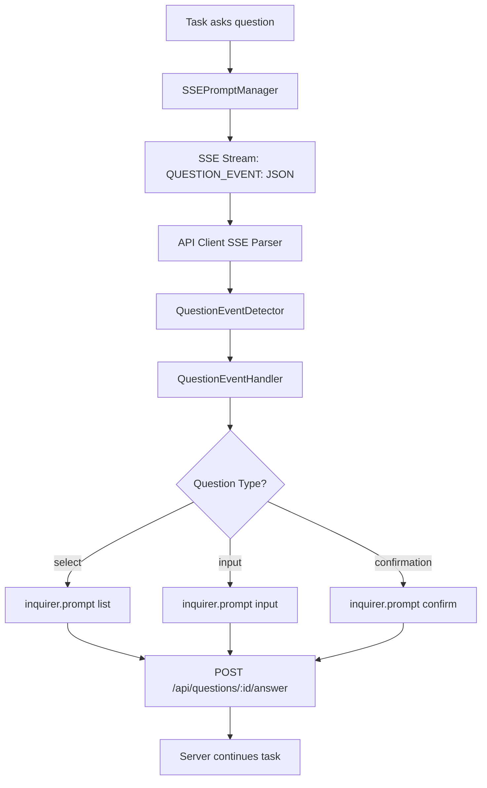

# API Client Question Handling - Complete Architecture Summary

## Executive Summary

The API client currently hangs when the server asks questions because it lacks client-side question event handling. The server-side infrastructure is working perfectly, but the client SSE stream processor ignores question events sent as "QUESTION_EVENT:" log messages.

**Root Cause:** Missing client-side detection and handling of "QUESTION_EVENT:" prefixed SSE messages.

**Solution:** Implement complete question handling pipeline with interactive prompts using inquirer.js patterns from existing CLI implementation.

## Current State Analysis

### ✅ Server-Side (Working Perfectly)

- **SSEPromptManager** sends questions via log messages: `QUESTION_EVENT: {"type":"question","questionId":"...","questionType":"select",...}`
- **ApiQuestionManager** manages question lifecycle and waits for responses
- **POST /api/questions/:questionId/answer** endpoint processes client answers
- **Task execution blocks** properly until client responds

### ❌ Client-Side (Missing Implementation)

- **SSE stream parser** ignores "QUESTION_EVENT:" prefixed messages
- **No interactive prompt presentation**
- **No answer submission** to API endpoint
- **Client hangs** indefinitely when questions are asked

## Technical Architecture

### System Flow



### Component Architecture

**1. QuestionEventDetector** (AC-001)

- Detects "QUESTION_EVENT:" prefix in SSE log messages
- Parses JSON payload after prefix
- Routes to QuestionEventHandler

**2. QuestionEventHandler** (AC-002)

- Manages question processing state
- Queues concurrent questions
- Coordinates answer submission
- Integrates with StreamProcessor

**3. Question Presentation Layer** (AC-003, AC-004, AC-005)

- **SelectQuestionPresenter**: inquirer.js list prompts with arrow navigation
- **InputQuestionPresenter**: Text input with validation and placeholders
- **ConfirmationQuestionPresenter**: Yes/No prompts with smart defaults

**4. Answer Submission System** (AC-006)

- HTTP POST to `/api/questions/:questionId/answer`
- Retry logic with exponential backoff
- Error handling and validation

**5. Error Handling & Resilience** (AC-007)

- Malformed question data validation
- Network failure recovery
- User cancellation handling
- Memory management and cleanup

## Implementation Roadmap

### Phase 1: Core Detection (AC-001)

**Files:** `src/tools/api-client.ts`

- Modify SSE event processing to detect "QUESTION_EVENT:" prefix
- Extract and parse JSON payload
- Route to question handler

### Phase 2: Handler Infrastructure (AC-002)

**Files:** `src/tools/QuestionEventHandler.ts`, `src/tools/types/api-client-types.ts`

- Create QuestionEventHandler class with state management
- Define TypeScript interfaces for question data
- Integrate with existing StreamProcessor

### Phase 3: Interactive Prompts (AC-003, AC-004, AC-005)

**Files:** `src/tools/QuestionEventHandler.ts`

- Implement select questions with inquirer.js list prompts
- Implement input questions with validation
- Implement confirmation questions with smart defaults
- Handle custom answers and special input types

### Phase 4: Answer Submission (AC-006)

**Files:** `src/tools/QuestionEventHandler.ts`

- HTTP POST implementation with proper headers
- Retry logic for network failures
- Response validation and error handling

### Phase 5: Error Handling (AC-007)

**Files:** `src/tools/QuestionEventHandler.ts`, `src/tools/api-client.ts`

- Comprehensive error handling for all edge cases
- User cancellation and timeout handling
- Memory management and resource cleanup

### Phase 6: Testing & Validation (AC-008)

**Files:** `src/tools/__tests__/question-flow-e2e.test.ts`

- End-to-end testing with real server
- Performance and stress testing
- Manual testing scenarios

## Key Technical Decisions

### 1. Question Event Format

**Decision:** Parse "QUESTION_EVENT:" prefixed log messages rather than modifying SSE event structure
**Rationale:** Maintains backward compatibility and leverages existing SSEPromptManager implementation

### 2. Question Presentation Library

**Decision:** Use inquirer.js for interactive prompts
**Rationale:** Already available in CLI implementation, proven UX patterns, comprehensive validation

### 3. Answer Submission Approach

**Decision:** Direct HTTP POST to existing `/api/questions/:questionId/answer` endpoint
**Rationale:** Leverages existing server infrastructure, simple and reliable

### 4. State Management

**Decision:** Centralized state in QuestionEventHandler with queue support
**Rationale:** Handles concurrent questions, maintains clean separation of concerns

### 5. Integration Pattern

**Decision:** Extend existing StreamProcessor rather than creating parallel system
**Rationale:** Maintains stream processing coordination, reuses pause/resume logic

## Expected User Experience

### Before Fix (Current)

```
User: Use ask_followup_question to ask me what color I prefer

Server: I'll ask you about your color preference.
QUESTION_EVENT sent via SSE ✅

Client: QUESTION_EVENT: {"type":"question","questionId":"q_job_md1s606p_543f603f_1752417562918_1","questionType":"select","question":"What color do you prefer?","choices":["Blue","Green","Red","Purple","(Custom answer)"],"timestamp":"2025-07-13T14:39:22.918Z"}

Client hangs indefinitely ❌
```

### After Fix (Target)

```
User: Use ask_followup_question to ask me what color I prefer

Server: I'll ask you about your color preference.
QUESTION_EVENT sent via SSE ✅

Client: ? What color do you prefer? (Use arrow keys)
❯ Blue
  Green
  Red
  Purple
  (Custom answer)

User selects: Blue

Client: ✅ Answer submitted successfully
Server: You selected Blue! ✅
Task execution continues...
```

## Dependencies & Requirements

### External Dependencies

- **inquirer.js** - Already available from CLI implementation
- **Node.js http/https** - For answer submission
- **Existing SSE infrastructure** - For event detection

### Internal Dependencies

- Current StreamProcessor architecture
- Existing API question endpoint infrastructure
- SSEPromptManager and ApiQuestionManager (server-side)

## Testing Strategy

### Unit Tests

- Question data validation
- Answer submission with mocked endpoints
- Error handling scenarios
- State management and queuing

### Integration Tests

- Full question flow with test server
- Network failure scenarios
- Multiple question sequences

### End-to-End Tests

- Real server integration
- Manual testing scenarios
- Performance validation

### Success Criteria

- All question types work end-to-end
- Stream processing resumes after questions
- Error scenarios handled gracefully
- User experience matches CLI quality

## Estimated Implementation Effort

| Story  | Description                           | Points | Dependencies       |
| ------ | ------------------------------------- | ------ | ------------------ |
| AC-001 | SSE Question Event Detection          | 2      | None               |
| AC-002 | Question Event Handler Infrastructure | 3      | AC-001             |
| AC-003 | Interactive Select Questions          | 2      | AC-002             |
| AC-004 | Interactive Input Questions           | 2      | AC-002             |
| AC-005 | Interactive Confirmation Questions    | 2      | AC-002             |
| AC-006 | Answer Submission System              | 3      | AC-002, AC-003-005 |
| AC-007 | Error Handling & Edge Cases           | 3      | All previous       |
| AC-008 | End-to-End Testing                    | 5      | All previous       |

**Total:** 22 Story Points (~3-4 weeks for 1 developer)

## Risk Mitigation

### Technical Risks

- **SSE parsing complexity**: Mitigated by incremental implementation and testing
- **inquirer.js compatibility**: Low risk, already proven in CLI
- **Network reliability**: Addressed by comprehensive retry logic

### Implementation Risks

- **Scope creep**: Clear acceptance criteria and story boundaries
- **Integration complexity**: Phased approach with early integration testing
- **User experience regression**: Extensive manual testing scenarios

## Conclusion

This architecture provides a complete solution for API client question handling that:

1. **Leverages existing server infrastructure** - No server-side changes needed
2. **Maintains consistency with CLI** - Same inquirer.js patterns and UX
3. **Handles edge cases robustly** - Comprehensive error handling and recovery
4. **Scales to complex scenarios** - Queue management and concurrent question support
5. **Provides excellent user experience** - Interactive prompts with clear feedback

The implementation is well-scoped with clear dependencies and success criteria. The phased approach allows for incremental development and testing while minimizing risk.
