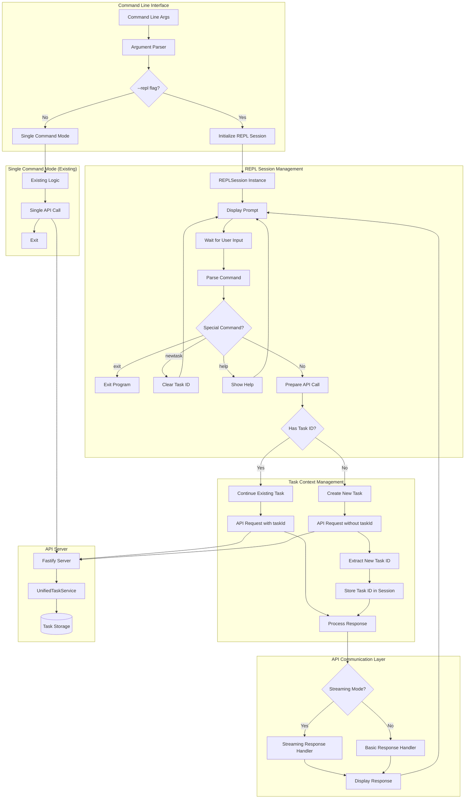
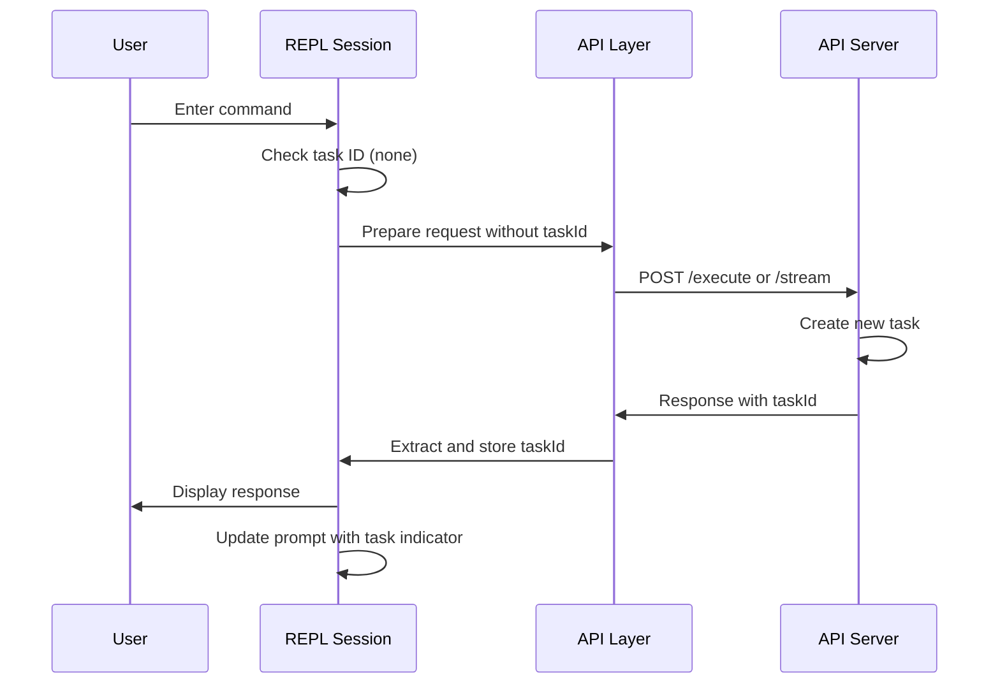
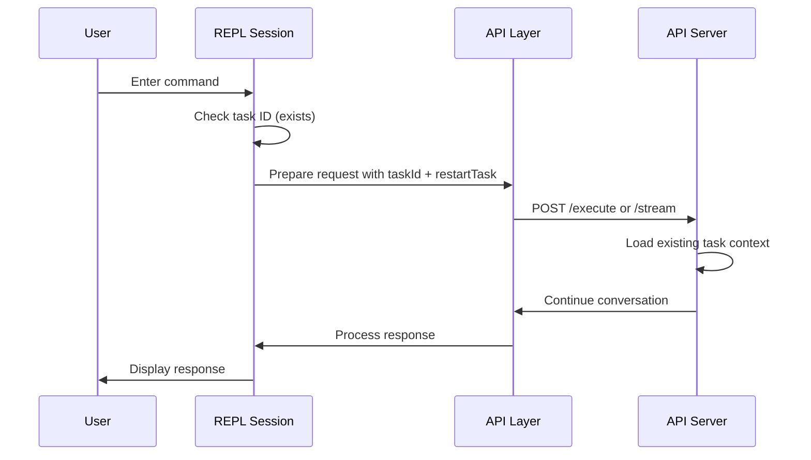

# API Client REPL Architecture

## System Overview

The REPL implementation extends the existing api-client.js with interactive capabilities while preserving all current functionality. The architecture follows a session-based approach where task context is maintained across multiple user interactions.

## Architecture Diagram



## Component Responsibilities

### REPLSession Class

- **Purpose**: Manages interactive session state and user interactions
- **Responsibilities**:
    - Maintain task ID across commands
    - Handle user input and command parsing
    - Manage readline interface
    - Coordinate with API communication layer
    - Provide user feedback and prompts

### Command Parser

- **Purpose**: Distinguish between special REPL commands and API tasks
- **Responsibilities**:
    - Parse user input
    - Route special commands (exit, newtask, help)
    - Pass regular commands to API layer

### Task Context Manager

- **Purpose**: Maintain conversation continuity across REPL commands
- **Responsibilities**:
    - Store and retrieve task ID
    - Determine when to create new vs continue existing tasks
    - Extract task ID from API responses

### API Communication Layer

- **Purpose**: Handle communication with the API server
- **Responsibilities**:
    - Prepare API requests with appropriate task context
    - Handle both streaming and basic response modes
    - Extract task information from responses
    - Display formatted responses to user

## Data Flow

### New Task Creation Flow



### Task Continuation Flow



## State Management

### Session State

```javascript
{
    taskId: string | null,           // Current task identifier
    mode: string,                    // Agent mode (code, debug, etc.)
    host: string,                    // API server host
    port: number,                    // API server port
    useStream: boolean,              // Streaming vs basic mode
    // ... other configuration options
}
```

### Task Context State (Server-side)

```javascript
{
    historyItem: HistoryItem,        // Task metadata
    apiConversationHistory: ApiMessage[], // API conversation
    uiMessages: ClineMessage[],      // UI messages
    taskDir: string,                 // Storage directory
    originContext: "api",            // Context identifier
    mode: string,                    // Agent mode
    workspace?: string               // Workspace path if applicable
}
```

## Integration Points

### Backward Compatibility

- All existing command-line flags work in REPL mode
- Single command mode remains unchanged
- No breaking changes to existing API contracts

### Shared Components

- Reuse existing API request logic
- Leverage current streaming infrastructure
- Maintain existing error handling patterns
- Use established logging and debugging systems

### Extension Points

- Command history support
- Tab completion for commands
- Custom prompt formatting
- Plugin system for additional commands

## Error Handling Strategy

### REPL-Specific Errors

- Invalid commands: Show help and continue
- API connection errors: Display error and continue session
- Task loading errors: Clear task ID and continue
- Unexpected errors: Log and continue session

### Graceful Degradation

- If task context is lost, continue with new task creation
- If API is unavailable, provide clear feedback but keep REPL active
- Handle network interruptions gracefully

## Security Considerations

### Input Validation

- Sanitize user input before sending to API
- Validate task ID format
- Prevent command injection

### Session Security

- Task IDs are UUIDs (non-guessable)
- No sensitive data stored in REPL session
- Leverage existing API authentication mechanisms

## Performance Considerations

### Memory Management

- Limit command history size
- Clean up readline resources on exit
- Avoid memory leaks in long-running sessions

### Response Handling

- Stream large responses to avoid blocking
- Implement timeout handling for API calls
- Provide progress indicators for long operations

## Testing Strategy

### Unit Testing

- REPLSession class methods
- Command parsing logic
- Task ID management
- Error handling scenarios

### Integration Testing

- End-to-end REPL workflows
- API communication in REPL mode
- Task continuation across commands
- Error recovery scenarios

### User Acceptance Testing

- Interactive session usability
- Command discoverability
- Error message clarity
- Performance under normal usage
