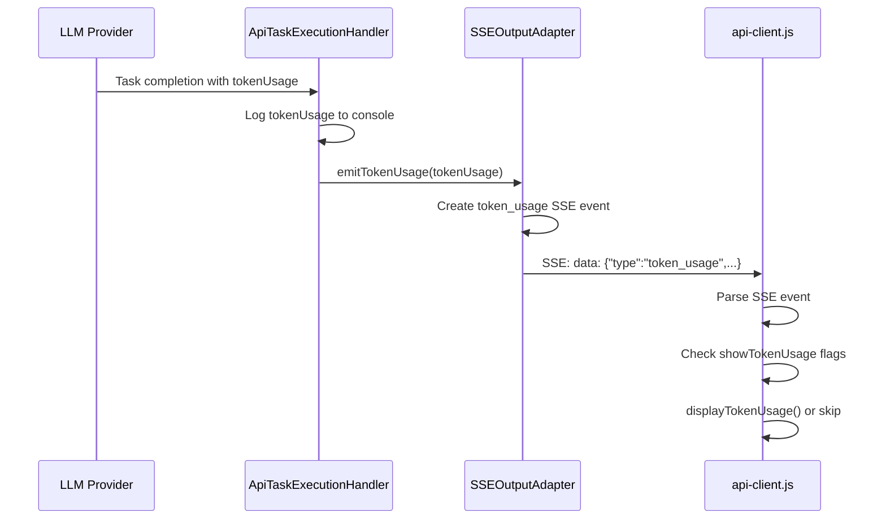

# API Client Token Usage and Timing Architecture

## Overview

This document outlines the technical architecture for enhancing api-client.js with comprehensive token usage debugging and execution timing functionality.

## Current State Analysis

### Token Usage Flow Investigation



### Current Implementation Status

**Server Side (✅ Implemented)**:

- `ApiTaskExecutionHandler.ts:47` calls `sseAdapter.emitTokenUsage(tokenUsage)`
- `SSEOutputAdapter.ts:531` implements `emitTokenUsage()` method
- Token usage events are properly formatted and emitted

**Client Side (⚠️ Partially Implemented)**:

- `api-client.js:417` handles `token_usage` events
- `api-client.js:1274` implements `displayTokenUsage()` function
- Flags `--show-token-usage` and `--hide-token-usage` exist

**Gap Analysis**:

- ❌ No debug logging to verify event reception
- ❌ No execution timing functionality
- ❌ No final execution time display

## Technical Architecture

### 1. Token Usage Debug Enhancement

#### Debug Logging Strategy

```javascript
// Enhanced event processing with debug logging
case "token_usage":
    // Always log reception for debugging
    if (verbose) {
        console.log(`[DEBUG-TOKEN-USAGE] 📊 Received token usage event at ${timestamp}:`)
        console.log(`[DEBUG-TOKEN-USAGE] Raw event:`, JSON.stringify(event, null, 2))
        console.log(`[DEBUG-TOKEN-USAGE] Display flags: showTokenUsage=${showTokenUsage}, hideTokenUsage=${hideTokenUsage}`)
    }

    if (showTokenUsage && !hideTokenUsage) {
        displayTokenUsage(event.tokenUsage, event.timestamp)
        if (verbose) {
            console.log(`[DEBUG-TOKEN-USAGE] ✅ Token usage displayed`)
        }
    } else {
        if (verbose) {
            console.log(`[DEBUG-TOKEN-USAGE] ⏭️ Token usage display skipped`)
        }
    }
    break
```

#### Enhanced displayTokenUsage Function

```javascript
function displayTokenUsage(tokenUsage, timestamp) {
	if (!tokenUsage) {
		if (verbose) {
			console.log(`[DEBUG-TOKEN-USAGE] ⚠️ No token usage data provided`)
		}
		return
	}

	const time = timestamp ? `[${timestamp}] ` : ""
	console.log(`💰 ${time}Token Usage:`)

	// Always show input/output tokens
	if (tokenUsage.totalTokensIn !== undefined) {
		console.log(`   Input: ${tokenUsage.totalTokensIn.toLocaleString()} tokens`)
	}
	if (tokenUsage.totalTokensOut !== undefined) {
		console.log(`   Output: ${tokenUsage.totalTokensOut.toLocaleString()} tokens`)
	}

	// Show cost if available
	if (tokenUsage.totalCost !== undefined && tokenUsage.totalCost > 0) {
		console.log(`   Cost: $${tokenUsage.totalCost.toFixed(4)}`)
	}

	// Show context tokens if available
	if (tokenUsage.contextTokens !== undefined && tokenUsage.contextTokens > 0) {
		console.log(`   Context: ${tokenUsage.contextTokens.toLocaleString()} tokens`)
	}

	// Show cache statistics if available
	if (tokenUsage.totalCacheReads !== undefined || tokenUsage.totalCacheWrites !== undefined) {
		const reads = tokenUsage.totalCacheReads || 0
		const writes = tokenUsage.totalCacheWrites || 0
		console.log(`   Cache: ${reads.toLocaleString()} reads, ${writes.toLocaleString()} writes`)
	}

	if (verbose) {
		console.log(`[DEBUG-TOKEN-USAGE] ✅ Token usage display completed`)
	}
}
```

### 2. Execution Timing Architecture

#### ExecutionTimer Class

```javascript
class ExecutionTimer {
	constructor(showTiming = false, verbose = false) {
		this.showTiming = showTiming
		this.verbose = verbose
		this.startTime = Date.now()
		this.operations = []
		this.lastOperationTime = this.startTime
	}

	/**
	 * Log an operation with timing information
	 * @param {string} operation - Operation name
	 * @param {string} details - Optional operation details
	 * @param {boolean} forceShow - Force show even if showTiming is false
	 */
	logOperation(operation, details = "", forceShow = false) {
		const now = Date.now()
		const operationDuration = now - this.lastOperationTime
		const totalDuration = now - this.startTime

		const operationRecord = {
			operation,
			details,
			duration: operationDuration,
			totalTime: totalDuration,
			timestamp: new Date(now).toISOString(),
		}

		this.operations.push(operationRecord)

		// Show timing if enabled or forced
		if (this.showTiming || forceShow) {
			const totalFormatted = this.formatDuration(totalDuration)
			const opFormatted =
				operationDuration < 1000 ? `${operationDuration}ms` : this.formatDuration(operationDuration)
			console.log(`⏱️  [${totalFormatted}] ${operation}${details ? ": " + details : ""} (+${opFormatted})`)
		}

		// Verbose logging always captures timing data
		if (this.verbose && !this.showTiming) {
			console.log(`[DEBUG-TIMING] ${operation}: ${operationDuration}ms (total: ${totalDuration}ms)`)
		}

		this.lastOperationTime = now
	}

	/**
	 * Format duration in min:sec:millis format
	 * @param {number} ms - Duration in milliseconds
	 * @returns {string} Formatted duration
	 */
	formatDuration(ms) {
		const minutes = Math.floor(ms / 60000)
		const seconds = Math.floor((ms % 60000) / 1000)
		const millis = ms % 1000
		return `${minutes}:${seconds.toString().padStart(2, "0")}:${millis.toString().padStart(3, "0")}`
	}

	/**
	 * Get final execution summary (always shown)
	 * @returns {string} Final timing summary
	 */
	getFinalSummary() {
		const totalDuration = Date.now() - this.startTime
		return `task completed in ${this.formatDuration(totalDuration)}`
	}

	/**
	 * Get timing statistics for analysis
	 * @returns {object} Timing statistics
	 */
	getStatistics() {
		const totalDuration = Date.now() - this.startTime
		return {
			totalDuration,
			operationCount: this.operations.length,
			operations: this.operations,
			averageOperationTime:
				this.operations.length > 0
					? this.operations.reduce((sum, op) => sum + op.duration, 0) / this.operations.length
					: 0,
		}
	}
}
```

#### Integration Points

**Command Line Argument Processing**:

```javascript
// Add timing flag
let showTiming = false

// In argument parsing loop
else if (arg === "--show-timing") {
    showTiming = true
}

// Initialize timer
const executionTimer = new ExecutionTimer(showTiming, verbose)
```

**Streaming Endpoint Integration**:

```javascript
function testStreamingEndpoint() {
    return new Promise((resolve, reject) => {
        const executionTimer = new ExecutionTimer(showTiming, verbose)

        // Log initial connection
        executionTimer.logOperation('API connection initiated', `${baseUrl}/execute/stream`)

        const req = http.request(options, (res) => {
            executionTimer.logOperation('Connection established', `Status: ${res.statusCode}`)

            let firstDataReceived = false
            let firstEventProcessed = false

            res.on("data", (chunk) => {
                if (!firstDataReceived) {
                    executionTimer.logOperation('First data received')
                    firstDataReceived = true
                }

                // Process SSE events with timing
                const lines = buffer.split("\n")
                for (const line of lines) {
                    if (line.startsWith("data: ")) {
                        try {
                            const data = JSON.parse(line.slice(6))

                            if (!firstEventProcessed) {
                                executionTimer.logOperation('First event processed', data.type)
                                firstEventProcessed = true
                            }

                            // Log specific event types
                            switch (data.type) {
                                case "start":
                                    executionTimer.logOperation('Task started', data.message)
                                    break
                                case "tool_use":
                                    executionTimer.logOperation('Tool execution', data.toolName || 'unknown')
                                    break
                                case "token_usage":
                                    executionTimer.logOperation('Token usage received')
                                    break
                                case "complete":
                                case "completion":
                                    executionTimer.logOperation('Task completed')
                                    break
                                case "stream_end":
                                    executionTimer.logOperation('Stream ended')
                                    break
                            }

                            // Process event through existing logic
                            await streamProcessor.processEvent(data, timestamp, contentFilter)

                        } catch (e) {
                            // Handle parsing errors
                        }
                    }
                }
            })

            res.on("end", () => {
                // Always show final timing
                console.log(`✅ ${executionTimer.getFinalSummary()}`)

                if (verbose) {
                    const stats = executionTimer.getStatistics()
                    console.log(`[DEBUG-TIMING] Statistics:`, {
                        totalOperations: stats.operationCount,
                        averageOperationTime: `${stats.averageOperationTime.toFixed(2)}ms`,
                        totalDuration: `${stats.totalDuration}ms`
                    })
                }

                resolve()
            })
        })
    })
}
```

### 3. Help Documentation Enhancement

```javascript
if (showHelp) {
	console.log(`
🧪 Roo Code Agent API Test Client

Usage: node api-client.js [options] "Your task here"

Options:
  --mode           Agent mode (default: code)
  --stream         Test SSE streaming endpoint (default: false)
  --verbose        Show full JSON payload and debug information (default: false)
  --show-timing    Show detailed execution timing for operations (default: false)
  --show-thinking  Show thinking sections in LLM output (default: false)
  --show-tools     Show tool call content (default: false)
  --show-system    Show system content (default: false)
  --show-response  Show final response content (default: false)
  --show-completion Show attempt_completion tags (default: false)
  --show-mcp-use   Show use_mcp_tool sections (default: false)
  --show-token-usage Show token usage information (default: true)
  --hide-token-usage Hide token usage information
  --host           API host (default: localhost)
  --port           API port (default: 3000)
  --help           Show this help

Timing Display:
  Default mode shows only final execution time in format: "task completed in min:sec:millis"
  Use --show-timing to see detailed operation timing during execution.
  Use --verbose to see debug timing information even without --show-timing.

Token Usage Display:
  Token usage is shown by default when available.
  Use --hide-token-usage to suppress token usage display.
  Use --verbose to see debug information about token usage events.

Examples:
  # Basic usage with final timing
  node api-client.js --stream "test task"
  
  # Detailed timing display
  node api-client.js --stream --show-timing "test task"
  
  # Debug token usage issues
  node api-client.js --stream --verbose "test task"
  
  # Hide token usage but show timing
  node api-client.js --stream --hide-token-usage --show-timing "test task"
  
  # Full debug mode
  node api-client.js --stream --verbose --show-timing "test task"
`)
}
```

## Error Handling and Edge Cases

### Token Usage Error Scenarios

1. **No Token Usage Event Received**: Debug logs will show no token_usage events
2. **Malformed Token Usage Data**: Enhanced displayTokenUsage handles undefined/null gracefully
3. **Display Flags Conflict**: Clear precedence: hideTokenUsage overrides showTokenUsage

### Timing Error Scenarios

1. **Timer Initialization Failure**: Graceful fallback to basic timing
2. **Operation Logging Errors**: Don't interrupt main execution flow
3. **Duration Calculation Edge Cases**: Handle negative durations and overflow

### Connection Error Scenarios

1. **Stream Interruption**: Final timing still displays based on last known state
2. **Timeout Scenarios**: Timer continues running until connection closes
3. **Parsing Errors**: Timing continues even if event parsing fails

## Performance Considerations

### Memory Usage

- ExecutionTimer stores operation history: ~100 bytes per operation
- Typical task: 10-50 operations = 1-5KB memory overhead
- Acceptable for debugging/monitoring purposes

### CPU Overhead

- Date.now() calls: ~1μs per operation
- String formatting: ~10μs per timing display
- Total overhead: <1ms per task execution

### Network Impact

- No additional network requests
- Debug logging only affects local console output
- No impact on SSE stream performance

## Testing Strategy

### Unit Tests

```javascript
describe("ExecutionTimer", () => {
	test("should format duration correctly", () => {
		const timer = new ExecutionTimer()
		expect(timer.formatDuration(1234)).toBe("0:01:234")
		expect(timer.formatDuration(61234)).toBe("1:01:234")
	})

	test("should track operations correctly", () => {
		const timer = new ExecutionTimer()
		timer.logOperation("test", "details")
		const stats = timer.getStatistics()
		expect(stats.operationCount).toBe(1)
		expect(stats.operations[0].operation).toBe("test")
	})
})

describe("Token Usage Debug", () => {
	test("should log debug information when verbose", () => {
		// Mock console.log and test debug output
	})
})
```

### Integration Tests

```bash
# Test token usage debugging
./test-token-usage-debug.sh

# Test timing functionality
./test-timing-functionality.sh

# Test combined features
./test-combined-features.sh
```

### Manual Testing Scenarios

```bash
# Scenario 1: Verify token usage events are received
node api-client.js --stream --verbose "simple task"
# Expected: Debug logs show token_usage events received and processed

# Scenario 2: Test timing accuracy
time node api-client.js --stream --show-timing "simple task"
# Expected: Internal timing matches external time measurement

# Scenario 3: Test final timing display
node api-client.js --stream "simple task"
# Expected: Final "task completed in min:sec:millis" always shows

# Scenario 4: Test flag combinations
node api-client.js --stream --hide-token-usage --show-timing "simple task"
# Expected: No token usage, detailed timing, final timing
```

## Success Metrics

### Token Usage Debugging

- ✅ Debug logs clearly show whether token usage events are received
- ✅ Debug logs show token usage display decision logic
- ✅ Token usage displays correctly when events are present
- ✅ Clear error messages when token usage data is malformed

### Execution Timing

- ✅ --show-timing flag controls detailed timing display
- ✅ Final execution time always displays in correct format
- ✅ Timing accuracy within 5% of external measurements
- ✅ No performance degradation in normal operation

### User Experience

- ✅ Clear help documentation for all new flags
- ✅ Consistent behavior across all execution modes
- ✅ Graceful error handling doesn't interrupt main functionality
- ✅ Debug information is helpful for troubleshooting

## Future Enhancements

1. **Timing Export**: Save timing data to JSON files for analysis
2. **Performance Alerts**: Warn when operations exceed thresholds
3. **Token Usage Trends**: Track usage patterns across sessions
4. **Interactive Timing**: Real-time timing display during execution
5. **Timing Visualization**: Generate timing charts and graphs
