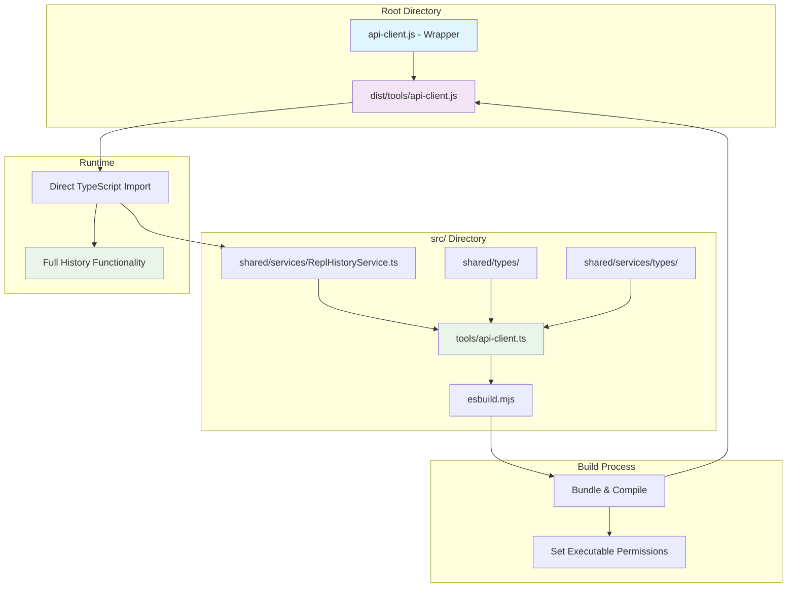

# API Client TypeScript Conversion - Technical Implementation

## Overview

This document outlines the technical implementation plan for converting `api-client.js` to TypeScript and integrating it into the existing build system to fix the ReplHistoryService issue.

## Problem Statement

The current `api-client.js` fails to load the ReplHistoryService because:

1. **Root Cause**: `api-client.js` runs from the root directory but tries to import TypeScript modules using `ts-node/register`
2. **Dependency Issue**: `ts-node` is only available as a dev dependency in `src/package.json`, not in the root `package.json`
3. **Import Failure**: The TypeScript import fails, causing history features to be disabled
4. **User Impact**: REPL mode shows "ReplHistoryService not available - history features disabled"

## Solution Architecture

### High-Level Approach

Convert `api-client.js` to TypeScript and integrate it into the existing esbuild-based build system used for CLI and API components.

### Architecture Diagram



## Implementation Plan

### Phase 1: TypeScript Conversion

#### Story 1: Create TypeScript API Client

- **File**: `src/tools/api-client.ts`
- **Scope**: Convert existing JavaScript to TypeScript
- **Key Changes**:
    - Add proper type definitions for all interfaces
    - Import ReplHistoryService directly without ts-node
    - Add types for command-line arguments and options
    - Implement proper error handling with typed exceptions

#### Story 2: Type Definitions

- **Files**:
    - `src/tools/types/api-client-types.ts`
    - Update existing type files as needed
- **Scope**: Define comprehensive types
- **Key Types**:

    ```typescript
    interface ApiClientOptions {
    	useStream: boolean
    	host: string
    	port: number
    	mode: string
    	verbose: boolean
    	// ... other options
    }

    interface REPLSessionOptions {
    	historyService?: ReplHistoryService
    	taskId?: string
    	verbose: boolean
    }
    ```

### Phase 2: Build System Integration

#### Story 3: Extend esbuild Configuration

- **File**: `src/esbuild.mjs`
- **Scope**: Add api-client build target
- **Configuration**:
    ```javascript
    const apiClientConfig = {
    	...buildOptions,
    	entryPoints: ["tools/api-client.ts"],
    	outfile: "dist/tools/api-client.js",
    	banner: {
    		js: "#!/usr/bin/env node",
    	},
    	alias: {
    		vscode: path.resolve(__dirname, "cli/__mocks__/vscode.js"),
    		"@roo-code/telemetry": path.resolve(__dirname, "cli/__mocks__/@roo-code/telemetry.js"),
    	},
    	external: [
    		// HTTP modules that should remain external
    	],
    	define: {
    		"process.env.VSCODE_CONTEXT": "false",
    	},
    	treeShaking: true,
    	keepNames: true,
    }
    ```

#### Story 4: Build Scripts Update

- **File**: `src/package.json`
- **Scope**: Add build scripts for api-client
- **Scripts**:
    ```json
    {
    	"build:api-client": "node esbuild.mjs --api-client",
    	"watch:api-client": "node esbuild.mjs --api-client --watch"
    }
    ```

### Phase 3: Backward Compatibility

#### Story 5: Wrapper Script

- **File**: `api-client.js` (root directory)
- **Scope**: Create wrapper for backward compatibility
- **Implementation**:

    ```javascript
    #!/usr/bin/env node

    const path = require("path")
    const { spawn } = require("child_process")

    // Check if built version exists
    const builtClient = path.join(__dirname, "dist", "tools", "api-client.js")

    try {
    	require.resolve(builtClient)
    	// Execute built version
    	const child = spawn("node", [builtClient, ...process.argv.slice(2)], {
    		stdio: "inherit",
    	})
    	child.on("exit", (code) => process.exit(code))
    } catch (error) {
    	console.error("Built api-client not found. Please run: cd src && npm run build")
    	process.exit(1)
    }
    ```

### Phase 4: Testing and Validation

#### Story 6: Comprehensive Testing

- **Scope**: Test all functionality
- **Test Cases**:
    - Basic API requests (streaming and non-streaming)
    - All command-line options and flags
    - REPL mode with history functionality
    - Task restart functionality
    - Error handling and edge cases
    - Cross-platform compatibility

#### Story 7: Integration Testing

- **Scope**: Test with existing workflows
- **Areas**:
    - CI/CD pipeline compatibility
    - Development workflow integration
    - Documentation examples
    - User scenarios

## Technical Details

### File Structure

```
/
├── api-client.js (wrapper script)
├── dist/
│   └── tools/
│       └── api-client.js (compiled output)
└── src/
    ├── tools/
    │   ├── api-client.ts (main implementation)
    │   └── types/
    │       └── api-client-types.ts
    ├── shared/services/
    │   └── ReplHistoryService.ts (existing)
    └── esbuild.mjs (updated)
```

### Key Dependencies

- **Build Time**: esbuild, TypeScript compiler
- **Runtime**: Node.js built-ins (http, readline, fs, path)
- **Internal**: ReplHistoryService, shared utilities

### Configuration Changes

#### esbuild.mjs Updates

```javascript
// Add to main() function
const apiClientConfig = {
	...buildOptions,
	entryPoints: ["tools/api-client.ts"],
	outfile: "dist/tools/api-client.js",
	banner: { js: "#!/usr/bin/env node" },
	// ... other config
}

// Add to build contexts
const apiClientCtx = await esbuild.context(apiClientConfig)

// Add to watch/build logic
if (watch) {
	await apiClientCtx.watch()
} else {
	await apiClientCtx.rebuild()

	// Make executable
	const apiClientPath = path.join(distDir, "tools", "api-client.js")
	if (fs.existsSync(apiClientPath)) {
		fs.chmodSync(apiClientPath, 0o755)
	}
}
```

## Benefits

### Immediate Benefits

1. **Fixed History Service**: ReplHistoryService will work correctly
2. **Better Type Safety**: TypeScript provides compile-time error checking
3. **Improved Performance**: Compiled JavaScript runs faster than ts-node
4. **Consistent Build System**: Uses same build process as other tools

### Long-term Benefits

1. **Easier Maintenance**: TypeScript makes refactoring safer
2. **Better Documentation**: Types serve as documentation
3. **Enhanced IDE Support**: Better autocomplete and error detection
4. **Unified Architecture**: All tools use consistent patterns

## Risk Mitigation

### Potential Risks

1. **Build Complexity**: Additional build step required
2. **Dependency Issues**: Build-time vs runtime dependencies
3. **Path Resolution**: Relative paths in built version
4. **Backward Compatibility**: Existing usage patterns

### Mitigation Strategies

1. **Gradual Migration**: Keep wrapper script during transition
2. **Comprehensive Testing**: Test all scenarios thoroughly
3. **Clear Documentation**: Update all usage examples
4. **Fallback Mechanisms**: Graceful error handling

## Success Criteria

### Functional Requirements

- [ ] History service works in REPL mode
- [ ] All existing command-line options work
- [ ] Streaming and non-streaming modes work
- [ ] Task restart functionality works
- [ ] Error handling is improved

### Non-Functional Requirements

- [ ] Build time is reasonable (< 10 seconds)
- [ ] Runtime performance is maintained or improved
- [ ] Memory usage is reasonable
- [ ] Cross-platform compatibility maintained

### Quality Requirements

- [ ] TypeScript compilation passes without errors
- [ ] All tests pass
- [ ] Code coverage maintained
- [ ] Documentation is updated

## Timeline

### Phase 1: TypeScript Conversion (2-3 days)

- Convert JavaScript to TypeScript
- Add type definitions
- Basic functionality testing

### Phase 2: Build Integration (1-2 days)

- Update esbuild configuration
- Add build scripts
- Test build process

### Phase 3: Compatibility & Testing (2-3 days)

- Create wrapper script
- Comprehensive testing
- Documentation updates

### Phase 4: Validation (1 day)

- Final testing
- Performance validation
- User acceptance testing

**Total Estimated Time**: 6-9 days

## Conclusion

This conversion will resolve the ReplHistoryService issue while modernizing the api-client tool and aligning it with the project's TypeScript-first architecture. The approach maintains backward compatibility while providing significant improvements in maintainability and functionality.
