# API Client TypeScript Conversion - Implementation Plan

## Executive Summary

This document outlines a comprehensive implementation plan to fix the ReplHistoryService issue in `api-client.js` by converting it to TypeScript and integrating it into the existing build system.

## Problem Statement

**Current Issue**: The `api-client.js` fails to load ReplHistoryService, showing:

```
ReplHistoryService not available - history features disabled
❌ History service not available
```

**Root Cause**: The api-client.js runs from the root directory but attempts to import TypeScript modules using `ts-node/register`, which is only available as a dev dependency in `src/package.json`.

**Impact**: Users cannot access command history, search previous commands, or benefit from enhanced REPL functionality.

## Solution Overview

Convert `api-client.js` to TypeScript (`src/tools/api-client.ts`) and integrate it into the existing esbuild-based build system, while maintaining backward compatibility through a wrapper script.

### Architecture Decision

```mermaid
graph TB
    subgraph "Current (Broken)"
        A1[api-client.js] --> A2[ts-node/register]
        A2 --> A3[❌ Import Failure]
        A3 --> A4[History Disabled]
    end

    subgraph "New Solution"
        B1[api-client.js wrapper] --> B2[dist/tools/api-client.js]
        B3[src/tools/api-client.ts] --> B4[esbuild]
        B4 --> B2
        B5[ReplHistoryService.ts] --> B3
        B2 --> B6[✅ Full History Support]
    end

    style A3 fill:#ffcccc
    style A4 fill:#ffcccc
    style B6 fill:#ccffcc
    style B2 fill:#ccccff
```



## Implementation Plan

### Phase 1: TypeScript Conversion (2-3 days)

1. **Create Type Definitions** (`src/tools/types/api-client-types.ts`)

    - Comprehensive interfaces for all options and configurations
    - Type-safe command-line argument parsing
    - Proper integration with existing TypeScript ecosystem

2. **Convert Main Implementation** (`src/tools/api-client.ts`)
    - Direct import of ReplHistoryService without ts-node
    - Enhanced error handling with TypeScript's type system
    - Maintain all existing functionality with improved type safety

### Phase 2: Build System Integration (1-2 days)

1. **Extend esbuild Configuration** (`src/esbuild.mjs`)

    - Add api-client build target with proper configuration
    - Bundle all dependencies while keeping Node.js built-ins external
    - Set executable permissions and shebang automatically

2. **Add Build Scripts** (`src/package.json`)
    - `build:api-client` for standalone builds
    - `watch:api-client` for development workflow
    - Integration with existing build pipeline

### Phase 3: Backward Compatibility (1 day)

1. **Create Wrapper Script** (`api-client.js` in root)
    - Automatically detect and use built TypeScript version
    - Provide helpful error messages if build is missing
    - Pass through all arguments and maintain exit codes

### Phase 4: Testing & Validation (2-3 days)

1. **Comprehensive Testing**

    - Unit tests for TypeScript implementation
    - Integration tests for CLI interface
    - REPL mode testing with full history functionality
    - Cross-platform compatibility validation

2. **Performance Validation**
    - Ensure no regression in startup time
    - Validate memory usage is reasonable
    - Optimize bundle size

### Phase 5: Documentation & Migration (1 day)

1. **Update Documentation**
    - Build instructions and requirements
    - Usage examples and troubleshooting guide
    - Developer migration documentation

## Key Benefits

### Immediate Benefits

- **✅ Fixed History Service**: ReplHistoryService works correctly in REPL mode
- **🔒 Type Safety**: Compile-time error checking prevents runtime issues
- **⚡ Better Performance**: Compiled JavaScript runs faster than ts-node interpretation
- **🔧 Consistent Architecture**: Uses same build system as other project tools

### Long-term Benefits

- **🛠️ Easier Maintenance**: TypeScript makes refactoring safer and more predictable
- **📚 Self-Documenting**: Types serve as living documentation
- **🎯 Enhanced IDE Support**: Better autocomplete, error detection, and refactoring
- **🏗️ Unified Build System**: All tools follow consistent patterns and conventions

## Technical Specifications

### File Structure

```
/
├── api-client.js (wrapper script)
├── src/
│   ├── tools/
│   │   ├── api-client.ts (main implementation)
│   │   ├── types/
│   │   │   └── api-client-types.ts (type definitions)
│   │   └── __tests__/
│   │       ├── api-client.test.ts
│   │       └── api-client.integration.test.ts
│   ├── shared/services/
│   │   └── ReplHistoryService.ts (existing)
│   ├── esbuild.mjs (updated)
│   └── package.json (updated scripts)
└── dist/
    └── tools/
        └── api-client.js (compiled output)
```

### Build Configuration

- **Entry Point**: `src/tools/api-client.ts`
- **Output**: `dist/tools/api-client.js` (executable)
- **Bundle Strategy**: Bundle application code, external Node.js built-ins
- **Target**: Node.js 20.19.2, ES2022
- **Source Maps**: Enabled for development builds

### Dependencies

- **Build Time**: esbuild, TypeScript compiler, existing build toolchain
- **Runtime**: Node.js built-ins only (http, readline, fs, path, os)
- **Internal**: ReplHistoryService, shared utilities, type definitions

## Risk Assessment & Mitigation

### Technical Risks

| Risk                       | Impact | Probability | Mitigation                        |
| -------------------------- | ------ | ----------- | --------------------------------- |
| Build complexity           | Medium | Low         | Use existing esbuild system       |
| Performance regression     | High   | Low         | Comprehensive performance testing |
| Backward compatibility     | High   | Low         | Wrapper script approach           |
| Type definition complexity | Medium | Medium      | Incremental implementation        |

### Mitigation Strategies

1. **Gradual Migration**: Keep wrapper script during transition period
2. **Comprehensive Testing**: Test all scenarios before deployment
3. **Fallback Mechanisms**: Graceful error handling if build artifacts missing
4. **Clear Documentation**: Detailed troubleshooting and migration guides

## Success Metrics

### Functional Requirements

- [ ] ReplHistoryService initializes and works correctly in REPL mode
- [ ] All existing command-line options function identically
- [ ] Streaming and non-streaming API modes work without regression
- [ ] Task restart functionality is preserved and enhanced
- [ ] Error handling is improved with better type safety

### Non-Functional Requirements

- [ ] Build process completes in < 10 seconds
- [ ] Startup time remains < 500ms for simple commands
- [ ] Memory usage stays < 100MB for typical operations
- [ ] Bundle size is optimized (< 5MB)
- [ ] Cross-platform compatibility maintained

### Quality Requirements

- [ ] TypeScript compilation passes without errors or warnings
- [ ] All existing tests pass, new tests added for TypeScript features
- [ ] Code follows project TypeScript conventions and style guide
- [ ] Documentation is complete, accurate, and up-to-date
- [ ] No regressions in existing functionality

## Timeline & Resource Allocation

### Estimated Timeline: 7-10 days total

**Week 1:**

- Days 1-3: TypeScript conversion and type definitions
- Days 4-5: Build system integration and testing
- Days 6-7: Backward compatibility and documentation

**Week 2 (if needed):**

- Days 8-10: Additional testing, performance optimization, and polish

### Resource Requirements

- **Primary Developer**: 1 full-time developer with TypeScript and Node.js experience
- **Testing Support**: Access to multiple platforms for compatibility testing
- **Code Review**: Senior developer familiar with project architecture
- **Documentation**: Technical writer for user-facing documentation updates

## Dependencies & Prerequisites

### Technical Dependencies

- Existing esbuild configuration and build system
- TypeScript compiler and toolchain (already available)
- ReplHistoryService implementation (already implemented)
- Node.js runtime environment (v20.19.2)

### Process Dependencies

- Code review and approval process
- Testing infrastructure and CI/CD pipeline
- Documentation review and approval
- User acceptance testing procedures

## Approval Criteria

This plan is ready for implementation when:

1. **Technical Approach Approved**: Architecture and implementation strategy confirmed
2. **Resource Allocation Confirmed**: Developer time and testing resources allocated
3. **Timeline Accepted**: Project timeline fits within development schedule
4. **Risk Assessment Reviewed**: All identified risks have approved mitigation strategies
5. **Success Criteria Agreed**: All stakeholders agree on functional and quality requirements

## Next Steps

1. **Stakeholder Review**: Present this plan to technical leadership for approval
2. **Resource Planning**: Confirm developer availability and testing resources
3. **Implementation Kickoff**: Begin Phase 1 (TypeScript conversion) upon approval
4. **Progress Tracking**: Establish regular check-ins and milestone reviews
5. **Quality Gates**: Define review points for each phase completion

## Implementation Plan Conclusion

This comprehensive implementation plan addresses the ReplHistoryService issue by converting `api-client.js` to TypeScript and integrating it into the existing build system. The proposed solution ensures compatibility with the project's TypeScript-first architecture while resolving the immediate problem of history service unavailability.

Key outcomes include improved maintainability, enhanced developer experience, and restored functionality for users. The backward compatibility approach minimizes disruption, ensuring a smooth transition to the new architecture.

This implementation plan highlights the importance of the proposed changes and their alignment with the project's long-term goals. The structured approach with clear phases, success metrics, and risk mitigation strategies provides a roadmap for successful execution.

**Status**: Implementation plan ready for execution - awaiting approval to proceed with Phase 1 (TypeScript conversion).
