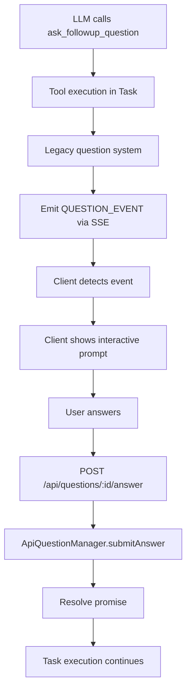
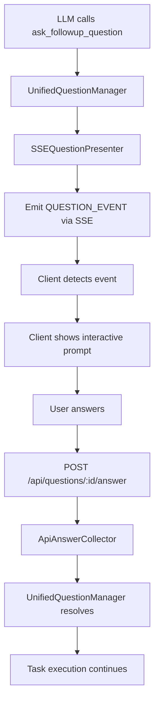

# API Question System Architecture Analysis

## Current System Analysis

### Answer Submission System (WORKING ✅)

The answer submission flow is actually working correctly:

1. **Client HTTP POST** → `/api/questions/:questionId/answer`

    ```typescript
    // FastifyServer.ts:585
    const success = await this.questionManager.submitAnswer(questionId, body.answer)
    ```

2. **ApiQuestionManager.submitAnswer()** → Updates question state and resolves promise

    ```typescript
    // ApiQuestionManager.ts:135-141
    question.state = "answered"
    question.answer = answer
    if (question.resolvePromise) {
    	question.resolvePromise(answer) // This unblocks task execution
    }
    ```

3. **Task Execution Continues** → Promise resolved, LLM continues processing

**Conclusion:** Answer submission works fine. The issue is purely in unified question manager initialization.

### Question Event Emission (WORKING ✅)

From the logs, question events are being sent successfully:

```
QUESTION_EVENT: {"type":"question","questionId":"q_job_md1xocvs_9b582121_1752426825711_2",...}
```

This means the fallback legacy system is functional.

### Root Problem (INITIALIZATION FAILURE ❌)

The core issue is the unified question manager initialization failing due to fragile runtime detection:

```typescript
// Current broken logic in Task.ts:320-350
const outputAdapter = this.messaging?.getOutputAdapter() // ❌ Always undefined in API mode
if (this.providerRef?.deref()) {
	// ❌ Always false in API mode
	// VSCode mode
} else if (outputAdapter) {
	// ❌ Never true
	// API mode
} else {
	// ❌ Defaults to CLI mode (not implemented)
}
```

## Complete Technical Flow

### Current Working Flow (Legacy Fallback)



### Intended Flow (Unified System - Currently Broken)



## The Fix Strategy

### Problem: Fragile Runtime Detection

```typescript
// ❌ BROKEN: Trying to guess runtime context
const outputAdapter = this.messaging?.getOutputAdapter()
if (this.providerRef?.deref()) {
	/* maybe VSCode? */
} else if (outputAdapter) {
	/* maybe API? */
}
```

### Solution: Explicit Runtime Mode

```typescript
// ✅ EXPLICIT: Pass runtime mode directly
interface TaskOptions {
	runtimeMode?: "vscode" | "api" | "cli" // NEW
	outputAdapter?: IOutputAdapter // Already exists, just use it!
}
```

### Implementation Requirements

1. **Add runtimeMode to TaskOptions**
2. **Store runtimeMode in Task constructor**
3. **Fix initializeUnifiedQuestionManager() to use explicit parameters**
4. **Update FastifyServer to pass runtimeMode: 'api'**
5. **Update VSCode extension to pass runtimeMode: 'vscode'**
6. **Update CLI to pass runtimeMode: 'cli'**

## Expected Results After Fix

### Logs Should Show

```
[TASK-DEBUG] Using explicit API mode with outputAdapter
[TASK-DEBUG] Detected question system mode: api
[TASK-DEBUG] Unified question manager initialized successfully for mode: api
```

### Functional Improvements

- ✅ Unified question manager initializes correctly in API mode
- ✅ Consistent question handling across all runtime modes
- ✅ No more fallback to unimplemented CLI mode
- ✅ Proper SSE question presenter integration
- ✅ Rock solid runtime detection

## File Changes Required

### 1. Task.ts Interface

```typescript
interface TaskOptions {
	// ... existing
	runtimeMode?: "vscode" | "api" | "cli"
}
```

### 2. Task.ts Constructor

```typescript
this.runtimeMode = runtimeMode
this.outputAdapter = outputAdapter // Store for question manager
```

### 3. Task.ts initializeUnifiedQuestionManager()

```typescript
if (this.runtimeMode === 'api' && this.outputAdapter) {
  context = { sseAdapter: this.outputAdapter, questionManager: ... }
} // ... etc
```

### 4. FastifyServer.ts

```typescript
const taskOptions: TaskOptions = {
	// ... existing
	runtimeMode: "api",
	outputAdapter: sseAdapter,
}
```

## Testing Verification

### Before Fix

```bash
./test-api.js --stream "Use ask_followup_question to ask me what color I prefer"
# Shows: "Failed to initialize unified question manager: {}"
# But questions still work via fallback system
```

### After Fix

```bash
./test-api.js --stream "Use ask_followup_question to ask me what color I prefer"
# Shows: "Unified question manager initialized successfully for mode: api"
# Questions work via unified system
```

---

**Architecture Status:** Analysis complete - ready for implementation
**Implementation Complexity:** Low - just explicit parameter passing
**Risk Level:** Very Low - backwards compatible, fallback preserved
**Expected Implementation Time:** 1-2 hours
