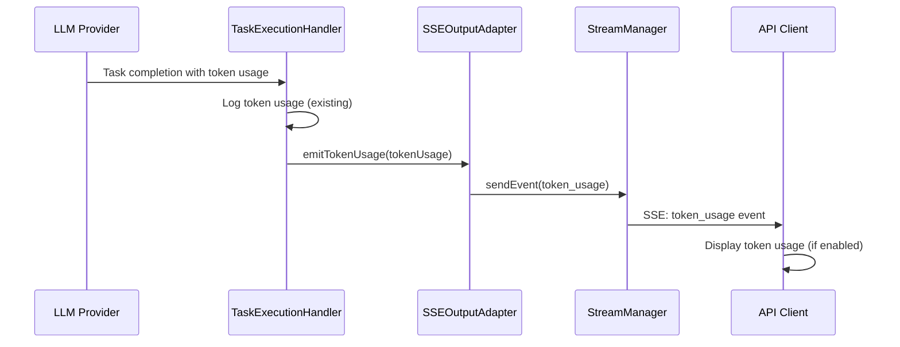

# API Token Usage Exposure Architecture

## Overview

Currently, token usage information is logged server-side in `ApiTaskExecutionHandler` but not exposed to API clients through the SSE stream. This document outlines the architecture for exposing token usage information to clients with configurable display options.

## Current State Analysis

### Server-Side Token Usage Logging

- **Location**: `src/core/task/execution/ApiTaskExecutionHandler.ts:40`
- **Data Available**:
    ```javascript
    {
      totalTokensIn: 8,
      totalTokensOut: 300,
      totalCacheWrites: 22738,
      totalCacheReads: 22397,
      totalCost: 0.0965106,
      contextTokens: 22857
    }
    ```
- **Current Behavior**: Only logged to console, not sent to clients

### Client-Side Limitations

- **SSE Event Types**: No `token_usage` event type defined in `src/api/streaming/types.ts`
- **Client Handling**: `api-client.js` has no token usage display logic
- **User Control**: No flag to show/hide token usage information

## Proposed Architecture

### 1. SSE Event Type Extension

Add new event type for token usage information:

```typescript
// src/api/streaming/types.ts
export interface SSEEvent {
	type:
		| "start"
		| "progress"
		| "tool_use"
		| "completion"
		| "stream_end"
		| "error"
		| "log"
		| "question"
		| "warning"
		| "information"
		| "question_ask"
		| "token_usage" // NEW
	// ... existing fields
	tokenUsage?: {
		totalTokensIn: number
		totalTokensOut: number
		totalCacheWrites?: number
		totalCacheReads?: number
		totalCost?: number
		contextTokens?: number
	}
}

export const SSE_EVENTS = {
	// ... existing events
	TOKEN_USAGE: "token_usage",
} as const
```

### 2. SSE Output Adapter Enhancement

Add method to emit token usage events:

```typescript
// src/api/streaming/SSEOutputAdapter.ts
async emitTokenUsage(tokenUsage: any): Promise<void> {
  const event: SSEEvent = {
    type: SSE_EVENTS.TOKEN_USAGE,
    jobId: this.jobId,
    timestamp: new Date().toISOString(),
    message: `Token usage: ${tokenUsage.totalTokensIn} in, ${tokenUsage.totalTokensOut} out, $${tokenUsage.totalCost?.toFixed(4) || '0.0000'}`,
    tokenUsage: {
      totalTokensIn: tokenUsage.totalTokensIn || 0,
      totalTokensOut: tokenUsage.totalTokensOut || 0,
      totalCacheWrites: tokenUsage.totalCacheWrites,
      totalCacheReads: tokenUsage.totalCacheReads,
      totalCost: tokenUsage.totalCost,
      contextTokens: tokenUsage.contextTokens,
    },
  }

  this.emitEvent(event)
}
```

### 3. Task Execution Handler Integration

Modify `ApiTaskExecutionHandler` to emit token usage:

```typescript
// src/core/task/execution/ApiTaskExecutionHandler.ts
async onTaskCompleted(taskId: string, result: string, tokenUsage?: any, toolUsage?: any): Promise<void> {
  // ... existing completion logic

  // Emit token usage information if available
  if (tokenUsage) {
    await this.sseAdapter.emitTokenUsage(tokenUsage)
  }

  // ... rest of completion logic
}
```

### 4. Client-Side Enhancement

Add token usage display to `api-client.js`:

```javascript
// Command line argument parsing
let showTokenUsage = true  // Default to show
let hideTokenUsage = false

// Argument handling
else if (arg === "--show-token-usage") {
  showTokenUsage = true
} else if (arg === "--hide-token-usage") {
  showTokenUsage = false
  hideTokenUsage = true
}

// SSE event handling
case "token_usage":
  if (showTokenUsage && !hideTokenUsage) {
    const usage = event.tokenUsage
    console.log(`💰 Token Usage:`)
    console.log(`   Input: ${usage.totalTokensIn.toLocaleString()} tokens`)
    console.log(`   Output: ${usage.totalTokensOut.toLocaleString()} tokens`)
    if (usage.totalCost) {
      console.log(`   Cost: $${usage.totalCost.toFixed(4)}`)
    }
    if (usage.contextTokens) {
      console.log(`   Context: ${usage.contextTokens.toLocaleString()} tokens`)
    }
    if (usage.totalCacheReads || usage.totalCacheWrites) {
      console.log(`   Cache: ${usage.totalCacheReads || 0} reads, ${usage.totalCacheWrites || 0} writes`)
    }
  }
  break
```

## Implementation Flow



## Configuration Options

### Server-Side Configuration

- **Environment Variable**: `EXPOSE_TOKEN_USAGE=true` (default: true)
- **Per-request Control**: Via API request headers or parameters

### Client-Side Configuration

- **Default Behavior**: Show token usage by default
- **Hide Option**: `--hide-token-usage` flag
- **Show Option**: `--show-token-usage` flag (explicit enable)

## Data Flow Architecture

### 1. Token Usage Collection

```
LLM Provider → Task Execution → Token Usage Object
```

### 2. Server-Side Processing

```
ApiTaskExecutionHandler → SSEOutputAdapter → StreamManager → HTTP Response
```

### 3. Client-Side Processing

```
SSE Event → Event Handler → Display Logic → Console Output
```

## Error Handling

### Missing Token Usage Data

- **Behavior**: Skip token usage emission if data is undefined/null
- **Fallback**: No error, just no token usage display

### Client Connection Issues

- **Behavior**: Token usage events follow same retry/reconnection logic as other SSE events
- **Graceful Degradation**: Missing token usage doesn't affect core functionality

## Testing Strategy

### Unit Tests

- `SSEOutputAdapter.emitTokenUsage()` method
- Token usage event formatting
- Client-side event handling

### Integration Tests

- End-to-end token usage flow
- Client display with various flag combinations
- Error scenarios (missing data, connection issues)

### Manual Testing

```bash
# Default behavior (show token usage)
./api-client.js --stream "test task"

# Explicitly hide token usage
./api-client.js --stream --hide-token-usage "test task"

# Explicitly show token usage
./api-client.js --stream --show-token-usage "test task"

# Verbose mode with token usage
./api-client.js --stream --verbose "test task"
```

## Performance Considerations

### Server-Side Impact

- **Minimal**: Token usage data already collected, just needs emission
- **Memory**: Small additional SSE event (~200 bytes)
- **CPU**: Negligible formatting overhead

### Client-Side Impact

- **Minimal**: Simple console output formatting
- **Network**: Small additional SSE event per task completion

## Security Considerations

### Data Sensitivity

- **Token Counts**: Generally safe to expose
- **Cost Information**: May be sensitive in some contexts
- **Cache Statistics**: Internal optimization data, consider exposure carefully

### Access Control

- **Default Exposure**: Safe for authenticated API users
- **Optional Filtering**: Server-side configuration to disable if needed

## Migration Strategy

### Phase 1: Server-Side Implementation

1. Add SSE event type and adapter method
2. Integrate with task execution handler
3. Add server-side configuration

### Phase 2: Client-Side Implementation

1. Add command-line flags
2. Implement event handling and display
3. Add help documentation

### Phase 3: Testing and Refinement

1. Comprehensive testing
2. Performance validation
3. User feedback integration

## Future Enhancements

### Advanced Display Options

- **Formatted Tables**: Rich token usage display
- **Historical Tracking**: Session-wide token usage summaries
- **Cost Alerts**: Warnings for high-cost operations

### Analytics Integration

- **Usage Metrics**: Track token usage patterns
- **Cost Optimization**: Identify expensive operations
- **Performance Monitoring**: Token usage vs. response quality

## Success Criteria

- ✅ Token usage information visible to API clients by default
- ✅ Users can hide token usage with `--hide-token-usage` flag
- ✅ Token usage display is clear and informative
- ✅ No performance impact on existing functionality
- ✅ Backward compatibility maintained
- ✅ Comprehensive test coverage
