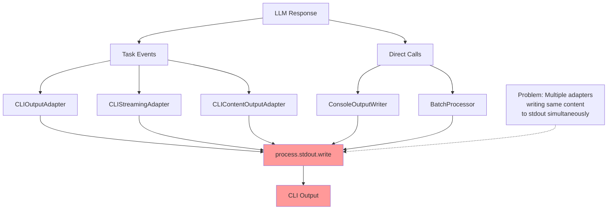
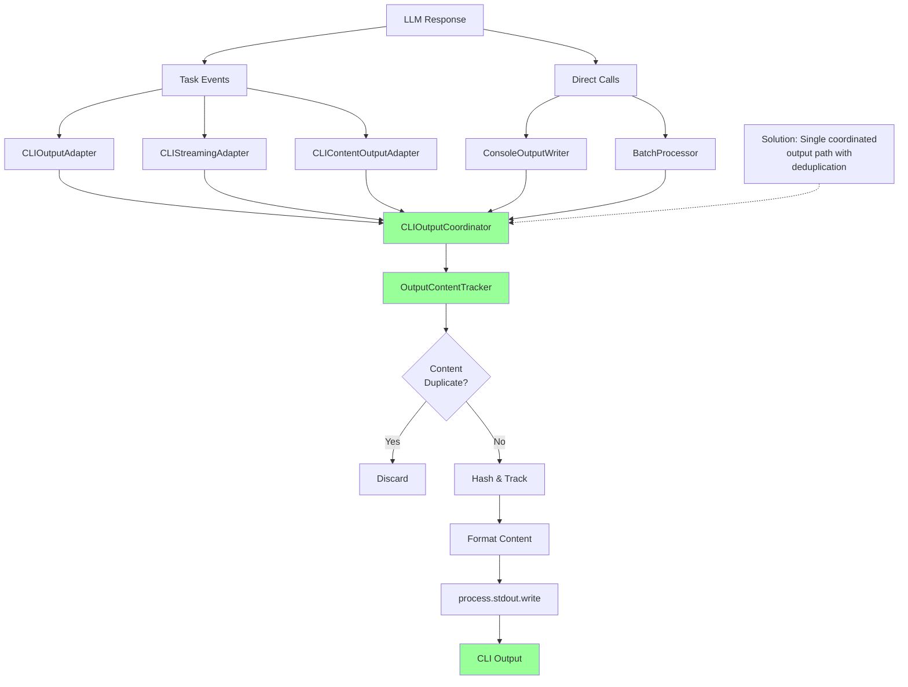
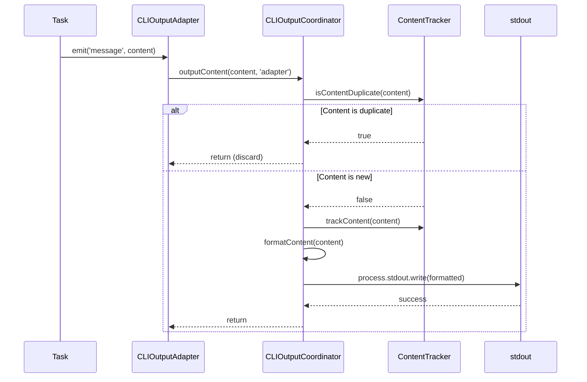
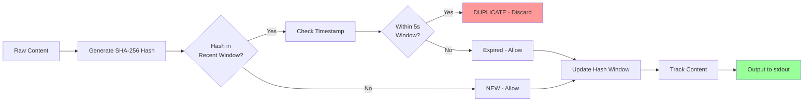
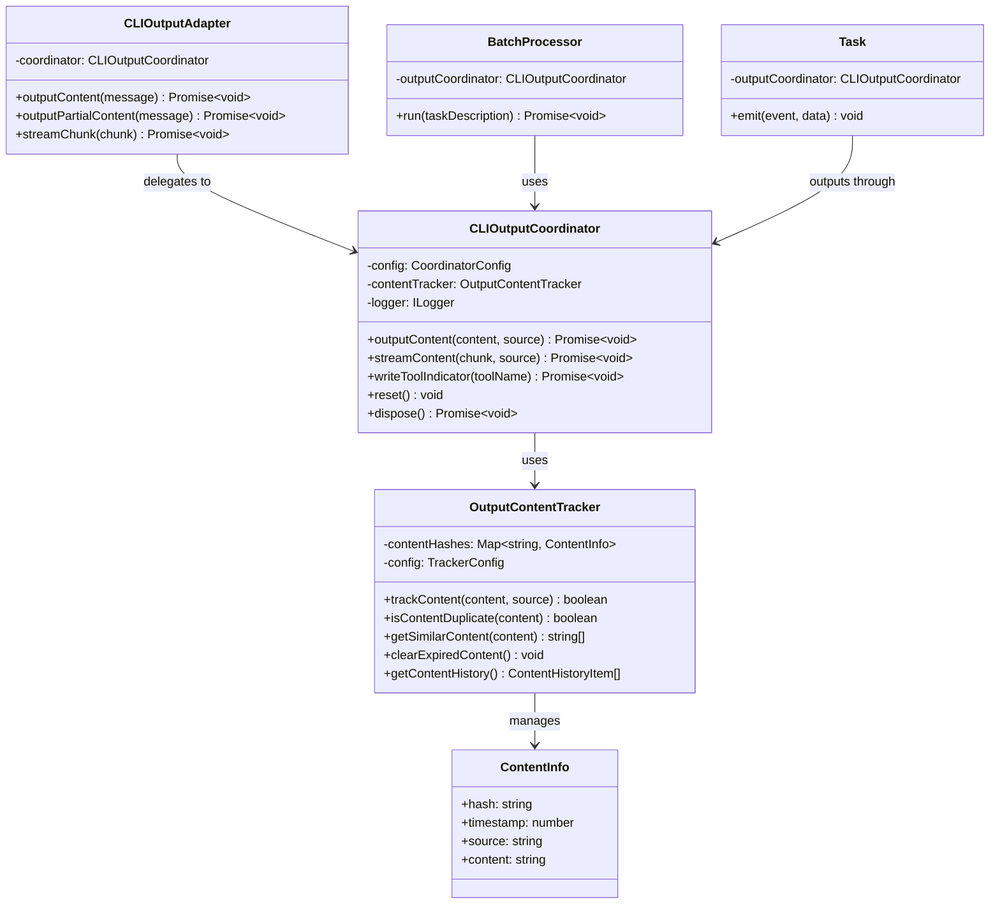
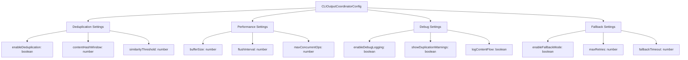
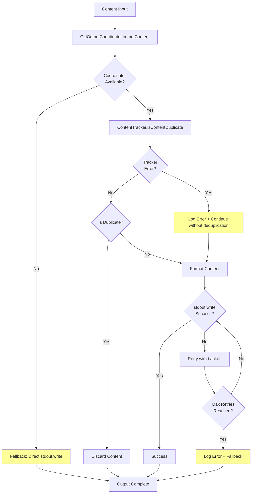
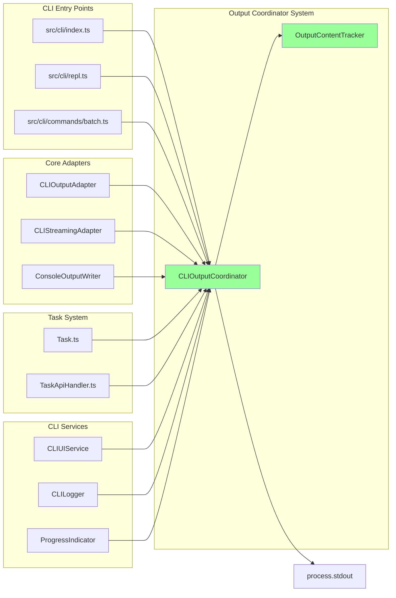
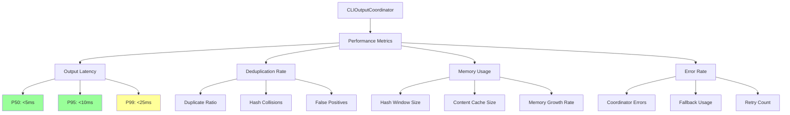

# CLI Output Coordinator Architecture Diagram

## Current Problem Architecture (Before Fix)

## Solution Architecture (After Fix)

## Content Flow Detail

## Deduplication Strategy

## Class Relationship Diagram

## Configuration Structure

## Error Handling Flow

## Integration Points

## Performance Monitoring

