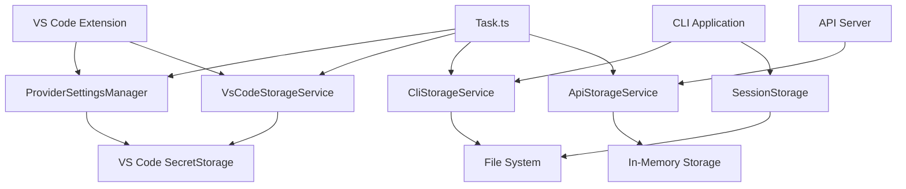
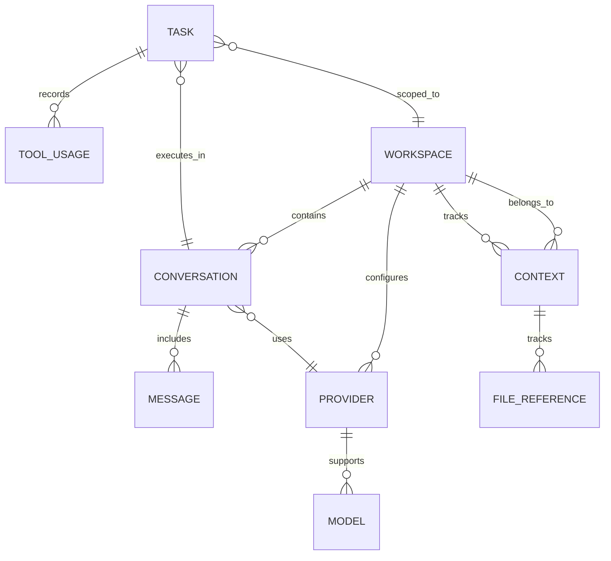
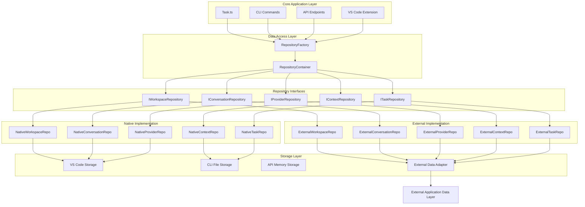
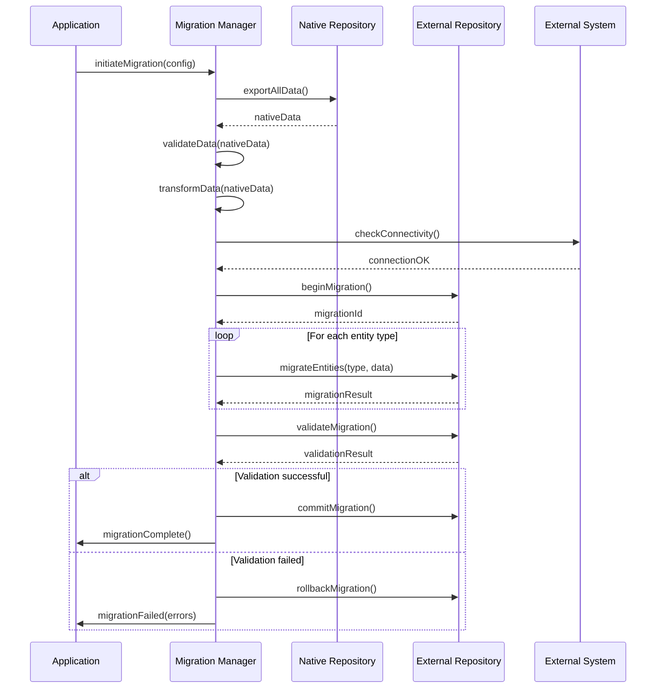
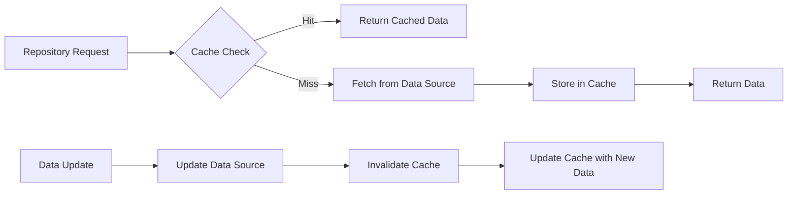

# Data Layer Abstraction Architecture

**Date Created**: December 16, 2025  
**Status**: Technical Specification  
**Related**: [Product Stories - Data Layer Abstraction](../product-stories/data-layer-abstraction.md)

## Technical Architecture Overview

This document provides the detailed technical architecture for abstracting the data layer to enable external application integration while maintaining backwards compatibility.

## Current State Analysis

### Existing Data Flow



### Data Entity Dependencies



## Target Architecture

### Repository Pattern Implementation



## Implementation Details

### 1. Repository Interface Definitions

#### Core Repository Interface

```typescript
// src/core/data/interfaces/IRepository.ts
export interface IRepository<T, TKey = string> {
	get(id: TKey): Promise<T | null>
	create(entity: Omit<T, "id" | "createdAt" | "updatedAt">): Promise<T>
	update(id: TKey, updates: Partial<T>): Promise<T>
	delete(id: TKey): Promise<void>
	list(options?: QueryOptions): Promise<T[]>
	exists(id: TKey): Promise<boolean>
}

export interface QueryOptions {
	limit?: number
	offset?: number
	sortBy?: string
	sortOrder?: "asc" | "desc"
	filters?: Record<string, any>
}
```

#### Workspace Repository Interface

```typescript
// src/core/data/interfaces/IWorkspaceRepository.ts
export interface IWorkspaceRepository extends IRepository<Workspace> {
	getCurrentWorkspace(): Promise<Workspace>
	setCurrentWorkspace(id: string): Promise<void>
	getByPath(path: string): Promise<Workspace | null>
	createFromPath(path: string, options?: CreateWorkspaceOptions): Promise<Workspace>
	getSettings(id: string): Promise<WorkspaceSettings>
	updateSettings(id: string, settings: Partial<WorkspaceSettings>): Promise<void>
}

export interface CreateWorkspaceOptions {
	name?: string
	settings?: Partial<WorkspaceSettings>
	initializeDefaults?: boolean
}
```

#### Conversation Repository Interface

```typescript
// src/core/data/interfaces/IConversationRepository.ts
export interface IConversationRepository extends IRepository<Conversation> {
	addMessage(conversationId: string, message: Omit<Message, "id" | "conversationId">): Promise<Message>
	getMessages(conversationId: string, options?: MessageQueryOptions): Promise<Message[]>
	updateMessage(conversationId: string, messageId: string, updates: Partial<Message>): Promise<Message>
	deleteMessage(conversationId: string, messageId: string): Promise<void>
	searchConversations(query: string, options?: SearchOptions): Promise<Conversation[]>
	getConversationsByWorkspace(workspaceId: string): Promise<Conversation[]>
	clearMessages(conversationId: string): Promise<void>
	archiveConversation(conversationId: string): Promise<void>
}

export interface MessageQueryOptions extends QueryOptions {
	since?: Date
	messageTypes?: ("user" | "assistant" | "system")[]
	includeMetadata?: boolean
}
```

### 2. Data Transfer Objects

#### Core Entity Definitions

```typescript
// src/core/data/types/entities.ts
export interface BaseEntity {
	id: string
	createdAt: Date
	updatedAt: Date
}

export interface Workspace extends BaseEntity {
	name: string
	path: string
	settings: WorkspaceSettings
	isActive: boolean
}

export interface WorkspaceSettings {
	defaultProvider?: string
	customInstructions?: string
	systemPrompt?: string
	rateLimitSeconds?: number
	diffEnabled?: boolean
	fuzzyMatchThreshold?: number
	[key: string]: any
}

export interface Conversation extends BaseEntity {
	workspaceId: string
	title: string
	messages: Message[]
	provider: string
	model: string
	tags: string[]
	isArchived: boolean
	metadata: ConversationMetadata
}

export interface Message extends BaseEntity {
	conversationId: string
	role: "user" | "assistant" | "system"
	content: string
	metadata: MessageMetadata
}

export interface Provider extends BaseEntity {
	name: string
	type: ProviderType
	apiKey: string
	baseUrl?: string
	isDefault: boolean
	settings: ProviderSettings
	isActive: boolean
}

export type ProviderType = "openAI" | "anthropic" | "groq" | "deepseek" | "litellm" | "xai"
```

### 3. Repository Factory Implementation

```typescript
// src/core/data/RepositoryFactory.ts
export interface DataLayerConfig {
	mode: "native" | "external"
	workspaceRoot?: string
	externalAdapter?: IExternalDataAdapter
	nativeServices?: NativeServicesConfig
}

export interface NativeServicesConfig {
	storageService: IStorageService
	providerSettingsManager?: ProviderSettingsManager
	sessionStorage?: ISessionStorage
}

export class RepositoryFactory {
	private static instance: RepositoryFactory | null = null

	static getInstance(): RepositoryFactory {
		if (!this.instance) {
			this.instance = new RepositoryFactory()
		}
		return this.instance
	}

	async create(config: DataLayerConfig): Promise<RepositoryContainer> {
		const validator = new ConfigValidator()
		await validator.validate(config)

		if (config.mode === "native") {
			return this.createNativeContainer(config)
		} else {
			return this.createExternalContainer(config)
		}
	}

	private async createNativeContainer(config: DataLayerConfig): Promise<RepositoryContainer> {
		const { nativeServices } = config
		if (!nativeServices) {
			throw new Error("Native services configuration required for native mode")
		}

		return new NativeRepositoryContainer({
			workspace: new NativeWorkspaceRepository(nativeServices.storageService),
			conversation: new NativeConversationRepository(nativeServices.sessionStorage),
			provider: new NativeProviderRepository(nativeServices.providerSettingsManager),
			context: new NativeContextRepository(nativeServices.storageService),
			task: new NativeTaskRepository(nativeServices.storageService),
		})
	}

	private async createExternalContainer(config: DataLayerConfig): Promise<RepositoryContainer> {
		const { externalAdapter } = config
		if (!externalAdapter) {
			throw new Error("External adapter required for external mode")
		}

		// Test connection to external system
		await externalAdapter.healthCheck()

		return new ExternalRepositoryContainer({
			workspace: new ExternalWorkspaceRepository(externalAdapter),
			conversation: new ExternalConversationRepository(externalAdapter),
			provider: new ExternalProviderRepository(externalAdapter),
			context: new ExternalContextRepository(externalAdapter),
			task: new ExternalTaskRepository(externalAdapter),
		})
	}
}
```

### 4. External Data Adapter Framework

#### Adapter Interface

```typescript
// src/core/data/adapters/IExternalDataAdapter.ts
export interface IExternalDataAdapter {
	// Connection management
	healthCheck(): Promise<void>
	connect(): Promise<void>
	disconnect(): Promise<void>

	// Generic CRUD operations
	read<T>(resource: string, id: string): Promise<T | null>
	create<T>(resource: string, data: T): Promise<T>
	update<T>(resource: string, id: string, updates: Partial<T>): Promise<T>
	delete(resource: string, id: string): Promise<void>
	list<T>(resource: string, options?: QueryOptions): Promise<T[]>

	// Batch operations for performance
	batchRead<T>(resource: string, ids: string[]): Promise<(T | null)[]>
	batchCreate<T>(resource: string, items: T[]): Promise<T[]>
	batchUpdate<T>(resource: string, updates: Array<{ id: string; data: Partial<T> }>): Promise<T[]>

	// Query operations
	query<T>(resource: string, query: QueryDefinition): Promise<T[]>
	search<T>(resource: string, searchQuery: string, options?: SearchOptions): Promise<T[]>

	// Transaction support
	beginTransaction(): Promise<Transaction>
	commitTransaction(transaction: Transaction): Promise<void>
	rollbackTransaction(transaction: Transaction): Promise<void>
}

export interface QueryDefinition {
	filters?: Record<string, any>
	sort?: Array<{ field: string; direction: "asc" | "desc" }>
	limit?: number
	offset?: number
	include?: string[]
}
```

#### HTTP Adapter Implementation

```typescript
// src/core/data/adapters/HttpExternalDataAdapter.ts
export class HttpExternalDataAdapter implements IExternalDataAdapter {
	private baseUrl: string
	private apiKey: string
	private httpClient: HttpClient
	private retryPolicy: RetryPolicy
	private cache: AdapterCache

	constructor(config: HttpAdapterConfig) {
		this.baseUrl = config.baseUrl
		this.apiKey = config.apiKey
		this.httpClient = new HttpClient({
			timeout: config.timeout || 30000,
			headers: {
				Authorization: `Bearer ${this.apiKey}`,
				"Content-Type": "application/json",
			},
		})
		this.retryPolicy = new ExponentialBackoffRetryPolicy(config.retryConfig)
		this.cache = new AdapterCache(config.cacheConfig)
	}

	async healthCheck(): Promise<void> {
		const response = await this.httpClient.get(`${this.baseUrl}/health`)
		if (response.status !== 200) {
			throw new Error(`Health check failed: ${response.statusText}`)
		}
	}

	async read<T>(resource: string, id: string): Promise<T | null> {
		const cacheKey = `${resource}:${id}`
		const cached = await this.cache.get<T>(cacheKey)
		if (cached) return cached

		const response = await this.retryPolicy.execute(async () => {
			return await this.httpClient.get(`${this.baseUrl}/${resource}/${id}`)
		})

		if (response.status === 404) return null
		if (response.status !== 200) {
			throw new Error(`Failed to read ${resource}/${id}: ${response.statusText}`)
		}

		const data = await response.json()
		await this.cache.set(cacheKey, data)
		return data
	}

	async create<T>(resource: string, data: T): Promise<T> {
		const response = await this.retryPolicy.execute(async () => {
			return await this.httpClient.post(`${this.baseUrl}/${resource}`, data)
		})

		if (response.status !== 201) {
			throw new Error(`Failed to create ${resource}: ${response.statusText}`)
		}

		const created = await response.json()

		// Update cache
		const cacheKey = `${resource}:${created.id}`
		await this.cache.set(cacheKey, created)

		return created
	}

	// ... other methods
}
```

### 5. Data Mapping and Transformation

#### Mapping Framework

```typescript
// src/core/data/mapping/DataMapper.ts
export abstract class DataMapper<TInternal, TExternal> {
	abstract toExternal(internal: TInternal): TExternal
	abstract fromExternal(external: TExternal): TInternal

	toExternalArray(internal: TInternal[]): TExternal[] {
		return internal.map((item) => this.toExternal(item))
	}

	fromExternalArray(external: TExternal[]): TInternal[] {
		return external.map((item) => this.fromExternal(item))
	}
}

// Example: Conversation Mapper
export class ConversationMapper extends DataMapper<Conversation, ExternalConversation> {
	constructor(private messageMapper: MessageMapper) {
		super()
	}

	toExternal(conversation: Conversation): ExternalConversation {
		return {
			id: conversation.id,
			title: conversation.title,
			messages: this.messageMapper.toExternalArray(conversation.messages),
			provider: conversation.provider,
			model: conversation.model,
			createdAt: conversation.createdAt.toISOString(),
			updatedAt: conversation.updatedAt.toISOString(),
			tags: conversation.tags,
			workspace_id: conversation.workspaceId, // External uses snake_case
			metadata: {
				...conversation.metadata,
				is_archived: conversation.isArchived,
			},
		}
	}

	fromExternal(external: ExternalConversation): Conversation {
		return {
			id: external.id,
			title: external.title,
			messages: this.messageMapper.fromExternalArray(external.messages || []),
			provider: external.provider,
			model: external.model,
			createdAt: new Date(external.createdAt || external.created_at),
			updatedAt: new Date(external.updatedAt || external.updated_at),
			tags: external.tags || [],
			workspaceId: external.workspace_id,
			isArchived: external.metadata?.is_archived || false,
			metadata: {
				...external.metadata,
				is_archived: undefined, // Remove from metadata since we have isArchived
			},
		}
	}
}
```

## Data Migration Strategy

### Migration Flow



### Migration Implementation

```typescript
// src/core/data/migration/MigrationManager.ts
export class MigrationManager {
	constructor(
		private sourceRepository: RepositoryContainer,
		private targetRepository: RepositoryContainer,
		private options: MigrationOptions,
	) {}

	async migrate(): Promise<MigrationResult> {
		const migrationId = generateMigrationId()
		const progress = new MigrationProgress()

		try {
			// Phase 1: Export data from source
			progress.setPhase("export")
			const exportResult = await this.exportFromSource()

			// Phase 2: Validate and transform data
			progress.setPhase("transform")
			const transformedData = await this.transformData(exportResult.data)

			// Phase 3: Import to target
			progress.setPhase("import")
			const importResult = await this.importToTarget(transformedData)

			// Phase 4: Validate migration
			progress.setPhase("validate")
			const validationResult = await this.validateMigration(importResult)

			if (validationResult.isValid) {
				await this.commitMigration(migrationId)
				return MigrationResult.success(migrationId, progress.getStats())
			} else {
				await this.rollbackMigration(migrationId)
				return MigrationResult.failure(validationResult.errors)
			}
		} catch (error) {
			await this.rollbackMigration(migrationId)
			return MigrationResult.error(error)
		}
	}

	private async exportFromSource(): Promise<ExportResult> {
		const workspaces = await this.sourceRepository.workspace.list()
		const conversations = await this.getAllConversations(workspaces)
		const providers = await this.sourceRepository.provider.list()
		const contexts = await this.getAllContexts(workspaces)
		const tasks = await this.getAllTasks(workspaces)

		return {
			workspaces,
			conversations,
			providers,
			contexts,
			tasks,
			exportedAt: new Date(),
			version: getCurrentVersion(),
		}
	}

	private async transformData(data: ExportResult): Promise<TransformedData> {
		const mappers = {
			workspace: new WorkspaceMapper(),
			conversation: new ConversationMapper(),
			provider: new ProviderMapper(),
			context: new ContextMapper(),
			task: new TaskMapper(),
		}

		return {
			workspaces: data.workspaces.map((w) => mappers.workspace.toExternal(w)),
			conversations: data.conversations.map((c) => mappers.conversation.toExternal(c)),
			providers: data.providers.map((p) => mappers.provider.toExternal(p)),
			contexts: data.contexts.map((c) => mappers.context.toExternal(c)),
			tasks: data.tasks.map((t) => mappers.task.toExternal(t)),
		}
	}
}
```

## Performance Considerations

### Caching Strategy



### Batch Operations

```typescript
// src/core/data/optimizations/BatchProcessor.ts
export class BatchProcessor<T> {
	private batch: T[] = []
	private batchSize: number
	private processingTimer: NodeJS.Timeout | null = null
	private processor: (items: T[]) => Promise<void>

	constructor(options: BatchProcessorOptions<T>) {
		this.batchSize = options.batchSize || 100
		this.processor = options.processor
	}

	add(item: T): void {
		this.batch.push(item)

		if (this.batch.length >= this.batchSize) {
			this.flush()
		} else if (!this.processingTimer) {
			// Process batch after delay if not full
			this.processingTimer = setTimeout(() => this.flush(), 1000)
		}
	}

	async flush(): Promise<void> {
		if (this.batch.length === 0) return

		const currentBatch = [...this.batch]
		this.batch = []

		if (this.processingTimer) {
			clearTimeout(this.processingTimer)
			this.processingTimer = null
		}

		await this.processor(currentBatch)
	}
}
```

## Error Handling and Resilience

### Circuit Breaker Pattern

```typescript
// src/core/data/resilience/CircuitBreaker.ts
export class CircuitBreaker {
	private state: "CLOSED" | "OPEN" | "HALF_OPEN" = "CLOSED"
	private failureCount = 0
	private lastFailureTime?: Date
	private successCount = 0

	constructor(private options: CircuitBreakerOptions) {}

	async execute<T>(operation: () => Promise<T>): Promise<T> {
		if (this.state === "OPEN") {
			if (this.shouldAttemptReset()) {
				this.state = "HALF_OPEN"
			} else {
				throw new Error("Circuit breaker is OPEN")
			}
		}

		try {
			const result = await operation()
			this.onSuccess()
			return result
		} catch (error) {
			this.onFailure()
			throw error
		}
	}

	private onSuccess(): void {
		this.failureCount = 0
		if (this.state === "HALF_OPEN") {
			this.successCount++
			if (this.successCount >= this.options.successThreshold) {
				this.state = "CLOSED"
				this.successCount = 0
			}
		}
	}

	private onFailure(): void {
		this.failureCount++
		this.lastFailureTime = new Date()

		if (this.failureCount >= this.options.failureThreshold) {
			this.state = "OPEN"
		}
	}
}
```

## Monitoring and Observability

### Metrics Collection

```typescript
// src/core/data/monitoring/MetricsCollector.ts
export class DataLayerMetrics {
	private metrics = new Map<string, MetricValue>()

	recordOperation(operation: string, duration: number, success: boolean): void {
		this.increment(`data_layer.${operation}.count`)
		this.histogram(`data_layer.${operation}.duration`, duration)

		if (success) {
			this.increment(`data_layer.${operation}.success`)
		} else {
			this.increment(`data_layer.${operation}.error`)
		}
	}

	recordCacheHit(repository: string): void {
		this.increment(`data_layer.cache.${repository}.hit`)
	}

	recordCacheMiss(repository: string): void {
		this.increment(`data_layer.cache.${repository}.miss`)
	}

	getMetrics(): Record<string, MetricValue> {
		return Object.fromEntries(this.metrics)
	}
}
```

## Security Implementation

### Authentication and Authorization

```typescript
// src/core/data/security/SecurityManager.ts
export class SecurityManager {
	constructor(private config: SecurityConfig) {}

	async authenticate(credentials: Credentials): Promise<AuthResult> {
		// Implement authentication logic
		const token = await this.generateToken(credentials)
		return { token, expiresAt: new Date(Date.now() + this.config.tokenTtl) }
	}

	async authorize(token: string, resource: string, action: string): Promise<boolean> {
		const claims = await this.validateToken(token)
		return this.checkPermissions(claims, resource, action)
	}

	sanitizeInput<T>(input: T): T {
		// Implement input sanitization
		return this.deepSanitize(input)
	}

	validateWorkspacePath(path: string, allowedRoot: string): boolean {
		const normalizedPath = path.normalize(path)
		const normalizedRoot = path.normalize(allowedRoot)
		return normalizedPath.startsWith(normalizedRoot)
	}
}
```

This technical architecture provides a comprehensive foundation for implementing the data layer abstraction while maintaining backwards compatibility and enabling secure external integration.
