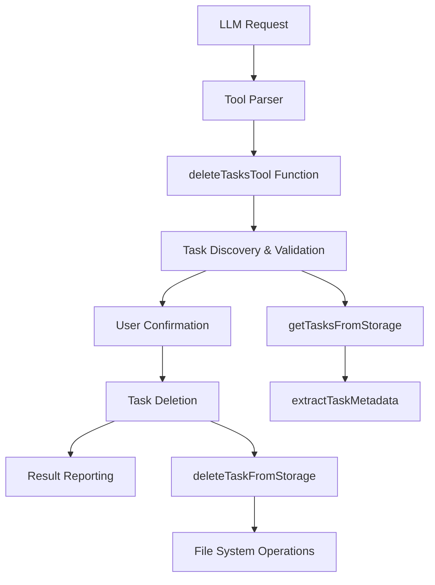

# Delete Tasks Tool Implementation

## Overview

This document outlines the technical implementation of the `delete_tasks` tool, which provides LLMs with the ability to permanently delete tasks from the agent's storage system. The tool follows the established pattern of the existing `list_tasks` tool and integrates seamlessly with the existing architecture.

## Architecture

### Tool Integration Pattern

The `delete_tasks` tool follows the same architectural pattern as other tools in the system:



### Storage Structure

Tasks are stored in the following directory structure that will be deleted:

```
storage/
└── tasks/
    ├── {uuid-1}/                 ← Will be deleted
    │   ├── ui_messages.json
    │   └── api_conversation_history.json
    ├── {uuid-2}/                 ← Will be deleted
    │   ├── ui_messages.json
    │   └── api_conversation_history.json
    └── ...
```

## Implementation Details

### Core Components

#### 1. Main Tool Function

**File**: `src/core/tools/deleteTasksTool.ts`

```typescript
export async function deleteTasksTool(
	cline: Task,
	block: ToolUse,
	askApproval: AskApproval,
	handleError: HandleError,
	pushToolResult: PushToolResult,
	removeClosingTag: RemoveClosingTag,
): Promise<void>
```

**Responsibilities**:

- Parse and validate task IDs from input
- Retrieve task metadata for confirmation
- Present deletion confirmation to user
- Execute permanent deletion operations
- Report results and handle errors

#### 2. Task ID Validation

```typescript
function validateTaskIds(taskIds: string[]): ValidationResult
```

**Validation Rules**:

- Must be valid UUID format
- Must exist in storage
- Must be accessible (no permission issues)
- Duplicate IDs are filtered out

#### 3. Task Deletion Engine

```typescript
async function deleteTaskFromStorage(taskId: string, storagePath: string): Promise<DeletionResult>
```

**Deletion Process**:

1. Validate task directory exists
2. Check file system permissions
3. Remove directory recursively using `fs.rm(path, { recursive: true, force: true })`
4. Verify deletion completed successfully
5. Return operation result

#### 4. Confirmation Display

```typescript
function formatTasksForConfirmation(tasks: TaskInfo[]): string
```

**Display Format**:

```
The following tasks will be permanently deleted:

### Task: Fix authentication bug (a1b2c3d4-e5f6-7890-abcd-ef1234567890)
- Created: 2025-01-07 14:30:22
- Status: Completed
- Mode: 🪲 Debug (debug)
- Messages: 23 messages

### Task: Update documentation (b2c3d4e5-f6g7-8901-bcde-f23456789012)
- Created: 2025-01-06 09:15:33
- Status: Active
- Mode: 💻 Code (code)
- Messages: 8 messages

Total: 2 tasks will be deleted
This action cannot be undone.
```

### Integration Points

#### Tool Registration

**File**: `packages/types/src/tool.ts`

```typescript
export const toolNames = [
	// ... existing tools
	"delete_tasks",
] as const
```

**File**: `src/shared/tools.ts`

```typescript
export interface DeleteTasksToolUse extends ToolUse {
	name: "delete_tasks"
	params: Partial<Pick<Record<ToolParamName, string>, "task_ids">>
}

export const TOOL_DISPLAY_NAMES: Record<ToolName, string> = {
	// ... existing tools
	delete_tasks: "delete tasks",
} as const

// Add to modes tool group
export const TOOL_GROUPS: Record<ToolGroup, ToolGroupConfig> = {
	modes: {
		tools: ["switch_mode", "new_task", "list_modes", "list_tasks", "delete_tasks"],
		alwaysAvailable: true,
	},
	// ... other groups
}

// Add task_ids to tool parameters
export const toolParamNames = [
	// ... existing params
	"task_ids",
] as const
```

#### Tool Description

**File**: `src/core/prompts/tools/delete-tasks.ts`

```typescript
export function getDeleteTasksDescription(args: ToolArgs): string {
	return `## delete_tasks
Description: Request to permanently delete specified tasks from storage. This tool removes task directories and all their contents from the file system. The operation requires user confirmation and cannot be undone.

Parameters:
- task_ids: (required) Array of task identifiers (UUIDs) to delete

Usage:
<delete_tasks>
<task_ids>["uuid1", "uuid2", "uuid3"]</task_ids>
</delete_tasks>

Examples:

1. Delete single task:
<delete_tasks>
<task_ids>["a1b2c3d4-e5f6-7890-abcd-ef1234567890"]</task_ids>
</delete_tasks>

2. Delete multiple tasks:
<delete_tasks>
<task_ids>["a1b2c3d4-e5f6-7890-abcd-ef1234567890", "b2c3d4e5-f6g7-8901-bcde-f23456789012"]</task_ids>
</delete_tasks>

Note: This operation permanently deletes tasks and cannot be undone. User confirmation is required before deletion.`
}
```

#### Execution Handler

**File**: `src/core/assistant-message/presentAssistantMessage.ts`

```typescript
// Add import
import { deleteTasksTool } from "../tools/deleteTasksTool"

// Add to tool description function
case "delete_tasks":
    return `[${block.name}${block.params.task_ids ? ` tasks: ${JSON.parse(block.params.task_ids).length}` : ""}]`

// Add to execution section
case "delete_tasks":
    await deleteTasksTool(cline, block, askApproval, handleError, pushToolResult, removeClosingTag)
    break
```

#### Tool Description Registration

**File**: `src/core/prompts/tools/index.ts`

```typescript
import { getDeleteTasksDescription } from "./delete-tasks"

const toolDescriptionMap: Record<string, (args: ToolArgs) => string | undefined> = {
	// ... existing tools
	delete_tasks: (args) => getDeleteTasksDescription(args),
}
```

## Error Handling

### Input Validation Errors

- **Invalid JSON**: Parse error in task_ids parameter
- **Invalid UUIDs**: Non-UUID format task identifiers
- **Empty array**: No task IDs provided
- **Duplicate IDs**: Same task ID specified multiple times

### File System Errors

- **Task not found**: Task directory doesn't exist
- **Permission denied**: Insufficient permissions to delete
- **Directory not empty**: Deletion failed due to locked files
- **Storage path error**: Cannot resolve storage directory

### Partial Failure Handling

- **Atomic operations**: Where possible, ensure all-or-nothing deletion
- **Rollback capability**: Restore partially deleted tasks if possible
- **Detailed reporting**: Report success/failure for each task individually

## Safety Measures

### Pre-deletion Validation

- Verify task existence before attempting deletion
- Check file system permissions
- Validate storage path accessibility
- Confirm task directory structure

### User Confirmation

- Display detailed task information before deletion
- Single confirmation for all tasks (not per-task)
- Clear warning about permanent deletion
- Option to cancel operation

### Deletion Safety

- Use `fs.rm()` with `recursive: true` and `force: true`
- Verify deletion completion
- Handle locked files gracefully
- Prevent directory traversal attacks

## Output Format

### Confirmation Display

```
The following tasks will be permanently deleted:

### Task: Fix authentication bug (a1b2c3d4-e5f6-7890-abcd-ef1234567890)
- Created: 2025-01-07 14:30:22
- Status: Completed
- Mode: 🪲 Debug (debug)
- Messages: 23 messages

### Task: Update documentation (b2c3d4e5-f6g7-8901-bcde-f23456789012)
- Created: 2025-01-06 09:15:33
- Status: Active
- Mode: 💻 Code (code)
- Messages: 8 messages

Total: 2 tasks will be deleted
This action cannot be undone.
```

### Success Result

```
Task Deletion Results:

✅ Successfully deleted: Fix authentication bug (a1b2c3d4-e5f6-7890-abcd-ef1234567890)
✅ Successfully deleted: Update documentation (b2c3d4e5-f6g7-8901-bcde-f23456789012)

Summary: 2 tasks deleted successfully, 0 failed
```

### Partial Failure Result

```
Task Deletion Results:

✅ Successfully deleted: Fix authentication bug (a1b2c3d4-e5f6-7890-abcd-ef1234567890)
❌ Failed to delete: Update documentation (b2c3d4e5-f6g7-8901-bcde-f23456789012)
   Error: Permission denied - task directory is locked

Summary: 1 task deleted successfully, 1 failed
```

## Performance Considerations

### Batch Operations

- Process multiple deletions efficiently
- Parallel deletion where safe
- Progress reporting for large batches
- Memory-efficient metadata loading

### File System Optimization

- Use native `fs.rm()` for recursive deletion
- Minimize file system calls
- Handle large directories efficiently
- Optimize for different file systems

## Security Considerations

### Input Validation

- Sanitize task ID inputs
- Prevent directory traversal attacks
- Validate UUID format strictly
- Limit maximum number of tasks per operation

### File System Security

- Verify storage path boundaries
- Check file permissions before deletion
- Prevent deletion of system directories
- Audit log deletion operations

## Future Enhancement Preparation

### Soft Delete Architecture

The implementation is designed to easily support soft deletion in the future:

```typescript
interface DeletionStrategy {
	delete(taskIds: string[], storagePath: string): Promise<DeletionResult[]>
	canRecover(): boolean
	recover?(taskIds: string[]): Promise<RecoveryResult[]>
}

class PermanentDeletionStrategy implements DeletionStrategy {
	async delete(taskIds: string[], storagePath: string): Promise<DeletionResult[]> {
		// Current implementation
	}

	canRecover(): boolean {
		return false
	}
}

class SoftDeletionStrategy implements DeletionStrategy {
	async delete(taskIds: string[], storagePath: string): Promise<DeletionResult[]> {
		// Move to deleted folder instead of permanent deletion
	}

	canRecover(): boolean {
		return true
	}

	async recover(taskIds: string[]): Promise<RecoveryResult[]> {
		// Restore from deleted folder
	}
}
```

### Advanced Features

- **Bulk operations**: Handle hundreds of tasks efficiently
- **Deletion scheduling**: Schedule deletions for later execution
- **Recovery system**: Implement task recovery from backups
- **Audit trail**: Track all deletion operations
- **Backup integration**: Automatic backup before deletion

## Testing Strategy

### Unit Tests

- Task ID validation logic
- Metadata extraction and formatting
- Deletion engine with mocked file system
- Error handling scenarios
- Confirmation display formatting

### Integration Tests

- End-to-end deletion workflow
- Cross-platform file system operations
- Storage path resolution
- Tool registration and execution
- Error recovery and rollback

### End-to-End Tests

- VSCode extension context
- CLI execution context
- API endpoint testing
- User interaction simulation
- Performance with large task sets

## Migration Considerations

### Backward Compatibility

- Support existing task storage formats
- Graceful handling of legacy data structures
- No impact on existing tasks during tool addition

### Version Management

- Track deletion operations for audit
- Maintain compatibility with older agent versions
- Provide upgrade paths for enhanced deletion features

## Monitoring and Observability

### Metrics

- Number of tasks deleted per operation
- Deletion success/failure rates
- Performance metrics (time per deletion)
- Error frequency and types

### Logging

- Audit log of all deletion operations
- Error details for troubleshooting
- Performance metrics for optimization
- User confirmation events

This implementation provides a robust, safe, and user-friendly task deletion system that integrates seamlessly with the existing architecture while preparing for future enhancements.
