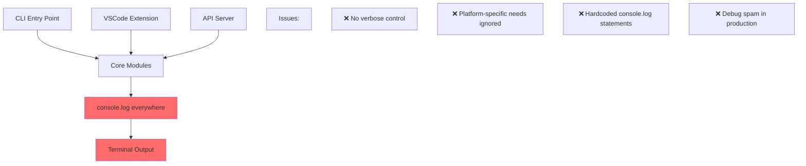
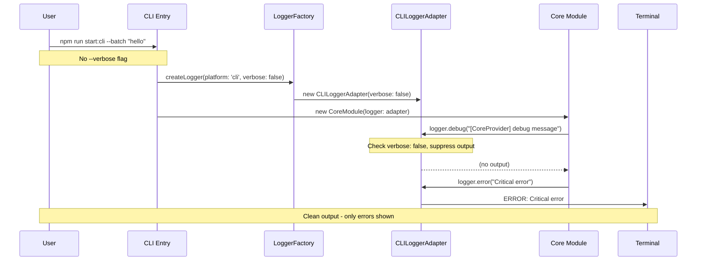
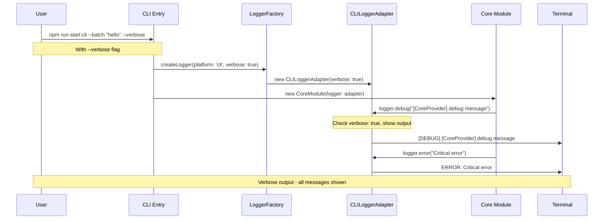
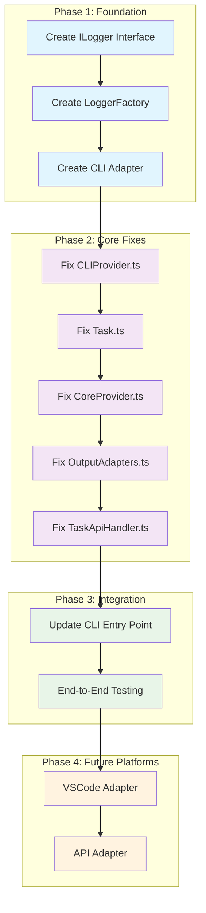

# Logging Architecture Diagram

## Current State vs Proposed Architecture

### Current Problem



### Proposed Solution

```mermaid
graph TD
    subgraph "Platform Entry Points"
        CLI[CLI Entry Point<br/>--verbose flag]
        VSC[VSCode Extension<br/>Output channels]
        API[API Server<br/>SSE streaming]
    end

    subgraph "Logger Factory"
        LF[LoggerFactory<br/>Platform Detection]
    end

    subgraph "Logger Adapters"
        CLA[CLILoggerAdapter<br/>Respects --verbose]
        VLA[VSCodeLoggerAdapter<br/>Output channels]
        ALA[APILoggerAdapter<br/>SSE integration]
    end

    subgraph "Core Interface"
        IL[ILogger Interface<br/>debug(), info(), warn(), error()]
    end

    subgraph "Core Modules"
        CP[CLIProvider]
        T[Task]
        CPR[CoreProvider]
        COA[CLIOutputAdapters]
        TAH[TaskApiHandler]
    end

    subgraph "Output Destinations"
        TERM[Terminal<br/>Clean/Verbose]
        OUT[VSCode Output<br/>Channels]
        SSE[SSE Stream<br/>Structured logs]
    end

    CLI --> LF
    VSC --> LF
    API --> LF

    LF --> CLA
    LF --> VLA
    LF --> ALA

    CLA --> IL
    VLA --> IL
    ALA --> IL

    IL --> CP
    IL --> T
    IL --> CPR
    IL --> COA
    IL --> TAH

    CLA --> TERM
    VLA --> OUT
    ALA --> SSE

    style IL fill:#4ecdc4
    style LF fill:#45b7d1
    style CLA fill:#96ceb4
    style VLA fill:#96ceb4
    style ALA fill:#96ceb4
```

## Implementation Flow





## Migration Strategy Visual



## Expected Behavior Changes

### Before Fix

```bash
$ npm run start:cli --silent -- --config ~/.agentz/agent-config.json --batch "say hello"
[CLIProvider] Initialized successfully
[Task] CLI mode detected - using CLI output adapter
📊 State synchronized - Mode: code, API: anthropic
[CoreProvider] parent task dc75d4f6-2afb-4bdd-853f-a6ed189a0d12.9e140e92 created
[MESSAGING-PERSISTENCE] 📦 About to send chunk to messaging system for persistence
Hello! How can I help you today?
```

### After Fix

```bash
$ npm run start:cli --silent -- --config ~/.agentz/agent-config.json --batch "say hello"
Hello! How can I help you today?
```

### With Verbose Flag

```bash
$ npm run start:cli --silent -- --config ~/.agentz/agent-config.json --batch "say hello" --verbose
[DEBUG] [+0ms] CLIProvider initialized successfully
[DEBUG] [+15ms] Task CLI mode detected - using CLI output adapter
[DEBUG] [+23ms] State synchronized - Mode: code, API: anthropic
[DEBUG] [+31ms] CoreProvider parent task dc75d4f6-2afb-4bdd-853f-a6ed189a0d12.9e140e92 created
[DEBUG] [+45ms] MESSAGING-PERSISTENCE About to send chunk to messaging system for persistence
Hello! How can I help you today?
```
