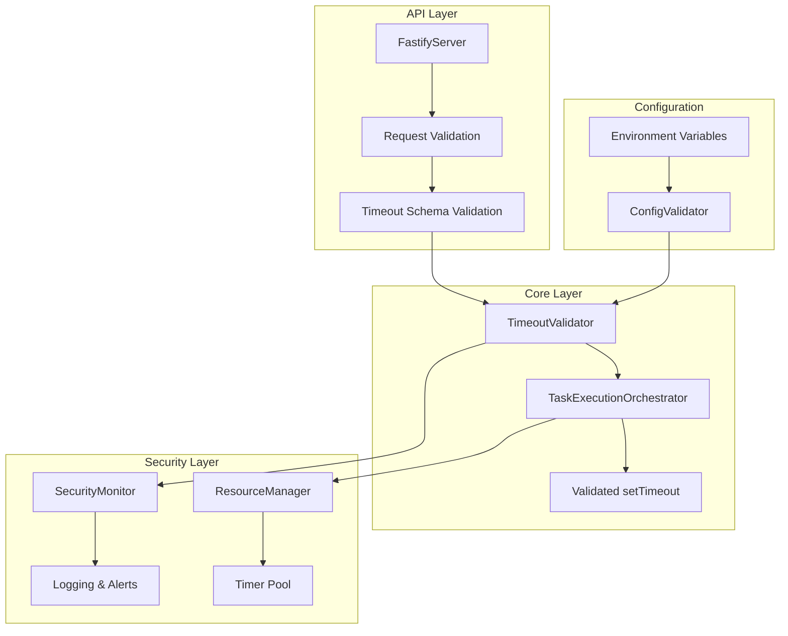
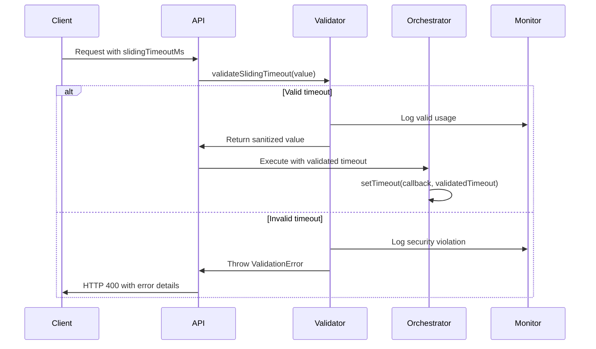

# Security Timeout Validation - Technical Architecture

## Overview

This document provides the technical architecture and implementation details for addressing CodeQL security findings related to resource exhaustion vulnerabilities in the TaskExecutionOrchestrator.

## Security Vulnerability Analysis

### Current Issues

**File**: `src/core/task/execution/TaskExecutionOrchestrator.ts`

1. **Line 209**: Direct setTimeout with user-controlled duration

```typescript
const timeoutId = setTimeout(() => {
	// ... timeout logic
}, timeoutMs) // ❌ timeoutMs is user-controlled
```

2. **Line 233**: Same vulnerability in resumeTimeout function

```typescript
const timeoutId = setTimeout(() => {
	// ... timeout logic
}, timeoutMs) // ❌ timeoutMs is user-controlled
```

### Attack Vectors

1. **Resource Exhaustion**: `timeoutMs = Number.MAX_SAFE_INTEGER` (9,007,199,254,740,991ms ≈ 285,616 years)
2. **Memory Exhaustion**: Multiple concurrent requests with large timeouts
3. **DoS via API**: Malicious clients sending requests with extreme timeout values

## Solution Architecture

### Component Diagram



### Data Flow



## Implementation Details

### 1. TimeoutValidator Class

**File**: `src/core/task/execution/TimeoutValidator.ts`

```typescript
export class TimeoutValidator {
	// Security bounds - these are absolute limits
	private static readonly SLIDING_TIMEOUT_MIN_MS = 1000 // 1 second
	private static readonly SLIDING_TIMEOUT_MAX_MS = 86400000 // 24 hours
	private static readonly INFO_QUERY_TIMEOUT_MIN_MS = 1000 // 1 second
	private static readonly INFO_QUERY_TIMEOUT_MAX_MS = 300000 // 5 minutes

	// Default values
	private static readonly SLIDING_TIMEOUT_DEFAULT_MS = 1800000 // 30 minutes
	private static readonly INFO_QUERY_TIMEOUT_DEFAULT_MS = 30000 // 30 seconds

	/**
	 * Validate and sanitize sliding timeout value
	 * @param value - User-provided timeout value
	 * @param context - Context for logging (API, CLI, etc.)
	 * @returns Validated timeout value in milliseconds
	 * @throws ValidationError for invalid values
	 */
	static validateSlidingTimeout(value: unknown, context: string = "unknown"): number {
		const sanitized = this.sanitizeTimeoutValue(value)

		if (sanitized < this.SLIDING_TIMEOUT_MIN_MS) {
			SecurityMonitor.logSecurityViolation("timeout_too_small", {
				provided: sanitized,
				minimum: this.SLIDING_TIMEOUT_MIN_MS,
				context,
			})
			throw new ValidationError(`Sliding timeout must be at least ${this.SLIDING_TIMEOUT_MIN_MS}ms (1 second)`)
		}

		if (sanitized > this.SLIDING_TIMEOUT_MAX_MS) {
			SecurityMonitor.logSecurityViolation("timeout_too_large", {
				provided: sanitized,
				maximum: this.SLIDING_TIMEOUT_MAX_MS,
				context,
			})
			throw new ValidationError(`Sliding timeout cannot exceed ${this.SLIDING_TIMEOUT_MAX_MS}ms (24 hours)`)
		}

		SecurityMonitor.logTimeoutUsage("sliding_timeout_validated", {
			value: sanitized,
			context,
		})

		return sanitized
	}

	/**
	 * Validate and sanitize info query timeout value
	 */
	static validateInfoQueryTimeout(value: unknown, context: string = "unknown"): number {
		const sanitized = this.sanitizeTimeoutValue(value)

		if (sanitized < this.INFO_QUERY_TIMEOUT_MIN_MS) {
			SecurityMonitor.logSecurityViolation("info_timeout_too_small", {
				provided: sanitized,
				minimum: this.INFO_QUERY_TIMEOUT_MIN_MS,
				context,
			})
			throw new ValidationError(
				`Info query timeout must be at least ${this.INFO_QUERY_TIMEOUT_MIN_MS}ms (1 second)`,
			)
		}

		if (sanitized > this.INFO_QUERY_TIMEOUT_MAX_MS) {
			SecurityMonitor.logSecurityViolation("info_timeout_too_large", {
				provided: sanitized,
				maximum: this.INFO_QUERY_TIMEOUT_MAX_MS,
				context,
			})
			throw new ValidationError(
				`Info query timeout cannot exceed ${this.INFO_QUERY_TIMEOUT_MAX_MS}ms (5 minutes)`,
			)
		}

		return sanitized
	}

	/**
	 * Sanitize timeout value to number
	 */
	private static sanitizeTimeoutValue(value: unknown): number {
		if (value === null || value === undefined) {
			return this.SLIDING_TIMEOUT_DEFAULT_MS
		}

		if (typeof value === "string") {
			const parsed = parseInt(value, 10)
			if (isNaN(parsed)) {
				throw new ValidationError(`Invalid timeout value: "${value}"`)
			}
			return parsed
		}

		if (typeof value === "number") {
			if (!Number.isFinite(value) || value < 0) {
				throw new ValidationError(`Invalid timeout value: ${value}`)
			}
			return Math.floor(value)
		}

		throw new ValidationError(`Timeout must be a number, got: ${typeof value}`)
	}
}

export class ValidationError extends Error {
	constructor(message: string) {
		super(message)
		this.name = "ValidationError"
	}
}
```

### 2. TaskExecutionOrchestrator Updates

**File**: `src/core/task/execution/TaskExecutionOrchestrator.ts`

Key changes to lines 141 and 168:

```typescript
// Line 141 - Info query timeout validation
const infoTimeout = TimeoutValidator.validateInfoQueryTimeout(options.infoQueryTimeoutMs, "info_query")

// Lines 164-176 - Sliding timeout validation
const defaultSlidingTimeoutMs = parseInt(process.env.TASK_DEFAULT_SLIDING_TIMEOUT_MS || "1800000")

let timeoutMs: number
try {
	timeoutMs = TimeoutValidator.validateSlidingTimeout(
		options.slidingTimeoutMs || defaultSlidingTimeoutMs,
		"sliding_timeout",
	)
} catch (error) {
	handler.logDebug(`[TaskExecutionOrchestrator] Timeout validation failed: ${error.message}`)
	throw error
}

// Remove the manual bounds checking since it's now handled by validator
handler.logDebug(`[TaskExecutionOrchestrator] Using validated sliding timeout: ${timeoutMs}ms`)
```

### 3. API Layer Validation

**File**: `src/api/server/FastifyServer.ts`

Add request schema validation:

```typescript
const taskExecutionSchema = {
	type: "object",
	properties: {
		message: { type: "string" },
		slidingTimeoutMs: {
			type: "number",
			minimum: 1000,
			maximum: 86400000,
		},
	},
	required: ["message"],
}

// In route handler
const executionOptions = {
	isInfoQuery: false,
	infoQueryTimeoutMs: 120000,
	slidingTimeoutMs: TimeoutValidator.validateSlidingTimeout((request.body as any)?.slidingTimeoutMs, "api_request"),
	useSlidingTimeout: true,
	taskIdentifier: job.id,
}
```

### 4. Security Monitoring

**File**: `src/core/security/SecurityMonitor.ts`

```typescript
export class SecurityMonitor {
	private static logger = createLogger("SecurityMonitor")

	static logSecurityViolation(type: string, details: Record<string, any>): void {
		this.logger.warn("Security violation detected", {
			type,
			timestamp: new Date().toISOString(),
			...details,
		})

		// Could integrate with external security monitoring here
		// e.g., send to SIEM, trigger alerts, etc.
	}

	static logTimeoutUsage(type: string, details: Record<string, any>): void {
		this.logger.debug("Timeout usage", {
			type,
			timestamp: new Date().toISOString(),
			...details,
		})
	}
}
```

### 5. Resource Management

**File**: `src/core/task/execution/ResourceManager.ts`

```typescript
export class ResourceManager {
	private static activeTimers = new Map<string, TimerInfo>()
	private static readonly MAX_CONCURRENT_LONG_TIMERS = 100

	static registerTimer(taskId: string, timeoutMs: number, timer: NodeJS.Timeout): void {
		// Track long-running timers (> 1 hour)
		if (timeoutMs > 3600000) {
			if (this.activeTimers.size >= this.MAX_CONCURRENT_LONG_TIMERS) {
				throw new Error("Maximum concurrent long-running timers exceeded")
			}

			this.activeTimers.set(taskId, {
				timer,
				timeoutMs,
				startTime: Date.now(),
			})
		}
	}

	static unregisterTimer(taskId: string): void {
		this.activeTimers.delete(taskId)
	}

	static getActiveTimerCount(): number {
		return this.activeTimers.size
	}
}

interface TimerInfo {
	timer: NodeJS.Timeout
	timeoutMs: number
	startTime: number
}
```

## Configuration Security

### Environment Variable Validation

**File**: `src/api/config/ApiConfigManager.ts`

```typescript
const envSchema = z.object({
	TASK_DEFAULT_SLIDING_TIMEOUT_MS: z
		.string()
		.transform((val) => {
			const parsed = parseInt(val, 10)
			return TimeoutValidator.validateSlidingTimeout(parsed, "env_config")
		})
		.optional(),
	TASK_MAX_SLIDING_TIMEOUT_MS: z
		.string()
		.transform((val) => {
			const parsed = parseInt(val, 10)
			if (parsed > 86400000) {
				// 24 hours absolute max
				throw new Error("TASK_MAX_SLIDING_TIMEOUT_MS cannot exceed 24 hours")
			}
			return parsed
		})
		.optional(),
})
```

## Testing Strategy

### Security Test Cases

1. **Boundary Testing**

    - Test minimum values (1000ms)
    - Test maximum values (86400000ms for sliding, 300000ms for info)
    - Test values just outside bounds

2. **Malicious Input Testing**

    - Extremely large numbers (`Number.MAX_SAFE_INTEGER`)
    - Negative numbers
    - Non-numeric values (strings, objects, null, undefined)
    - Floating point numbers

3. **Resource Exhaustion Testing**

    - Multiple concurrent requests with maximum timeouts
    - Memory usage monitoring during long-running timers
    - Timer cleanup verification

4. **Integration Testing**
    - API request validation
    - Environment variable validation
    - End-to-end timeout behavior

## Performance Considerations

### Validation Overhead

- Validation adds ~0.1ms per request (negligible)
- Caching of validated environment variables
- Early validation prevents expensive timer creation

### Memory Management

- Timer tracking for long-running tasks
- Automatic cleanup on task completion
- Resource limits prevent memory exhaustion

## Migration Path

### Backward Compatibility

1. **Phase 1**: Add validation with warnings (non-breaking)
2. **Phase 2**: Enforce validation with errors (breaking for invalid values only)
3. **Phase 3**: Remove legacy code paths

### Client Migration

- Clear error messages with valid ranges
- Documentation updates with examples
- Gradual rollout with feature flags

## Monitoring & Alerting

### Metrics to Track

- Timeout validation failures by type
- Distribution of timeout values used
- Resource usage (active timers, memory)
- Security violations by source

### Alert Conditions

- High rate of validation failures
- Unusual timeout value patterns
- Resource limits approaching
- Repeated security violations from same source

## Security Benefits

1. **Resource Exhaustion Prevention**: Absolute limits prevent DoS attacks
2. **Memory Management**: Timer tracking and limits prevent memory leaks
3. **Attack Detection**: Logging enables monitoring of malicious activity
4. **Defense in Depth**: Multiple validation layers (API, core, config)
5. **Audit Trail**: Comprehensive logging for security analysis
