# SSE Stream Closing - Architecture Design

## Current Architecture (Problematic)

```mermaid
sequenceDiagram
    participant Client as API Client
    participant Server as Fastify Server
    participant SM as StreamManager
    participant SSE as SSEOutputAdapter
    participant Task as Task Execution

    Client->>Server: POST /execute/stream
    Server->>SM: createStream(response, jobId)
    SM->>Client: SSE Headers + Stream
    Server->>SSE: new SSEOutputAdapter(streamManager, jobId)
    Server->>Task: executeTask()

    loop Task Execution
        Task->>SSE: progress events
        SSE->>SM: sendEvent(jobId, event)
        SM->>Client: data: {...}
    end

    Task->>SSE: emitCompletion("Task completed")
    SSE->>SM: sendEvent(jobId, completion)
    SM->>Client: data: {type: "completion", ...}

    Note over Client: ❌ RACE CONDITION
    Client->>Client: res.destroy() immediately

    Note over Task: Task still finishing...
    Task->>SSE: Additional completion events
    SSE->>SM: sendEvent(jobId, event)
    Note over SM: ❌ Stream already closed!
    SM-->>SSE: sendEvent returns false

    Note over Server: ❌ Lost completion content
```



## New Architecture (Fixed)

```mermaid
sequenceDiagram
    participant Client as API Client
    participant Server as Fastify Server
    participant SM as StreamManager
    participant SSE as SSEOutputAdapter
    participant Task as Task Execution

    Client->>Server: POST /execute/stream
    Server->>SM: createStream(response, jobId)
    SM->>Client: SSE Headers + Stream
    Server->>SSE: new SSEOutputAdapter(streamManager, jobId)
    Server->>Task: executeTask()

    loop Task Execution
        Task->>SSE: progress events
        SSE->>SM: sendEvent(jobId, event)
        SM->>Client: data: {...}
    end

    Task->>SSE: emitCompletion("Task completed")

    Note over SSE: ✅ NEW COMPLETION FLOW
    SSE->>SSE: Queue completion event
    SSE->>SM: sendEvent(jobId, completion)
    SM->>Client: data: {type: "completion", ...}

    Note over Client: ✅ NO IMMEDIATE CLOSURE
    Client->>Client: Process completion, wait for stream_end

    Note over SSE: ✅ CONTROLLED CLOSURE
    SSE->>SSE: setTimeout(50ms)
    SSE->>SM: sendEvent(jobId, stream_end)
    SM->>Client: data: {type: "stream_end", ...}

    SSE->>SSE: setTimeout(100ms)
    SSE->>SM: closeStream(jobId)
    SM->>SM: Cleanup resources

    Note over Client: ✅ SAFE TO CLOSE
    Client->>Client: res.destroy() on stream_end
```



## Component Architecture


## Event Flow Timing


## Data Structures

### New SSE Event Type

```typescript
// src/api/streaming/types.ts
export const SSE_EVENTS = {
	START: "start",
	PROGRESS: "progress",
	COMPLETION: "completion",
	STREAM_END: "stream_end", // ✅ NEW
	ERROR: "error",
	// ... other events
} as const

export interface SSEEvent {
	type: SSEEventType
	jobId: string
	timestamp: string
	message?: string
	result?: string
	contentType?: string
	// ... other fields
}
```

### Stream State Management

```typescript
// Enhanced SSEStream interface
export interface SSEStream {
	jobId: string
	response: ServerResponse
	isActive: boolean
	lastActivity: Date
	completionSent: boolean // ✅ NEW
	streamEndSent: boolean // ✅ NEW
	scheduledClosure?: NodeJS.Timeout // ✅ NEW
}
```

## Implementation Details

### Server-Side Changes

#### 1. SSEOutputAdapter.emitCompletion()

```typescript
async emitCompletion(message: string): Promise<void> {
    // Send completion event immediately
    const completionEvent: SSEEvent = {
        type: SSE_EVENTS.COMPLETION,
        jobId: this.jobId,
        timestamp: new Date().toISOString(),
        message: message
    }

    this.emitEvent(completionEvent)

    // Schedule stream_end event after small delay
    setTimeout(() => {
        if (this.isActive()) {
            const endEvent: SSEEvent = {
                type: SSE_EVENTS.STREAM_END,
                jobId: this.jobId,
                timestamp: new Date().toISOString(),
                message: "Stream ending"
            }

            this.emitEvent(endEvent)

            // Schedule actual stream closure
            setTimeout(() => {
                this.close()
            }, 100)
        }
    }, 50)
}
```

#### 2. StreamManager Enhanced Closure

```typescript
closeStream(jobId: string): void {
    const stream = this.streams.get(jobId)
    if (!stream) return

    // Clear any scheduled closures
    if (stream.scheduledClosure) {
        clearTimeout(stream.scheduledClosure)
    }

    stream.isActive = false

    // ... existing cleanup logic
}
```

### Client-Side Changes

#### 1. Updated Event Handling

```javascript
// In testStreamingEndpoint()
switch (filteredData.type) {
	case "complete":
	case "completion":
		// Process completion content
		if (showResponse && shouldDisplay) {
			// ... display logic
		}
		// ✅ DON'T close stream here anymore
		break

	case "stream_end":
		// ✅ NOW we close the stream
		if (verbose) {
			console.log("     🔚 Stream ended by server")
		}
		res.destroy()
		return

	// ... other cases
}
```

#### 2. Timeout Protection

```javascript
// Add timeout fallback
const STREAM_TIMEOUT = 30000 // 30 seconds
const streamTimeout = setTimeout(() => {
	if (verbose) {
		console.log("     ⏰ Stream timeout - forcing closure")
	}
	res.destroy()
}, STREAM_TIMEOUT)

res.on("end", () => {
	clearTimeout(streamTimeout)
	resolve()
})

res.on("error", (error) => {
	clearTimeout(streamTimeout)
	reject(error)
})
```

## Benefits of New Architecture

1. **Eliminates Race Condition**: Server controls stream closure timing
2. **Guarantees Message Delivery**: All completion events sent before closure
3. **Maintains Performance**: Minimal delays (50-100ms total)
4. **Provides Safety**: Timeout fallbacks prevent hanging connections
5. **Enables Monitoring**: Clear stream lifecycle events for observability
6. **Backward Compatible**: Can support both old and new protocols

## Risk Mitigation

### Resource Leaks

- **Timeout fallbacks** at multiple levels
- **Cleanup on connection errors**
- **Monitoring for orphaned streams**

### Performance Impact

- **Minimal delays** (50ms + 100ms)
- **Asynchronous processing** doesn't block other operations
- **Load testing** to validate performance

### Deployment Safety

- **Feature flags** for gradual rollout
- **Backward compatibility** during transition
- **Rollback capability** if issues arise

This architecture ensures reliable, complete delivery of SSE stream content while maintaining performance and safety characteristics.
