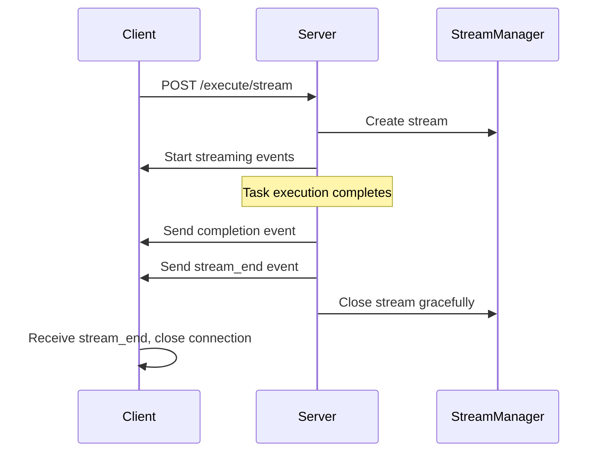

# SSE Stream Closing Race Condition Fix

## Problem Analysis

### Current Issue

The SSE stream is being closed prematurely by the client before the server has finished sending all completion events. This results in:

1. **Lost completion messages** - The final "Task completed successfully" message never reaches the client
2. **Race condition** - Client calls `res.destroy()` immediately upon receiving completion events
3. **Server attempts to send to closed stream** - Server tries to emit completion events after stream is closed

### Root Cause

In `api-client.js`, the client immediately destroys the response stream when it receives completion events:

```javascript
// Lines 997 and 1089 in api-client.js
case "complete":
case "completion":
    // ... process completion
    res.destroy()  // ❌ IMMEDIATE DESTRUCTION
    return
```

This happens before the server has finished processing and sending all completion-related events.

## Solution Architecture

### 1. Server-Initiated Stream Closure

Instead of client-initiated closure, implement server-initiated closure with proper signaling:



### 2. Graceful Stream Termination Protocol

#### Server Side Changes

1. **Add `stream_end` event type** to signal proper stream termination
2. **Delay stream closure** until all completion events are sent
3. **Implement completion event queue** to ensure proper ordering

#### Client Side Changes

1. **Remove immediate `res.destroy()`** calls
2. **Wait for `stream_end` event** before closing connection
3. **Add timeout fallback** for safety

## Implementation Plan

### Phase 1: Server-Side Stream Management

1. **Add new SSE event type**: `stream_end`
2. **Modify SSEOutputAdapter**: Queue completion events and send `stream_end`
3. **Update StreamManager**: Implement graceful closure with delay
4. **Modify FastifyServer**: Ensure proper completion event ordering

### Phase 2: Client-Side Stream Handling

1. **Update api-client.js**: Remove immediate `res.destroy()` calls
2. **Implement proper event handling**: Wait for `stream_end` before closing
3. **Add timeout protection**: Fallback closure after reasonable timeout
4. **Maintain backward compatibility**: Handle both old and new protocols

### Phase 3: Testing and Validation

1. **Unit tests**: Test stream closure scenarios
2. **Integration tests**: Test complete request/response cycles
3. **Load testing**: Ensure no resource leaks with multiple streams
4. **Backward compatibility**: Test with existing clients

## Technical Details

### New SSE Event Type

```typescript
export const SSE_EVENTS = {
	// ... existing events
	STREAM_END: "stream_end",
}
```

### Server-Side Completion Flow

```typescript
// In SSEOutputAdapter
async emitCompletion(message: string): Promise<void> {
    // Send completion event
    const completionEvent: SSEEvent = {
        type: SSE_EVENTS.COMPLETION,
        jobId: this.jobId,
        timestamp: new Date().toISOString(),
        message: message
    }
    this.emitEvent(completionEvent)

    // Send stream end event after a small delay
    setTimeout(() => {
        const endEvent: SSEEvent = {
            type: SSE_EVENTS.STREAM_END,
            jobId: this.jobId,
            timestamp: new Date().toISOString(),
            message: "Stream ending"
        }
        this.emitEvent(endEvent)

        // Close stream after end event is sent
        setTimeout(() => {
            this.close()
        }, 100)
    }, 50)
}
```

### Client-Side Event Handling

```javascript
// In api-client.js testStreamingEndpoint()
switch (filteredData.type) {
	case "complete":
	case "completion":
		// Process completion but DON'T close stream
		if (showResponse && shouldDisplay) {
			// ... show completion content
		}
		// DON'T call res.destroy() here
		break

	case "stream_end":
		// NOW we can safely close the stream
		console.log("Stream ended by server")
		res.destroy()
		return

	// ... other cases
}

// Add timeout fallback
const streamTimeout = setTimeout(() => {
	console.log("Stream timeout - forcing closure")
	res.destroy()
}, 30000) // 30 second timeout

res.on("end", () => {
	clearTimeout(streamTimeout)
	resolve()
})
```

## Benefits

1. **Eliminates race condition** - Server controls when stream closes
2. **Ensures complete data transmission** - All events sent before closure
3. **Maintains reliability** - Timeout fallback prevents hanging connections
4. **Backward compatible** - Can support both protocols during transition
5. **Better error handling** - Clear separation between completion and termination

## Risks and Mitigations

### Risk: Resource Leaks

- **Mitigation**: Implement timeout fallbacks and proper cleanup
- **Monitoring**: Add metrics for stream lifecycle tracking

### Risk: Increased Latency

- **Mitigation**: Keep delays minimal (50-100ms)
- **Testing**: Measure impact on response times

### Risk: Breaking Changes

- **Mitigation**: Implement backward compatibility
- **Rollout**: Gradual deployment with feature flags

## Success Metrics

1. **Zero lost completion messages** - All completion events reach client
2. **No stream resource leaks** - Proper cleanup of all streams
3. **Maintained performance** - No significant latency increase
4. **Client compatibility** - Works with existing and new clients

## Next Steps

1. **Create product stories** for each implementation phase
2. **Design detailed API changes** for server and client
3. **Implement server-side changes** first
4. **Update client with backward compatibility**
5. **Test thoroughly** before production deployment
