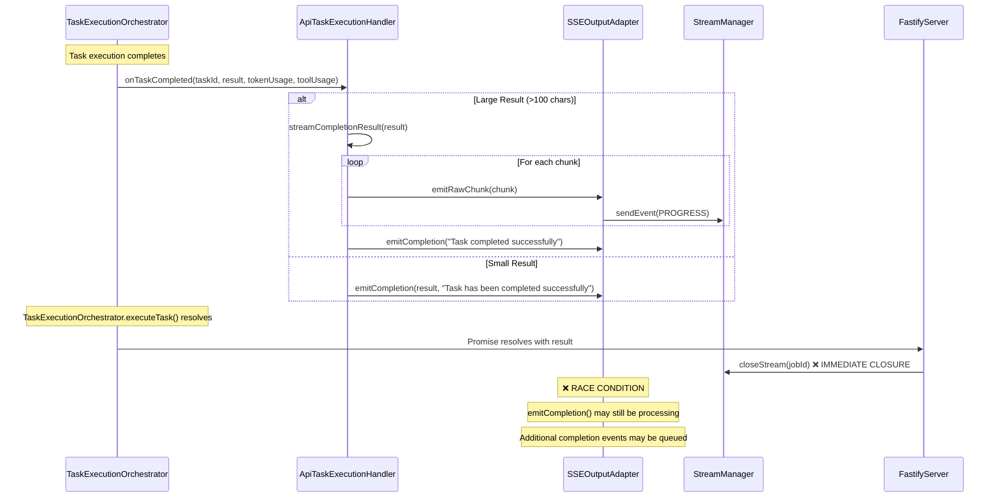
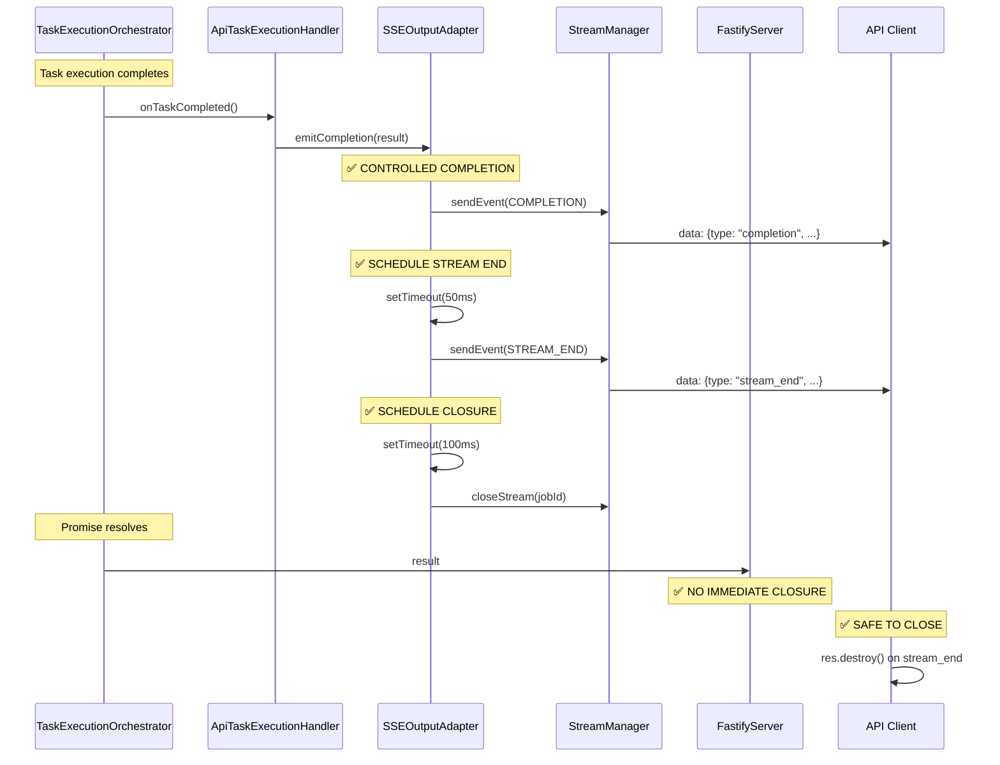

# SSE Stream End Event - Trigger Analysis

## Current Flow Analysis

Based on the code analysis, here's the complete flow that leads to stream closure:

### 1. Task Execution Completion Flow



### 2. The Problem: Immediate Stream Closure

In `FastifyServer.ts` lines 420-433:

```typescript
this.taskExecutionOrchestrator
	.executeTask(taskInstance, taskPromise, executionHandler, executionOptions)
	.then(async (result) => {
		console.log(`[FastifyServer] Task execution completed for job ${job.id}:`, result.reason)
		// ... logging

		// ❌ IMMEDIATE CLOSURE - This is the problem!
		this.streamManager.closeStream(job.id)
	})
```

**The issue**: `closeStream()` is called immediately when the orchestrator promise resolves, but:

- `ApiTaskExecutionHandler.onTaskCompleted()` may still be executing
- `SSEOutputAdapter.emitCompletion()` may still be sending events
- Additional completion-related events may be queued

## Solution: Stream End Event Triggers

### Trigger Point 1: After emitCompletion() Completes

The `stream_end` event should be triggered **after** all completion events have been sent:

```typescript
// In SSEOutputAdapter.emitCompletion()
async emitCompletion(message: string = "Task completed", result?: any): Promise<void> {
    // ... existing completion logic

    // ✅ NEW: Schedule stream_end event after completion processing
    setTimeout(() => {
        this.emitStreamEnd()
    }, 50) // Small delay to ensure completion events are sent
}

private async emitStreamEnd(): Promise<void> {
    const endEvent: SSEEvent = {
        type: SSE_EVENTS.STREAM_END,
        jobId: this.jobId,
        timestamp: new Date().toISOString(),
        message: "Stream ending"
    }

    this.emitEvent(endEvent)

    // Schedule actual stream closure after end event is sent
    setTimeout(() => {
        this.close()
    }, 100)
}
```

### Trigger Point 2: After Chunked Completion Streaming

For large results that are streamed in chunks:

```typescript
// In ApiTaskExecutionHandler.streamCompletionResult()
private async streamCompletionResult(result: string): Promise<void> {
    // ... existing chunking logic

    // Send final completion event
    await this.sseAdapter.emitCompletion("Task completed successfully", "Task has been completed successfully")

    // ✅ The emitCompletion() call above will trigger stream_end via the timeout mechanism
}
```

### Trigger Point 3: Remove Immediate Closure from FastifyServer

```typescript
// In FastifyServer.ts - REMOVE immediate closeStream call
this.taskExecutionOrchestrator
	.executeTask(taskInstance, taskPromise, executionHandler, executionOptions)
	.then(async (result) => {
		console.log(`[FastifyServer] Task execution completed for job ${job.id}:`, result.reason)
		// ... logging

		// ✅ REMOVE THIS LINE - let SSEOutputAdapter handle closure
		// this.streamManager.closeStream(job.id)
	})
```

## Complete Trigger Flow



## Timing Analysis

### Current Problematic Timing

```
T+0ms:    Task completes
T+0ms:    onTaskCompleted() starts
T+0ms:    FastifyServer promise resolves
T+0ms:    closeStream() called ❌ IMMEDIATE
T+5ms:    emitCompletion() tries to send event ❌ FAILS
```

### New Controlled Timing

```
T+0ms:    Task completes
T+0ms:    onTaskCompleted() starts
T+0ms:    FastifyServer promise resolves (no immediate closure)
T+10ms:   emitCompletion() sends completion event ✅
T+60ms:   emitStreamEnd() sends stream_end event ✅
T+160ms:  closeStream() called ✅ SAFE
```

## Implementation Summary

### What Triggers `stream_end`?

1. **Primary Trigger**: `SSEOutputAdapter.emitCompletion()` completion

    - After all completion events are sent
    - Uses `setTimeout(50ms)` to ensure completion events are flushed

2. **Secondary Trigger**: End of chunked completion streaming

    - After `streamCompletionResult()` finishes sending all chunks
    - Calls `emitCompletion()` which triggers the primary flow

3. **Fallback Trigger**: Error conditions
    - If task fails, `emitError()` should also trigger stream end
    - Timeout protection in case of hanging streams

### What Does NOT Trigger `stream_end`?

- ❌ TaskExecutionOrchestrator promise resolution
- ❌ FastifyServer task completion handler
- ❌ Client-side events or timeouts
- ❌ Manual stream closure calls

### Key Benefits

1. **Server-Controlled**: Stream closure is managed by the component that sends events
2. **Event-Ordered**: Completion events are guaranteed to be sent before stream_end
3. **Race-Condition Free**: No more premature closures
4. **Timeout Protected**: Fallback mechanisms prevent hanging streams
5. **Backward Compatible**: Can support both old and new protocols

This approach ensures that the `stream_end` event is triggered at exactly the right time - after all completion content has been sent but before the stream is actually closed.
