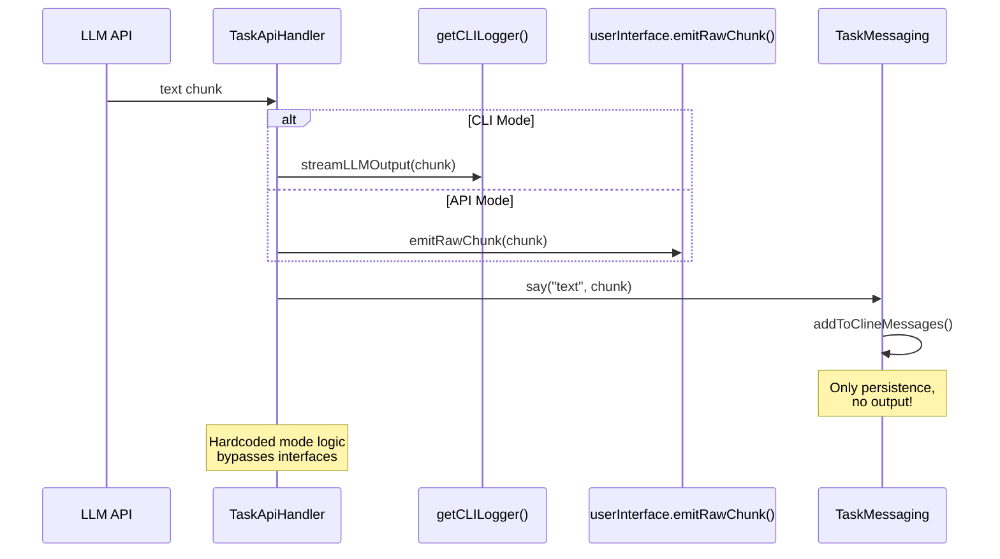
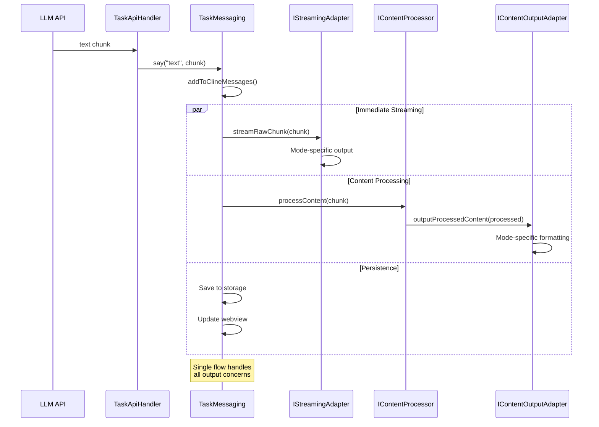

# Streaming Architecture Diagrams

## Current Architecture (Problematic)

```mermaid
graph TD
    A[TaskApiHandler] --> B{this.cliMode?}
    B -->|true| C[getCLILogger().streamLLMOutput()]
    B -->|false| D[task.userInterface.emitRawChunk()]
    A --> E[TaskMessaging.say()]
    E --> F[TaskMessaging.addToClineMessages()]
    F --> G[Persistence Only]

    H[FastifyServer] --> I[SSEStreamingAdapter - CREATED BUT UNUSED]
    H --> J[SSEContentOutputAdapter - CREATED BUT UNUSED]

    style B fill:#ff6b6b
    style C fill:#ff6b6b
    style D fill:#ff6b6b
    style I fill:#ff6b6b
    style J fill:#ff6b6b

    classDef problem fill:#ff6b6b,stroke:#333,stroke-width:2px
    classDef unused fill:#ffd93d,stroke:#333,stroke-width:2px
```

**Problems:**

- 🔴 Hardcoded mode detection bypasses interfaces
- 🔴 Output adapters created but never used
- 🔴 Valuable logic in TaskMessaging is bypassed
- 🔴 Inconsistent behavior across modes

## Proposed Architecture (Solution)

```mermaid
graph TD
    A[TaskApiHandler] --> B[TaskMessaging.say()]
    B --> C[TaskMessaging.addToClineMessages()]

    C --> D[IStreamingAdapter.streamRawChunk()]
    C --> E[IContentProcessor.processContent()]
    E --> F[IContentOutputAdapter.outputProcessedContent()]
    C --> G[Persistence & Webview]

    H[Task Constructor] --> I{Mode Detection}
    I -->|provider exists| J[VSCodeStreamingAdapter]
    I -->|userInterface is SSE| K[SSEStreamingAdapter]
    I -->|CLI mode| L[CLIStreamingAdapter]

    I -->|provider exists| M[VSCodeContentOutputAdapter]
    I -->|userInterface is SSE| N[SSEContentOutputAdapter]
    I -->|CLI mode| O[CLIContentOutputAdapter]

    J --> P[Inject into TaskMessaging]
    K --> P
    L --> P
    M --> P
    N --> P
    O --> P

    style A fill:#4ecdc4
    style B fill:#4ecdc4
    style C fill:#4ecdc4
    style D fill:#95e1d3
    style E fill:#95e1d3
    style F fill:#95e1d3
    style H fill:#45b7d1

    classDef solution fill:#4ecdc4,stroke:#333,stroke-width:2px
    classDef interface fill:#95e1d3,stroke:#333,stroke-width:2px
    classDef factory fill:#45b7d1,stroke:#333,stroke-width:2px
```

**Benefits:**

- ✅ Single code path through TaskMessaging
- ✅ True interface abstraction with adapters
- ✅ All adapters properly utilized
- ✅ Consistent behavior across all modes

## Data Flow Comparison

### Current Flow (Problematic)



### Proposed Flow (Solution)



## Adapter Hierarchy

```mermaid
classDiagram
    class IStreamingAdapter {
        <<interface>>
        +streamRawChunk(chunk: string) Promise~void~
        +reset() void
    }

    class IContentOutputAdapter {
        <<interface>>
        +outputProcessedContent(content: ProcessedContent[]) Promise~void~
        +reset() void
    }

    class CLIStreamingAdapter {
        +streamRawChunk(chunk: string)
        +reset()
    }

    class SSEStreamingAdapter {
        -sseAdapter: SSEOutputAdapter
        +streamRawChunk(chunk: string)
        +reset()
    }

    class VSCodeStreamingAdapter {
        -provider: ClineProvider
        +streamRawChunk(chunk: string)
        +reset()
    }

    class CLIContentOutputAdapter {
        -useColor: boolean
        +outputProcessedContent(content: ProcessedContent[])
        +reset()
    }

    class SSEContentOutputAdapter {
        -sseAdapter: SSEOutputAdapter
        +outputProcessedContent(content: ProcessedContent[])
        +reset()
    }

    class VSCodeContentOutputAdapter {
        -provider: ClineProvider
        +outputProcessedContent(content: ProcessedContent[])
        +reset()
    }

    IStreamingAdapter <|-- CLIStreamingAdapter
    IStreamingAdapter <|-- SSEStreamingAdapter
    IStreamingAdapter <|-- VSCodeStreamingAdapter

    IContentOutputAdapter <|-- CLIContentOutputAdapter
    IContentOutputAdapter <|-- SSEContentOutputAdapter
    IContentOutputAdapter <|-- VSCodeContentOutputAdapter
```



## Implementation Phases

```mermaid
gantt
    title Streaming Architecture Refactor Timeline
    dateFormat  X
    axisFormat %s

    section Phase 1: Foundation
    Update TaskMessaging Constructor    :phase1a, 0, 3
    Create VSCode Adapters             :phase1b, 1, 3
    Basic Unit Tests                   :phase1c, 2, 3

    section Phase 2: Integration
    Enhance addToClineMessages         :phase2a, 3, 6
    Add Adapter Factory to Task        :phase2b, 4, 6
    Integration Tests                  :phase2c, 5, 6

    section Phase 3: Cleanup
    Simplify TaskApiHandler            :phase3a, 6, 9
    Update FastifyServer               :phase3b, 7, 9
    End-to-End Tests                   :phase3c, 8, 9

    section Phase 4: Validation
    Performance Testing                :phase4a, 9, 12
    Error Handling Validation          :phase4b, 10, 12
    Release Preparation                :phase4c, 11, 12
```



This architecture provides clean separation of concerns while maintaining high performance streaming capabilities across all platforms.
