# Task Restart Architecture

## System Architecture Overview

This document provides architectural diagrams and flow charts for the task restart functionality.

## High-Level Architecture

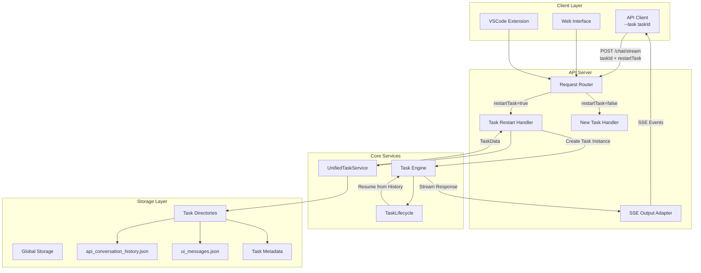

## Task Restart Flow

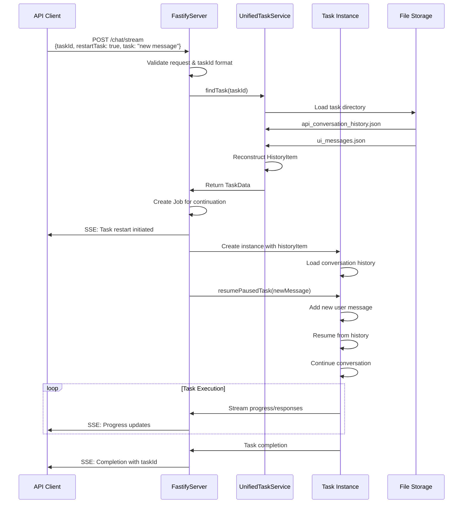

## Cross-Context Task Access

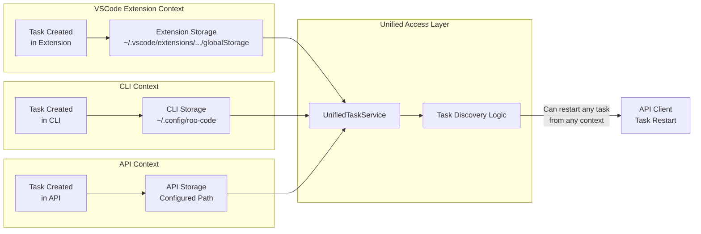

## Task State Restoration

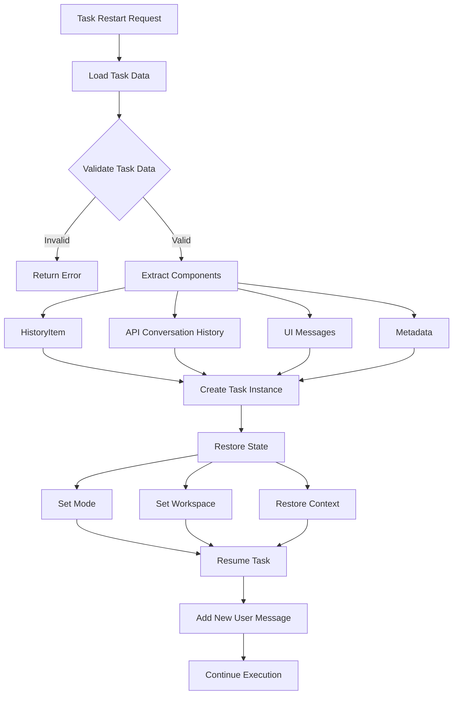

## Storage Structure

```
globalStoragePath/
├── tasks/
│   ├── {taskId-1}/
│   │   ├── api_conversation_history.json    # API messages with timestamps
│   │   ├── ui_messages.json                 # UI display messages
│   │   ├── task_metadata.json              # Task metadata (optional)
│   │   └── checkpoints/                     # Checkpoint data (if enabled)
│   ├── {taskId-2}/
│   │   ├── api_conversation_history.json
│   │   ├── ui_messages.json
│   │   └── ...
│   └── ...
├── settings/
│   ├── custom_modes.yaml
│   └── mcp_settings.json
└── logs/
    └── system-prompt-*.txt
```

## Data Flow Architecture

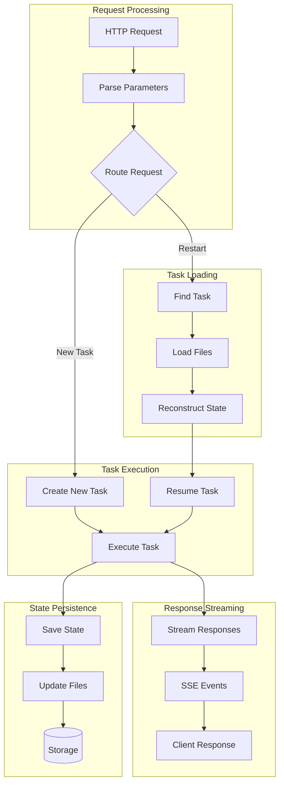

## Error Handling Flow

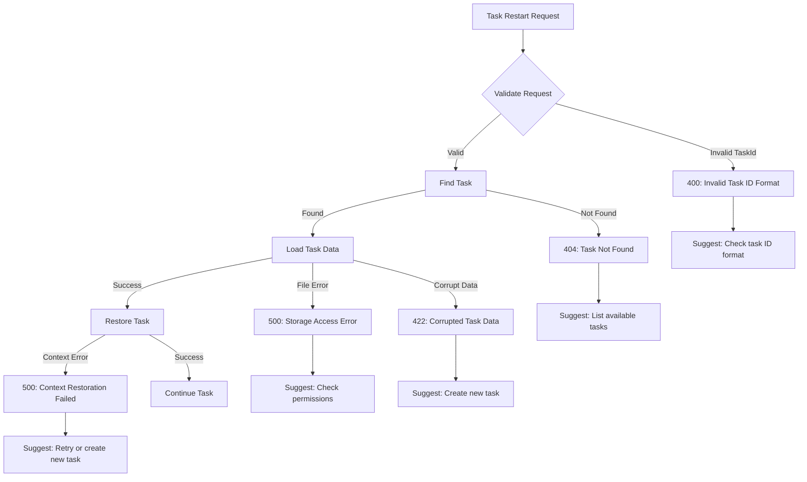

## Security Architecture

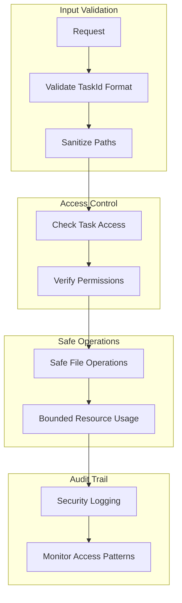

## Performance Considerations

### Task Loading Optimization

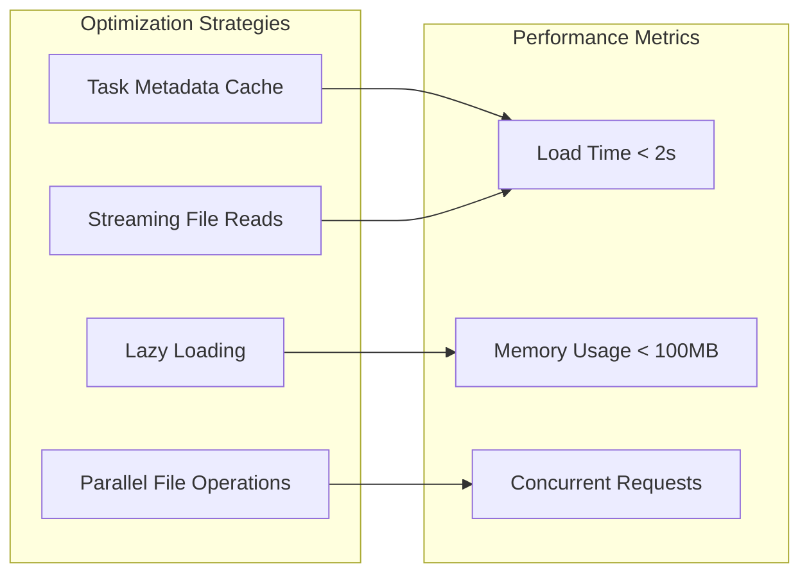

### Scalability Architecture

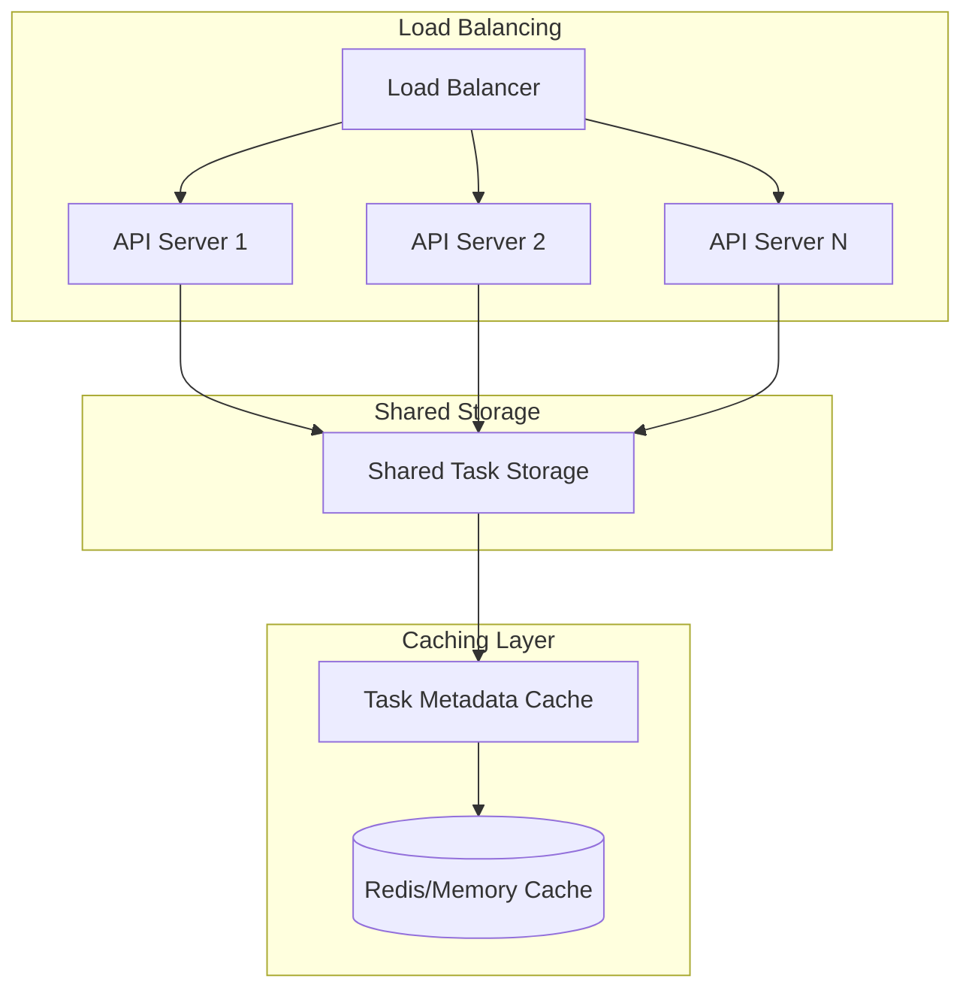

## Integration Points

### VSCode Extension Integration

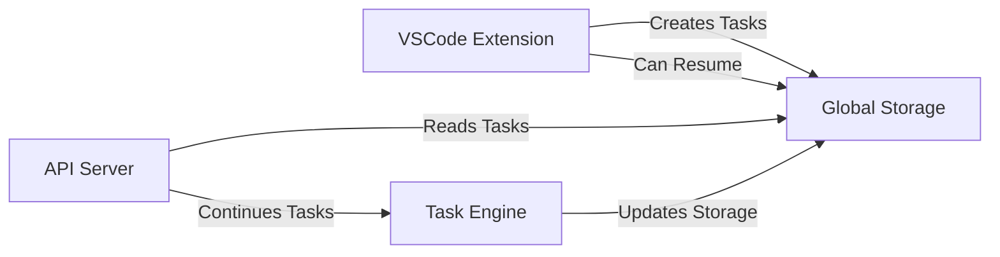

### CLI Integration

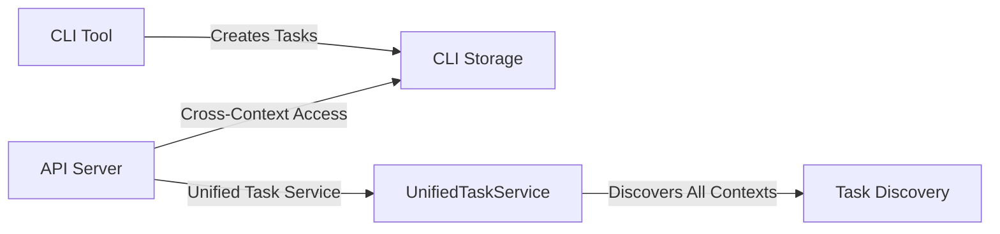

This architecture ensures that task restart functionality is robust, secure, and performant while maintaining compatibility across all execution contexts.
