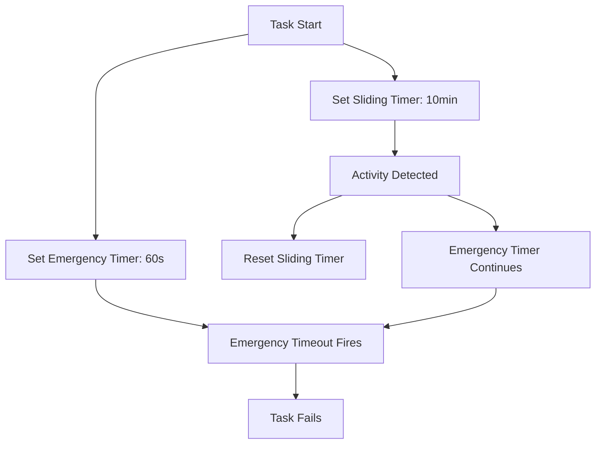
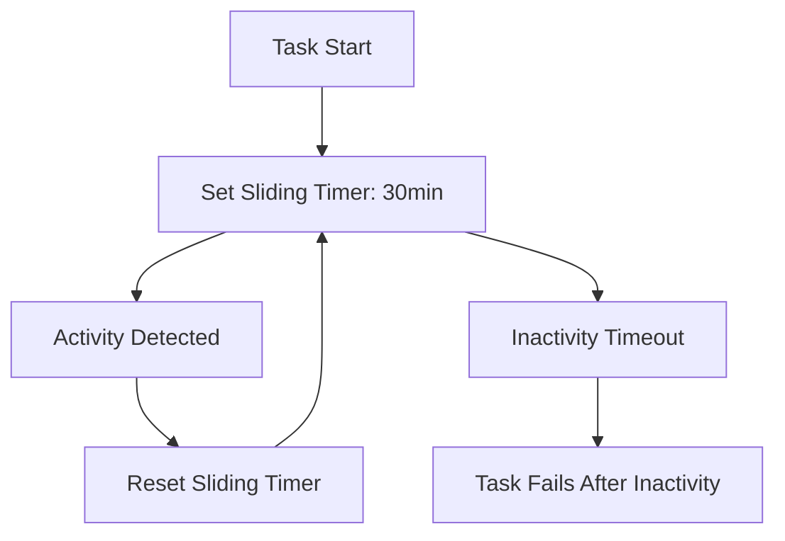

# Timeout System Technical Analysis

## Current Implementation Analysis

### Problem Identification

The API is experiencing "Emergency timeout after 60 seconds" errors due to a dual timeout system:

1. **Emergency Timeout**: Hard 60-second limit that never resets
2. **Sliding Timeout**: Activity-based timeout that resets on task activity

### Code Location Analysis

#### Emergency Timeout Implementation

- **File**: `src/core/task/execution/TaskExecutionOrchestrator.ts`
- **Lines**: 149-156
- **Logic**: Fixed timeout that never resets, applied to ALL tasks

```typescript
// Emergency timeout
const emergencyTimeout = options.emergencyTimeoutMs || 60000
const emergencyTimeoutId = setTimeout(() => {
	if (!state.isCompleted) {
		rejectOnce(new Error(`Emergency timeout after ${emergencyTimeout / 1000} seconds`))
	}
}, emergencyTimeout)
```

#### Sliding Timeout Implementation

- **File**: `src/core/task/execution/TaskExecutionOrchestrator.ts`
- **Lines**: 169-200
- **Logic**: Resets on activity, works correctly

```typescript
const resetTimeout = () => {
	state.lastActivityTime = Date.now()
	// ... timeout reset logic
}
```

#### Configuration Source

- **File**: `src/api/server/FastifyServer.ts`
- **Lines**: 294-296
- **Current Values**:
    - `emergencyTimeoutMs: 60000` (60 seconds - PROBLEMATIC)
    - `slidingTimeoutMs: 600000` (10 minutes - works fine)

### Root Cause

The emergency timeout is designed as a "safety net" but becomes the primary failure point because:

1. It's shorter than the sliding timeout (60s vs 10min)
2. It never resets on activity
3. It applies to all tasks, including long-running ones

## Technical Solution Design

### Architecture Changes

#### 1. Remove Emergency Timeout from Standard Tasks

**Current Flow**:



**Proposed Flow**:



#### 2. Enhanced Configuration System

```typescript
interface TaskExecutionOptions {
	// Remove: emergencyTimeoutMs?: number
	slidingTimeoutMs?: number // Enhanced with env var support
	infoQueryTimeoutMs?: number // Keep for info queries
	maxSlidingTimeoutMs?: number // New: upper bound
}
```

#### 3. Activity Detection Enhancement

**Current Activity Types**:

- User input/responses
- Basic task events

**Enhanced Activity Types**:

- Tool executions (file operations, commands)
- LLM streaming responses
- Progress updates
- Mode switches
- Task spawning
- User interactions

### Implementation Plan

#### Phase 1: Emergency Timeout Removal

1. **TaskExecutionOrchestrator.ts**:

    - Remove emergency timeout logic from `executeStandardTask()`
    - Keep emergency timeout for info queries (different use case)
    - Update timer management

2. **FastifyServer.ts**:

    - Remove `emergencyTimeoutMs` from execution options
    - Update default `slidingTimeoutMs` to 30 minutes

3. **types.ts**:
    - Remove `emergencyTimeoutMs` from interface
    - Add documentation for remaining timeout options

#### Phase 2: Configuration Enhancement

1. **Environment Variables**:

    ```bash
    TASK_DEFAULT_SLIDING_TIMEOUT_MS=1800000  # 30 minutes
    TASK_MAX_SLIDING_TIMEOUT_MS=86400000     # 24 hours
    ```

2. **API Parameter Support**:

    ```typescript
    POST /api/tasks
    {
      "message": "...",
      "slidingTimeoutMs": 3600000  // Override per request
    }
    ```

3. **Validation Logic**:
    - Ensure timeout values are within bounds
    - Provide sensible defaults
    - Log configuration choices

#### Phase 3: Activity Detection

1. **Enhanced Activity Tracking**:

    - Monitor all tool executions
    - Track LLM response streaming
    - Detect user interaction patterns
    - Log activity for debugging

2. **Timeout Reset Logic**:
    - Ensure all activity types call `resetTimeout()`
    - Add activity type metadata
    - Improve logging for timeout debugging

### Testing Strategy

#### Unit Tests

- Test timeout logic in isolation
- Mock timer functions for predictable testing
- Test configuration validation
- Test activity detection

#### Integration Tests

- Test across CLI, API, and Extension contexts
- Test long-running task scenarios
- Test activity-based timeout resets
- Test configuration override behavior

#### Performance Tests

- Verify timeout overhead is minimal
- Test with high activity frequency
- Test memory usage with long-running tasks

### Migration Considerations

#### Backward Compatibility

- API requests without timeout parameters use new defaults
- Existing behavior preserved for info queries
- No breaking changes to public APIs

#### Monitoring

- Add metrics for timeout events
- Track timeout configuration usage
- Monitor task duration patterns

#### Documentation Updates

- API documentation for new timeout parameters
- Configuration guide for environment variables
- Troubleshooting guide for timeout issues
- Migration guide for users experiencing timeout issues

### Risk Assessment

#### Low Risk

- Removing emergency timeout (eliminates current problem)
- Increasing default sliding timeout (more permissive)

#### Medium Risk

- Configuration changes (need proper validation)
- Activity detection changes (need thorough testing)

#### Mitigation Strategies

- Gradual rollout with monitoring
- Comprehensive testing across all contexts
- Clear documentation and migration guides
- Rollback plan if issues arise

### Future Considerations

#### State Persistence Integration

- Design timeout system to work with task pause/resume
- Consider cumulative vs. activity-based timing
- Plan for task state serialization

#### Advanced Timeout Policies

- Different timeout policies per task type
- User-configurable timeout preferences
- Adaptive timeout based on task complexity

#### Monitoring and Observability

- Timeout event metrics
- Task duration analytics
- Activity pattern analysis
- Performance impact monitoring
