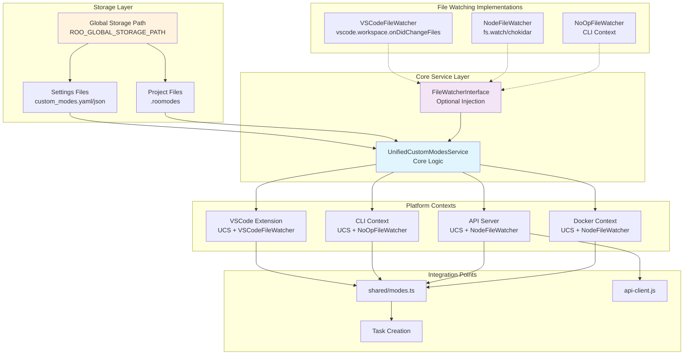

# Unified Custom Modes Architecture

## Overview

This document outlines the architecture for implementing unified custom modes support across all execution contexts: VSCode Extension, CLI, API, and Docker environments.

## Current State Analysis

### Existing Implementation

- **VSCode Extension**: Uses `CustomModesManager` to load custom modes from global settings and `.roomodes` files
- **CLI**: Only validates against hardcoded built-in modes, no custom mode loading
- **API**: No custom mode support, defaults to "code" mode
- **Docker**: Storage paths configurable but custom modes not loaded

### Storage Configuration

- Environment variables: `ROO_GLOBAL_STORAGE_PATH`, `API_STORAGE_ROOT`
- Docker mounts: `./storage:/app/.roo-storage:rw`
- Custom modes files: `docker/development/storage/settings/custom_modes.yaml`

## Architecture Design

### Core Principles

1. **Single Unified Service**: One `UnifiedCustomModesService` used across all contexts
2. **Dependency Injection**: File watching capability injected only where needed
3. **Context-Aware**: Different initialization based on execution context
4. **Read-Only API**: Focus on consumption, not management via API

### Architecture Diagram



## Technical Implementation

### 1. UnifiedCustomModesService Interface

```typescript
export interface CustomModesServiceOptions {
	storagePath: string
	fileWatcher?: FileWatcherInterface
	enableProjectModes?: boolean
	workspacePath?: string
}

export class UnifiedCustomModesService {
	private cachedModes: ModeConfig[] | null = null
	private cachedAt: number = 0
	private readonly cacheTTL = 10_000

	constructor(private options: CustomModesServiceOptions) {
		this.setupFileWatching()
	}

	async loadCustomModes(): Promise<ModeConfig[]> {
		// Load from global settings
		const globalModes = await this.loadGlobalModes()

		// Load from project .roomodes if enabled
		const projectModes = this.options.enableProjectModes ? await this.loadProjectModes() : []

		// Merge with project taking precedence
		return this.mergeModes(projectModes, globalModes)
	}

	private setupFileWatching(): void {
		if (!this.options.fileWatcher) return

		const watchPaths = [
			path.join(this.options.storagePath, "settings", "custom_modes.yaml"),
			path.join(this.options.storagePath, "settings", "custom_modes.json"),
		]

		if (this.options.workspacePath) {
			watchPaths.push(path.join(this.options.workspacePath, ".roomodes"))
		}

		this.options.fileWatcher.watch(watchPaths, () => {
			this.invalidateCache()
		})
	}
}
```

### 2. File Watcher Implementations

```typescript
// FileWatcherInterface
export interface FileWatcherInterface {
	watch(paths: string[], callback: () => void): void
	dispose(): void
}

// NoOpFileWatcher for CLI
export class NoOpFileWatcher implements FileWatcherInterface {
	watch(paths: string[], callback: () => void): void {
		// No-op for CLI context
	}
	dispose(): void {}
}

// NodeFileWatcher for API/Docker
export class NodeFileWatcher implements FileWatcherInterface {
	private watchers: fs.FSWatcher[] = []

	watch(paths: string[], callback: () => void): void {
		paths.forEach((path) => {
			if (fs.existsSync(path)) {
				const watcher = fs.watch(path, callback)
				this.watchers.push(watcher)
			}
		})
	}

	dispose(): void {
		this.watchers.forEach((w) => w.close())
		this.watchers = []
	}
}

// VSCodeFileWatcher for extension
export class VSCodeFileWatcher implements FileWatcherInterface {
	private disposables: vscode.Disposable[] = []

	constructor(private context: vscode.ExtensionContext) {}

	watch(paths: string[], callback: () => void): void {
		const watcher = vscode.workspace.onDidChangeFiles((event) => {
			if (event.files.some((file) => paths.some((path) => arePathsEqual(file.fsPath, path)))) {
				callback()
			}
		})
		this.disposables.push(watcher)
	}

	dispose(): void {
		this.disposables.forEach((d) => d.dispose())
		this.disposables = []
	}
}
```

### 3. Context-Specific Initialization

```typescript
// CLI Context (src/cli/index.ts)
const storagePath = getStoragePath()
const customModesService = new UnifiedCustomModesService({
	storagePath,
	fileWatcher: new NoOpFileWatcher(),
	enableProjectModes: true,
	workspacePath: options.cwd,
})

// API Context (src/api/server/FastifyServer.ts)
const storagePath = process.env.ROO_GLOBAL_STORAGE_PATH || getStoragePath()
const customModesService = new UnifiedCustomModesService({
	storagePath,
	fileWatcher: new NodeFileWatcher(),
	enableProjectModes: false, // API typically doesn't have workspace context
})

// VSCode Context (src/core/webview/ClineProvider.ts)
const customModesService = new UnifiedCustomModesService({
	storagePath: context.globalStorageUri.fsPath,
	fileWatcher: new VSCodeFileWatcher(context),
	enableProjectModes: true,
	workspacePath: getWorkspacePath(),
})
```

## File Structure

```
src/
├── shared/
│   └── services/
│       ├── UnifiedCustomModesService.ts
│       └── watchers/
│           ├── FileWatcherInterface.ts
│           ├── NoOpFileWatcher.ts
│           ├── NodeFileWatcher.ts
│           └── VSCodeFileWatcher.ts
├── cli/
│   ├── index.ts (updated)
│   └── config/CliConfigManager.ts (updated)
├── api/
│   └── server/FastifyServer.ts (updated)
└── core/
    ├── config/CustomModesManager.ts (refactored)
    └── webview/ClineProvider.ts (updated)

api-client.js (updated)
```

## Configuration Examples

### Environment Variables

```bash
# Global storage path (used by all contexts)
ROO_GLOBAL_STORAGE_PATH=/app/.roo-storage

# API-specific storage override
API_STORAGE_ROOT=/app/.roo-storage

# CLI storage path
ROO_CLI_STORAGE_PATH=/app/.roo-cli
```

### CLI Usage

```bash
# Use custom mode
roo-cli --mode product-owner "Create a PRD for user authentication"

# Use built-in mode
roo-cli --mode code "Fix this bug"
```

### API Usage

```bash
# Test API with custom mode
./api-client.js --stream --mode ticket-oracle "What's the status of ticket 12345?"

# API request payload
{
  "task": "Create a PRD for user authentication",
  "mode": "product-owner",
  "verbose": true
}
```

### Docker Compose

```yaml
environment:
    - ROO_GLOBAL_STORAGE_PATH=/app/.roo-storage
volumes:
    - ./storage:/app/.roo-storage:rw
```

## Benefits

- ✅ Single unified service across all contexts
- ✅ Dependency injection for file watching
- ✅ Context-appropriate initialization
- ✅ Minimal changes to existing code
- ✅ Clear separation of concerns
- ✅ Easy testing and maintenance
- ✅ Consistent behavior across platforms
- ✅ Configurable storage paths
- ✅ Hot-reloading where needed
