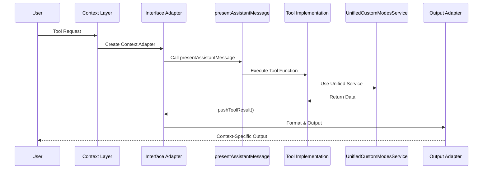
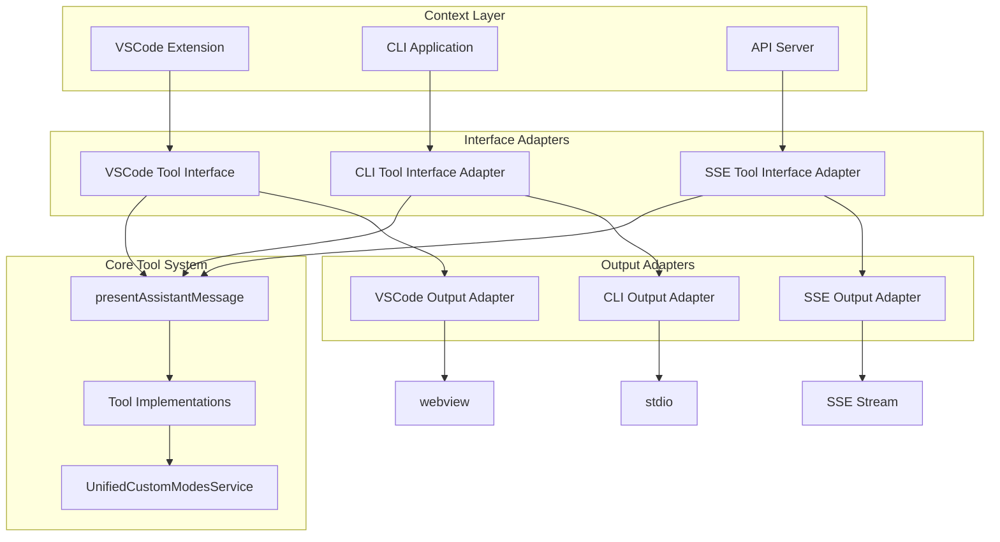

# Technical Architecture: Unified Tool Execution

## Overview

This document provides the technical architecture details for the unified tool execution system that consolidates tool handling across VSCode Extension, CLI, and API contexts while preserving existing output mechanisms.

## Current Architecture Issues

### Problem: Dual Tool Execution Systems

```typescript
// VSCode Extension - Complete tool coverage
switch (block.name) {
	case "list_modes":
		await listModesTool(cline, block, askApproval, handleError, pushToolResult, removeClosingTag)
	// ... all tools available
}

// CLI/API - Incomplete tool coverage
switch (toolName) {
	case "write_to_file": {
		/* implementation */
	}
	case "read_file": {
		/* implementation */
	}
	// Missing: list_modes, switch_mode, new_task
	default:
		throw new Error(`Tool ${toolName} not implemented for CLI mode`)
}
```

### Root Cause Analysis

1. **Architectural Divergence**: VSCode uses `presentAssistantMessage` pattern, CLI/API use `executeCliTool`
2. **Incomplete Implementation**: CLI switch statement missing several tools
3. **Service Integration Gap**: `UnifiedCustomModesService` not properly integrated
4. **Maintenance Burden**: Duplicate tool implementations

## Target Architecture

### Unified Tool Execution Flow



### Component Architecture



## Interface Specifications

### Tool Interface Adapter Contract

```typescript
interface ToolInterfaceAdapter {
	askApproval: AskApproval
	handleError: HandleError
	pushToolResult: PushToolResult
	removeClosingTag: RemoveClosingTag
}

type AskApproval = (type: string, message: string) => Promise<boolean>
type HandleError = (operation: string, error: any) => Promise<void>
type PushToolResult = (result: string) => void
type RemoveClosingTag = (str: string) => string
```

### CLI Tool Interface Adapter

```typescript
export class CLIToolInterfaceAdapter implements ToolInterfaceAdapter {
	constructor(private outputAdapter: CLIOutputAdapter) {}

	askApproval: AskApproval = async (type: string, message: string) => {
		if (this.outputAdapter.isInteractive()) {
			return await this.outputAdapter.promptUser(message)
		}
		return true // Auto-approve in batch mode
	}

	handleError: HandleError = async (operation: string, error: any) => {
		await this.outputAdapter.showError(`Error in ${operation}: ${error.message}`)
	}

	pushToolResult: PushToolResult = (result: string) => {
		this.outputAdapter.showToolResult(result)
	}

	removeClosingTag: RemoveClosingTag = (str: string) => {
		return str.replace(/<\/[^>]+>$/, "")
	}
}
```

### SSE Tool Interface Adapter

```typescript
export class SSEToolInterfaceAdapter implements ToolInterfaceAdapter {
	constructor(
		private sseAdapter: SSEOutputAdapter,
		private taskApiHandler: TaskApiHandler,
	) {}

	askApproval: AskApproval = async (type: string, message: string) => {
		// Auto-approve for now, could integrate with question system
		return true
	}

	handleError: HandleError = async (operation: string, error: any) => {
		await this.sseAdapter.emitError(error)
	}

	pushToolResult: PushToolResult = (result: string) => {
		// Add to conversation history
		this.taskApiHandler.streamingState.userMessageContent.push({
			type: "text",
			text: `<tool_result>\n${result}\n</tool_result>`,
		})
		// Emit real-time SSE event
		this.sseAdapter.emitToolResult(result)
	}

	removeClosingTag: RemoveClosingTag = (str: string) => {
		return str.replace(/<\/[^>]+>$/, "")
	}
}
```

## Service Integration Architecture

### UnifiedCustomModesService Integration

```typescript
// Task Constructor Enhancement
interface TaskOptions {
	// ... existing options
	customModesService?: UnifiedCustomModesService
	toolInterfaceAdapter?: ToolInterfaceAdapter
}

class Task {
	private customModesService?: UnifiedCustomModesService
	private toolInterfaceAdapter?: ToolInterfaceAdapter

	constructor(options: TaskOptions) {
		// ... existing constructor
		this.customModesService = options.customModesService
		this.toolInterfaceAdapter = options.toolInterfaceAdapter
	}
}
```

### Context-Specific Service Configuration

```typescript
// CLI Context
const cliCustomModesService = new UnifiedCustomModesService({
	storagePath: getStoragePath(),
	fileWatcher: new NoOpFileWatcher(), // No file watching overhead
	enableProjectModes: !!workspacePath,
	workspacePath,
})

// API Context
const apiCustomModesService = new UnifiedCustomModesService({
	storagePath: process.env.ROO_GLOBAL_STORAGE_PATH || getStoragePath(),
	fileWatcher: new NodeFileWatcher(), // Optional file watching
	enableProjectModes: false, // Typically no workspace context
})

// VSCode Context (existing)
const vscodeCustomModesService = new UnifiedCustomModesService({
	storagePath: context.globalStorageUri.fsPath,
	fileWatcher: new VSCodeFileWatcher(context),
	enableProjectModes: true,
	workspacePath: vscode.workspace.workspaceFolders?.[0]?.uri.fsPath,
	onUpdate: () => this.refreshModes(),
})
```

## Output Adapter Enhancements

### CLI Output Adapter Extensions

```typescript
// Extend CLIOutputAdapter with tool support
export class CLIOutputAdapter implements IOutputAdapter {
	// ... existing implementation

	async showToolResult(result: string): Promise<void> {
		const formatted = this.formatToolResult(result)
		await this.outputLogger.logMethodCall("showToolResult", formatted)
		process.stdout.write(formatted + "\n")
	}

	async promptUser(message: string): Promise<boolean> {
		// Use existing CLI prompt infrastructure
		const response = await this.interactivePrompt(message)
		return response.toLowerCase().startsWith("y")
	}

	isInteractive(): boolean {
		return process.stdin.isTTY && !process.env.CI
	}

	private formatToolResult(result: string): string {
		if (this.useColor) {
			return chalk.green("✓ ") + chalk.gray(result)
		}
		return "✓ " + result
	}
}
```

### SSE Output Adapter Extensions

```typescript
// Extend SSEOutputAdapter with tool support
export class SSEOutputAdapter implements IUserInterface {
	// ... existing implementation

	async emitToolResult(result: string): Promise<void> {
		const event: SSEEvent = {
			type: SSE_EVENTS.TOOL_RESULT,
			jobId: this.jobId,
			timestamp: new Date().toISOString(),
			result,
		}
		this.emitEvent(event)
	}

	async emitToolStart(toolName: string, params: any): Promise<void> {
		const event: SSEEvent = {
			type: SSE_EVENTS.TOOL_START,
			jobId: this.jobId,
			timestamp: new Date().toISOString(),
			toolName,
			params,
		}
		this.emitEvent(event)
	}

	async emitToolComplete(toolName: string, success: boolean): Promise<void> {
		const event: SSEEvent = {
			type: SSE_EVENTS.TOOL_COMPLETE,
			jobId: this.jobId,
			timestamp: new Date().toISOString(),
			toolName,
			success,
		}
		this.emitEvent(event)
	}
}
```

## Tool Implementation Updates

### listModesTool Service Integration

```typescript
// Before: Placeholder implementation
async function getCustomModesForContext(cline: Task): Promise<ModeConfig[]> {
	try {
		// For now, return empty array since we don't have direct access to custom modes service
		return []
	} catch (error) {
		console.warn("Failed to load custom modes:", error)
		return []
	}
}

// After: Unified service integration
async function getCustomModesForContext(cline: Task): Promise<ModeConfig[]> {
	if (cline.customModesService) {
		try {
			return await cline.customModesService.getAllModes()
		} catch (error) {
			console.warn("Failed to load custom modes:", error)
		}
	}

	// Fallback to built-in modes only
	const { getAllModes } = await import("../../shared/modes")
	return getAllModes([])
}
```

## Migration Strategy

### Phase 1: Foundation

1. Create interface adapter contracts
2. Implement CLI and SSE tool interface adapters
3. Enhance output adapters with tool support methods
4. Create adapter factory pattern

### Phase 2: CLI Integration

1. Create unified tool execution method in Task
2. Replace first `executeCliTool` call with unified approach
3. Test and validate CLI tool execution
4. Iteratively replace remaining calls

### Phase 3: API Integration

1. Integrate SSE adapter into API execution flow
2. Replace API tool execution with unified approach
3. Test and validate API tool execution
4. Enhance SSE events for tool feedback

### Phase 4: Service Integration

1. Inject `UnifiedCustomModesService` into all Task constructors
2. Update tool implementations to use service
3. Test custom modes across all contexts
4. Validate consistent behavior

### Phase 5: Cleanup and Optimization

1. Remove `executeCliTool` method
2. Clean up unused CLI-specific tool imports
3. Optimize performance and memory usage
4. Update documentation

## Performance Considerations

### Adapter Overhead

- Interface adapters add minimal overhead (~1-2ms per tool call)
- Output adapter enhancements reuse existing infrastructure
- Service integration uses existing caching mechanisms

### Memory Usage

- Adapters are lightweight objects with minimal state
- Service instances are shared across tool calls
- No significant memory overhead expected

### Streaming Performance

- SSE events maintain existing streaming characteristics
- CLI stdio output preserves existing performance
- Tool execution latency unchanged

## Error Handling Strategy

### Graceful Degradation

```typescript
// Service unavailable fallback
if (!cline.customModesService) {
	// Fall back to built-in modes only
	return getBuiltInModes()
}

// Adapter creation failure fallback
if (!toolInterfaceAdapter) {
	// Fall back to basic error handling
	throw new Error("Tool execution not available in this context")
}
```

### Context-Specific Error Handling

- **CLI**: Error messages formatted for terminal display
- **API**: Errors emitted as SSE events with proper structure
- **VSCode**: Errors handled through existing webview error system

## Security Considerations

### Input Validation

- Tool parameters validated before execution
- Service inputs sanitized and validated
- Output formatting prevents injection attacks

### Context Isolation

- Each context maintains appropriate security boundaries
- Service access controlled by context configuration
- Tool execution permissions respect context limitations

## Testing Strategy

### Unit Testing

- Test each adapter implementation independently
- Mock dependencies for isolated testing
- Verify interface compliance and error handling

### Integration Testing

- Test complete tool execution flows
- Validate service integration across contexts
- Test output formatting and streaming

### Performance Testing

- Benchmark tool execution overhead
- Load test API SSE streaming
- Memory usage profiling

## Monitoring and Observability

### Metrics

- Tool execution latency by context
- Error rates by tool and context
- Service integration success rates
- Output adapter performance

### Logging

- Structured logging for tool execution
- Context-specific log formatting
- Service integration debugging logs
- Performance metrics logging

This technical architecture provides a robust foundation for unified tool execution while preserving the strengths of each execution context's output mechanisms.
