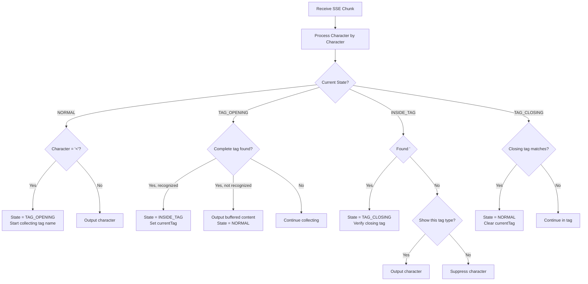

# XML Tag Filtering Implementation Plan

## Overview

Implement stateful XML tag parsing in the `ClientContentFilter` class to handle `<thinking></thinking>` sections that can span multiple SSE chunks.

## Requirements

1. Filter out `<thinking></thinking>` content unless `--show-thinking` is passed
2. Handle XML tags that span multiple SSE chunks
3. Maintain state between chunks to track when we're inside a tag
4. Support arbitrary content inside thinking sections
5. Recognize opening and closing tags properly

## Implementation Strategy

### State Management

The filter needs to maintain state between SSE chunks:

- `currentTag`: The tag we're currently inside (null if not in a tag)
- `tagBuffer`: Buffer to collect content while determining tag type
- `insideTag`: Boolean indicating if we're currently inside a recognized tag
- `tagContent`: Buffer for content inside the current tag

### XML Parser States

1. **NORMAL**: Default state, outputting content normally
2. **TAG_OPENING**: Found `<`, collecting characters to identify tag
3. **INSIDE_TAG**: Inside a recognized tag, collecting content until close tag
4. **TAG_CLOSING**: Found `</`, verifying it matches the current tag

### Processing Flow



### Supported Tags

- `<thinking>`: Filtered unless `showThinking` is true
- Future extensibility for other tags like `<tool_call>`, `<system>`, etc.

## Implementation Details

### Class Structure Updates

```javascript
class ClientContentFilter {
	constructor(options) {
		// Existing options...

		// XML parsing state
		this.parserState = "NORMAL"
		this.currentTag = null
		this.tagBuffer = ""
		this.tagContent = ""
		this.outputBuffer = ""
	}

	processData(data) {
		// Process message content character by character
		// Return filtered content
	}

	processText(text) {
		// Character-by-character XML parsing
	}

	handleTagOpening(char) {
		// Handle TAG_OPENING state
	}

	handleInsideTag(char) {
		// Handle INSIDE_TAG state
	}

	handleTagClosing(char) {
		// Handle TAG_CLOSING state
	}

	shouldShowTag(tagName) {
		// Determine if tag content should be shown
	}
}
```

### Edge Cases to Handle

1. Malformed XML tags
2. Nested tags (though thinking sections shouldn't have these)
3. Tags split across multiple chunks at any position
4. Self-closing tags (if needed)
5. Tags with attributes (if needed)

### Testing Scenarios

1. Complete `<thinking>` section in single chunk
2. Opening tag split across chunks
3. Closing tag split across chunks
4. Content split across chunks
5. Multiple thinking sections
6. Thinking section with special characters
7. Malformed thinking tags

## Integration Points

- Update `processData()` method to use the new XML parser
- Ensure filtered content maintains proper formatting
- Handle both verbose and simple output modes
- Preserve existing functionality for other content types

## Future Extensibility

The XML parser should be designed to easily support additional tags:

- `<tool_call>` sections
- `<system>` sections
- Custom tag types
- Tag-specific filtering rules
